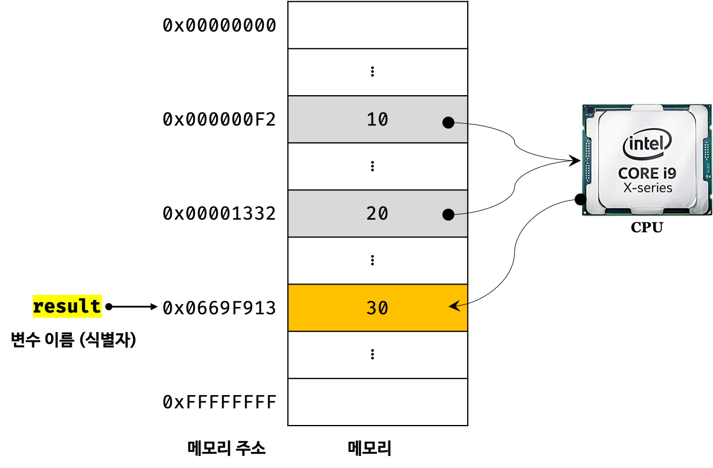
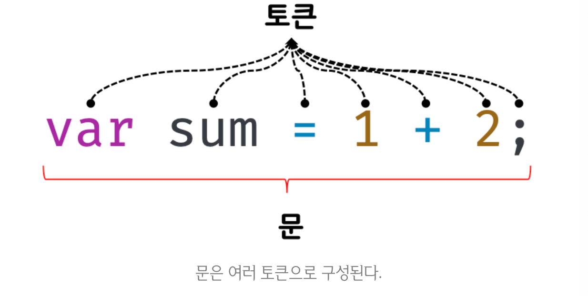

## 변수란?

데이터를 관리하기 위한 핵심 개념으로 하나의 값을 저장하기 위해 확보한 메모리 공간 자체 또는 메모리 공간을 식별하기 위해 붙인 이름.

- memory - 데이터를 저장할 수 있는 memory cell의 집합체. 메모리 셀의 크기는 1byte (8bit)
컴퓨터는 1바이트 단위로 데이터를 저장하고 읽어들인다.
- 메모리에 저장되는 데이터는 데이터의 종류와 상관없이 모두 2진수로 저장된다.
- 메모리 공간에 저장된 값을 식별할 수 있는 별명을 변수 이름이라고 하고, 변수에 저장된 값을 변수 값이라고 한다.
- 변수에 값을 저장하는 것은 할당(assignment), 저장된 값을 읽어 들이는 것은 참조(reference)



## 식별자 (Idendifier)

변수 이름을 식별자라고도 하며, 식별자는 어떤 값을 구별해서 식별할수 있는 고유한 이름을 말한다.

식별자는 값이 아니라 값이 저장되어 있는 메모리 주소를 기억(저장)한다. 즉, 메모리 주소를 통해 메모리 공간에 저장된 값에 접근하는 것이다.

## 변수 선언 (Variable declaration)

변수를 생성하는 것을 말하는데 값을 저장하기 위한 메모리 공간을 확보(allocate)하고 변수 이름과 메모리 공간의 주소를 연결(name binding)하여 값을 저장할 준비를 하는 것이다.

- 변수 선언에 의해 확보된 메모리 공간은 확보가 해제(release)되기 전까지는 다른 변수가 사용할 수 없도록 보호된다.
- var 변수 선언 후, 값을 할당하지 않으면 메모리 공간에는 `undefined` 라는 값이 임시(?) 할당되어 초기화된다. 따라서 값이 할당되지 않은 변수를 호출(?)하면 `undefined` 가 반환된다.
- 일반적으로 초기화(initialization)란 변수가 선언된 이후 최초로 값을 할당하는 것을 말한다.
- 초기화 단계를 거치지 않으면 확보된 메모리 공간에는 다른 변수가 사용했던 값이 남아있을 수 있는데 이러한 값을 쓰레기 값(garbage value)라고 한다. 자바스크립트의 var 키워드는 암묵적으로 undefined라는 값으로 초기화를 수행하기 때문에 쓰레기 값이 나올 위험이 적다.
- 변수를 사용하려면 반드시! 선언이 필요하다.

## 변수 호이스팅(Variable Hoisting) ?

```jsx
console.log(NUEST); // undefined

var NUEST; // 변수 선언문
```

위 코드를 보면 변수 선언문보다 변수를 참조하는 코드가 앞에 위치해 있다. 

자바스크립트 코드는 인터프리터 언어로 한 줄씩 순차적으로 실행되므로, 변수가 선언되기 이전의 시점인 `console.log(NUEST);` 는 참조 에러(Reference Error)가 발생할 것 같지만, `undefined` 가 출력되게 된다.

이는 변수 선언이 소스코드가 런타임이 아니라 그 이전 단계에서 먼저 실행되기 때문이다. 

자바스크립트 엔진은 변수 선언이 어디에 위치되어 있든 상관없이 다른 코드보다 먼저 평가 과정을 거치고 실행한다.

이와 같이 변수 선언문이 코드의 선두에 있는 것처럼 동작하는 자바스크립트 고유의 특징을 변수 호이스팅이라고 한다.

## 값의 할당

```jsx
var score; // 변수 선언
score = 80; // 값의 할당

var score = 80; // 변수 선언과 값의 할당을 하나의 문으로 단축 표현
```

주의: 변수 선언과 값의 할당 실행 시점이 다르다.

변수 선언은 소스코드가 순차적으로 실행되는 시점인 런타임 이전에 먼저 실행되지만 값의 할당은 소스코드가 순차적으로 실행되는 시점인 런타임에 실행된다.

```jsx
console.log(score); // undefined

var score; // 변수 선언
score = 80; // 값의 할당

console.log(score); // 80

// 단축 표현도 동일하게 동작

console.log(score); // undefined

var score = 80; // 변수 선언과 값의 할당

console.log(score); // 80

```

## 값의 재할당

재할당이란 이미 값이 할당되어 있는 변수에 새로운 값을 대입(저장)하는 것을 말한다. 즉, 현재 변수에 저장된 값을 버리고 새로운 값을 할당받는 것이다.

만약 값을 재할당할 수 없어서 변수에 저장된 값을 변경할 수 없다면 그것은 변수가 아닌 상수(constant)이다.

```jsx
var score = 80;
score = 100; // 값의 재할당
```

값이 재할당 될 때 기존에 확보하고 있던 메모리 공간을 지우고 다시 사용하는 것이 아니라 새로운 메모리 공간을 확보하고 그 공간에 재할당 받은 값(위 코드에선 100)을 저장한다.

어떤 식별자와도 연결되어 있지 않은 값 (undefined 또는 80)은 더 이상 필요하지 않기 때문에 가비지 콜렉터(garbage collector)에 의해 메모리에서 자동 해제된다. 그러나 언제 해제될지는 알 수 없다.

- 가비지 콜렉터? 
애플리케이션이 할당한 메모리 공간을 주기적으로 검사하여 더이상 사용되고 있지 않은 메모리를 해제하는 기능

## 식별자 네이밍 규칙

1. 특수문자를 제외한 문자, 숫자, 언더스코어(_), 달러 기호($)를 포함할 수 있다.
2. 단, 특수문자를 제외한 문자, 언더스코어(_), 달러 기호($)로 시작해야하며, 숫자로 시작하는 것은 허용하지 않는다.
3. 예약어는 사용할 수 없다.
- 예약어(reserved word)란 프로그래밍 언어에서 사용되고 있거나 사용될 예정인 단어를 말한다.
4. 대소문자를 구별한다.
5. 네이밍 컨벤션(naming convention)으로 자바스크립트에서는 주로 카멜케이스(변수 또는 함수)와 파스칼 케이스(생성자 함수, 클래스 이름)를 사용한다.
- camelCase & PascalCase

## 값 (value)

표현식(expression)이 평가(evaluate)되어 생성된 결과를 값이라고 말하고, 평가란 식을 해석하여 값을 생성하거나 참조하는 것을 의미한다.

## 리터럴(literal)

사람이 이해할 수 있는 문자 또는 약속된 기호를 사용해 값을 생성하는 표기 방식(notaion)

- 숫자 - 정수 리터럴, 부동소수점 리터럴, 2진수 리터럴, 8진수 리터럴, 16진수 리터럴
- 문자열 리터럴
- 불리언(Boolea) 리터럴
- null 리터럴
- undefined 리터럴
- 객체 리터럴
- 배열 리터럴
- 함수 리터럴
- 정규표현식 리터럴

## 표현식 (expression)

표현식이란 값으로 평가될 수 있는 문(statement)이다.
표현식이 평가되면 새로운 값을 생성하거나 기존 값을 참조한다.

- 표현식은 리터럴, 식별자, 연산자, 함수 호출 등의 조합으로 이뤄질 수 있으며, 값으로 평가되는 문을 모두 일컫는다.
- 표현식과 표현식이 평가된 값은 동등한 관계, 즉 동치(equivalent)이다.

## 문 (statement)

- 프로그램을 구성하는 기본 단위이자 최소 실행 단위를 말한다. 문의 집합으로 이루어진 것이 프로그램이고 문을 작성하고 순서에 맞게 나열하는 것이 프로그래밍이다.
- 문은 여러 토큰(token)으로 구성되는데, 토큰이란 문법적인 의미를 가지며, 문법적으로 더 이상 나눌 수 없는 코드의 기본 요소를 의미한다.
- 문은 컴퓨터에 내리는 명령이다. 따라서 문이 실행되면 명령이 실행되고 무슨 일인가가 일어나게 된다.
- 선언문, 할당문, 조건문, 반복문 등



## 표현식인 문과 표현식이 아닌 문

- `표현식인 문`은 값으로 평가될 수 있는 문이다. 할당문은 값으로  평가될 수 있으므로 표현식인 문이 된다.
- `표현식이 아닌 문` 은 값으로 평가될 수 없는 문을 말하며 변수 선언문이 해당한다.

## 데이터 타입 (data type)

자바스크립트의 모든 값은 데이터 타입을 가지며, ES6에서는 7개의 데이터 타입을 제공한다.

- 원시 타입 (primitive type)   
- number : 숫자, 정수와 실수 구분없이 하나의 숫자 타입만 존재  
- string : 문자열  
- boolean : 참(true)과 거짓(false)  
- undefined : var 키워드로 선언된 변수에 암묵적으로 할당되는 값  
- null : 값이 없다는 것을 의도적으로 명시할 때 사용하는 값  
- symbol : 변경 불가능한 타입의 값으로 다른 값과 중복되지 않는 유일무이한 값
- 객체 타입 (object / reference type) : 객체, 함수, 배열 등

## 템플릿 리터럴 (template literal)

ES6부터 도입된 새로운 문자열 표기법으로 멀티라인 문자열(multi-line string), 표현식 삽입(expression interpolation), 태그드 템플릿(tagged template) 등 편리한 문자열 처리 기능을 제공한다. 

일반 문자열은 작은 따옴표 또는 큰 따옴표를 사용해 표현하지만, 템플릿 리터럴은 백틱(grave ` `)을 사용한다.