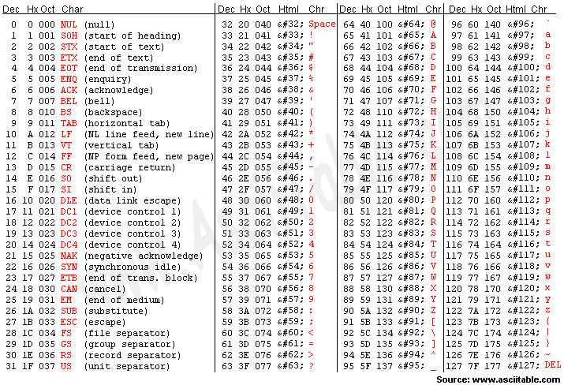
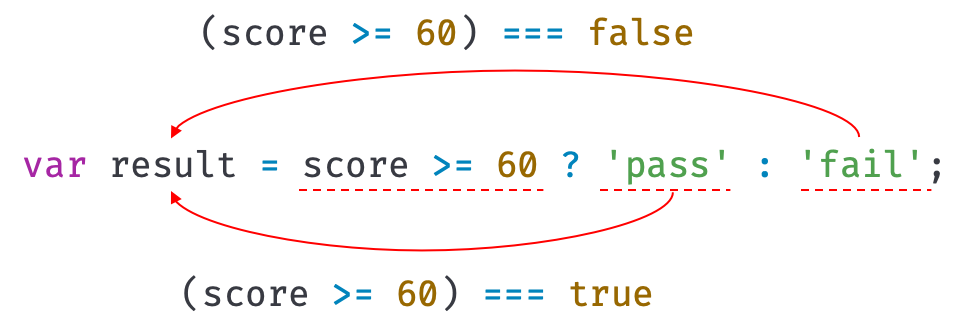

## bit & byte
1. bit
- 데이터를 나타내는 최소 단위로 1bit는 0 또는 1이다.
- 즉, 1개의 비트로 표현할 수 있는 데이터 수는 2^1으로 n개의 비트는 2^n개의 데이터를 나타낼 수 있다. 
2. byte
- 컴퓨터가 조작하는 정보의 최소 처리 단위
- 실질적 의미는 ASCII 문자 하나를 나타낼 수 있다 
- 1byte는 8bit로 간주된다.
## ASCII 아스키 코드
- ASCII는 American Standard Code for Information Interchange(미국 정보 교환 표준 부호)의 약어
- 미국표준협회(ANSI)에서 정의한 표준 코드
- 영문 키보드로 입력할 수 있는 모든 기호가 할당되어 있는 부호 체계로 000(0x00)부터 127(0x7F)까지 총 128개의 부호가 사용됨
- 아스키 코드는 하나의 기호를 나타내는데에 1byte를 사용한다. 그 중 7bit만이 문자를 표현하는데 사용되고 1bit는 통신 에러 검출을 위해 사용한다. 
- 오류 검사 코드는 패리티 비트(Parity bit)라고 한다.

- 아스키 코드는 미국에서 만들어졌기 때문에 다른 언어권에서는 아스키 코드만으로 컴퓨터에서 문자를 표현하기가 어려웠다. 그래서 아스키 코드를 확장하여 각자의 문자 인코딩 방식을 만들게 되었는데, 서로 통신할 때 문자가 깨지는 현상이 발생하게 되었다. 이런 문제로 `유니코드`가 나오게 됐다.
## 유니코드 (Unicode)
- 전 세계 모든 언어를 일관성 있게 표현할 수 있도록 만든 국제적 단위의 문자 코드 체계
- 컴퓨터 간 데이터 교환이 원활할 수 있도록 각각의 문자마다 16비트를 부여하므로 최대 65,536자를 표현할 수 있다. 
- 대표적인 유니코드의 인코딩 방식은 UTF-8이 있다. 이는 가장 많이 사용되는 가변 길이 인코딩으로 문자에 따라 1~4바이트로 인코딩 될 수 있으며, 아스키 코드와 하위 호환성을 가진다.
## 왜 1byte는 8bit일까?
기존 아스키 코드 체계에서도 사용했듯이 최소한 128개의 문자를 나타낼 수 있어야 했을 것이다. 
그런데 2^9 또는 2^10 등 더 많은 경우의 수가 생기면 잉여 공간이 많아져서 2^8을 제일 합리적인 값이라고 생각하지 않았을까 한다.

---

## 연산자 (operator)

- 연산자는 하나 이상의 표현식을 대상으로 산술, 할당, 비교, 논리, 타입, 지수 연산 등을 수행해 하나의 값을 만든다.
- 연산의 대상을 피연산자(operand)라고 하며, 피연산자는 값으로 평가될 수 있는 표현식이어야 한다.
- 피연산자와 연산자의 조합으로 이뤄진 연산자 표현식은 값으로 평가될 수 있는 표현식이다.
- 피연산자 - 값 / 연산자 - 피연산자를 연산하여 새로운 값을 만듦

### 산술 연산자 (arithmetic operator)

피연산자를 대상으로 수학적 계산을 수행해 새로운 숫자 값을 만든다. 산술 연산이 불가능한 경우 NaN을 반환한다. 

1. 이항(binary) 산술 연산자  
* 2개의 피연산자를 산술 연산하여 숫자 값을 만든다.  
* 모든 이항 산술 연산자는 피연산자의 값을 변경하는 부수 효과(side effect)가 없다. 즉, 어떤 산술 연산을 해도 피연산자의 값이 바뀌는 경우는 없고 언제나 새로운 값을 만들 뿐!  
| 이항 산술 연산자 | 의미 | 부수 효과 |  
|:---:|:---:|:---:|  
| + | 덧셈 | X |  
| - | 뺄셈 | X |  
| * | 곱셈 | X |  
| / | 나눗셈 | X |  
| % | 나머지 | X |  
2. 단항(unary) 산술 연산자  
* 1개의 피 연산자를 산술 연산하여 숫자 값을 만든다.  
* 주의할 점은 이항 산술 연산자와 달리 `증가/감소(++/-) 연산자는 피연산자의 값을 변경하는 부수 효과가 있다`는 것이다.  
다시 말해, 증가/감소 연산을 하면 피연산자의 값을 변경하는 암묵적 할당이 이뤄진다.  
| 단항 산술 연산자 | 의미 | 부수 효과 |  
|:---:|:---|:---:|  
| ++ | 증가 | O |  
| -_ | 감소 | O |  
| + | 어떠한 효과도 X, 음수를 양수로 반전하지도 않음 | X |  
| - | 양수를 음수로, 음수를 양수로 반전한 값을 반환 | X |  
* 증가/감소 연산자는 위치에 의미가 있다.  
  1. 피연산자 앞에 위치한 전위 증가/감소 연산자(prefix increment/decrement operator)는 먼저 피연산자의 값을 증가/감소시킨후, 다른 연산을 수행  
  2. 피연산자 뒤에 위치한 증가/감소 연산자(postfix increment/decrement operator)는 먼저 다른 연산을 수행한 후, 피연산자의 값을 증가/감소시킨다.
  ```jsx
  var x = 5, result;

  // 선할당 후증가(postfix increment operator)
  result = x++;
  console.log(result, x); // 5 6

  // 선증가 후할당(prefix increment operator)
  result = ++x;
  console.log(result, x); // 7 7

  // 선할당 후감소(postfix decrement operator)
  result = x--;
  console.log(result, x); // 7 6

  // 선감소 후할당 (prefix decrement operator)
  result = --x;
  console.log(result, x); // 5 5
  ```
* 숫자 타입이 아닌 피연산자에 + 단항 연산자를 사용하면 피연산자를 숫자 타입으로 변환하여 반환한다. 이때 피연산자를 변경하는 것은 아니고 숫자 타입으로 변환한 값을 생성해서 반환한다. 따라서 부수 효과는 없다.  
```jsx
var x  = '1';

// 문자열을 숫자로 타입 변환한다.
console.log(+x); // 1
// 부수 효과는 없다.
console.log(x);  // "1"

// 문자열을 숫자로 타입 변환할 수 없으므로 NaN을 반환한다.
x = 'Hello';
console.log(+x); // NaN
// 부수 효과는 없다.
console.log(x);  // "Hello"
```
3. 문자열 연결 연산자  
`+` 연산자는 피연산자 중 하나 이상이 문자열인 경우 문자열 연결 연산자로 동작하며 그 외의 경우는 산술 연산자로 동작한다. 
```jsx
// 문자열 연결 연산자
'1' + 2; // -> '12'
1 + '2'; // -> '12'

// 산술 연산자
1 + 2; // -> 3

// true는 1로 타입 변환된다.
1 + true; // -> 2

// false는 0으로 타입 변환된다.
1 + false; // -> 1

// null은 0으로 타입 변환된다.
1 + null; // -> 1

// undefined는 숫자로 타입 변환되지 않는다.
+undefined;    // -> NaN
1 + undefined; // -> NaN
```
### 할당 연산자 (assignment operator)
- 우항에 있는 피연산자의 평가 결과를 좌항에 있는 변수에 할당한다. 
- 할당 연산자는 좌항의 변수에 값을 할당하므로 변수 값이 변하는 부수 효과가 있다. 
| 할당 연산자 | 예시 | 동일 표현 |  
|:---:|:---|:---|  
| = | x = 5 | x = 5 |  
| += | x += 5 | x = x + 5 |  
| -= | x -= 5 | x = x - 5 |  
| *= | x *= 5 | x = x * 5 |  
| /= | x /= 5 | x = x / 5 |  
| %= | x %= 5 | x = x % 5 |  
- `할당문은 값으로 평가되는 표현식인 문으로서 할당된 값으로 평가된다.` 
- 여러 변수에 동일한 값을 연쇄 할당할 수 있다. 
```jsx
var a, b, c;

// 연쇄 할당. 오른쪽에서 왼쪽으로 진행.
// ① c = 0 : 0으로 평가된다
// ② b = 0 : 0으로 평가된다
// ③ a = 0 : 0으로 평가된다
a = b = c = 0;

console.log(a, b, c); // 0 0 0
```
### 비교 연산자 (comparison operator)
좌항과 우항의 피연산자를 비교한 다음 그 결과를 `불리언 값`으로 반환한다.  
비교 연산자는 if문이나 for문과 같은 제어문의 조건식에서 주로 사용한다. 
1. 동등 / 일치 비교 연산자  
- 동등 비교(loose equality) 연산자와 일치 비교(strict equality) 연산자는 좌항과 우항의 피연산자가 같은 값으로 평가되는지 비교해 불리언 값을 반환한다.  
| 비교 연산자 | 의미 | 사례 | 설명 | 부수효과 |  
|:---:|:---|:---|:---|:---:|  
| == | 동등 비교 | x==y | x와 y의 값이 같음 | X |  
| === | 일치 비교 | x===y | x와 y의 값과 타입이 같음 | X |   
| != | 부동등 비교 | x!=y | x와 y의 값이 다름 | X |    
| !== | 불일치 비교 | x!==y |x와 y의 값과 타입이 다름 | X |  
- 동등 비교(==) 연산자는 좌항과 우항의 피연산자를 비교할 때 먼저 암묵적 타입 변환 (implicit coercion)을 통해 타입을 일치시킨 후, 같은 값인지 비교한다.
- 일치 비교(===) 연산자는 좌항과 우항의 피연산자가 타입도 같고 값도 같은 경우에 한하여 true를 반환한다. (암묵적 타입 변환을 하지 않고 값을 비교)
- 주의해야 할 `NaN`  
```jsx
// NaN은 자신과 일치하지 않는 유일한 값이다.
NaN === NaN; // -> false

// 숫자가 NaN인지 조사하려면 빌트인 함수(Built-in function) isNaN() 사용
// isNaN 함수는 지정한 값이 NaN인지 확인하고 그 결과를 불리언 값으로 반환한다.
isNaN(NaN); // -> true
isNaN(10);  // -> false
isNaN(1 + undefined); // -> true
```
- 숫자 `0` - js에는 양의 0과 음의 0이 있다.
```jsx
// 양의 0과 음의 0의 비교. 일치 비교/동등 비교 모두 결과는 true이다.
0 === -0; // -> true
0 == -0;  // -> true
```
2. 대소 관계 비교 연산자
```jsx
// 대소 관계 비교
5 > 0;  // -> true
5 > 5;  // -> false
5 >= 5; // -> true
5 <= 5; // -> true
```
### 삼항 조건 연산자 (ternary operator)
- 조건식의 평가 결과에 따라 반환할 값을 결정하며 부수 효과는 없다. 
> 조건식 ? 조건식이 true일 때 반환할 값 : 조건식이 false일 때 반환할 값  


- 첫 번째 피연산자가 true로 평가되면 두 번째 피연산자를 반환하고, 첫 번째 피연산자가 false로 평가되면 세 번째 피연산자를 반환
- 삼항 조건 연산자는 두 번째 피연산자 또는 세 번째 피연산자로 평가되는 표현식
- 물음표 앞의 첫 번째 피연산자는 조건식, 즉 불리언 타입의 값으로 평가될 표현식 
- 만약 조건식의 평가 결과가 불리언 값이 아니면 불리언 값으로 암묵적 타입 변환되고  조건식이 참이면 콜론 앞의 두 번째 피연산자가 평가되어 반환, 거짓이면 콜론 뒤의 세 번째 피연산자가 평가되어 반환된다.
```jsx
var x = 2;

// 2 % 2는 0이고 0은 false로 암묵적 타입 변환된다.
var result = x % 2 ? '홀수' : '짝수';

console.log(result); // 짝수
```
- 삼항 조건 연산자 표현식은 값으로 평가할 수 있는 표현식인 문이다!
- if...else 문을 삼항 조건 연산자 표현식과 유사하게 처리할 수 있다. But, if...else문은 표현식이 아닌 문이기 때문에 값처럼 사용할 수 없다. 
### 논리 연산자 (logical operator)
우항과 좌항의 피연산자(부정 논리 연산자의 경우 우항의 피연산자)를 논리 연산한다.   
```jsx
// 논리합(||) 연산자 (OR)
true || true;   // -> true
true || false;  // -> true
false || true;  // -> true
false || false; // -> false

// 논리곱(&&) 연산자 (AND)
true && true;   // -> true
true && false;  // -> false
false && true;  // -> false
false && false; // -> false

// 논리 부정(!) 연산자 (NOT)
!true;  // -> false
!false; // -> true
```
- 논리 부정(!) 연산자는 언제나 불리언 값을 반환한다. 단, 피연산자가 반드시 불리언 값일 필요는 없다. 
```jsx
// 암묵적 타입 변환
!0;       // -> true
!'Hello'; // -> false
```
- 논리합(||) 또는 논리곱(&&) 연산자 표현식은 언제나 2개의 피연산자 중 어느 한쪽으로 평가된다.
```jsx
// 단축 평가
'Cat' && 'Dog'; // -> 'Dog'
```
- `드 모르간의 법칙`이란게 있다... 이를 활용하면 복잡한 표현식을 좀 더 가독성 좋은 표현식으로 쓸 수 있다고 한다.
### 쉼표 연산자
왼쪽 피연산자부터 차례대로 피연산자를 평가하고 마지막 피연산자의 평가가 끝나면 마지막 피연산자의 평가 결과를 반환한다.
```jsx
var x, y, z;

x = 3, y = 5, z = 7; // 7
```
Q. 이걸.. 언제 사용하는거지? 어차피 오른쪽 끝의 값이 나오는데 굳이 전부 다 나열해야하나?
### 그룹 연산자
수학처럼 소괄호 `()`로 감싸진 피연산자 표현식을 가장 먼저 평가한다.  
그룹 연산자는 `연산자 우선순위`가 가장 높다.
```jsx
10 * 2 + 3; // -> 23

// 그룹 연산자를 사용하여 우선순위를 조절
10 * (2 + 3); // -> 50
```
### typeof 연산자
- 피연산자의 데이터 타입을 문자열로 반환
- “string”, “number”, “boolean”, “undefined”, “symbol”, “object”, “function” 중 하나를 반환
```jsx
typeof ''              // -> "string"
typeof 1               // -> "number"
typeof NaN             // -> "number"
typeof true            // -> "boolean"
typeof undefined       // -> "undefined"
typeof Symbol()        // -> "symbol"
typeof null            // -> "object"
typeof []              // -> "object"
typeof {}              // -> "object"
typeof new Date()      // -> "object"
typeof /test/gi        // -> "object"
typeof function () {}  // -> "function"
```
- 주의! `null`은 'object'로 반환된다! 이는 js 첫 번째 버전의 버그이다.
- 값이 `null` 타입인지 확인하고 싶을 때에는 일치 연산자를 사용하면 된다.
- 선언하지 않은 식별자를 typeof 연산자로 연산하면 `undefined`가 반환된다.
### 지수 연산자
거듭 제곱이라고 생각하면 된다. 좌항의 피연산자를 밑으로, 우항의 피연산자를 지수로 거듭 제곱하여 숫자 값을 반환
```jsx
2 ** 2;   // -> 4
2 ** 2.5; // -> 5.65685424949238
2 ** 0;   // -> 1
2 ** -2;  // -> 0.25
```
- 지수 연산자는 ES7에서 도입되었는데, 이전에는 `Math.pow` 메서드를 사용했다.
```jsx
Math.pow(2, 2);   // -> 4
Math.pow(2, 2.5); // -> 5.65685424949238
Math.pow(2, 0);   // -> 1
Math.pow(2, -2);  // -> 0.25
```
- 음수를 거듭 제곱의 밑으로 사용하여 계산하려면 음수값을 괄호로 묶어줘야 함
- 이항 연산자 중에서 우선순위가 가장 높다.

---

## 제어문 (control flow statement)
- 주어진 조건에 따라 코드 블록을 실행(조건문)하거나 반복 실행(반복문)할 때 사용
- 제어문을 사용하면 코드의 실행 흐름을 인위적으로 제어할 수 있다.
- 다만, 코드의 흐름을 이해하기 어렵게 만들어 가독성을 해치는 단점이 있다. 
### 블록문 (block statement/compound statement)
- 0개 이상의 문을 중괄호로 묶은 것으로, 코드 블록 또는 블록이라고 한다. 
- js에서 블록문을 하나의 실행 단위로 취급
- 일반적으로 제어문이나 함수를 정의할 때 사용 (단독으로도 사용 가능)
- 블록문은 문의 종료를 의미하는 자체 종결성(self closing)을 갖기 때문에 블록문의 끝에는 세미콜론을 붙이지 않는다.
```jsx
// 블록문
{
  var foo = 10;
}

// 제어문
var x = 1;
if (x < 10) {
  x++;
}

// 함수 선언문
function sum(a, b) {
  return a + b;
}
```
### 조건문 (conditional statement)
- 주어진 조건식(conditional expression)의 평가 결과에 따라 코드 블록(블록문)의 실행을 결정
- 조건식은 불리언 값으로 평가될 수 있는 표현식
1. if...else
- 주어진 조건식(불리언 값으로 평가될 수 있는 표현식)의 평가 결과에 따라 실행할 코드 블록을 결정
- 조건식의 평가 결과가 true일 경우 if 문의 코드 블록이 실행되고, false일 경우 else 문의 코드 블록이 실행
```jsx
if (조건식1) {
  // 조건식1이 참이면 이 코드 블록이 실행된다.
} else if (조건식2) {
  // 조건식2가 참이면 이 코드 블록이 실행된다.
} else {
  // 조건식1과 조건식2가 모두 거짓이면 이 코드 블록이 실행된다.
}
```
- else if와 else는 옵션
- if와 else는 2번 이상 사용할 수 없지만 else if는 여러 번 사용 가능
- 대부분의 if...else문은 삼항 조건 연산자로 바꿔쓸 수 있다. 
- 삼항 조건 연산자 표현식은 값처럼 사용할 수 있기 때문에 변수에 할당할 수 있지만 if...else문은 표현식이 아닌 문으로 값처럼 사용할 수 없기 때문에 변수에 할당할 수 없다. 
2. switch
- 주어진 표현식을 평가하여 그 값과 일치하는 표현식을 갖는 case 문으로 실행 흐름을 옮김
- case 문은 상황(case)을 의미하는 표현식을 지정하고 콜론으로 마치고 그 뒤에 실행할 문을 위치시킨다.
- switch 문의 표현식과 일치하는 case 문이 없다면 실행 순서는 default 문으로 이동 (default문은 선택 사항임)
```jsx
switch (표현식) {
  case 표현식1:
    switch문의 표현식과 표현식1이 일치하면 실행될 문;
    break;
  case 표현식2:
    switch문의 표현식과 표현식2가 일치하면 실행될 문;
    break;
  default:
    switch문의 표현식과 일치하는 표현식을 갖는 case 문이 없을 때 실행될 문;
}
```
- switch 문의 표현식은 불리언 값보다는 문자열이나 숫자값인 경우가 많음.
- 논리적 참, 거짓보다는 다양한 상황(case)에 따라 실행할 코드 블록을 결정할 때 사용
- `폴스루fall through`? - switch 문의 표현식의 평가 결과와 일치하는 case 문으로 실행 흐름이 이동하여 문을 실행하지만, break가 없으면 switch문을 탈출하지 않고 모든 case문과 default문을 실행하게 된다.
- `break`는 코드 블록에서 탈출하는 역할이다.
- default 문에는 break 문을 생략하는 것이 일반적
- if…else 문으로 해결할 수 있다면 switch 문보다 if…else 문을 사용하는 편이 좋음
- 조건이 너무 많아서 if…else 문보다 switch 문을 사용했을 때 가독성이 더 좋다면 switch 문을 사용하는 편이 좋다.
### 반복문 (loop statement)
- 조건식의 평가 결과가 참인 경우 코드 블록을 실행
- 조건식이 거짓일 때까지 반복
1. for 문
- 조건식이 거짓으로 평가될 때까지 코드 블록을 반복 실행
- 반복 횟수가 명확할 때 주로 사용
> for (변수 선언문 또는 할당문; 조건식; 증감식) {
  조건식이 참인 경우 반복 실행될 문;
}  
```jsx
for (var i = 0; i < 2; i++) {
  console.log(i);
}
```
- i변수 : for 문의 변수 선언문의 변수 이름은 반복을 의미하는 iteration의 i를 사용하는 것이 일반적

- 변수 선언문은 단 한번만 실행!
- for 문의 변수 선언문, 조건식, 증감식은 모두 옵션이므로 반드시 사용할 필요는 없다. 단, 어떤 식도 선언하지 않으면 무한루프가 된다.(빠져나올 수 없는 개미지옥..)
- 중첩 for문? for 문 내에 for 문을 중첩해 사용
```jsx
for (var i = 1; i <= 6; i++) {
  for (var j = 1; j <= 6; j++) {
    if (i + j === 6) console.log(`[${i}, ${j}]`);
  }
}
// 결과값
[1, 5]
[2, 4]
[3, 3]
[4, 2]
[5, 1]
```
2. while문
- 주어진 조건식의 평가 결과가 참이면 코드 블록을 계속해서 반복 실행
- 반복 횟수가 불명확할 때 주로 사용
- 조건문의 평가 결과가 거짓이 되면 코드 블록을 실행하지 않고 종료
- 만약 조건식의 평가 결과가 불리언 값이 아니면 불리언 값으로 강제 변환하여 논리적 참, 거짓을 구별
- 조건식의 평가 결과가 언제나 참이면 무한루프가 된다... 탈출하기 위해선 코드 블록 내에 if 문으로 탈출 조건을 만들고 break문으로 탈출!
```jsx
var count = 0;

// 무한루프
while (true) {
  console.log(count);
  count++;
  // count가 3이면 코드 블록을 탈출한다.
  if (count === 3) break;
} // 0 1 2
```
3. do...while 문
- 코드 블록을 먼저 실행하고 조건식을 평가
- 그러므로 코드 블록은 무조건 한 번 이상 실행!!
### break 문
- break 문은 코드 블록을 탈출
- 정확히는 레이블 문, 반복문(for, for…in, for…of, while, do…while) 또는 switch 문의 코드 블록을 탈출
- 레이블 문, 반복문, switch 문의 코드 블록 외에 break 문을 사용하면 SyntaxError(문법 에러) 발생
- 레이블 문(label statement)이란 식별자가 붙은 문
```jsx
// foo라는 레이블 식별자가 붙은 레이블 문
foo: console.log('foo');
```
- 중첩된 for 문의 내부 for 문에서 break 문을 실행하면 내부 for 문을 탈출하여 외부 for 문으로 진입. 이때 내부 for 문이 아닌 외부 for 문을 탈출하려면 레이블 문을 사용
- 레이블 문은 중첩된 for 문 외부로 탈출할 때 유용하지만 그 밖의 경우에는 일반적으로 권장하지 않는다. 
### continue 문
- 반복문의 코드 블록 실행을 현 지점에서 중단하고 반복문의 증감식으로 실행 흐름을 이동시킴

---

## 타입 변환과 단축 평가
### 타입 변환이란?
- 기본 원시값을 직접 변경하는 것은 아님!
- 원시값은 변경 불가능한 값(immutable value)이므로 변경할 수 없다.
- 명시적 타입 변환(explicit coercion) 또는 타입 캐스팅(type casting) ? 개발자가 의도적으로 값의 타입을 변환하는 것
- 암묵적 타입 변환(implicit coercion) 또는 타입 강제 변환(type coercion) ? 개발자의 의도와는 상관없이 js엔진에 의해 암묵적으로 타입이 자동 변환되는 것
### 암묵적 타입 변환 (implicit coercion)
자바스크립트는 가급적 에러를 발생시키지 않도록 개발자의 의도와는 상관없이 코드의 문맥을 고려해 암묵적 타입 변환을 통해 표현식을 평가한다.
1. 문자열 타입으로 변환
`+`연산자는 피연산자 중 하나 이상이 문자열이므로 문자열 연결 연산자로 동작한다.
이 때, js 엔진은 문자열 연결 연산자 표현식을 평가하기 위해 문자열 연결 연산자의 피연산자 중에서 문자열 타입이 아닌 피연산자를 문자열 타입으로 암묵적 타입 변환한다.
2. 숫자 타입으로 변환
- js 엔진은 산술 연산자 표현식을 평가하기 위해 산술 연산자의 피연산자 중에서 숫자 타입이 아닌 피연산자를 숫자 타입으로 암묵적 타입 변환한다. 
- 피연산자를 숫자 타입으로 변환할 수 없는 경우는 산술 연산을 수행할 수 없으므로 표현식의 평가 결과는 NaN이 된다.
- `>` 비교 연산자는 피연산자의 크기를 비교하므로 모든 피연산자는 코드의 문맥상 모두 숫자 타입이어야 한다. 
- js 엔진은 비교 연산자 표현식을 평가하기 위해 비교 연산자의 피연산자 중에서 숫자 타입이 아닌 피연산자를 숫자 타입으로 암묵적 타입 변환
- `+`단항 연산자는 피연산자가 숫자 타입의 값이 아니면 숫자 타입의 값으로 암묵적 타입 변환을 수행
- 주의!! 빈 문자열(‘’), 빈 배열([]), null, false는 0으로, true는 1로 변환된다. 객체와 빈 배열이 아닌 배열, undefined는 변환되지 않아 NaN이 된다
3. 불리언 타입으로 변환
- 불리언 타입이 아닌 값을 Truthy 값(참으로 평가되는 값) 또는 Falsy 값(거짓으로 평가되는 값)으로 구분
-  제어문의 조건식과 같이 불리언 값으로 평가되어야 할 문맥에서 Truthy 값은 true로, Falsy 값은 false로 암묵적 타입 변환
- false로 평가되는 falsy 값에는 `false / undefined / null / 0 / -0 / NaN / ''(빈 문자열)`이 있다.
- Falsy 값 외의 모든 값은 모두 true로 평가되는 Truthy 값
```jsx
// 전달받은 인수가 Falsy 값이면 true, Truthy 값이면 false를 반환한다.
function isFalsy(v) {
  return !v;
}

// 전달받은 인수가 Truthy 값이면 true, Falsy 값이면 false를 반환한다.
function isTruthy(v) {
  return !!v;
}

// 모두 true를 반환한다.
isFalsy(false);
isFalsy(undefined);
isFalsy(null);
isFalsy(0);
isFalsy(NaN);
isFalsy('');

// 모두 true를 반환한다.
isTruthy(true);
isTruthy('0'); // 빈 문자열이 아닌 문자열은 Truthy 값이다.
isTruthy({});
isTruthy([]);
```
### 명시적 타입 변환 (explicit coercion)
표준 빌트인 생성자 함수(String, Number, Boolean)를 new 연산자 없이 호출하는 방법과 빌트인 메서드를 사용하는 방법 그리고 암묵적 타입 변환을 이용해 명시적으로 타입을 변경할 수 있다. 
1. 문자열 타입으로 변환
```jsx
// 1. String 생성자 함수를 new 연산자 없이 호출하는 방법
// 숫자 타입 => 문자열 타입
String(1);        // -> "1"
String(NaN);      // -> "NaN"
String(Infinity); // -> "Infinity"
// 불리언 타입 => 문자열 타입
String(true);     // -> "true"
String(false);    // -> "false"

// 2. Object.prototype.toString 메서드를 사용하는 방법
// 숫자 타입 => 문자열 타입
(1).toString();        // -> "1"
(NaN).toString();      // -> "NaN"
(Infinity).toString(); // -> "Infinity"
// 불리언 타입 => 문자열 타입
(true).toString();     // -> "true"
(false).toString();    // -> "false"

// 3. 문자열 연결 연산자를 이용하는 방법
// 숫자 타입 => 문자열 타입
1 + '';        // -> "1"
NaN + '';      // -> "NaN"
Infinity + ''; // -> "Infinity"
// 불리언 타입 => 문자열 타입
true + '';     // -> "true"
false + '';    // -> "false"
```
2. 숫자 타입으로 변환
```jsx
// 1. Number 생성자 함수를 new 연산자 없이 호출하는 방법
// 문자열 타입 => 숫자 타입
Number('0');     // -> 0
Number('-1');    // -> -1
Number('10.53'); // -> 10.53
// 불리언 타입 => 숫자 타입
Number(true);    // -> 1
Number(false);   // -> 0

// 2. parseInt, parseFloat 함수를 사용하는 방법(문자열만 변환 가능)
// 문자열 타입 => 숫자 타입
parseInt('0');       // -> 0
parseInt('-1');      // -> -1
parseFloat('10.53'); // -> 10.53

// 3. + 단항 산술 연산자를 이용하는 방법
// 문자열 타입 => 숫자 타입
+'0';     // -> 0
+'-1';    // -> -1
+'10.53'; // -> 10.53
// 불리언 타입 => 숫자 타입
+true;    // -> 1
+false;   // -> 0

// 4. * 산술 연산자를 이용하는 방법
// 문자열 타입 => 숫자 타입
'0' * 1;     // -> 0
'-1' * 1;    // -> -1
'10.53' * 1; // -> 10.53
// 불리언 타입 => 숫자 타입
true * 1;    // -> 1
false * 1;   // -> 0
```
3. 불리언 타입으로 변환
- Boolean 생성자 함수를 new 연산자 없이 호출
- !부정 논리 연산자를 두번 사용

---

## 단축 평가
1. 논리 연산자를 사용한 단축 평가
| 단축 평가 표현식 | 평가 결과 |   
|:---|:---|  
| true `||` anything | true |  
| false `||` anything | anything |   
| true && anything | anything |  
| false && anything | false |  

어렵다....