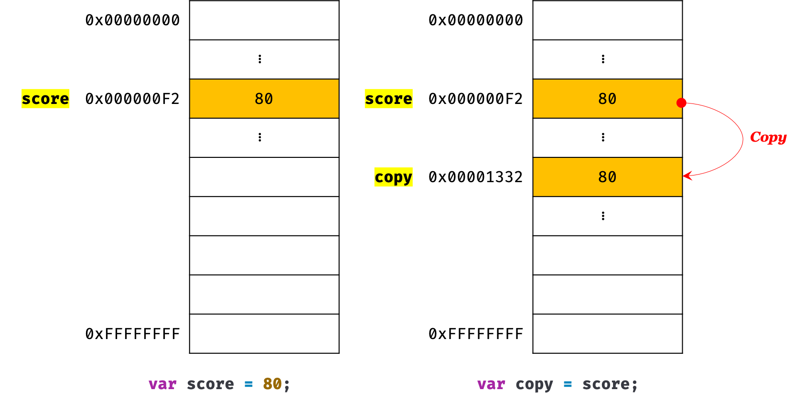
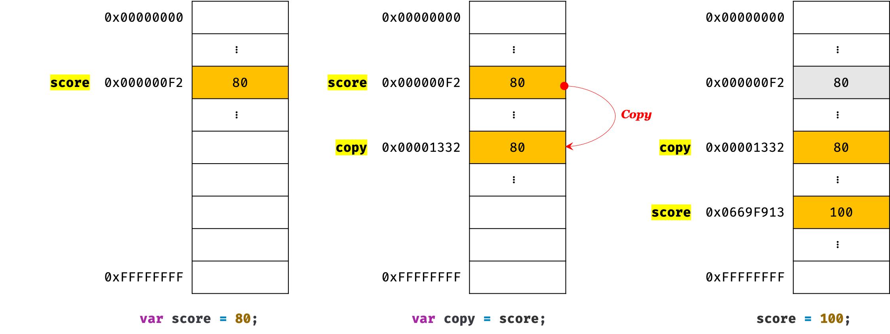
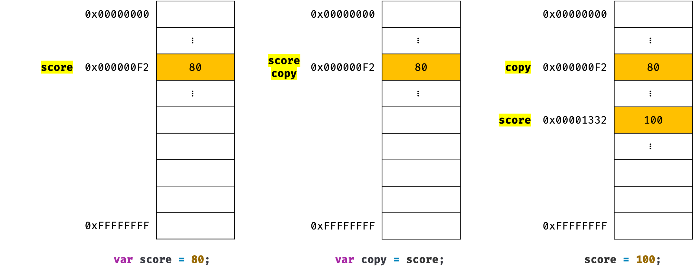
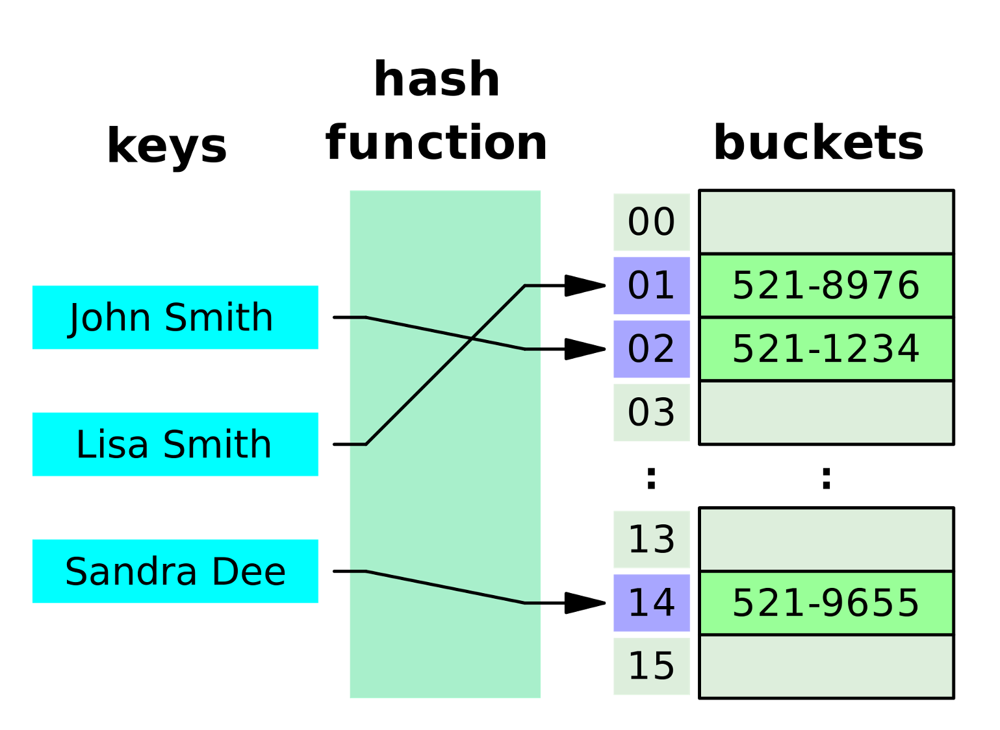
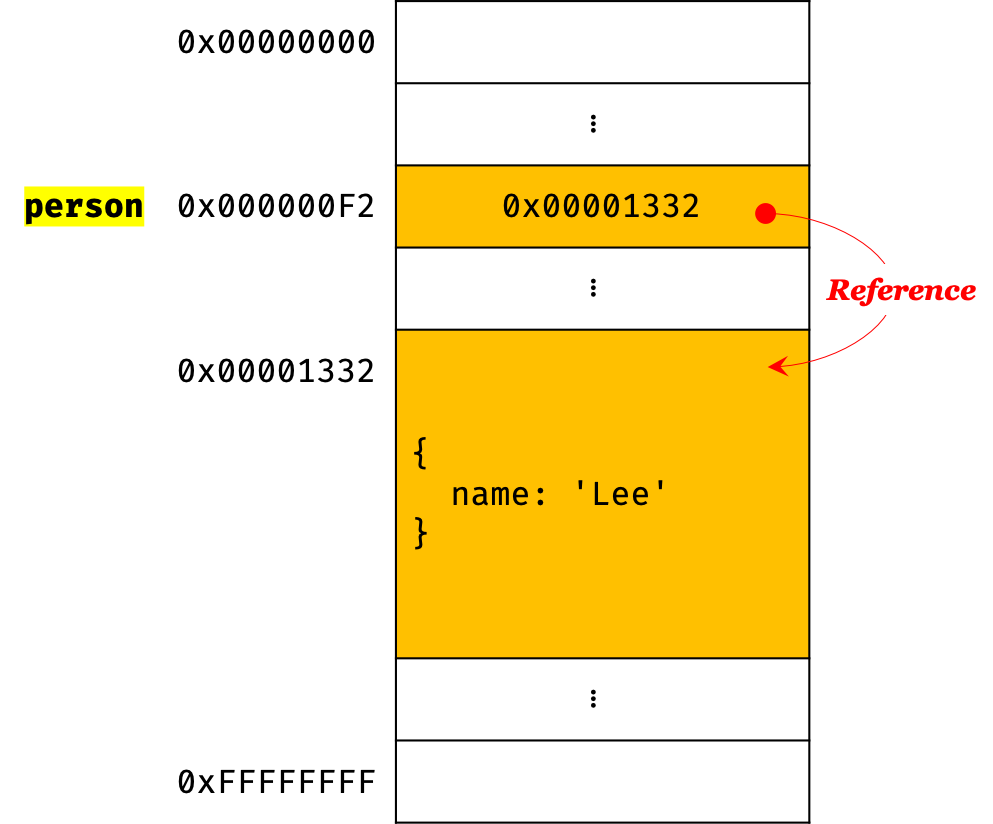
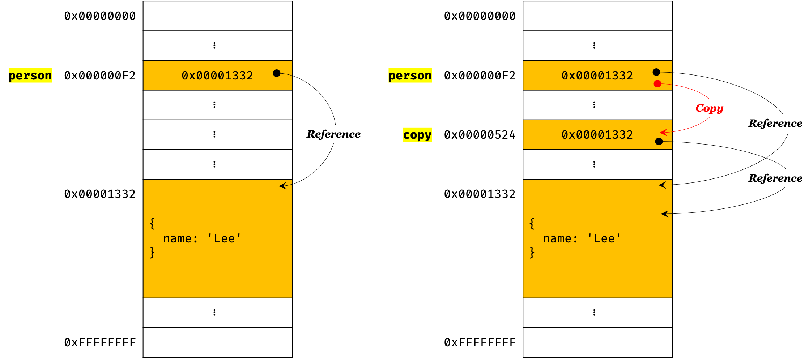

## Chapter 10. 객체 리터럴

### 객체(object)란?
- js는 객체 기반의 프로그래밍 언어이며, js를 구성하는 거의 모든 것이 객체이다.  
- 원시 값을 제외하고 모두 객체이다. (함수, 배열, 정규 표현식 등)
- 객체 타입(object/reference type)은 다양한 타입의 값을 하나의 단위로 구성한 복합적인 자료구조(data structure)다.
- 원시 값은 변경 불가능한 값(immutable value)이지만 객체는 변경 가능한 값(mutable value)이다.
- 객체는 `0개 이상의 프로퍼티`로 구성된 집합이며, 프로퍼티는 키와 값으로 구성된다.
```jsx
var person = {
  name: 'Judy',
  age: 21
};
```
> property key : 'name', 'age'  
> property value : 'Judy', 21  
> `name: 'Judy'` , `age: 21` 은 property

- js에서 사용할 수 있는 모든 값은 프로퍼티 값이 될 수 있다. 
- js의 함수는 일급 객체이므로 값으로 취급되어짐! 따라서 함수도 프로퍼티 값이 될 수 있음. (일급 객체에 대해서는 나중에 배운다)
- 프로퍼티 값이 함수일 경우, 일반 함수와 구분하기 위해 `메서드(method)`라고 부른다.  
  1. 프로퍼티 : 객체의 상태를 나타내는 값(data)
  2. 메서드 : 프로퍼티(상태 데이터)를 참조하고 조작할 수 있는 동작(behavior)
```jsx
var counter = {
  num: 0, //프로퍼티
  increase: function () {
    this.num++;
  } //메서드
};
```

### 객체 리터럴에 의한 객체 생성
- C++, 자바 같은 클래스 기반 객체지향 언어는 클래스를 사전에 정의하고 필요한 시점에 new 연산자와 함께 생성자(constructor)를 호출하여 인스턴스를 생성하는 방식으로 객체를 생성한다.  
  * 인스턴스 (instance) ?
  1. 클래스에 의해 생성되어 메모리에 저장된 실체(클래스에 소속된 개별적인 객체)  
  ex) user라는 클래스를 정의하고 Judy라는 객체를 생성할 경우, Judy라는 객체는 user라는 클래스의 인스턴스
  2. 객체지향 프로그래밍에서 객체는 클래스와 인스턴스를 포함한 개념이다. 
  3. 클래스는 인스턴스를 생성하기 위한 템플릿의 역할을 함.
  4. 인스턴스는 객체가 메모리에 저장되어 실제로 존재하는 것에 초점을 맞춘 용어
- js는 프로토타입 기반 객체지향 언어로서 클래스 기반 객체지향 언어와는 달리 다양한 객체 생성 방법을 지원한다.  
  1. 객체 리터럴 - 가장 일반적이고 간단한 방법
  2. Object 생성자 함수
  3. 생성자 함주
  4. Object.create 메서드
  5. 클래스(ES6)  
- 객체 리터럴은 중괄호 `{ }` 내에 0개 이상의 프로퍼티를 정의하며, 변수에 할당되는 시점에 js엔진은 객체 리터럴을 해석해 객체를 생성.  
  * 중괄호 내에 프로퍼티를 정의하지 않으면 빈 객체가 생성됨
  * 객체 리터럴의 중괄호는 코드 블록을 의미하지 않음.
  * 객체 리터럴은 값으로 평가되는 표현식으로 닫는 중괄호 뒤에 세미콜론을 붙임.

### 프로퍼티 (property)
- 객체는 프로퍼티의 집합이며, 프로퍼티는 키와 값으로 구성된다.  
  * 프로퍼티 키(key) : 빈 문자열을 포함하는 모든 문자열 또는 심벌 값
  * 프로퍼티 값(value) : js에서 사용할 수 있는 모든 값 
- 프로퍼티를 나열할 때에 쉼표로 구분
- 프로퍼티 키는 프로퍼티 값에 접근할 수 있는 식별자 역할을 함
- 문자열인 프로퍼티 키(심벌 값X)는 따옴표로 묶어줘야 한다. But, 식별자 네이밍 규칙을 준수하는 이름에는 따옴표 생략 가능!
- 즉, 식별자 네이밍 규칙을 따르지 않는 이름에는 반드시! 따옴표를 사용해야 함.
- 가급적이면 식별자 네이밍 규칙을 따라 프로퍼티 키를 사용하자~
```jsx
var person = {
  firstName: 'Judy', // 식별자 네이밍 규칙을 준수하는 프로퍼티 키
  'last-name': 'Park'   // 식별자 네이밍 규칙을 준수하지 않는 프로퍼티 키
  // 따옴표를 생략하고 last-name만 쓸 경우 에러가 발생한다. SyntaxError: Unexpected token - 
};

console.log(person); // {firstName: "Judy", last-name: "Park"}
```
- 문자열 또는 문자열로 평가할 수 있는 표현식을 사용해 프로퍼티 키를 동적으로 생성 가능. 이 경우, 표현식을 대괄호`[ ]`로 묶어줘야 함
Q. 무슨소린지 모르겠다 ㅎㅎ 이게 왜 동적이야? 뭐가 동적이란거야? 왜 저렇게 나오지?
```jsx
var obj = {};
var key = 'hello';

// ES5: 프로퍼티 키 동적 생성
obj[key] = 'world';
// ES6: 계산된 프로퍼티 이름
// var obj = { [key]: 'world' };

console.log(obj); // {hello: "world"}
```
- 프로퍼티 키에 문자열이나 심벌 값 외의 값을 사용하면 암묵적 타입 변환을 통해 문자열이 된다. (ex, 숫자 리터럴 -> 문자열)
- var, function과 같은 `예약어`는 프로퍼티 키로 사용하지 말자~
- 이미 존재하는 프로퍼티 키를 중복 선언하면 나중에 선언한 프로퍼티가 먼저 선언한 프로퍼티를 덮어쓴다.
```jsx
var foo {
  name: 'Judy',
  name: 'Margu'
};

console.log(foo); // {name: "Margu"}
```

### 메서드 (method)
- 메서드는 객체에 묶여있는 함수를 의미 (일반 함수와 구분하기 위함)
```jsx
var circle = {
  radius: 5, // ← 프로퍼티

  // 원의 지름
  getDiameter: function () { // ← 메서드
    return 2 * this.radius; // this는 circle을 가리킨다.
  }
};

console.log(circle.getDiameter()); // 10
```
- `this` 키워드는 객체 자신을 가리키는 참조변수.

### 프로퍼티 접근
> 프로퍼티에 접근하는 방법  
1. 마침표 표기법(dot notation) : 마침표 프로퍼티 접근 연산자(.)를 사용
2. 대괄호 표기법(bracket notation) : 대괄호 프로퍼티 저근 연산자([ ])를 사용
- 프로퍼티 키가 js에서 사용 가능한, 유요한 이름이면 두 접근 방법 모두 사용 가능
- 마침표 프로퍼티 접근 연산자 또는 대괄호 프로퍼티 접근 연산자의 `좌측`에는 객체로 평가되는 표현식을 기술
- 마침표 프로퍼티 접근 연산자의 `우측` 또는 대괄호 프로퍼티 접근 연산자의 `내부`에는 프로퍼티 키를 지정한다.   
```jsx
var person = {
  name: 'Park'
};

// 마침표 표기법에 의한 프로퍼티 접근
console.log(person.name); // Park

// 대괄호 표기법에 의한 프로퍼티 접근
console.log(person['name']); // Park
```
- 대괄호 표기법을 사용할 때, 대괄호 프로퍼티 접근 연산자 내부에 지정하는 프로퍼티 키는 반드시 따옴표로 감싼 문자열이어야 한다. (따옴표 없으면 js엔진이 식별자로 해석해버림)
```jsx
var person = {
  name: 'Judy'
};

console.log(person[name]); // ReferenceError: name is not defined
// key값인 name을 따옴표로 감싸줘야함 person['name'] 이렇게
```
- 객체에 존재하지 않는 프로퍼티에 접근하면 ReferenceError가 발생하지 않고 `undefined` 반환! (위 예제에서 name 대신 age 같은거 호출하면 undefined가 반환되는거지!)
- 프로퍼티 키가 식별자 네이밍 규칙을 준수하지 않는 이름이면 꼭! 반드시! `대괄호 표기법`을 사용해야한다.
- 프로퍼티 키가 숫자로 이뤄진 문자열인 경우엔 따옴표 생략 가능
```jsx
var person = {
  'last-name': 'Park',
  1: 10
};

person.'last-name';  // -> SyntaxError: Unexpected string
person.last-name;    // -> 브라우저 환경: NaN
                     // -> Node.js 환경: ReferenceError: name is not defined
person[last-name];   // -> ReferenceError: last is not defined
person['last-name']; // -> Park

// 프로퍼티 키가 숫자로 이뤄진 문자열인 경우 따옴표를 생략할 수 있다.
person.1;     // -> SyntaxError: Unexpected number
person.'1';   // -> SyntaxError: Unexpected string
person[1];    // -> 10 : person[1] -> person['1']
person['1'];  // -> 10
```

### 프로퍼티 값 갱신
이미 존재하는 프로퍼티에 값을 할당하면 프로퍼티 값이 갱신됨
```jsx
var person = {
  name: 'Judy'
};

// person 객체에 name 프로퍼티가 존재하므로 name 프로퍼티의 값이 갱신된다.
person.name = 'Margu';

console.log(person);  // {name: "Margu"}
```

### 프로퍼티 동적 생성
존재하지 않는 프로퍼티에 값을 할당하면 프로퍼티가 동적으로 생성되어 추가되고 프로퍼티 값이 할당된다.
```jsx
var person = {
  name: 'Park'
};

// person 객체에는 age 프로퍼티가 존재하지 않는다.
// 따라서 person 객체에 age 프로퍼티가 동적으로 생성되고 값이 할당된다.
person.age = 21;

console.log(person); // {name: "Park", age: 21}
```
오.. 신기하다 똑똑한 친구네 js

### 프로퍼티 삭제
- `delete` 연산자는 객체의 프로퍼티를 삭제한다. 
- delete 연산자의 피연산자는 프로퍼티 값에 접근할 수 있는 표현식이어야함.
- 존재하지 않는 프로퍼티를 삭제하면 에러 없이 그냥 무시됨!
```jsx
var person = {
  name: 'Judy'
};

// 프로퍼티 동적 생성
person.age = 21;

// person 객체에 age 프로퍼티가 존재한다.
// 따라서 delete 연산자로 age 프로퍼티를 삭제할 수 있다.
delete person.age;

// person 객체에 address 프로퍼티가 존재하지 않는다.
// 따라서 delete 연산자로 address 프로퍼티를 삭제할 수 없다. 이때 에러가 발생하지 않는다.
delete person.address;

console.log(person); // {name: "Judy"}
```

### 객체 리터럴의 확장 기능
ES6에서 추가됨  
1. 프로퍼티 축약 표현  
프로퍼티 값으로 변수를 사용하는 경우 변수 이름과 프로퍼티 키가 동일한 이름일 때, 프로퍼티 키를 생략(property shorthand)할 수 있다. 이때, 프로퍼티 키는 변수 이름으로 자동 생성.
```jsx
// ES5
var x = 1, y = 2;

var obj = {
  x: x,
  y: y
};

console.log(obj); // {x: 1, y: 2}

// ES6
let x = 1, y = 2;

// 프로퍼티 축약 표현
const obj = { x, y };

console.log(obj); // {x: 1, y: 2}
```
2. 계산된 프로퍼티 이름  
문자열 또는 문자열로 타입 변환할 수 있는 값으로 평가되는 표현식을 사용해 프로퍼티 키를 동적으로 생성 가능! 단, 프로퍼티 키로 사용할 표현식을 대괄호로 묶어야 한다.  
이를 `계산된 프로퍼티 이름(computed property name)`이라 한다.
```jsx
// ES5
var prefix = 'prop';
var i = 0;

var obj = {};

// 계산된 프로퍼티 이름으로 프로퍼티 키 동적 생성
obj[prefix + '-' + ++i] = i;
obj[prefix + '-' + ++i] = i;
obj[prefix + '-' + ++i] = i;

console.log(obj); // {prop-1: 1, prop-2: 2, prop-3: 3}

// ES6
const prefix = 'prop';
let i = 0;

// 객체 리터럴 내부에서 계산된 프로퍼티 이름으로 프로퍼티 키 동적 생성
const obj = {
  [`${prefix}-${++i}`]: i,
  [`${prefix}-${++i}`]: i,
  [`${prefix}-${++i}`]: i
};

console.log(obj); // {prop-1: 1, prop-2: 2, prop-3: 3}
```
3. 메서드 축약 표현
ES5에서는 메서드 정의할 때 프로퍼티 값으로 함수를 할당했는데 ES6에서는 function 키워드를 생략한 축약 표현 사용 가능
```jsx
// ES5
var obj = {
  name: 'Judy',
  sayHi: function() {
    console.log('Hi! ' + this.name);
  }
};

obj.sayHi(); // Hi! Judy

// ES6
const obj = {
  name: 'Judy',
  // 메서드 축약 표현
  sayHi() {
    console.log('Hi! ' + this.name);
  }
};

obj.sayHi(); // Hi! Judy
```

---

## Chapter 11. 원시값과 객체의 비교

원시 타입(primitive type)과 객체 타입(object/reference type)의 다른점  
- 변경 가능 여부 : 원시값은 변경 불가능한 값(immutable value)인데 반해 객체(참조)타입의 값은 변경 가능한 값(mutable value)
- 변수(확보된 메모리 공간)에 저장되는 값 : 원시값을 변수에 할당하면 변수에는 실제 값이 저장되지만 객체를 변수에 할당하면 변수에는 참조값이 저장된다.
- 값에 의한 전달 vs 참조에 의한 전달  
  - 값에 의한 전달(pass by value) : 원시값을 갖는 변수를 다른 변수에 할당하면 원본의 원시값이 복사되어 전달됨
  - 참조에 의한 전달(pass by reference) : 객체를 가리키는 변수를 다른 변수에 할당하면 원본의 참조값이 복사되어 전달됨.

### 원시값 (primitive type)
1. 변경 불가능한 값(immutable value)  
  - 한 번 생성된 원시값은 읽기 전용(read only)값이므로 변경 불가!
  - 변수와 값을 구분해서 생각해야하는데, `변수`는 하나의 값을 저장하기 위해 확보한 메모리 공간 자체 또는 그 메모리 공간을 식별하기 위해 붙인 이름, `값`은 변수에 저장된 데이터로서 표현식이 평가되어 생성된 결과
  - 즉, 변경 불가능하다는 것은 변수가 아니라 값에 대한 얘기다
  - 이말인 즉슨, '원시값은 변경 불가'란 말은 원시값 자체를 변경할 수 없다는 것이지 변수 값을 변경할 수 없다는 것이 아님
  - 변수는 언제든 재할당을 통해 변수 값을 변경(교체)할 수 있다.  
  
  Q. 음.. 변수 값을 재할당으로 변경할 수 있는건 아는데 그럼.. 원시값이 변경 불가라는게 무슨 의미인지 잘 이해가 안되넹.. 변수 이름을 못 바꾼다는 얘기인가?

  - 변수의 상대 개념인 상수는 재할당이 금지된 변수를 말함.
  - `상수`도 값을 저장하기 위한 메모리 공간이 필요하므로 변수의 일종! 다만 변수와 다르게 할당이 단 한 번만 허용되므로 변수 값을 변경(교체)할 수 없는 것임
  - `원시값의 특성` : 데이터의 신뢰성을 보장 (왜냐면! 어떤 일이 있어도 불변하니까)  

Q. 아! 변수에 값을 할당하고 그 후에 재할당 할 때 새로운 메모리 공간에 값을 넣어 변수 메모리 공간의 주소를 새롭게 맵핑하는거니까 값이 변경되지만 기존의 값은 그대로 처음의 메모리 주소에 담겨있다가 garbage collector에 의해 lock해제 되길 기다리니까 이게 원시값은 변경할 수 없고 변수 값이 교체되는거다 이건가??? 원시값은 그럼 결국 객체가 아닌 타입의 기존 값인거?? 
근데 그럼 원시값을 어디다 쓰는데? 원시값이 있는 메모리 공간의 이름은 재할당을 통해 다른 공간으로 이동했는데 어떻게 참조하려고?  
하.. 어렵당 모르겠다아!!

- 원시값을 할당한 변수에 새로운 원시값을 재할당하면 메모리 공간에 저장되어 있는 재할당 이전의 원시값을 변경하는 것이 아니라 새로운 메모리 공간을 확보하고 재할당한 원시값을 저장한 후, 변수는 새롭게 재할당한 원시값을 가리킨다. 변수가 참조하던 메모리 공간의 주소 바뀜!  

- 변수가 참조하던 메모리 공간의 주소가 변경된 건, 변수에 할당된 원시값이 변경 불가능한 값이기 때문! 
- if, 원시값이 변경 가능한 값이라면 변수에 새로운 원시값을 재할당 했을 때 기존의 메모리 공간에 원시값만 변경했을 것임! 메모리 공간의 주소는 그대로겠지! 메모리 공간 안에 저장되어있던 값만 샤샥 교체해줄테니까
- but, 원시값은 이미 말했듯이 변경 불가능한 값이니까 값을 직접 변경할 수 없어 
- 그렇기 때문에 chapter 4 변수에서 배웠듯이 변수 값을 재할당 하기 위해서는 새로운 메모리 공간을 확보하고 재할당한 값을 저장, 그리고 변수가 참조하던 메모리 공간의 주소도 변경! 
- 원시값의 `불변성(immutability) - 원시값은 불변성을 갖기 때문에 원시값을 할당한 변수는 재할당 외에는 값을 변경할 수 있는 방법이 없다!
- 불변성이 없다면 예기치 않게 변수 값이 변경될 수 있기 때문에 값의 변경(상태 변경)을 추적하기 어렵게 된다

2. 문자열과 불변성  
- 원시값을 저장하려면 확보해야하는 메모리 공간의 크기를 결정해야하기 때문에 원시 타입별로 메모리 공간의 크기가 미리 정해져 있다.
- 단, ECMAScript 사양에 String(2byte)과 Number(8byte) 이외의 원시 타입은 크기를 명확히 규정하고 있지 않아서 브라우저 제조사의 구현에 따라 원시 타입의 크기가 다를 수 있다.
- 문자열은 0개 이상의 문자(character)로 이뤄진 집합
- 문자열의 독특한 특징! - 1개의 문자는 2byte의 메모리 공간에 저장됨. 그렇기 때문에 문자열은 몇 개의 문자로 이뤄졌느냐에 따라 필요한 메모리 공간의 크기가 결정됨 (ex, 1개의 문자로 이뤄진 문자열은 2byte, 10개의 문자로 이뤄진 문자열은 20byte 필요)
- 반면에 숫자값은 '1'도 '10000000'도 동일한 8byte 필요
- 문자열은 `유사 배열 객체`이면서 `이터러블`이므로 배열과 유사하게 각 문자에 접근할 수 있음  
(이터러블은.. 추후에 배우는 것 같으니 넘어가야지~)
- `유사 배열 객체(array-like object)?  
배열처럼 인덱스로 프로퍼티 값에 접근할 수 있고 length 프로퍼티를 갖는 객체를 말함. 
```jsx
var str = 'string';

// 문자열은 유사 배열이므로 배열과 유사하게 인덱스를 사용해 각 문자에 접근할 수 있다.
// 하지만 문자열은 원시값이므로 변경할 수 없다. 이때 에러가 발생하지 않는다.
str[0] = 'S';

console.log(str); // string
```
- 위 예시의 `str[0]='S'`처럼 이미 생성된 문자열의 일부 문자를 변경해도 반영되지 않음. 접근은 가능하지만, 문자열은 변경 불가능한 원시값이기 때문에 읽기 전용 값이다! 물론, 새로운 문자열을 재할당 하는 것은 가능

3. 값에 의한 전달(Pass by value)
- 변수에 원시값을 갖는 변수를 할당하면 할당받는 변수에는 할당되는 변수의 원시값이 복사되어 전달됨.
```jsx
var score = 80;

// copy 변수에는 score 변수의 값 80이 복사되어 할당된다.
var copy = score;

console.log(score, copy); // 80  80
console.log(score === copy); // true
```
- 위 예제에서 score변수와 copy변수의 값은 다른 메모리 공간에 저장된 별개의 값!

```jsx
var score = 80;

// copy 변수에는 score 변수의 값 80이 복사되어 할당된다.
var copy = score;

console.log(score, copy);    // 80  80
console.log(score === copy); // true

// score 변수와 copy 변수의 값은 다른 메모리 공간에 저장된 별개의 값이다.
// 따라서 score 변수의 값을 변경해도 copy 변수의 값에는 어떠한 영향도 주지 않는다.
score = 100;

console.log(score, copy);    // 100  80
console.log(score === copy); // false
```
- score 변수와 copy 변수의 값은 다른 메모리 공간에 저장된 별개의 값이었기 때문에 score 변수의 값을 변경해도 copy 변수의 값에는 영향이 없다.

- 참고: 위 그림은 JS엔진의 내부 동작과 일치하지 않을 수 있음. ECMAScript 사양에 변수를 통해 메모리를 어떻게 관리해야 하는지 명확한 정의 없음. 그래서 실제 js엔진을 구현하는 제조사에 따라 실제 내부 동작 방식은 차이 있을 수 있음. 
- 변수에 원시값을 갖는 변수를 할당하는 시점에 두 변수가 같은 원시값을 참조하다가 어느 한쪽의 변수에 재할당이 이뤄졌을 때 새로운 메모리 공간에 재할당된 값을 저장하는 동작도 있다.(like 파이썬, 공유에 의한 전달 pass by sharing)

- 사실 '값에 의한 전달'이라기 보다는 메모리 주소가 전달된다는게 맞는 표현일수도! 왜냐하면 변수와 같은 식별자는 값이 아니라 메모리 주소를 기억하고 있으니까!
- 변수에 원시값을 갖는 변수를 할당하는 경우 변수 할당 시점이든, 두 변수 중 어느 하나의 변수에 원시값을 재할당하는 시점이든, 결국엔 두 변수의 원시값은 서로 다른 메모리 공간에 저장된 별개의 값이 되어 어느 한쪽에서 재할당을 통해 값을 변경하더라도 서로 간섭할 수 없음!!!

### 객체
- 객체는 프로퍼티의 개수가 정해져 있지 않고, 동적으로 추가되고 삭제할 수 있다.
- 프로퍼티의 값에 제약이 없기 때문에 객체는 확보해야 할 메모리 공간의 크기를 사전에 정해둘 수 없다.
- 객체는 복합적인 자료구조로 객체를 관리하는 방식이 복잡하고 구현 방식도 브라우저 제조사마다 다를 수 있다. 
- 객체는 경우에 따라 메모리 소비 크기가 클 수 있다. 
- 자바스크립트 객체의 관리 방식
  - js 객체는 프로퍼티 키를 인덱스로 사용하는 해시 테이블(hash table / 연관 배열, map, dictionary, lookup table이라고도 부름)이라고 생각할 수 있음
  - 해시 테이블과 유사하지만 일반적인 해시 테이블보다 나은 방법으로 객체를 구현  
  해시 테이블? 연관배열 구조를 이용하여 key에 결과 값 value을 저장하는 자료구조.   
  [해시 테이블](https://velog.io/@cyranocoding/Hash-Hashing-Hash-Table%ED%95%B4%EC%8B%9C-%ED%95%B4%EC%8B%B1-%ED%95%B4%EC%8B%9C%ED%85%8C%EC%9D%B4%EB%B8%94-%EC%9E%90%EB%A3%8C%EA%B5%AC%EC%A1%B0%EC%9D%98-%EC%9D%B4%ED%95%B4-6ijyonph6o)
  
  객체 관리 방식의 자세한 내용은.. 나중에 다시 봐야겠다!  히든 클래스가 어쩌고 하는데... 지금은 읽어봐도 무슨 소린지 모르겠당

1. 변경 가능한 값(mutable value)  
  - 원시값을 할당한 변수는 원시값 자체를 값으로 갖지만 객체를 할당한 변수는 변수가 기억하는 메모리 주소를 통해 메모리 공간에 접근하면 참조값(reference value)에 접근! 
  - 참조값은 생성된 객체가 저장된 메모리 공간의 주소 그 자체임
  - 즉, 객체를 할당한 변수에는 생성된 객체가 실제로 저장된 메모리 공간의 주소가 저장되어 있음 (이 값이 참조값) 따라서 변수는 이 참조값을 통해 객체에 접근  
  Q. 흠.. 그니까 객체는 변수가 선언되면 처음 메모리 주소를 확보하고 값이 초기화(할당)이 이뤄지면 새 메모리 공간에 할당값을 넣고 기존에 확보한 메모리셀에는 실제 할당값이 있는 메모리 주소를 넣어두는건가??
  
  - 객체를 할당한 변수는 "변수는 객체를 참조하고 있다." 또는 "변수는 객체를 가리키고(point) 있다."라고 표현 - 원시값처럼 '변수는 00값을 갖는다, 변수의 값은 00이다'라고 표현 X
  - ex) person 변수는 객체 `{name: 'Park'}을 가리키고(참조하고) 있다
  - 객체는 변경 가능한 값이기 때문에 재할당 없이 객체를 직접 변경할 수 있음
  - 재할당 없이 프로퍼티를 동적으로 추가할 수 있고, 프로퍼티 값을 갱신할 수도 있으며 프로퍼티 자체를 삭제할 수도 있다. 
  ```jsx
  var person = {
  name: 'Park'
};

// 프로퍼티 값 갱신
person.name = 'Judy';

// 프로퍼티 동적 생성
person.address = 'Seoul';

console.log(person); // {name: "Judy", address: "Seoul"}
```
  - 메모리에 저장된 객체를 직접 수정할 때, 객체를 할당한 변수에 재할당을 하지 않았으니까 객체를 할당한 변수의 참조값은 변경되지 않음
  
  - 객체의 구조적 단점 : 여러 개의 식별자가 하나의 객체를 공유할 수 있다. 
  - 얕은 복사(shallow copy)와 깊은 복사(deep copy)?  
  객체를 프로퍼티 값으로 갖는 객체의 경우 `얕은 복사`는 한 단계까지만 복사, `깊은 복사`는 객체에 중첩되어 있는 객체까지 모두 복사
  - 얕은/깊은 복사로 생성된 객체는 원본과는 다른 객체. 즉, 참조값이 다른 별개의 객체
  - 얕은 복사는 객체에 중첩되어 있는 객체의 경우 참조값을 복사, 깊은 복사는 객체에 중첩되어 있는 객체까지 몽땅 다 복사해서 완전한 복사본을 만든다.  
  Q. 와... 얕은 복사, 깊은 복사 1도 못 알아듣겠다... 뜻은 대~충 조금 알겠는데 예제보니까 이게 뭔 소리람... 

2. 참조에 의한 전달(pass by reference)
- 객체를 가리키는 변수(원본)를 다른 변수(사본)에 할당하면 원본의 참조값이 복사되어 전달되는데 이를 참조에 의한 전달이라고 함.

- 원본과 사본에 저장된 메모리 주소는 다르지만 동일한 참조값을 가짐. 즉, 모두 동일한 객체를 가리킴
- 이는 두개의 식별자가 하나의 객체를 공유(sharing)한다는 것을 의미
- 원본 또는 사본 중 어느 한쪽에서 객체를 변경(변수에 새로운 객체를 재할당하는 것이 아니라 객체의 프로퍼티 값을 변경하거나 프로퍼티를 추가, 삭제)하면 서로 영향을 주고받음

> `값에 의한 전달`과 `참조에 의한 전달`을 식별자가 기억하는 메모리 공간에 저장되어 있는 값을 복사해서 전달한다는 면에서 동일하지만, 식별자가 기억하는 메모리 공간(변수)에 저장되어 있는 값이 원시값이냐 참조값이냐의 차이가 있을 뿐  
따라서 엄격히 말하면, js에는 '참조에 의한 전달'은 존재X '값에 의한 전달'만 존재한다고 할 수 있음.

```jsx
var person1 = {
  name: 'Lee'
};

var person2 = {
  name: 'Lee'
};

console.log(person1 === person2); // false
console.log(person1.name === person2.name); // true
```