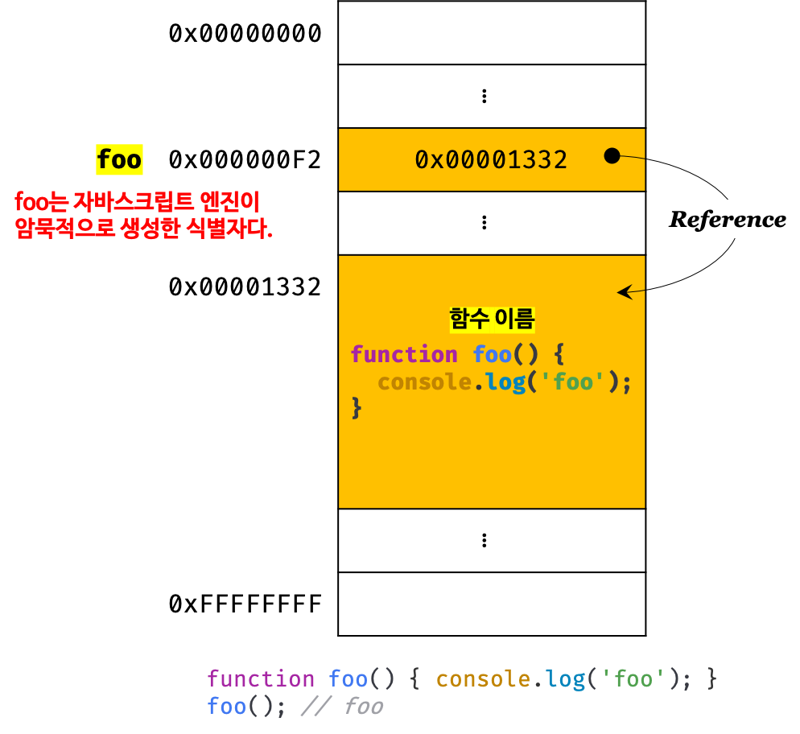
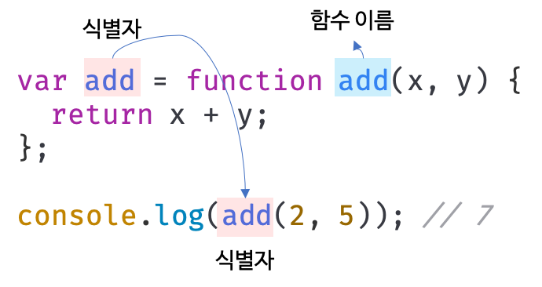

## Chapter 12. 함수 

### 함수란 ?
 - 일련의 과정을 문(statement)으로 구현하고 코드 블록을 감싸서 하나의 실행 단위로 정의한 것.
 - 수학의 함수처럼 입력을 받아서 출력을 내보낸다.
 - 함수의 구성 요소
    - 함수 내부로 입력을 전달받는 변수 `매개변수(parameter)` 
    - 입력(input) `인수(argument)`
    - 출력(output) `반환값(return value)`
    
 - 함수는 `값`이며, 여러 개 존재할 수 있음. 따라서 함수 이름을 붙일 수 있음.
 - `함수 정의(function definition)` 
    - 함수를 생성
    - 함수 정의만으로 함수가 실행되지는 않음 
 - `함수 호출(function call/invoke)`
    - 인수를 매개변수를 통해 함수에 전달하며 함수의 실행을 명시적으로 지시
    - 함수를 호출하면 코드 블록에 담긴 문들이 실행되고 반환값(실행 결과)을 반환

### 함수의 사용 이유
 - 실행 시점을 개발자가 결정할 수 있음
 - 몇 번이든 `재사용` 가능 (코드의 재사용성)
 - 반복 작업을 수행해야 한다면 중복 코드를 작성하는 것보다 미리 정의된 함수를 재사용 하는 것이 효율적
 - 유지보수의 편의성을 높이고 실수를 줄임
 - 코드의 신뢰성을 높이는 효과
 - 코드의 `가독성` 향상

### 함수 리터럴
 - function 키워드, 함수 이름, 매개변수 목록, 함수 몸체로 구성
  1. 함수 이름  
    - 식별자 네이밍 규칙을 준수한 식별자  
    - 함수 몸체 내에서만 참조할 수 있음  
    - 생략 가능  
    - 이름이 있는 함수는 기명 함수(named function), 이름이 없는 함수는 무명/익명 함수(anonymous function)
  2. 매개변수 목록  
    - 0개 이상의 매개변수를 소괄호로 감싸고 쉼표로 구분  
    - 순서에 의미가 있음 (함수를 호출할 때 지정한 인수가 순서대로 할당)  
    - 식별자 네이밍 규칙을 준수해야함 (함수 몸체 내에서 변수와 동일하게 취급됨)  
  3. 함수 몸체  
    - 함수가 호출됐을 때 일괄적으로 실행될 문들을 하나의 실행 단위로 정의한 코드 블록  
    - 함수 호출에 의해 실행됨
 - 함수 리터럴은 평가되어 값을 생성하기 때문에 `객체`이다
 - 일반 객체와 다르게 호출할 수 있고 함수 객체만의 고유한 프로퍼티를 갖음  
   Q. 함수만의 고유한 프로퍼티가 무엇이냐?!

### 함수 정의
- 선언문에는 세미콜론 안 붙는다!
- 변수는 `선언(declaration)`이지만 함수는 `정의(definition)`  
  함수 선언문이 평가되면 식별자가 암묵적으로 생성되고 함수 객체가 할당
Q. 음..식별자가 암묵적으로 생성된다고..? 객체가 할당되다니..? 
- 함수는 기본적으로 `undefined`를 반환! 다른 값을 반환하기 위해서는 반환값을 지정하는 `return`문이 있어야 함

 1. 함수 선언문 (function declaration / function statement)
  ```jsx
  function add(x, y) {
    return x + y;
  }
  ```
  - 함수 리터럴과 형태 동일하지만 함수 이름 생략 불가  
  - 함수 선언문은 표현식이 아닌 문이다 (그렇기 때문에 콘솔에서 선언문 실행 시 완료값completion value로 undefined가 출력됨)  
  - 함수 선언문은 표현식이 아닌 문이므로 변수에 할당할 수 없으나, 변수에 할당되는 것처럼 보인다. 이는 js엔진이 코드의 문맥에 따라 표현식이 아닌 함수 선언문 또는 표현식인 문인 함수 리터럴 표현식으로 해석하는 경우가 있기 때문
  ```jsx
  var add = function add(x, y) {
    return x + y;
  };

  console.log(add(2, 5)); // 7
  ```
  - 함수 이름이 있는 함수 리터럴을 단독으로 사용하면 함수 선언문으로 해석, 함수 리터럴이 값으로 평가되어야하면 함수 리터럴 표현식으로 해석
  ```jsx
  // 기명 함수 리터럴을 단독으로 사용하면 함수 선언문으로 해석된다.
  // 함수 선언문에서는 함수 이름을 생략할 수 없다.
  function foo() { console.log('foo'); }
  foo(); // foo

  // 그룹 연산자()의 피연산자는 값으로 평가될 수 있는 표현식이어야함
  // 함수 리터럴을 피연산자로 사용하면 함수 선언문이 아니라 함수 리터럴 표현식으로 해석된다.
  // 함수 리터럴에서는 함수 이름을 생략할 수 있다.
  // 함수 몸체 외부에서 함수 이름으로 함수 호출 불가, 즉 식별자가 없다...?
  (function bar() { console.log('bar'); });
  bar(); // ReferenceError: bar is not defined
  ```
  Q. 위에서 왜 foo는 엔진이가 식별자를 암묵적으로 생성해주고 bar는 안해주는거야????
  - js엔진은 생성된 함수를 호출하기 위해 함수 이름과 동일한 이름의 식별자를 암묵적으로 생성하고, 거기에 생성된 함수 객체를 할당
  
  - 함수는 이름으로 호출하는 것이 아니라 함수 객체를 가리키는 `식별자`로 호출!!
  
 2. 함수 표현식 (function expression)
  ```jsx
  var add = function (x, y) {
    return x + y;
  };
  ```
  - js의 함수는 값처럼 변수에 할당할 수도 있고, 프로퍼티 값이 될 수도 있으며 배열의 요소가 될 수도 있기에 `일급 객체(first-class object)`라 한다.
  - 즉, 함수가 일급 객체라는 것은 함수를 값처럼 자유롭게 사용할 수 있다는 것!
  - 함수 리터럴로 생성한 함수를 변수에 할당할 수 있음 - 이 정의 방식을 함수 표현식이라고 함
  - 함수 리터럴의 함수 이름은 생략 가능 - 익명 함수
  - 함수 표현식의 함수 리터럴은 일반적으로 함수 이름을 생략 
 3. 함수 생성 시점과 함수 호이스팅
  - 함수 선언문으로 정의한 함수는 함수 선언문 이전에 호출 O
  - but, 함수 표현식으로 정의한 함수는 함수 표현식 이전에 호출 X
  - why? 두 함수의 생성 시점이 다르기 때문
  - 변수 선언문처럼 함수 선언문도 runtime 이전에 js엔진에 의해 먼저 실행되어 함수 객체가 먼저 생성! (`function hoisting`)
  - 따라서 코드가 실행되는 runtime에는 이미 함수 객체가 생성되어 함수 이름과 동일한 식별자에 할당까지 완료된 상태! 그렇기 때문에 함수 선언문 이전에 참조도 할 수 있고 호출도 할 수 있음
  - var 변수와 다르게 함수 선언문을 통해 암묵적으로 생성된 식별자는 `함수 객체로 초기화`된다
  - 함수 표현식은 변수 선언문과 변수 할당문을 한번에 기술한 축약 표현과 동일하게 동작 -> 즉, 함수 표현식의 함수 리터럴은 할당문이 실행되는 시점에 평가되어 함수 객체가 된다.
  - `함수 표현식`으로 함수를 정의하면 함수 호이스팅이 발생하는 것이 아니라 `변수 호이스팅` 발생 -> 따라서 함수 표현식 이전에 함수를 참조하면 undefined로 평가되어 undefined를 호출하는건 말이 안되니까 타입 에러(TypeError) 발생
 4. Function 생성자 함수 (function constructor)
  ```jsx
  var add = new Function('x', 'y', 'return x + y');
  ```
  - Function 생성자 함수는 js가 기본 제공하는 빌트인 함수
  - 매개변수 목록과 함수 몸체를 문자열로 전달 + nuw 연산자와 함께 호출 -> 함수 객체 생성하여 반환 (new 연산자 없어도 결과 동일)
  - 이 방식으로 생성한 함수는 클로저(closure)를 생성하지 않는 등 함수 선언문 또는 함수 표현식으로 생성한 함수와 다르게 동작하기 때문에 이를 활용하는 것은 일반적이지 않으며 바람직하지 않음!
 5. 화살표 함수 (arrow function) - ES6에서 추가됨
  ```jsx
  var add = (x, y) => x + y;
  ```
  - function 키워드 대신 화살표(fat arrow)사용하여 간결하게 함수 선언 
  - 이는 항상 익명 함수로 정의
  - 표현만 간략한 것이 아니고 내부 동작도 간략화되어 있음

### 함수 호출
함수를 호출하면 현재의 실행 흐름을 중단하고 호출된 함수로 실행 흐름을 옮김
1. 매개변수와 인수
 - 함수 실행에 필요한 값을 함수 외부에서 내부로 전달해야하는 경우, 매개변수(parameter,인자)를 통해 인수(argument, 값으로 평가될 수 있는 표현식) 전달
 - 매개변수는 함수를 정의할 때 선언, 함수 몸체 내부에서 변수와 동일하게 취급
 - 함수 호출 -> 함수 몸체 내 매개변수 생성(암묵적) -> undefined로 초기화 -> 인수 할당(순서대로) => 이를 함수 호출될 때마다 반복
 
 - 매개변수의 scope(유효 범위)는 함수 내부 - 함수 몸체 외부에서 참조 불가
 - 함수를 호출할 때 매개변수의 수만큼 인수를 전달하지 않아도 에러 발생 X
 - if, 인수가 부족한 경우 인수가 할당되지 않은 매개변수의 값은 undefined
 - 반면에 매개변수보다 인수가 많은 경우에는 초과된 인수 무시! (but, 모든 인수는 암묵적으로 arguments 객체의 프로퍼티로 보관)
 ```jsx
 function add(x, y) {
   return x + y;
 }
 console.log(add(2)); // NaN (x+y = 2+undefined)

 function add2(x, y) {
   return x + y;
 }
 console.log(add(2, 5, 10)); // 7
 ```
2. 인수 확인
 ```jsx
 // 어떤 타입의 인수를 전달해야 하는지, 어떤 타입의 값을 반환하는지 알 수 없음
 function add(x, y) {
  return x + y;
 }

 // 숫자 타입의 인수를 전달 했을 때,
 console.log(add(2));        // NaN

 // 문자열 타입의 인수를 전달 했을 때,
 console.log(add('a', 'b')); // 'ab'
 ```
 - js함수는 매개변수와 인수의 개수가 일치하는지 확인하지 않음
 - js는 동적 타입 언어이기 때문에 js함수는 매개변수의 타입을 사전이 지정할 수 없음

3. 매개변수의 최대 개수
 - ECMAScript 사양에서 매개변수의 최대 개수에 대해 제한하지 않음
 - 매개변수는 순서에 의미가 있기 때문에 매개변수가 많아지면 함수를 호출할 때 전달해야 할 인수의 순서를 고려해야함. 이는 실수 발생시킬 위험 높음
 - 매개변수의 개수나 순서가 변경되면 함수의 호출 방법도 바뀌므로 코드 전체가 영향을 받아 유지보수성이 나빠짐
 - 이상적인 매개변수의 개수는 0개이며 적을수록 좋다....... ㅋ 
 - 매개변수의 수가 많아지면 함수가 여러가지 일을 한다는 것이므로 바람직하지 않음
 - 이상적인 함수는 한 가지 일만 해야하고 가급적 작게 만들어야한다 (이상적인건.. 보통 현실에 존재하기 어렵지않나여.. 꿈 속에서나 보는... 그렇지만 이상적인 함수를 사용하는 걸 추구해야겠지..?)
 - 권장하는 매개변수의 수는 최대 3개!
 - 4개 이상의 매개변수가 필요하면 하나의 매개변수를 선언하고 객체를 인수로 전달하는 것이 유리 (음.. 어떻게 사용하는거지 이게? 흠.. )
4. 반환문
 - 함수는 `return` 키워드와 표현식(반환값)으로 이뤄진 반환문을 사용해 실행 결과를 함수 외부로 반환할 수 있음
 - 함수 호출은 표현식은 return 키워드가 반환한 표현식의 결과(반환값)으로 평가됨
 - 반환문의 역할  
  - 함수의 실행을 중단하고 함수 몸체 탈출! (즉, 반환문 이후에 있는 다른 문은 실행되지 않고 무시)
  - return 키워드 뒤에 오는 표현식을 평가해 반환! (표현식이 명시적으로 지정되어 있지 않으면 undefined 반환)
 - 반환문 생략 가능 -> 함수 몸체의 마지막 문까지 실행 후 암묵적으로 undefined 반환
 - 함수 몸체 내부에서만 사용 가능! 전역에서 반환문 사용 시 문법 에러 (SyntaxError: Illegal return statement) 발생

### 참조에 의한 전달과 외부 상태의 변경
 - 매개변수도 변수와 마찬가지로 타입에 따라 '값에 의한 전달(pass by value)', '참조에 의한 전달(pass by reference)' 방식을 따름
 - 값에 의한 호출(call by value), 참조에 의한 호출(call by reference)이라고 부르기도 함
 - 참조에 의한 호출은 참조값을 전달하고 (실제 객체가 들어있는 메모리 주소를 참조) 한 댑스 더 찾아들어감. 
 - 참조값은 여럿이 공유할 수 있기 때문에 원본 훼손 가능성이 높다(원본 수정 가능)
 - 여러 함수가 하나의 참조값을 공유하게 되면 값이 수정되었을 때 서로 영향을 받아 상태 변화 추적이 어렵다. 

### 다양한 함수의 형태
1. 즉시 실행 함수 (IIFE, Immediately Invoked Function Expression)
 - 함수 정의와 동시에 즉시 호출되는 함수
 - 단 1번만 호출되고 다시 호출할 수 없음
 - 일반적으로 익명 함수를 사용
 - 기명 즉시 실행 함수도 사용할수 있다 (그룹연산자 내의 기명 함수는 함수 리터럴로 평가됨)
 ```jsx
  // 익명 즉시 실행 함수
  (function () {
    var a = 3;
    var b = 5;
    return a * b;
  }());

  // 기명 즉시 실행 함수
  (function foo() {
    var a = 3;
    var b = 5;
    return a * b;
  }());

  foo(); // ReferenceError: foo is not defined
 ```
 - 반드시! 그룹 연산자`()`로 감싸줘야한다 (안 쓰면 에러 발생)
 - 그룹 연산자로 함수를 묶는 이유는 함수 리터럴을 평가해서 함수 객체를 생성하기 위함
 - 즉시 실행 함수도 일반 함수처럼 값을 반환할 수 있고 인수 전달도 가능
2. 재귀 함수 (recursive function)
 - 재귀 호출(recursive call) ? 함수가 자기 자신을 호출하는 것
 - 재귀 함수 ? 재귀 호출을 수행하는 함수
 - 반복되는 처리를 위해 사용
 - 재귀 함수는 무한 재귀 호출하기 때문에 '탈출 조건'을 반드시 만들어줘야 함
 - 탈출 조건 없으면 무한 호출되어 스택 오버플로(stack overflow) 에러 발생  
   - 프로그램이 호출 스택에서 이용 가능한 공간 이상을 사용하려고 시도할 때
 - 대부분의 재귀 함수는 for문이나 while문으로 구현 가능
3. 중첩 함수 (nested function)
 - 함수 내부에 정의된 함수로 내부 함수(inner function)이라고도 함
 - 중첩 함수를 포함하는 함수는 외부 함수(outer function)이라고 함
 - 보통 중첩 함수는 자신을 포함하는 외부 함수를 돕는 헬퍼 함수(helper fuction) 역할
 - ES6부터 함수 정의는 문이 위치할 수 있는 문맥이면 어디든지 가능! if문이나 for문 등의 코드 블록 내에서도 정의 가능
 - but, 호이스팅으로 인해 혼란 발생할 수 있으니 if문, for문 등의 코드 블록에서 함수 선언문을 통해 함수를 정의하는 것은 바람직하지 않음
4. 콜백 함수 (callback function)
 - 파라미터(매개변수)로 전달되는 함수 - 함수의 매개변수를 통해 다른 함수의 내부로 전달되는 함수
 - 매개변수를 통해 함수의 외부에서 콜백 함수를 전달받은 함수는 고차 함수(Higher-Order Function, HOF)
 - 매개변수를 통해 함수를 전달받거나 반환값으로 함수를 반환하는 함수를 함수형 프로그래밍 패러다임에서 고차 함수라 한다
 - 콜백 함수도 고차 함수에 전달되어 헬퍼 함수의 역할을 함
 - 함수 외부에서 고차 함수 내부로 주입하기 때문에 자유롭게 교체할 수 있다!
 - 고차 함수는 콜백 함수를 자신의 일부분으로 합성한다 
 - 고차 함수는 매개변수를 통해 전달받은 콜백 함수의 호출 시점을 결정해서 호출한다
 - 콜백 함수는 고차 함수에 의해 호출됨(모든 콜백 함수가 그런 것은 아님)
 - 고차 함수는 필요에 따라 콜백 함수에 인수를 전달할 수 있음(함수 자체를 전달)
 - 함수가 실행되는 중간에 호출되어 상태 정보를 전달하거나 결과 값을 처리하는데 사용 
 - 비동기 처리(이벤트 처리, Ajax 통신, Timer 함수 등)에 활용되는 중요 패턴
5. 순수 함수와 비순수 함수
 - 순수 함수(pure function) ? 어떤 외부 상태에 의존 X, 변경 X, 부수 효과 X
 - 비순수 함수(impure function) ? 외부 상태에 의존 O, 외부 상태 변경 O, 부수 효과 O
   1. 순수 함수
     - 동일한 인수가 전달되면 언제나 동일한 값을 반환
     - 오직 매개변수를 통해 함수 내부로 전달된 인수에게만 의존하여 반환값을 만듦
     - 함수의 외부 상태를 변경하지 않음
     ```jsx
     var count = 0; // 현재 카운트를 나타내는 상태

     // 순수 함수 increase는 동일한 인수가 전달되면 언제나 동일한 값을 반환한다.
     function increase(n) {
       return ++n;
     }

     // 순수 함수가 반환한 결과값을 변수에 재할당해서 상태를 변경
     count = increase(count);
     console.log(count); // 1

     count = increase(count);
     console.log(count); // 2
     ```
   2. 비순수 함수
     - 외부 상태에 따라 반환값이 달라짐
     - 외부 상태를 변경하는 부수 효과(side effect)있음
     ```jsx
     var count = 0; // 현재 카운트를 나타내는 상태: increase 함수에 의해 변화한다.

     // 비순수 함수
     function increase() {
       return ++count; // 외부 상태에 의존하며 외부 상태를 변경한다.
     }

     // 비순수 함수는 외부 상태(count)를 변경하므로 상태 변화를 추적하기 어려워진다.
     increase();
     console.log(count); // 1
     increase();
     console.log(count); // 2
     ```
 - 함수가 외부 상태를 변경하면 상태 변화를 추적하기 어려워짐
 - 함수 외부 상태의 변경을 지양하는 순수 함수를 사용하는 것이 좋음
 - 비순수 함수를 줄이는 것은 부수 효과를 억제하는 것과 동일
 - 함수형 프로그래밍은 순수 함수와 보조 함수의 조합을 통해 외부 상태를 변경하는 부수 효과를 최소화해서 불변성(immutability)을 지향하는 프로그래밍 패러다임
 - 조건문이나 반복문은 로직의 흐름을 이해하기 어렵게 해서 가독성을 해치고, 변수의 값은 누군가에 의해 언제든지 변경될 수 있어 오류 발생의 근본적 원인이 될 수 있음
 - 함수형 프로그래밍은 결국 오류를 피하고 프로그램의 안정성을 높이려는 노력의 일환