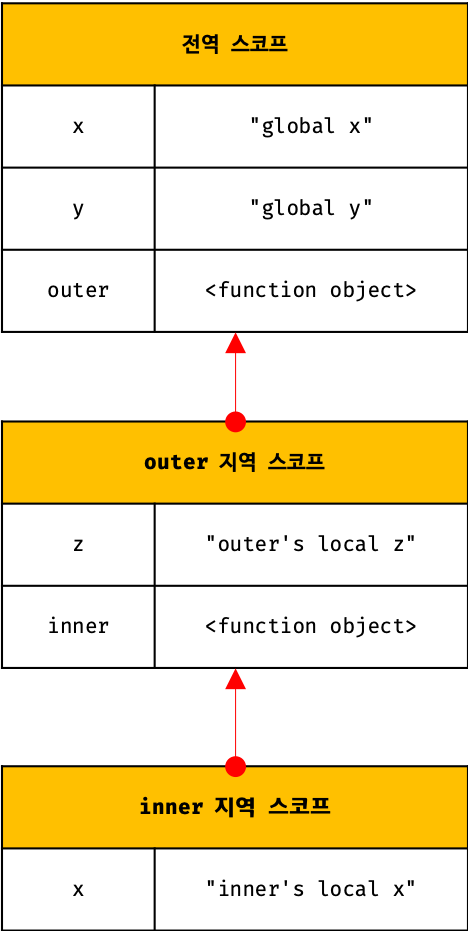
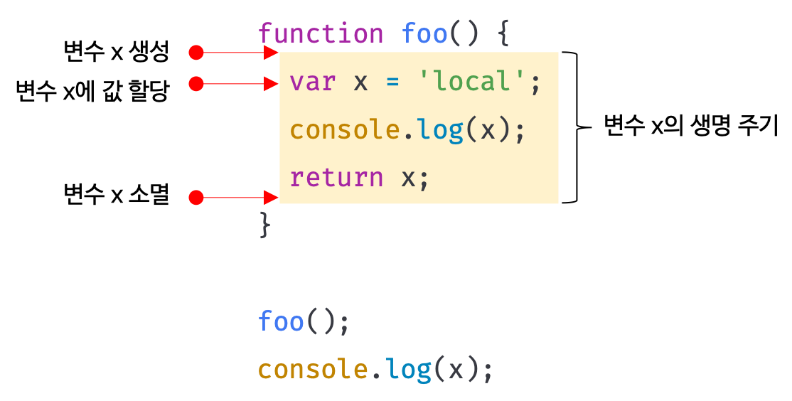
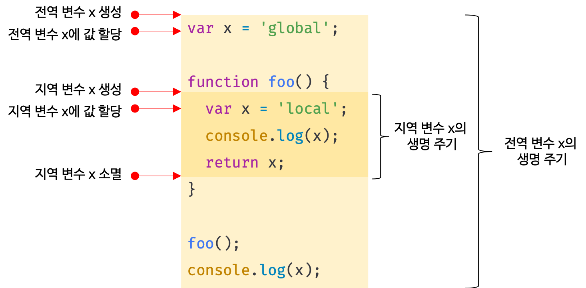

## Chapter 13. 스코프 

### 스코프(scope)란 ?

- 모든 프로그래밍 언어의 기본적이며 중요한 개념
- 유효범위를 나타내는데 var 키워드로 선언한 변수와 let 또는 const 키워드로 선언한 변수의 스코프는 다르게 작동함
- 함수의 매개변수는 함수 몸체 내부에서 참조할 수 있는데, 이를 매개변수의 스코프(유효범위)가 함수 몸체 내부로 한정되어 있다고 한다
- 모든 식별자(변수 이름, 함수 이름, 클래스 이름 등)는 자신이 선언된 위치에 의해 유효한 범위가 결정된다. 즉, 스코프는 식별자가 유효한 범위를 말함
- '식별자 결정(identifier resolution)' - 같은 이름을 가진 변수가 두 개 있을 때 js엔진은 어떤 변수를 참조해야 할 것인지 결정하는 것
- 식별자 결정을 할 때 스코프를 통해 결정하게 됨 → 스코프는 js엔진이 식별자를 검색할 때 사용하는 규칙
- js엔진은 코드를 실행할 때 코드의 문맥(context)을 고려하여 코드가 어디서 실행되고 주변에 어떤 코드가 있는지에 따라 다른 결과가 나올 수 있음
- if, 스코프라는 개념이 없다면 같은 이름을 갖는 변수는 충돌을 일으키므로 프로그램 전체에 하나밖에 사용 못함
- 식별자는 어떤 값을 구별할 수 있어야 하기 때문에 유일(unique)해야함 → 즉, 하나의 값은 유일한 식별자에 연결(name binding)되어야 함
- 스코프는 네임스페이스! (스코프 내에서 식별자는 유일해야 하지만, 다른 스코프에는 같은 이름의 식별자를 사용할 수 있음)
- `var 키워드로 선언한 변수의 중복 선언` - 같은 스코프 내에서 중복 선언이 허용되어 의도치 않게 변수 값이 재할당되어 변경되는 부작용이 있음
- `let` 이나 `const` 키워드로 선언된 변수는 같은 스코프 내에서 중복 선언을 허용하지 않음

### 스코프의 종류
- 전역(global)과 지역(local)으로 구분
1. 전역과 전역 스코프(global scope)

   - 전역은 코드의 가장 바깥 영역으로 전역 변수(global variable)는 어디서든지 참조할 수 있다.
2. 지역과 지역 스코프(local scope)
   - 지역이란 `함수 몸체 내부`를 말하는데, 지역 변수(local variable)는 자신의 지역 스코프와 하위 지역 스코프에서 유효하다!

### 스코프 체인
 - 함수의 중첩?  
 함수 몸체 내부에 함수가 정의된 것
 - 중첩 함수(nested function) ?  
 함수 몸체 내부에서 정의한 함수 
 - 외부 함수(outer function) ?  
 중첩 함수를 포함하는 함수
 - 함수는 중첩될 수 있으니 함수의 지역 스코프도 중첩이 될 수 있다!-> `스코프가 함수의 중첩에 의해 계층적 구조를 갖는다`
 - 외부 함수의 지역 스코프를 중첩 함수의 상위 스코프라 함
 - `스코프 체인(scope chain)` ?  
 모든 스코프는 하나의 계층적 구조로 연결되며, 모든 지역의 스코프의 최상위 스코프는 전역 스코프이다. 이러한 계층 구조로 연결된 것을 스코프 체인이라 함
 
 - 변수를 참조할 때 js엔진은 스코프 체인을 통해 변수를 참조하는 코드의 스코프에서 상위 스코프 방향으로 이동하며 선언된 변수를 검색(identifier resolution)
 - 스코프 체인은 물리적인 실체로 존재! -> 코드 실행 전 위의 그림과 같은 자료구조인 `렉시컬 환경(Lexical Environment)` 생성함

1. 스코프 체인에 의한 변수 검색 
   - 스코프 체인을 따라 변수를 참조하는 코드의 스코프에서 시작해서 상위 스코프 방향으로 이동하며 선언된 변수를 검색한다.
   - 즉, `상위 스코프에서 유효한 변수는 하위 스코프에서 자유롭게 참조할 수 있지만 하위 스코프에서 유효한 변수를 상위 스코프에서 참조할 수 없다`
   - 스코프의 계층적 구조는 '상속(inheritance)'과 유사
2. 스코프 체인에 의한 함수 검색
  - js엔진은 함수 이름과 동일한 이름의 식별자를 암묵적으로 선언하고 생성된 함수 객체를 할당
  - 함수도 식별자에 할당되기 때문에 스코프를 가짐

### 함수 레벨 스코프
 - 코드 블록이 아닌 함수에 의해서만 지역 스코프가 생성됨
 - 대부분의 프로그래밍 언어는 함수 몸체만이 아니라 모든 코드 블록(if, for, while 등)이 지역 스코프를 만드는데 이를 `블록 레벨 스코프(block level scope)`라 함
 - `함수 레벨 스코프(function level scope)` ?  
 `var` 키워드로 선언된 변수는 오로지 함수의 코드 블록(함수 몸체)만을 지역 스코프로 인정!!
 ```jsx
 var x = 1;

if (true) {
  // var 키워드로 선언된 변수는 함수의 코드 블록(함수 몸체)만을 지역 스코프로 인정한다.
  // 함수 밖에서 var 키워드로 선언된 변수는 코드 블록 내에서 선언되었다 할지라도 모두 전역 변수다.
  // 따라서 x는 전역 변수다. 이미 선언된 전역 변수 x가 있으므로 x 변수는 중복 선언된다.
  // 이는 의도치 않게 변수 값이 변경되는 부작용을 발생시킨다.
  var x = 10;
}

console.log(x); // 10
```
 - var 변수와 다르게 ES6에서 도입된 let, const 키워드는 블록 레벨 스코프를 지원한다!

### 렉시컬 스코프
```jsx
var x = 1;

function foo() {
  var x = 10;
  bar();
}

function bar() {
  console.log(x);
}

foo(); // 1
bar(); // 1
```
- 동적 스코프(dynamic scope) ?  
   - 함수를 어디서 `호출`했는지에 따라 함수의 상위 스코프를 결정
   - 함수를 정의하는 시점에 함수가 어디서 호출될지 알 수 없으므로 함수가 호출되는 시점에 동적으로 상위 스코프를 결정
- `렉시컬 스코프(lexical scope)` ?  
   - 정적 스코프(static scope)라고도 함
   - 함수를 어디서 `정의`했는지에 따라 함수의 상위 스코프를 결정
   - 함수 정의가 평가되는 시점에 상위 스코프가 정적으로 결정되는 것!!
- 자바스크립트는 렉시컬 스코프를 따르므로 함수를 어디서 정의했는지에 따라 상위 스코프를 결정한다. 함수가 호출된 위치는 상위 스코프 결정에 어떠한 영향도 주지 않는다. 즉, `함수의 상위 스코프는 언제나 자신이 정의된 스코프`다.
- 함수 정의(함수 선언문 또는 함수 표현식)가 실행되어 생성된 함수 객체는 결정된 상위 스코프를 기억함 -> 함수가 호출될 때마다 함수의 상위 스코프를 참조해야하니까

---

## Chapter 14. 전역 변수의 문제점
전역 변수의 무분별한 사용은 위험!

### 변수의 생명 주기
1. 지역 변수의 생명 주기
 - 변수는 선언에 의해 생성되고 할당을 통해 값을 가졌다가 언젠가 소멸함! 즉, 생성되고 소멸되는 생명 주기(life cycle)가 있음
 - 변수에 생명 주기가 없다면 프로그램이 종료될 때까지.. 영원히 메모리 공간을 차지함
 - 변수는 자신이 선언된 위치에서 생성되고 소멸되는데 전역 변수의 생명 주기는 애플리케이션의 생명 주기와 같음
 - 지역 변수는 함수가 호출되면 생성되고 함수가 종료하면 소멸! (함수의 생명 주기와 일치)
 
 - 위 그림에서 함수가 호출되면 함수 내부의 코드들이 실행되기 이전에 (런타임 전에) x변수의 선언문이 먼저 실행되어 변수 선언되고 undefined로 초기화됨 -> 그 후 문들이 실행될 때 값이 할당
 - 변수의 생명 주기는 메모리 공간이 확보(allocate)된 시점부터 메모리 공간이 해제(release)되어 가용 메모리 풀(memory pool)에 반환되는 시점까지!
 - 변수는 자신이 등록된 스코프가 소멸(스코프가 메모리에서 해제)될 때까지 유효
 - 할당된 메모리 공간은 더 이상 그 누구도 참조하지 않을 때 가비지 콜렉터에 의해 해제되어 가용 메모리 풀에 반환 - 즉, 누군가가 메모리 공간을 참조하고 있으면 해제되지 않고 확보된 상태
- 누군가 스코프를 참조하고 있으면 스코프는 소멸하지 않고 생존
- 호이스팅은 스코프를 단위로 동작
- 즉, 호이스팅은 변수 선언이 스코프의 선두로 끌어 올려진 것처럼 동작하는 자바스크립트 고유의 특징
2. 전역 변수의 생명 주기
- 전역 코드는 명시적인 호출 없이 실행됨(코드 실행을 위한 진입점entry point 없고 곧바로 해석&실행)
- 전역 코드는 마지막 문이 실행되어 더 이상 실행할 문이 없을 때 종료
- var 키워드로 선언한 전역 변수는 전역 객체의 생명 주기와 일치
- 전역 객체(global object)  
코드가 실행되기 이전 단계에 js 엔진에 의해 어떤 객체보다도 먼저 생성되는 특수한 객체로 클라이언트 사이드 환경(브라우저)에서는 window, 서버 사이드 환경(Node.js)에서는 global 객체를 의미


### 전역 변수의 문제점
1. 암묵적 결합(implicit coupling)  
   - 모든 코드가 전역 변수를 참조하고 변결할 수 있기 때문에 변수의 유효 범위가 클수록 가독성이 나빠지고 의도치 않게 상태가 변경될 위험성이 높다.
2. 긴 생명 주기
   - 전역 변수는 생명 주기가 길기 때문에 메모리 리소스를 오랜 시간 소비함
   - 상태 변경할 수 있는 시간이 길고 기회가 많기 때문에 위험
   - 특히, var 키워드는 변수의 중복 선언을 허용하므로 변수 이름이 중복될 가능성이 있음 (의도치 않은 재할당이 이루어질 수 있음)
3. 스코프 체인 상에서 종점에 존재
   - 스코프 체인에서 종점에 위치하기 때문에 변수를 검색할 때 전역 변수가 가장 마지막에 검색됨
   - 즉, 검색 속도가 느리다 
4. 네임스페이스 오염
   - 파일이 분리되어 있어도 하나의 전역 스코프를 공유... 따라서 다른 파일에서 동일한 이름의 전역 변수 또는 전역 함수가 같은 스코프 내에 존재할 경우 예상치 못한 결과를 초래할 수 있음

### 전역 변수의 사용을 억제하는 방법
변수의 스코프는 좁을수록 좋다! 

1. 즉시 실행 함수 
- 함수 정의와 동시에 호출되는 즉시 실행 함수! only one time 호출됨
- 모든 코드를 즉시 실행 함수로 감싸면 모든 변수는 즉시 실행 함수의 지역 변수가 됨
```jsx
(function () {
  var foo = 10; // 즉시 실행 함수의 지역 변수
  // ...
}());

console.log(foo); // ReferenceError: foo is not defined
```
2. 네임스페이스(namespace) 객체
 - 이름 공간... 개체를 구분할 수 있는 범위, 하나의 이름 공간에서는 하나의 이름이 단 하나의 개체만을 가리킴
 - 전역에 네임스페이스 역할을 담당할 객체를 생성하고 전역 변수처럼 사용하고 싶은 변수를 프로퍼티로 추가하는 방법
 - ...? 이게 뭐람...?
3. 모듈 패턴
 - 클래스를 모방해서 관련이 있는 변수와 함수를 모아 즉시 실행 함수로 감싸 하나의 모듈로 만듦
 - 클로저를 기반으로 동작 (클로저는 추후에 배움..)
 - 전역 변수의 억제는 물론 캡슐화까지 구현 가능 
 - 캡슐화(encapsulation) ?  
   - 객체의 상태(state)를 나타내는 프로퍼티와 프로퍼티를 참조하고 조작할 수 있는 동작(behavior)인 메서드를 하나로 묶는 것
   - 정보 은닉(information hiding) 목적으로도 사용 (객체의 특정 프로퍼티나 메서드를 감추는 의도)
  ```jsx
  var Counter = (function () {
  // private 변수
  var num = 0;

  // 외부로 공개할 데이터나 메서드를 프로퍼티로 추가한 객체를 반환한다.
  return {
    increase() {
      return ++num;
    },
    decrease() {
      return --num;
    }
  };
  }());

  // private 변수는 외부로 노출되지 않는다.
  console.log(Counter.num); // undefined

  console.log(Counter.increase()); // 1
  console.log(Counter.increase()); // 2
  console.log(Counter.decrease()); // 1
  console.log(Counter.decrease()); // 0
```
 코드 이해 잘 안된다..
