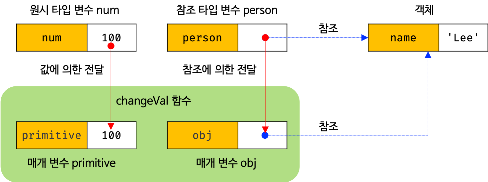

# 201127 - JavaScript Day 6
Day 5 함수 이어서 ...

## Chapter 14. 함수

- 변수에 할당한 함수는 익명으로 하는 것이 좋다!

### 얕은 복사

- 상위(?) 객체만 복사
- `Object.assign({}, obj)};` - 함수도 알아야 하고 사용법도 알아야함(매개변수가 어떤 타입인지 등)  
여기서 Object 는 빌트인 메서드, 뒤에 .assign은 빌트인 객체 (?)
- `{...obj}` - 좀 더 객관적인 표현식으로 사용법 몰라도 됨

```jsx
// 얕은 복사
const obj = {
    a: 1,
    b: 2,
    c: {
        d: 3
    }
};

// 빌트인 메서드 Object.assign()을 이용하여 얕은 복사
const copiedObj = Object.assign({}, obj);
copiedObj = {
    a: 1,
    b: 2,
    c: {
        d: 3
    }
};

// 1. 복사해온 범위 내에서 변경
copiedObj.b = 4; // b: 2 -> 4

console.log(copiedObj); // {a: 1, b: 4, c: {…}}
// 실제로 copiedObj가 복사해 새로운 객체를 만든건 'a: 1, b: 4, c: {참조값}'이지만 console.log찍으면 {d: 3}까지 나옴
console.log(obj); // {a: 1, b: 2, c: {…}} // copiedObj와 달리 변경되지 않음

// 2. 복사해온 범위 밖에서 변경
// 'c: 참조값'으로 복사해왔기 때문에 {d: 3}이 들어있는 실제 메모리 주소를 obj와 공유하고 있음(얕은 복사로 인해)
copiedObj.c.d = 5; // c: {d: 3} -> c: {d: 5}

console.log(copiedObj); // {a: 1, b: 4, c: {d: 5}}
console.log(obj); // {a: 1, b: 2, c: {d: 5}} // copiedObj의 변경에 영향을 받음
```

### 함수 호출

2. 인수 확인

- 동적 타입 → runtime 중에 타입이 변할 수 있다
- 정적 타입 → runtime 이전에 확정된 타입
- 객체 - CRUD
    - Create 생성
    - Read 접근
    - Update 갱신
    - Delete 삭제

3. 매개변수의 최대 개수

- 매개변수가 4개 이상이 되면 하나의 객체로 만들어서 넘겨라 (객체로 만들면 순서 의미 없음, 인수는 순서가 중요하니까) - 다만, 단점이 외부와 내부에서 누군가 변경하면 서로 영향을 주고 받음...
- 가변 인자 함수 (파라미터 값(개수)이 변하는 함수)
- 인수가 매개변수에 할당됨
- 불변성 유지를 위해 객체를 얼린다..(챕터 16에서 배움) - 객체를 얼려서 (갱신 못하게, 지우지도 추가하지도 못하게) 전달
- 외부값(호출할때?) 변경할수 없게

4. 반환문

- `return` 키워드의 역할 두가지
    - 키워드 뒤의 표현식을 평가하여 함수 외부로 반환
    - 함수 실행 종료
- return 안써주면 암묵적으로 return;이 생겨 `undefined` 반환
- 함수만 뭔가를 반환하니까 return키워드는 함수에서만 사용! - 그외에서 사용하면 문법 에러남 (SyntaxError)

### 참조에 의한 전달과 외부 상태의 변경

- 코드 한줄한줄 의미 의도가 있어야행 - ex, 어떤 값을 변수에 담아 만들 때에는 재사용해야 할 일이 있어서 변수를 만드는 것이여야 함
- 객체를 만약 원시값처럼 변경 불가하고 참조값이 아니라 값을 그대로 복사하여 할당하게 될 경우 메모리 소모가 크기 때문에 지금처럼 만들어짐 (옛날에는 메모리가 매우 비쌌으니까 메모리를 최대한 아껴야함...)

```jsx
// 매개변수 primitive는 원시값을 전달받고, 매개변수 obj는 객체를 전달받는다.
function changeVal(primitive, obj) {
  primitive += 100;
  obj.name = 'Kim';
}

// 외부 상태
var num = 100;
var person = { name: 'Lee' };
// 외부에 선언해놨기때문에 재할당(수정) 가능함.. 
// 다른데서도 사용하려고 외부에 굳이 변수를 선언한거
// 객체를 수정하는것을 방지하려면 read only로 만들어 얼려버려 

// 원시값은 값 자체가 복사되어 전달되고 객체는 참조값이 복사되어 전달된다.
changeVal(num, person);

// 만약에 changeVal(100, {}) 이렇게만 쓰면 100이란 값은 primitive만 접근가능
// 객체 {}는 obj만 접근 가능
// 다만 한번만 사용하겠지..? 
```



- 객체 값을 카피해서 바꾸는거,  값을 못바꾸게 변수에 할당한 객체를 read only로 만들어 (????)
- 가급적 순수함수를 지향.. - 함수형 프로그래밍
- 객체의 메서드는 비순수함수 (프로퍼티 값으로 뭔가를 하니까 (상태 변경을 하니까) 기본적으로 비순수

### 다양한 함수의 형태

1. 즉시 실행 함수 (Immediately Invoked Function Expression)
- 정의된 직후 실행 `IIFE` (용어 알아두세용)
- 함수 객체로 평가된거 뒤에 `()` 작성하여 바로 호출
- 그룹연산자로 감싸고 그 안은 값으로 평가되는 표현식(함수 리터럴)이 옴
- 그룹연산자 안 쓰면 함수 선언문으로 인식함 (왜냐, 함수키워드가 단독으로 있고 값으로 평가되지 않아도 되는 문맥이니까 )
    - 함수 선언문으로 인식하면 SyntaxError 발생
    - 익명 함수일 경우엔, 함수 선언문은 함수 이름을 생략할 수 없으니까
    - 기명 함수일 경우엔 ASI가 함수 몸체 `{}` 와 호출 연산자 `()` 사이에 `;` 세미콜론을 찍어버려서 호출 연산자가 아닌 그룹 연산자로 인식

        ```jsx
        function foo () {
        	console.log('Judy');
        } (); // 이 줄을 }; (); 이렇게 인식해버림..
        ```

- `(함수{})();` 이 방식으로  쓰는것을 권장
    - 왜냐면 화살표 함수랑 일관성있게 사용하려고

2. 재귀 함수

- 실행 컨텍스트(Execution Context) 스택 - 아직 잘 모르겠당 ㅎ
    - 실행 가능한 코드를 형상화하고 구분하는 추상적인 개념 (실행 가능한 코드가 실행되기 위해 필요한 환경)
    - 함수가 만들어질 때 생기는 자료구조
- 함수가 호출되면 객체가 만들어짐 - 실행 컨텍스트
- 대부분 반복문으로 구현 가능
- 재귀는 자기가 자기를 호출하는 함수
- 탈출구 안만들어주면 무한 반복하므로 `탈출 조건`이 꼭 있어야 함 → 없으면 `스택 오버플로(stack overflow)` 발생
- 남발해선 안되는 함수다!
- 반복문은 함수를 한번 호출하니까 실행 컨텍스트 한번만 만들어지지만 재귀함수는 호출되는 만큼 실행컨텍스트 만들어냄 ⇒ stack overflow
- 따라서 반복문이 성능면에서도 좋고 가독성 측면에서도 좋음
- 팩토리얼은 재귀함수가 주로 쓰임 - 이땐 재귀함수가 가독성 더 좋음
- 둘 중 뭘 써야할지 모르겠을 때는 둘다 써봐
- 깊은 복사할 때 주로 쓰이지만... 실무에서 잘 안씀


3. 중첩 함수

- 내부 함수라고도 함
- 함수 안에 또 함수
- 런타임 이전에, 평가단계에서 함수 객체 생성
- `상속`의 의미를 내포
- 변수는 값을 재사용, 함수는 `로직`을 재사용
- 즉, 함수 내에서 반복 행동을 하려고 중첩 함수 사용 (밖에서는 쓸 필요 없는 반복 작업)

4. 콜백함수

- 감춘다 = 추상화한다
- 인수로 함수를 받거나 return 값으로 함수를 받는 함수를 고차함수
- 함수가 값으로 표현되어야 함수형 프로그래밍
- `function repeat(n, f)` - f 함수를 n번 반복한다
- 고차함수가 호출하는게 콜백함수
- 고차함수가 호출하지 않는 함수가 비동기????
- 이벤트 핸들러 (event handler)

5. 순수 함수(pure function)와 비순수 함수(impure function)

- 순수 함수
    - 동일한 인수가 전달되면 언제나 동일한 값을 반환
    - 외부 상태를 변경하지 않고, 외부 상태에 의존하지도 않음
- 비순수 함수
    - 외부 상태에 따라 반환값이 달라짐
    - 부수 효과가 있어 외부 상태를 변경할 수도 있음

---

- 선형 검색 & 이진 검색
- 이진검색 - 범위를 반씩 좁혀가면서 찾는거 , 선형 검색보다 낫다
- indexOf  - array.indexOf(target)
- 함수형 프로그래밍이 되려면 함수가 일급 객체여야한다

```jsx
// var arr = []; // 빈 배열
var arr = [1, 2, 3]; // length : last index number + 1
// [1, 2, 3] => [2, 4, 6]
// 인덱스 값을 하나씩 2배로

// console.log(arr[0]);
// console.log(arr[1]);
// console.log(arr[2]); //
var res = [];
for (var i = 0; i < arr.length; i++) {
  // console.log(arr[i] * 2);
  res.push(arr[i] * 2);
}
// 만드는 것까진 성공. 이제 담아야 한다. 변수에!!
// 변수 res 선언

console.log(res);
```

```jsx
function linearSearch(array, target) {
  for (var i = 0; i < array.length; i++) {
    if(target === array[i]) return i; // 함수를 여기서 끝내면 되니까 return 
  }
  return -1;
}

console.log(linearSearch([1, 2, 3, 4, 5, 6], 1)); // 0
console.log(linearSearch([1, 2, 3, 4, 5, 6], 3)); // 2
console.log(linearSearch([1, 2, 3, 4, 5, 6], 5)); // 4
console.log(linearSearch([1, 2, 3, 4, 5, 6], 6)); // 5
console.log(linearSearch([1, 2, 3, 4, 5, 6], -1)); // -1
console.log(linearSearch([1, 2, 3, 4, 5, 6], 0)); // -1
console.log(linearSearch([1, 2, 3, 4, 5, 6], 7)); // -1
```

---

## H.W

- exercise 숙제 - 1.2 이진검색
- Chapter 15, 16 예습
- 복습