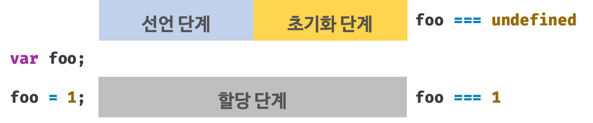
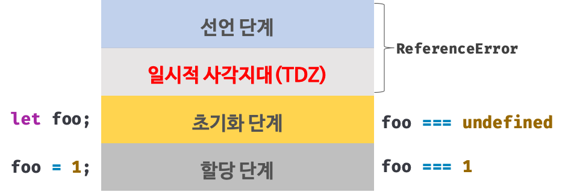

## Chapter 15. let, const와 블록 레벨 스코프

### var 키워드로 선언한 변수의 문제점
1. 변수 중복 선언 허용
   - var 키워드로 선언한 변수는 '중복 선언' 가능
   ```jsx
   var x = 1;
   var y = 1;

   // var 키워드로 선언된 변수는 같은 스코프 내에서 중복 선언을 허용한다.
   // 초기화문이 있는 변수 선언문은 자바스크립트 엔진에 의해 var 키워드가 없는 것처럼 동작한다.
   var x = 100;
   // 초기화문이 없는 변수 선언문은 무시된다. 에러 발생 NO
   var y;

   console.log(x); // 100
   console.log(y); // 1
   ```
2. 함수 레벨 스코프
   - var 키워드로 선언한 변수는 오로지 **함수의 코드 블록**만을 지역 스코프로 인정함
   - 함수 외부에서 var 키워드로 선언한 변수는 모두 전역 변수가 됨
3. 변수 호이스팅
   - 변수 호이스팅에 의해 var 키워드로 선언한 변수는 선언문이 스코프의 선두로 끌어 올려진 것처럼 동작하여 변수 선언문 이전에 참조 가능 (다만, 할당문 이전에 참조하면 undefined 반환)
   ```jsx
   // 이 시점에는 변수 호이스팅에 의해 이미 foo 변수가 선언되었다(1. 선언 단계)
   // 변수 foo는 undefined로 초기화된다. (2. 초기화 단계)
   console.log(foo); // undefined 
 
   // 변수에 값을 할당(3. 할당 단계)
   foo = 123;

   console.log(foo); // 123

   // 변수 선언은 런타임 이전에 자바스크립트 엔진에 의해 암묵적으로 실행된다.
   var foo;
   ```

### let 키워드  
 - var 키워드의 단점을 보완하기 위해 ES6에서 도입된 변수 선언 키워드
 - let외에 const도 있다

1. 변수 중복 선언 금지
   - let 키워드로 같은 이름의 변수를 중복 선언하면 문법 에러(SyntaxError) 발생 
   ```jsx
   var foo = 123;
   // var 키워드로 선언된 변수는 같은 스코프 내에서 중복 선언을 허용한다.
   // 아래 변수 선언문은 자바스크립트 엔진에 의해 var 키워드가 없는 것처럼 동작한다.
   var foo = 456;

   let bar = 123;
   // let이나 const 키워드로 선언된 변수는 같은 스코프 내에서 중복 선언을 허용하지 않는다.
   let bar = 456; // SyntaxError: Identifier 'bar' has already been declared
   ```
2. 블록 레벨 스코프
   - 함수 레벨 스코프를 따르는 var 키워드와 다르게 let 키워드로 선언한 변수는 모든 코드 블록(함수, if문, for문, while문 등)을 지역 스코프로 인정하는 `블록 레벨 스코프(block-level scope)`를 따름
   ```jsx
   let foo = 1; // 전역 변수

   {
     let foo = 2; // 지역 변수
     let bar = 3; // 지역 변수
   }

   console.log(foo); // 1
   console.log(bar); // ReferenceError: bar is not defined
   ```
  

3. 변수 호이스팅
   - let 키워드로 선언한 변수는 변수 호이스팅이 발생하지 않는 것처럼 동작
   - 변수 선언문 이전에 참조하면 참조 에러(ReferenceError) 발생
   ```jsx
   console.log(foo); // ReferenceError: foo is not defined
   let foo;
   ```
   - var 변수는 런타임 이전에 암묵적으로 선언 단계와 초기화 단계가 한번에 진행됨
   - 즉, var 변수는 선언 단계에서 스코프(실행 컨텍스트의 렉시컬 환경(Lexical Environment))에 변수 식별자를 등록하여 변수의 존재를 알림 -> 초기화 단계에서 undefined로 변수 초기화함 -> 따라서 선언문 이전에 변수에 접근해도 스코프에 변수가 존재하기 때문에 에러 발생하지 않고 undefined 반환
   
   - BUT!! let 키워드로 선언한 변수는 `'선언 단계'와 '초기화 단계'가 분리되어 진행`
   - 즉, let 변수는 런타임 이전에 js엔진에 의해 암묵적으로 선언 단계가 먼저 실행되기는 하지만, 초기화 단계는 변수 선언문에 도달했을 때 실행!
   - 초기화 단계가 실행되기 이전에 변수에 접근하면 참조 에러! 
   - 스코프의 시작 지점부터 초기화 시작 지점(변수 선언문)까지 변수를 참조할 수 없는 구간을 `일시적 사각지대(Temporal Dead Zone; TDZ)`라고 함
   ```jsx
   // 런타임 이전에 선언 단계가 실행된다. 아직 변수가 초기화되지 않았다.
   // 초기화 이전의 일시적 사각 지대에서는 변수를 참조할 수 없다.
   console.log(foo); // ReferenceError: foo is not defined

   let foo; // 변수 선언문에서 초기화 단계가 실행된다.
   console.log(foo); // undefined

   foo = 1; // 할당문에서 할당 단계가 실행된다.
   console.log(foo); // 1
   ```
    

4. 전역 객체와 let
   - 전역 객체는 전역 범위(global scope)에 항상 존재하는 객체  
     - 브라우저에서는 window
     - Node.js 환경에서는 global
   - var 키워드로 선언한 전역 변수와 전역 함수, 그리고 선언하지 않은 변수에 값을 할당한 암묵적 전역은 전역 객체 window의 프로퍼티가 됨, 전역 객체의 프로퍼티를 참조할 때 window 생략 가능
   ```jsx
   // 이 예제는 브라우저 환경에서 실행해야 한다.

   // 전역 변수
   var x = 1;
   // 암묵적 전역
   y = 2;
   // 전역 함수
   function foo() {}

   // var 키워드로 선언한 전역 변수는 전역 객체 window의 프로퍼티다.
   console.log(window.x); // 1
   // 전역 객체 window의 프로퍼티는 전역 변수처럼 사용할 수 있다.
   console.log(x); // 1

   // 암묵적 전역은 전역 객체 window의 프로퍼티다.
   console.log(window.y); // 2
   console.log(y); // 2

   // 함수 선언문으로 정의한 전역 함수는 전역 객체 window의 프로퍼티다.
   console.log(window.foo); // ƒ foo() {}
   // 전역 객체 window의 프로퍼티는 전역 변수처럼 사용할 수 있다.
   console.log(foo); // ƒ foo() {}
   ```
   - 반면에, let 키워드로 선언한 전역 변수는 전역 객체의 프로퍼티가 아님! 즉, window.foo와 같이 접근할 수 없음
   - let 전역 변수는 보이지 않는 개념적인 블록(전역 렉시컬 환경의 선언적 환경 레코드)내에 존재 (추후 배울 내용임.. )
   ```jsx
   // 이 예제는 브라우저 환경에서 실행해야 한다.
   let x = 1;

   // let, const 키워드로 선언한 전역 변수는 전역 객체 window의 프로퍼티가 아니다.
   console.log(window.x); // undefined
   console.log(x); // 1
   ```

### const 키워드
 - 상수(constant)를 선언하기 위해 사용하지만 반드시 상수만을 위해 사용하는 것은 아님

1. 선언과 초기화
   - const 키워드로 선언한 변수는 반드시 **선언과 동시에 초기화**해야 함
   - 선언과 초기화를 동시에 하지 않으면 문법 에러 발생
   ```jsx
   const foo; // SyntaxError: Missing initializer in const declaration
   ```
   - let 키워드와 마찬가지로 `블록 레벨 스코프`를 가지며, 변수 호이스팅이 발생하지 않는 것처럼 동작
   ```jsx
   {
     // 변수 호이스팅이 발생하지 않는 것처럼 동작한다
     console.log(foo); // ReferenceError: Cannot access 'foo' before initialization
     const foo = 1;
     console.log(foo); // 1
   }

   // 블록 레벨 스코프를 갖는다.
   console.log(foo); // ReferenceError: foo is not defined
   ```

2. 재할당 금지
   - 재할당 시 TypeError 발생
   ```jsx
   const foo = 1;
   foo = 2; // TypeError: Assignment to constant variable.
   ```

3. 상수
   - const 키워드로 선언한 변수에 원시값을 할당한 경우 변수 값을 변경할 수 없다. (원시값은 변경 불가능한 값immutable value이므로 재할당 없이는 값 변경 불가능)
   - 상수는 `재할당이 금지된 변수`를 말함
   - 상수 또한 값을 저장하기 뒤한 메모리 공간이 필요하므로 변수라고도 할 수 있음
   - But, 변수는 언제든 재할당을 통해 변수 값을 변경할 수 있으나, 상수는 재할당 금지!
   - 상태 유지와 가독성, 유지보수의 편의를 위해 상수를 사용하도록 하자!
   - 일반적으로 상수의 이름은 대문자로 선언해 상수임을 명확히 나타냄
   ```jsx
   // 세전 가격
   let preTaxPrice = 100;

   // 세후 가격
   // 0.1의 의미를 명확히 알기 어렵기 때문에 가독성이 좋지 않다.
   let afterTaxPrice = preTaxPrice + (preTaxPrice * 0.1);

   console.log(afterTaxPrice); // 110

   // 상수를 사용해보자

   // 세율을 의미하는 0.1은 변경할 수 없는 상수로서 사용될 값이다.(즉, 고정된 값)
   // 변수 이름을 대문자로 선언해 상수임을 명확히 나타낸다.
   const TAX_RATE = 0.1;

   // 세전 가격
   let preTaxPrice = 100;

   // 세후 가격
   let afterTaxPrice = preTaxPrice + (preTaxPrice * TAX_RATE);

   console.log(afterTaxPrice); // 110
   ```

4. const 키워드와 객체
   - const 키워드는 재할당을 금지할 뿐 불변(immutable)을 의미하지는 않는다
   - const 키워드로 선언된 변수에 객체를 할당한 경우, 값을 변경할 수 있다 - 객체는 재할당 없이도 변경이 가능하기 때문!
   - 객체가 변경되더라도 변수에 할당된 참조값은 변경되지 않음

### `var` vs `let` vs `const` 

   - 변수 선언에는 기본적으로 const 사용 (의도치 않은 재할당 방지)
   - 재할당이 필요한 경우에는 let 사용 (변수의 스코프는 최대한 좁게!)
   - ES6에서는 var 키워드 사용하지 않는 것을 권장

---

## Chapter 16. 프로퍼티 어트리뷰트

### 내부 슬롯(internal slot)과 내부 메서드(internal method)

 - 의사 프로퍼티(pseudo property)와 의사 메서드(pseudo method)  
 - 내부 슬롯과 내부 메서드는 js엔진의 **내부 로직**이므로 원칙적으로 자바스크립트는 내부 슬롯과 내부 메서드에 직접적으로 접근하거나 호출할 수 있는 방법을 제공하지 않음. 단, 간접적으로 접근할 수 있는 수단은 제공
 - 모든 객체는 `[[Prototype]]`이라는 내부 슬롯을 갖는다. 내부 슬롯은 js엔진의 내부 로직이므로 원칙적으로 직접 접근할 수 없지만 `[[Prototype]]` 내부 슬롯의 경우 `__proto__`를 통해 간접적으로 접근 가능
### 프로퍼티 어트리뷰트와 프로퍼티 디스크립터 객체
 - js엔진은 프로퍼티를 생성할 때 프로퍼티의 상태를 나타내는 프로퍼티 어트리뷰트를 기본값으로 자동 정의 
 - **프로퍼티의 상태**란 프로퍼티의 값(value), 값의 갱신 가능 여부(writable), 열거 가능 여부(enumerable), 재정의 가능 여부(configurable)를 말함  
- 프로퍼티 어트리뷰트 ?  
  js엔진이 관리하는 내부 상태 값(meta-property)인 내부 슬롯 : `[[Value]], [[Writable]], [[Enumerable]], [[Configurable]]`
 - `Object.getOwnPropertyDescriptor` 메서드 사용하여 프로퍼티 어트리뷰트 간접적으로 확인 가능
 - `Object.getOwnPropertyDescriptor(객체의 참조, '프로퍼티 키')` -> 프로퍼티 어트리뷰트 정보를 제공하는 `프로퍼티 디스크립터(PropertyDescriptor) 객체`를 반환
  ```jsx
  const person = {
  name: 'Lee'
  };

  // 프로퍼티 어트리뷰트 정보를 제공하는 프로퍼티 디스크립터 객체를 반환한다.
  console.log(Object.getOwnPropertyDescriptor(person, 'name'));
  // {value: "Lee", writable: true, enumerable: true, configurable: true}
  ```
 - ES8에서 도입된 Object.getOwnPropertyDescriptors 메서드는 모든 프로퍼티의 프로퍼티 어트리뷰트 정보를 제공하는 프로퍼티 디스크립터 객체들을 반환

### 데이터 프로퍼티와 접근자 프로퍼티
1. 데이터 프로퍼티(data property)
   - 키와 값으로 구성된 일반적은 프로퍼티
   - js엔진이 프로퍼티를 생성할 때 기본값으로 자동 정의
  
   - 프로퍼티가 생성될 때 [[Value]]의 값은 프로퍼티 값으로 초기화, [[Writable]], [[Enumerable]], [[Configurable]]의 값은 true로 초기화

2. 접근자 프로퍼티 (accessor property)
   - 자체적으로는 값을 갖지 않고 다른 데이터 프로퍼티의 값을 읽거나 저장할 때 호출되는 접근자 함수(accessor function)로 구성된 프로퍼티
   
   - 접근자 함수는 getter / setter 함수라고도 부르며, 두 함수를 모두 정의할 수도 있고 하나만 정의할 수도 있음

   Q. 접근자 프로퍼티랑 getter, setter 함수 잘 모르겠다...

   - 프로토타입(prototype)
     - 어떤 객체의 상위(부모) 객체의 역할을 하는 객체
     - 하위(자식) 객체에게 자신의 프로퍼티와 메서드를 상속
     - 프로토타입 객체의 프로퍼티나 메서드를 상속받은 하위 객체는 자신의 프로퍼티 또는 메서드인 것처럼 자유롭게 사용
     - 프로토타입 체인은 프로토타입이 단방향 링크드 리스트 형태로 연결되어 있는 상속 구조를 말함
   - 접근자 프로퍼티와 데이터 프로퍼티 구별법
   ```jsx
   // 일반 객체의 __proto__는 접근자 프로퍼티다.
   Object.getOwnPropertyDescriptor(Object.prototype, '__proto__');
   // {get: ƒ, set: ƒ, enumerable: false, configurable: true}

   // 함수 객체의 prototype은 데이터 프로퍼티다.
   Object.getOwnPropertyDescriptor(function() {}, 'prototype');
   // {value: {...}, writable: true, enumerable: false, configurable: false}
   ```

### 프로퍼티 정의
 - 프로퍼티 정의 ?  
   새로운 프로퍼티를 추가하면서 프로퍼티 어트리뷰트를 명시적으로 정의하거나, 기존 프로퍼티의 프로퍼티 어트리뷰트를 재정의하는 것
 - 이를 통해 객체의 프로퍼티가 어떻게 동작해야 하는지를 명확히 정의할 수 있음 (프로퍼티 값 갱신 가능 여부, 프로터피 열거 가능 여부, 재정의 가능 여부)
 - `Object.defineProperty` 메서드 사용해서 프로퍼티의 어트리뷰트를 정의

 | 프로퍼티 디스크립터 객체의 프로퍼티 | 대응하는 프로퍼티 어트리뷰트 | 생략했을 때의 기본값 |  
 | :---: | :---: | :---: |  
 | value | [[Value]] | undefined | 
 | get | [[Get]] | undefined |
 | set | [[Set]] | undefined |
 | writable | [[Writable]] | false |
 | enumerable | [[Enumerable]] | false |
 | configurable | [[Configurable]] | false |    


### 객체 변경 방지
 - 객체는 변경 가능한 값으로 재할당 없이 직접 변경 가능
 - 프로퍼티 추가, 삭제, 프로퍼티 값 갱신 가능
 - `Object.defineProperty` 또는 `Object.defineProperties` 메서드 사용하여 프로퍼티 어트리뷰트도 재정의 가능
 - 객체 변경 방지 메서드들은 객체의 변경을 금지하는 강도가 다름
 

1. 객체 확장 금지  
   - `Object.preventExtensions` 메서드로 객체의 확장 금지 - **프로퍼티 추가 금지** 
   - `Object.isExtensible` 메서드로 확장 가능 객체 여부 확인

2. 객체 밀봉
   - `Object.seal` 메서드로 객체 밀봉 - **프로퍼티 추가 및 삭제, 프로퍼티 어트리뷰트 재정의 금지**
   - 밀봉된 객체는 `읽기와 쓰기만 가능`
   - `Object.isSealed` 메서드로 밀봉 여부 확인  

3. 객체 동결
   - `Object.freeze` 메서드로 객체 동결 - **프로퍼티 추가 및 삭제, 프로퍼티 어트리뷰트 재정의 금지, 프로퍼티 값 갱신 금지**
   - 동결된 객체는 `읽기만 가능`
   - 동결 여부는 `Object.isFrozen` 메서드로 확인

4. 불변 객체
   - 위의 세가지 변경 방지 메서드들은 얕은 변경 방지(shallow only)로 **직속 프로퍼티만 변경 방지** (중첩 객체에는 영향 X)
   - 객체의 중첩 객체까지 동결하여 변경이 불가능한 읽기 전용의 불변 객체(immutable object)로 만드려면 객체를 값으로 갖는 모든 프로퍼티에 대해 재귀적으로 `Object.freeze` 메서드를 호출해야 함

