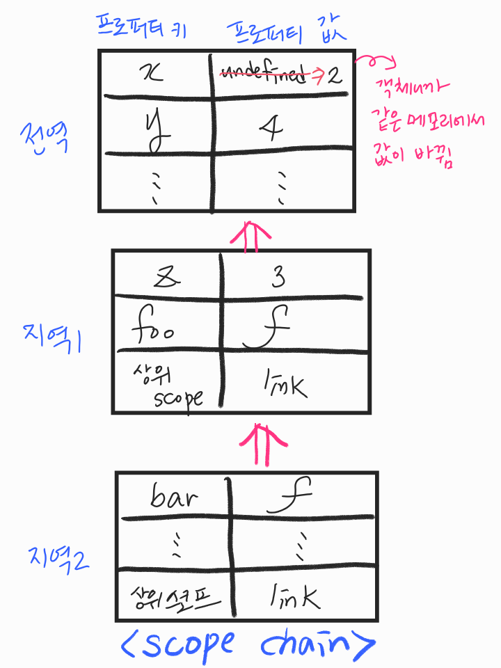
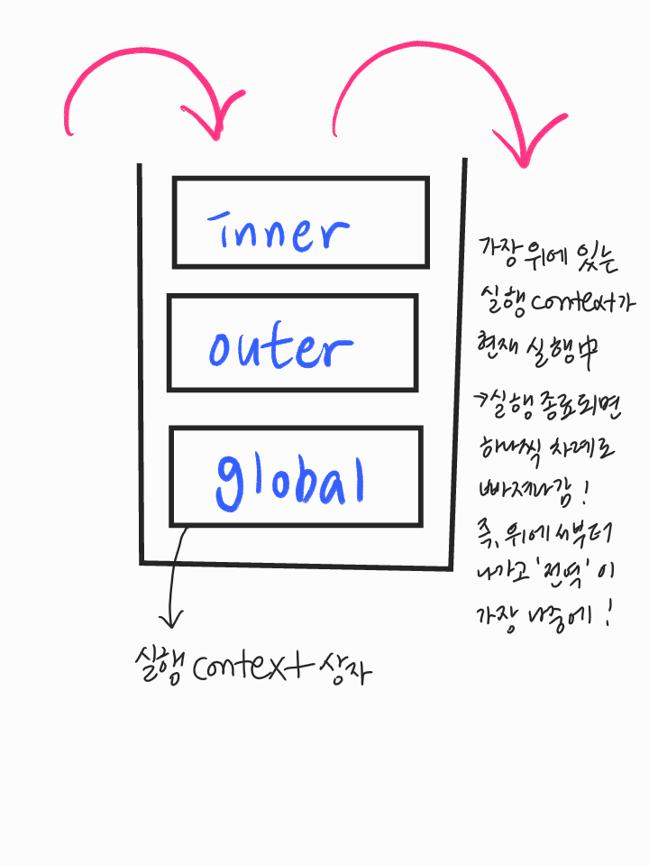

# 201130 - JavaScript Day 7

- 함수 호출문은 전부 표현식인 문이다! → return 값이 항상 있으니까

## Chapter 13. Scope

### 스코프란 ?

- 식별자는 스코프 내에서 유니크하고 유일 해야함
- 식별자 결정 (identifier resolution) - 참조하는 코드가 있는 스코프 내에서 먼저 찾음
- js 엔진이 내부적으로 객체 리터럴을 만들어서 자료 저장
- `단방향 linked list` - 하위 scope에 없으면 상위 scope로 찾아 올라가는 것 ( 양방향 상호 작용하는 것도 있는데 그렇게 되면 무한 뺑뺑이... )
- 상위 스코프에서 하위 스코프 참조할 수 없다! 보이지 않음!! (shadowing)
- 스코프는 **식별자를 찾는 규칙**
- var 변수는 함수 몸체 내에서만 지역 스코프로 인정 → 함수 레벨 스코프
- let, const는 블록 레벨 스코프로 모든 블록문에서 지역 스코프를 만든다

### 스코프의 종류

- 전역 ≠ 전역 스코프 , 지역 ≠ 지역 스코프

### 스코프 체인

### 렉시컬스코프

- 함수를 어디서 호출했는지에 따라 함수의 상위 스코프를 결정하면, 상위 스코프가 매번 바뀜 그래서 `동적 스코프` - 예측하기 어렵기 때문에 실수 발생하기 쉬움, 가독성도 별로
- js를 포함하여 대부분의 언어는 어디서 정의 했는지가 중요! 정의된 곳에서 상위 스코프를 결정! `정적 스코프` 또는 `렉시컬 스코프`  - 예측하기 쉽다
- 함수 정의가 평가되면 함수 객체가 만들어짐 - 런타임 이전에 함수객체가 만들어질 때 상위 스코프가 결정됨 - 이것을 기억하기 위해 함수 객체의 숨겨진 프로퍼티에 메모해놓고 언제 어디서 호출되든지 내부에 있는 이 메모를 참조하여서 상위 스코프를 찾음 ⇒ 내부 슬롯 [[Environment]]

---

## Chapter 14. 전역 변수의 문제점

- 전역 변수의 무분별한 사용은 No No해
- 함수도 하나의 일만하게끔 잘게 쪼개버려
- 클로저 (closure) → 함수는 종료됐는데 함수 내에 있는 변수는 살아있는거
- 참조하는 식별자가 없을 때 가비지 컬렉터의 대상이 됨
- 전역변수의 생명주기는 어플리케이션의 생명과 동일 (브라우저 종료될 때까지..)
- 함수도 같은 이름으로 중복 정의하면 덮어써버림  

- 암묵적 결합 - 코드 어디서든 참조 가능
- 네임스페이스(쉽게 말해 폴더) 오염
- 긴 생명 주기
- 스코프 체인 상에서 종점에 존재

---

## Chapter 15. let, const와 블록 레벨 스코프

### var 키워드로 선언한 변수의 문제점

- 중복 선언 허용 (중복 선언해도 에러가 발생하지 않는다)
- 블록 레벨 스코프를 지원하지 않고 함수 레벨 스코프만 따른다
- 변수 호이스팅

### let 키워드와 const 키워드

- let , const → 변수 중복 선언 금지, 블록 레벨 스코프 지원, 호이스팅이 발생하지 않는 것처럼 동작
- 호이스팅 발생하긴 함 → 선언문 이전에 참조하면 **ReferenceError** /  일시적 사각지대
- let 재할당 자유로움, const는 재할당 금지 (재할당을 금지할 뿐 불변성을 의미하지는 않음 )