## Chapter 19. 프로토타입
js는 객체 기반의 프로그래밍 언어이며 js를 이루고 있는 거의 모든 것이 객체이다. (원시 타입의 값 제외)

### 객체지향 프로그래밍
- 객체지향 프로그래밍(Object Oriented Programming, OPP)
  - 여러 개의 독립적인 객체(object)의 집합으로 프로그램을 표현하려는 프로그래밍 패러다임
  - 객체의 상태(state)를 나타내는 데이터와 상태 데이터를 조작할 수 있는 동작(behavior)을 하나의 논리적인 단위로 묶어 생각하는 것
- 추상화(abstraction) 
  - 다양한 속성 중에서 프로그램에 필요한 속성만 간추려 내어 표현하는 것
- 객체
  - 속성을 통해 여러 개의 값을 하나의 단위로 구성한 복합적인 자료구조 &#8594; 상태 데이터와 동작을 하나의 논리적인 단위로 묶음
  - 객체의 상태 데이터는 프로퍼티, 동작은 메서드
  - 자신의 고유한 기능을 수행하면서 다른 객체와 관계성(relationship)을 가질 수 있음

### 상속과 프로토타입
- 상속(inheritance)?  
  객체지향 프로그래밍의 핵심 개념, 어떤 객체의 프로퍼티 또는 메서드를 다른 객체가 상속받아 그대로 사용할 수 있는 것
- js는 프로토타입을 기반으로 상속을 구현하여 불필요한 중복을 제거 (기존의 코드 재사용, 이는 개발 비용을 줄일 수 있음)
```jsx
// 생성자 함수
function Circle(radius) {
  this.radius = radius;
  this.getArea = function () {
    // Math.PI는 원주율을 나타내는 상수다.
    return Math.PI * this.radius ** 2;
  };
}

// 반지름이 1인 인스턴스 생성
const circle1 = new Circle(1);
// 반지름이 2인 인스턴스 생성
const circle2 = new Circle(2);

// Circle 생성자 함수는 인스턴스를 생성할 때마다 동일한 동작을 하는
// getArea 메서드를 중복 생성하고 모든 인스턴스가 중복 소유한다.
// getArea 메서드는 하나만 생성하여 모든 인스턴스가 공유해서 사용하는 것이 바람직하다.
console.log(circle1.getArea === circle2.getArea); // false

console.log(circle1.getArea()); // 3.141592653589793
console.log(circle2.getArea()); // 12.566370614359172
```
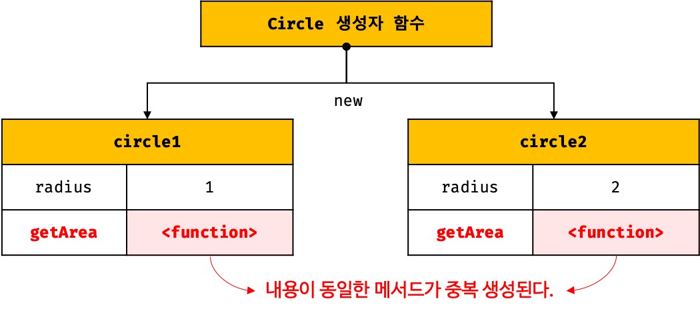
- 만약, 생성자 함수에 의해 생성된 모든 인스턴스가 동일한 메서드를 사용할 때에는 메서드를 단 하나만 생성하여 공유하는 것이 바람직 &#8594; 상속을 통해 불필요한 중복 제거 가능!
- 동일한 메서드를 모든 인스턴스가 중복 소유하면 메모리 낭비가 심하고, 매번 인스턴스를 생성할 때마다 메서드도 생성하므로 퍼포먼스에도 악영향
- js는 `프로토타입(prototype)`을 기반으로 **상속**을 구현
```jsx
// 생성자 함수
function Circle(radius) {
  this.radius = radius;
}

// Circle 생성자 함수가 생성한 모든 인스턴스가 getArea 메서드를
// 공유해서 사용할 수 있도록 프로토타입에 추가한다.
// 프로토타입은 Circle 생성자 함수의 prototype 프로퍼티에 바인딩되어 있다.
Circle.prototype.getArea = function () {
  return Math.PI * this.radius ** 2;
};

// 인스턴스 생성
const circle1 = new Circle(1);
const circle2 = new Circle(2);

// Circle 생성자 함수가 생성한 모든 인스턴스는 부모 객체의 역할을 하는
// 프로토타입 Circle.prototype으로부터 getArea 메서드를 상속받는다.
// 즉, Circle 생성자 함수가 생성하는 모든 인스턴스는 하나의 getArea 메서드를 공유한다.
console.log(circle1.getArea === circle2.getArea); // true

console.log(circle1.getArea()); // 3.141592653589793
console.log(circle2.getArea()); // 12.566370614359172
```

- 생성자 함수가 생성한 모든 인스턴스는 자신의 프로토타입(상위,부모 객체 역할을 하는)의 모든 프로퍼티와 메서드를 상속받을 수 있음 &#8594; 따라서 공통적으로 사용할 프로퍼티나 메서드를 프로토타입에 미리 구현해 두면 생성자 함수가 생성할 모든 인스턴스는 별도의 구현없이 상위 객체인 프로토타입의 자산을 공유하여 사용할 수 있음
- 상속은 코드의 재사용이란 관점에서 매우 유용!
### 프로토타입 객체
- 프로토타입 객체(프로토타입)
  - 객체지향 프로그래밍의 근간을 이루는 객체 간 상속을 구현하기 위해 사용됨
  - 프로토타입은 어떤 객체의 상위(부모) 객체의 역할을 하는 객체
  - 프로토타입을 상속받은 하위(자식) 객체는 상위 객체의 프로퍼티를 자신의 프로퍼티처럼 자유롭게 사용 가능
- `[[Prototype]]`
  - 모든 객체가 가지는 내부 슬롯으로 이 내부 슬롯의 값은 프로토타입의 참조다(null인 경우도 있음)
  - 객체가 생성될 때 객체 생성 방식에 따라 프로토타입이 결정되고 [[Prototype]]에 저장됨
  - ex) 객체 리터럴에 의해 생성된 객체의 프로토타입은 `Object.prototype` , 생성자 함수에 의해 생성된 객체의 프로토타입은 생성자 함수의 `prototype` 프로퍼티에 바인딩되어 있는 객체
- 모든 객체는 하나의 프로토타입을 가진다([[Prototype]] 내부 슬롯의 값이 null인 객체는 프로토타입이 없다)
- 모든 프로토타입은 생성자 함수와 연결되어 있음
- [[Prototype]] 내부 슬롯에 직접 접근은 불가능하지만 `__proto__` 접근자 프로퍼티를 통해 자신의 프로토타입('[[Prototype]]' 내부 슬롯이 가리키는 프로토타입)에 간접 접근 가능
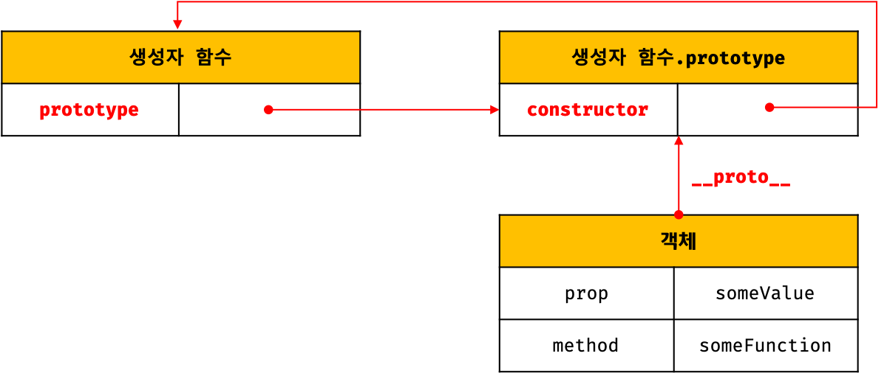  

1. `__proto__` 접근자 프로퍼티
   - 모든 객체는 __proto__ 접근자 프로퍼티를 통해 자신의 프로토타입에 간접적으로 접근 가능
   
   1. __proto__는 접근자 프로퍼티다
     - 접근자 프로퍼티는 자체적으로는 값([[Value]] 프로퍼티 어트리뷰트)을 갖지 않고 다른 데이터 프로퍼티의 값을 읽거나 저장할 때 사용하는 접근자 함수(accessor function)인 [[Get]], [[Set]] 프로퍼티 어트리뷰트로 구성된 프로퍼티 
     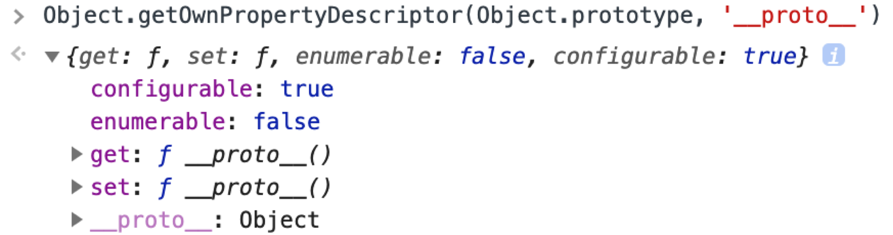
     - Object.prototype의 접근자 프로퍼티인 __proto__는 getter/setter 함수라고 부르는 접근자 함수를 통해 프로토타입을 취득하거나 할당함 &#8594; 프로토타입에 접근하면 getter함수가 호출되고, 새로운 프로토타입을 할당하면 setter 함수가 호출됨
      ```jsx
      const obj = {};
      const parent = { x: 1 };

      // getter 함수인 get __proto__가 호출되어 obj 객체의 프로토타입을 취득
      obj.__proto__;
      // setter함수인 set __proto__가 호출되어 obj 객체의 프로토타입을 교체
      obj.__proto__ = parent;

      console.log(obj.x); // 1
      ```
   2. __proto__ 접근자 프로퍼티는 상속을 통해 사용됨
     - __proto__ 접근자 프로퍼티는 객체가 직접 소유하는 프로퍼티가 아니라 Object.prototype의 프로퍼티
     - 객체는 상속을 통해 Object.prototype.__proto__접근자 프로퍼티 사용할 수 있음
      ```jsx
      const person = { name: 'Lee' };

      // person 객체는 __proto__ 프로퍼티를 소유하지 않는다.
      console.log(person.hasOwnProperty('__proto__')); // false

      // __proto__ 프로퍼티는 모든 객체의 프로토타입 객체인 Object.prototype의 접근자 프로퍼티다.
      console.log(Object.getOwnPropertyDescriptor(Object.prototype, '__proto__'));
      // {get: ƒ, set: ƒ, enumerable: false, configurable: true}

      // 모든 객체는 Object.prototype의 접근자 프로퍼티 __proto__를 상속받아 사용할 수 있다.
      console.log({}.__proto__ === Object.prototype); // true
      ```
     - `Object.prototype`
       - 모든 객체는 프로토타입의 계층 구조인 **프로토타입 체인**에 묶여 있음. 
       - js엔진은 객체의 프로퍼티(메서드 포함)에 접근하려고 할 때 해당 객체에 그 프로퍼티가 없으면 __proto__ 접근자 프로퍼티가 가리키는 참조를 따라 자신의 부모 역할을 하는 프로토타입의 프로퍼티를 순차적으로 검색
       - 프로토타입 체인의 종점, 즉 프로토타입 체인의 최상위 객체는 Object.prototype이고 이 객체의 프로퍼티와 메서드는 모든 객체에게 상속
    3. __proto__접근자 프로퍼티를 통해 프로토타입에 접근하는 이유
     - 상호 참조에 의해 프로토타입 체인이 생성되는 것을 방지하기 위함
      ```jsx
      const parent = {};
      const child = {};

      // child의 프로토타입을 parent로 설정
      child.__proto__ = parent;
      // parent의 프로토타입을 child로 설정
      parent.__proto__ = child; // TypeError: Cyclic __proto__ value
      ```
     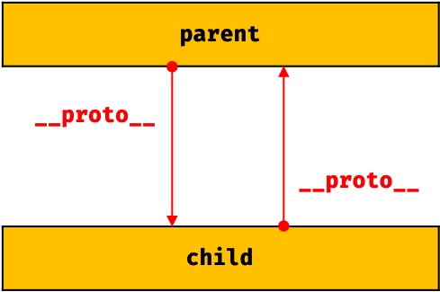
     - 프로토타입 체인은 **단방향 링크드 리스트**로 구형되어야 함(프로퍼티 검색 방향이 한쪽으로만!)
     - 위 그림과 같은 비정상적인 순환 참조(circular reference) 프로토타입 체인이 만들어지면 프로토타입 체인 종점이 존재하지 않음 &#8594; 프로퍼티 검색할 때 무한 루프...
    4. __proto__접근자 프로퍼티를 코드 내에서 직접 사용하는 것은 권장하지 않음
     - ES5까지 비표준이었다가 일부 브라우저에서 __proto__를 지원하고 있었기 때문에 브라우저 호환성을 고려해 ES6에서 표준으로 채택됨
     - 모든 객체가 `__proto__` 접근자 프로퍼티를 사용할 수 있는 건 아니기 때문에 코드 내에서 직접 사용하는 것은 권장되지 않음 (ex, 직접 상속을 통해 Object.prototype을 상속받지 않는 객체를 생성할 수 있음)
     - 프로토타입의 참조를 취득하고 싶은 경우에는 `Object.getPrototypeOf` 메서드, 프로토타입을 교체하고 싶은 경우에는 `Object.setPrototypeOf` 메서드 사용을 권장
      ```jsx
      const obj = {};
      const parent = { x: 1 };

      // obj 객체의 프로토타입을 취득
      Object.getPrototypeOf(obj); // obj.__proto__;
      // obj 객체의 프로토타입을 교체
      Object.setPrototypeOf(obj, parent); // obj.__proto__ = parent;

      console.log(obj.x); // 1
      ```
2. 함수 객체의 prototype 프로퍼티
   - 함수 객체만이 소유하는 prototype 프로퍼티는 생성자 함수가 생성할 인스턴스의 프로토타입을 가리킨다 (일반 객체는 prototype 프로퍼티 없음!)
   - 생성자 함수로서 호출할 수 없는 함수(non-constructor)인 화살표 함수와 메서드 축약 표현으로 정의한 메서드는 prototype 프로퍼티를 소유하지 않고 프로토타입도 생성하지 않음
   - 모든 객체가 가지고 있는(엄밀히 말하면 Object.prototype으로부터 상속받은) __proto__ 접근자 프로퍼티와 함수 객체만이 가지고 있는 prototype 프로퍼티는 결국 동일한 프로토타입을 가리킨다. 
   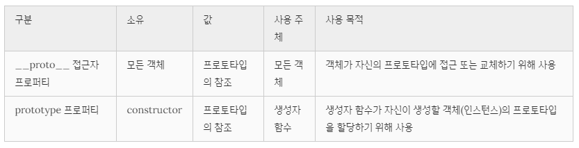
    ```jsx
    // 생성자 함수
    function Person(name) {
      this.name = name;
    }

    const me = new Person('Lee');

    // 결국 Person.prototype과 me.__proto__는 결국 동일한 프로토타입을 가리킨다.
    console.log(Person.prototype === me.__proto__);  // true
    ```
   
3. 프로토타입의 constructor 프로퍼티와 생성자 함수
   - 모든 프로토타입은 constructor 프로퍼티를 가짐
   - constructor 프로퍼티는 prototype 프로퍼티로 자신을 참조하고 있는 생성자 함수를 가리킴
   
### 리터럴 표기법에 의해 생성된 객체의 생성자 함수와 프로토타입
- 생성자 함수에 의해 생성된 인스턴스는 프로토타입의 constructor 프로퍼티에 의해 생성자 함수와 연결됨! 이때 constructor 프로퍼티가 가리키는 생성자 함수는 인스턴스를 생성한 생성자 함수임
- BUT! 리터럴 표기법에 의해 생성된 객체의 경우 프로토타입의 constructor 프로퍼티가 가리키는 생성자 함수가 반드시 객체를 생성한 생성자 함수라고 단정할 수 없음 (물론, 리터럴 표기법에 의해 생성된 객체도 프로토타입이 존재함)
  ```jsx
  // obj 객체는 Object 생성자 함수로 생성한 객체가 아니라 객체 리터럴로 생성했다.
  const obj = {};

  // 하지만 obj 객체의 생성자 함수는 Object 생성자 함수다.
  console.log(obj.constructor === Object); // true
  ```
- 추상 연산 OrdinaryObjectCreate.....................??????
  ```jsx
  // 2. Object 생성자 함수에 의한 객체 생성
  // Object 생성자 함수는 new 연산자와 함께 호출하지 않아도 new 연산자와 함께 호출한 것과 동일하게 동작한다.
  // 인수가 전달되지 않았을 때 추상 연산 OrdinaryObjectCreate를 호출하여 빈 객체를 생성한다.
  let obj = new Object();
  console.log(obj); // {}

  // 1. new.target이 undefined나 Object가 아닌 경우
  // 인스턴스 -> Foo.prototype&nbsp;-> Object.prototype 순으로 프로토타입 체인이 생성된다.
  class Foo extends Object {}
  new Foo(); // Foo&nbsp;{}

  // 3. 인수가 전달된 경우에는 인수를 객체로 변환한다.
  // Number 객체 생성
  obj = new Object(123);
  console.log(obj); // Number {123}

  // String  객체 생성
  obj = new Object('123');
  console.log(obj); // String {"123"}
  ```
- 객체 리터럴에 의해 생성된 객체는 Object 생성자 함수가 생성한 객체가 아님
- 리터럴 표기법에 의해 생성된 객체도 상속을 위해 프로토타입이 필요
- 리터럴 표기법에 의해 생성된 객체도 가상적인 생성자 함수를 가짐 (프로토타입은 생성자 함수와 더불어 생성되며 prototype, constructor 프로퍼티에 의해 연결되어 있기 때문)
- **프로토타입과 생성자 함수는 단독으로 존재할 수 없고 언제나 쌍(pair)으로 존재**  

| 리터럴 표기법 | 생성자 함수 | 프로토타입 |
| :---: | :---: | :---: |
| 객체 리터럴 | Object | Object.prototype |
| 함수 리터럴 | Function | Function.prototype |
| 배열 리터럴 | Array | Array.prototype |
| 정규 표현식 리터럴 | RegExp | RegExp.prototype |

### 프로토타입의 생성 시점
- 모든 객체는 생성자 함수와 연결되어 있다!
- 프로토타입은 생성자 함수가 생성되는 시점에 함께 생성됨 (프로토타입과 생성자 함수는 단독으로 존재할 수 없고 언제나 쌍으로 존재하니까)

1. 사용자 정의 생성자 함수와 프로토타입 생성 시점
   - 생성자 함수로서 호출할 수 있는 함수(constructor)는 함수 정의가 평가되어 함수 객체를 생성하는 시점에 프로토타입도 같이 생성
    ```jsx
    // 함수 정의(constructor)가 평가되어 함수 객체를 생성하는 시점에 프로토타입도 더불어 생성된다.
    console.log(Person.prototype); // {constructor: ƒ}

    // 생성자 함수
    function Person(name) {
      this.name = name;
    }
    ```
   - 생성자 함수로서 호출할 수 없는 non-constructor는 프로토타입 생성되지 않음 
    ```jsx
    // 화살표 함수는 non-constructor다.
    const Person = name => {
      this.name = name;
    };

    // non-constructor는 프로토타입이 생성되지 않는다.
    console.log(Person.prototype); // undefined
    ```
   - 함수 선언문은 다른 코드가 실행되기 이전에 js 엔진에 의해 먼저 실행되기 때문에 함수 선언문으로 정의된 생성자 함수는 어떤 코드보다 먼저 평가되어 함수 객체가 됨 (이때, 프로토타입도 생성!) &#8594; 생성된 프로토타입은 생성자 함수의 prototype 프로퍼티에 바인딩!
   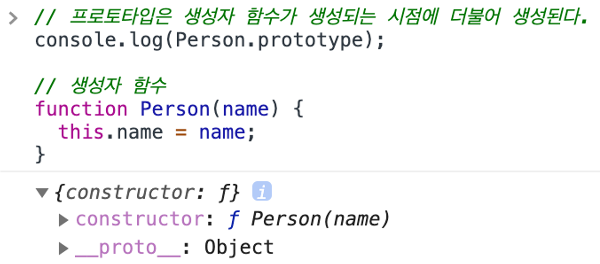
   - 생성된 프로토타입은 constructor 프로퍼티만을 갖는 객체임. 프로토타입도 객체이고 모든 객체는 프로토타입을 가지므로 프로토타입도 자신의 프로토타입을 가짐
   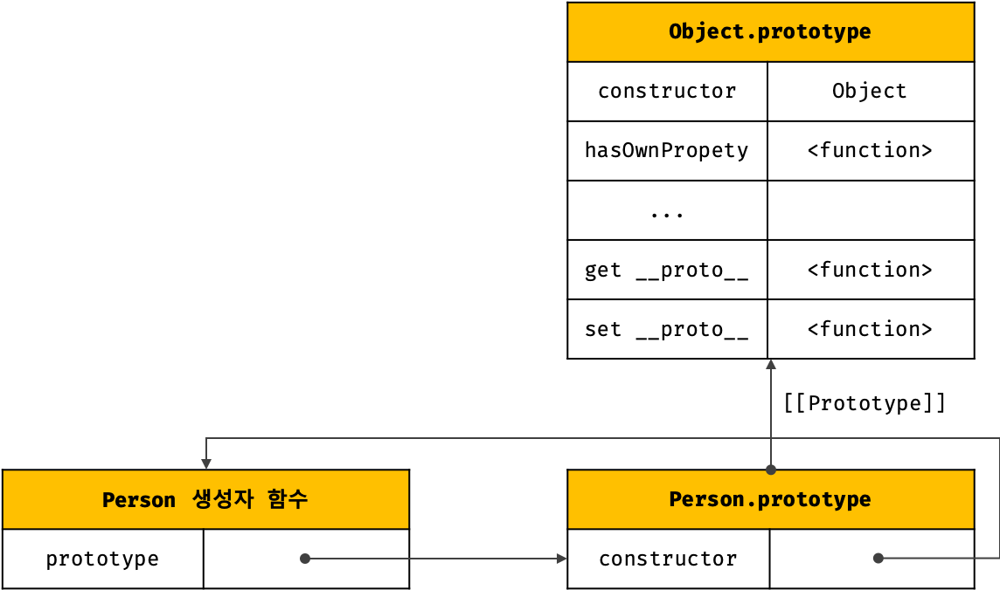
   - 빌트인 생성자 함수가 아닌 사용자 정의 생성자 함수는 자신이 평가되어 함수 객체로 생성되는 시점에 프로토타입도 더불어 생성되며, 생성된 프로토타입의 프로토타입은 언제나 Object.prototype
2. 빌트인 생성자 함수와 프로토타입 생성 시점
   - 빌트인 생성자 함수도 일반 함수와 마찬가지로 빌트인 생성자 함수가 생성되는 시점에 프로토타입이 생성
   - 모든 빌트인 생성자 함수는 전역 객체가 생성되는 시점에 생성. 생성된 프로토타입은 빌트인 생성자 함수의 prototype 프로퍼티에 바인딩
   
   - 전역 객체(global object)
     - 코드가 실행되기 이전 단계에 js 엔진에 의해 생성되는 특수한 객체로 클라이언트 사이드 환경(브라우저)에서는 window, 서버 사이드 환경(Node.js)에서는 global 객체를 의미
     - 표준 빌트인 객체(Object, String, Number, Function, Array 등)들과 환경에 따른 호스트 객체(클라이언트 web API 또는 Node.js의 호스트 API), 그리고 var 키워드로 선언한 전역 변수와 전역 함수를 프로퍼티로 가짐
   - 빌트인 객체인 Object는 전역 객체 window의 프로퍼티다 - `window.Object === Object // true`
   - 표준 빌트인 객체인 Object도 전역 객체의 프로퍼티이며, 전역 객체가 생성되는 시점에 생성
   - 객체가 생성되기 이전에 생성자 함수와 프로토타입은 이미 객체화되어 존재 &#8594; 생성자 함수 또는 리터럴 표기법으로 객체를 생성하면 프로토타입은 생성된 객체의 [[Prototype]] 내부 슬롯에 할당
### 객체 생성 방식과 프로토타입의 결정
- 객체 생성 방법
   1. 객체 리터럴
   2. Object 생성자 함수
   3. 생성자 함수 
   4. Object.create 메서드
   5. 클래스 (ES6)
- 다양한 방식으로 생성된 모든 객체는 추상 연산 OrdinaryObjectCreate에 의해 생성된다는 공통점이 있음
- 추상 연산 OrdinaryObjectCreate는 필수적으로 자신이 생성할 객체의 프로토타입을 인수로 전달받음
- 추상 연산 OrdinaryObjectCreate는 빈 객체를 생성한 후, 객체에 추가할 프로퍼티 목록이 인수로 전달된 경우 프로퍼티를 객체에 추가 &#8594; 인수로 전달받은 프로토타입을 자신이 생성한 객체의 [[Prototype]] 내부 슬롯에 할당한 뒤 생성한 객체를 반환
- 프로토타입은 추상 연산 OrdinaryObjectCreate에 전달되는 인수에 의해 결정 (인수는 객체가 생성되는 시점에 객체 생성 방식에 의해 결정)
1. 객체 리터럴에 의해 생성된 객체의 프로토타입
   - 객체 리터럴에 의해 생성되는 객체의 프로토타입은 Object.prototype
   - 객체 리터럴에 의해 생성된 객체는 constructor 프로퍼티와 hasOwnProperty 메서드 등을 소유하지 않지만 자신의 프로토타입인 Object.prototype의 constructor 프로퍼티와 hasOwnProperty 메서드를 자신의 자산인 것처럼 자유롭게 사용 가능
2. Object 생성자 함수에 의해 생성된 객체의 프로토타입
   - Object 생성자 함수를 인수 없이 호출하면 빈 객체가 생성됨
   - Object 생성자 함수에 의해 생성되는 객체의 프로토타입은 Object.prototype
   - 객체 리터럴과 Object 생성자 함수에 의한 객체 생성 방식의 차이?  
     프로퍼티를 추가하는 방식!  
     객체 리터럴 방식은 객체 리터럴 내부에 프로퍼티를 추가하지만, Object 생성자 함수 방식은 일단 빈 객체를 생성한 이후 프로퍼티를 추가해야 함
   
3. 생성자 함수에 의해 생성된 객체의 프로토타입
   - 생성자 함수에 의해 생성되는 객체의 프로토타입은 생성자 함수의 prototype 프로퍼티에 바인딩되어 있는 객체
   - 사용자 정의 생성자 함수와 더불어 생성된 프로토타입 함수.prototype의 프로퍼티는 constructor 뿐! (반면에, 표준 빌트인 객체인 Object 생성자 함수와 더불어 생성된 프로토타입 Object.prototype은 다양한 빌트인 메서드(hasOwnProperty, propertyIsEnumerable)를 갖고 있음)
   - 프로토타입은 객체이기 때문에 프로퍼티를 추가/삭제할 수 있음 (프로토타입 체인에 즉각 반영됨)
    ```jsx
    function Person(name) {
    this.name = name;
    }

    // 프로토타입 메서드
    Person.prototype.sayHello = function () {
      console.log(`Hi! My name is ${this.name}`);
    };

    const me = new Person('Lee');
    const you = new Person('Kim');

    me.sayHello();  // Hi! My name is Lee
    you.sayHello(); // Hi! My name is Kim
    ```
   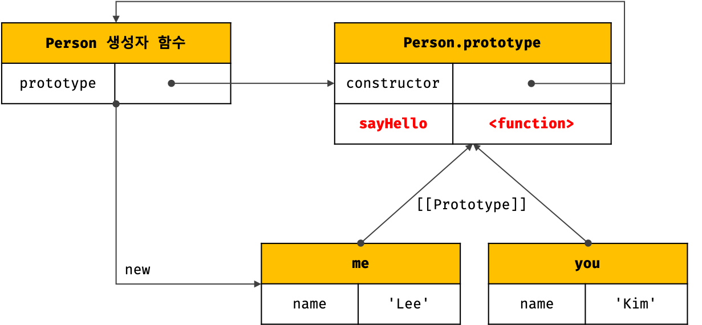
### 프로토타입 체인
- 프로토타입 체인 ?  
   - 자바스크립트가 객체지향 프로그래밍의 상속을 구현하는 메커니즘
   - 상속과 프로퍼티 검색을 위한 메커니즘
   - 객체의 프로퍼티(메서드 포함)에 접근하려고 할 때 해당 객체에 접근하려는 프로퍼티가 없다면 [[Prototype]] 내부 슬롯의 참조를 따라 자신의 부모 역할을 하는 프로토타입의 프로퍼티를 순차적으로 검색

- 프로토타입 체인의 종점(end of prototype chain)은 Object.prototype &#8594; 따라서 모든 객체는 Object.prototype을 상속받음
- Object.prototype의 프로토타입, 즉 [[Prototype]] 내부 슬롯의 값은 null
- 프로토타입 체인의 종점인 Object.prototype에서도 프로퍼티를 검색할 수 없는 경우, undefined를 반환 (에러 발생 NO)
- js 엔진은 객체 간의 상속 관계로 이루어진 프로토타입의 계층적인 구조에서 객체의 프로퍼티를 검색
- 프로퍼티가 아닌 식별자는 스코프 체인에서 검색 (함수의 중첩 관계로 이루어진 스코프의 계층적 구조에서 식별자를 검색) - 스코프 체인은 식별자 검색을 위한 메커니즘
- 스코프 체인과 프로토타입 체인은 서로 연관없이 별도로 동작하는 것이 아니라 서로 협력하여 식별자와 프로퍼티를 검색하는 데 사용됨
### 오버라이딩과 프로퍼티 섀도잉
```jsx
const Person = (function () {
  // 생성자 함수
  function Person(name) {
    this.name = name;
  }

  // 프로토타입 메서드
  Person.prototype.sayHello = function () {
    console.log(`Hi! My name is ${this.name}`);
  };

  // 생성자 함수를 반환
  return Person;
}());

const me = new Person('Lee');

// 인스턴스 메서드
me.sayHello = function () {
  console.log(`Hey! My name is ${this.name}`);
};

// 인스턴스 메서드가 호출된다. 프로토타입 메서드는 인스턴스 메서드에 의해 가려진다.
me.sayHello(); // Hey! My name is Lee
```
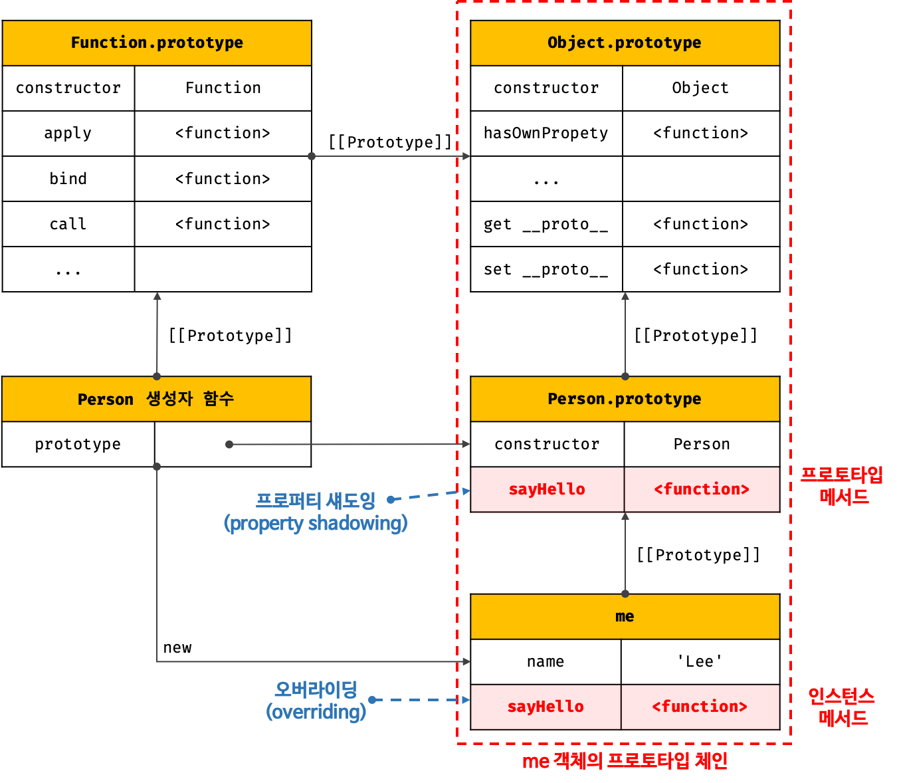
- 프로토타입이 소유한 프로퍼티(메서드 포함)를 프로토타입 프로퍼티, 인스턴스가 소유한 프로퍼티를 인스턴스 프로퍼티라고 함
- 프로토타입 프로퍼티와 같은 이름의 프로퍼티를 인스턴스에 추가하면 프로토타입 체인을 따라 프로토타입 프로퍼티를 검색하여 프로토타입 프로퍼티를 덮어쓰는 것이 아니라 인스턴스 프로퍼티로 추가
- 동일한 이름의 인스턴스 메서드가 프로포타입 메서드를 `오버라이딩`하고 프로토타입 메서드는 가려짐
- **프로퍼티 섀도잉(property shadowing)** - 상속 관계에 의해 프로퍼티가 가려지는 현상
- 오버라이딩(overriding) - 상위 클래스가 가지고 있는 메서드를 하위 클래스가 재정의하여 사용하는 방식
- 오버로딩(overloading) - 함수의 이름은 동일하지만 매개변수의 타입 또는 개수가 다른 메서드를 구현하고 매개변수에 의해 메서드를 구별하여 호출하는 방식 (js는 오버로딩 지원 X, arguments 객체로 구현은 가능)
- 인스턴스 메서드는 삭제 가능
- 하위 객체를 통해 프로토타입의 프로퍼티를 변경 또는 삭제하는 것은 불가능 &#8594; 하위 객체를 통해 프로토타입에 get 액세스는 허용되나 set 액세스는 허용되지 않음
- 프로토타입 프로퍼티를 변경 또는 삭제하려면 하위 객체를 통해 프로토타입 체인으로 접근하는 것이 아니라 프로토타입에 직접 접근해야 함
### 프로토타입의 교체
프로토타입은 임의의 다른 객체로 변경할 수 있음 &#8594; 부모 객체인 프로토타입을 동적으로 변경 가능, 즉 객체 간의 상속 관계를 동적으로 변경할 수 있음
1. 생성자 함수에 의한 프로토타입의 교체
  ```jsx
  const Person = (function () {
    function Person(name) {
      this.name = name;
    }

    // ① 생성자 함수의 prototype 프로퍼티를 통해 프로토타입을 교체
    Person.prototype = {
      sayHello() {
        console.log(`Hi! My name is ${this.name}`);
      }
    };

    return Person;
  }());

  const me = new Person('Lee');

  // 프로토타입을 교체하면 constructor 프로퍼티와 생성자 함수 간의 연결이 파괴된다.
  console.log(me.constructor === Person); // false
  // 프로토타입 체인을 따라 Object.prototype의 constructor 프로퍼티가 검색된다.
  console.log(me.constructor === Object); // true

  // 다시 연결을 하려면, ① 자리에 아래 코드를 넣어줌
  // 생성자 함수의 prototype 프로퍼티를 통해 프로토타입을 교체
  Person.prototype = {
  // constructor 프로퍼티와 생성자 함수 간의 연결을 설정
  constructor: Person,
  sayHello() {
    console.log(`Hi! My name is ${this.name}`);
  }
  
  ```
  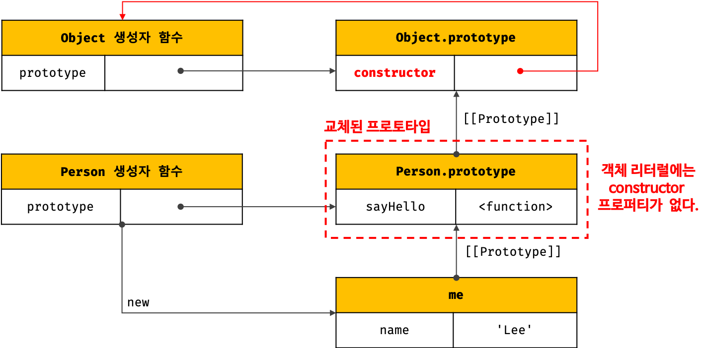
   - 프로토타입을 교체하면 constructor 프로퍼티와 생성자 함수 간의 연결이 파괴됨  
2. 인스턴스에 의한 프로토타입의 교체
   - 프로토타입은 생성자 함수의 prototype 프로퍼티뿐만 아니라 인스턴스의 __proto__ 접근자 프로퍼티(또는 Object.getPrototypeOf 메서드)를 통해 접근 가능
   - 생성자 함수의 prototype 프로퍼티에 다른 임의의 객체를 바인딩하는 것은 미래에 생성할 인스턴스의 프로토타입을 교체하는 것이고, __proto__ 접근자 프로퍼티를 통해 프로토타입을 교체하는 것은 이미 생성된 객체의 프로토타입을 교체하는 것이당
    ```jsx
    function Person(name) {
      this.name = name;
    }

    const me = new Person('Lee');

    // 프로토타입으로 교체할 객체
    const parent = {
      sayHello() {
        console.log(`Hi! My name is ${this.name}`);
      }
    };

    // ① me 객체의 프로토타입을 parent 객체로 교체한다.
    Object.setPrototypeOf(me, parent);
    // 위 코드는 아래의 코드와 동일하게 동작한다.
    // me.__proto__ = parent;

    me.sayHello(); // Hi! My name is Lee

    // 프로토타입을 교체하면 constructor 프로퍼티와 생성자 함수 간의 연결이 파괴된다.
    console.log(me.constructor === Person); // false
    // 프로토타입 체인을 따라 Object.prototype의 constructor 프로퍼티가 검색된다.
    console.log(me.constructor === Object); // true
    ```
  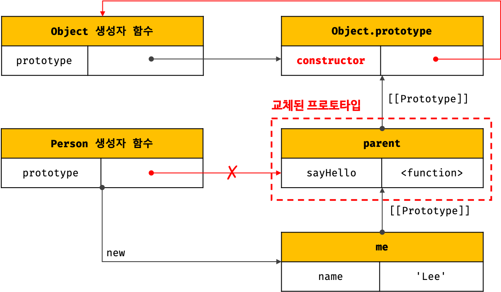
   - 파괴된 생성자 함수와 프로토타입 간의 연결 되살리기
    ```jsx
    function Person(name) {
      this.name = name;
    }

    const me = new Person('Lee');

    // 프로토타입으로 교체할 객체
    const parent = {
      // constructor 프로퍼티와 생성자 함수 간의 연결을 설정
      constructor: Person,
      sayHello() {
        console.log(`Hi! My name is ${this.name}`);
      }
    };

    // 생성자 함수의 prototype 프로퍼티와 프로토타입 간의 연결을 설정
    Person.prototype = parent;

    // me 객체의 프로토타입을 parent 객체로 교체한다.
    Object.setPrototypeOf(me, parent);
    // 위 코드는 아래의 코드와 동일하게 동작한다.
    // me.__proto__ = parent;

    me.sayHello(); // Hi! My name is Lee

    // constructor 프로퍼티가 생성자 함수를 가리킨다.
    console.log(me.constructor === Person); // true
    console.log(me.constructor === Object); // false

    // 생성자 함수의 prototype 프로퍼티가 교체된 프로토타입을 가리킨다.
    console.log(Person.prototype === Object.getPrototypeOf(me)); // true
    ```
   - 생성자 함수에 의한 프로토타입 교체와 인스턴스에 의한 프로토타입 교체의 미묘한 차이
   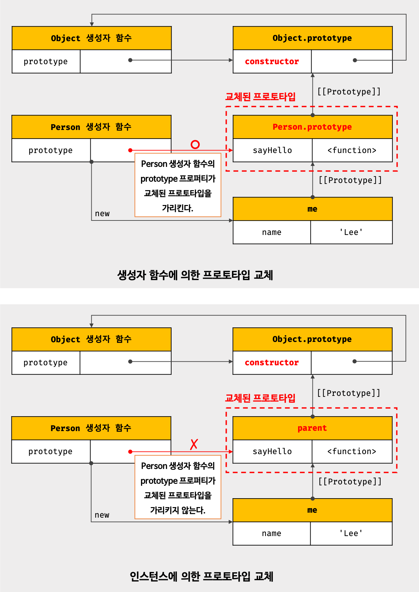
### instanceof 연산자
> 객체 instanceof 생성자 함수
- instanceof 연산자는 이항 연산자로서 좌변에 객체를 가리키는 식별자, 우변에 생성자 함수를 가리키는 식별자를 피연산자로 받음 (if, 우변의 피연산자가 함수가 아닌 경우 TypeError 발생)
- 우변의 생성자 함수의 prototype에 바인딩된 객체가 좌변의 객체의 프로토타입 체인 상에 존재하면 true로 평가되고, 그렇지 않은 경우에는 false로 평가됨
```jsx
// 생성자 함수
function Person(name) {
  this.name = name;
}

const me = new Person('Lee');

// 프로토타입으로 교체할 객체
const parent = {};

// 프로토타입의 교체
Object.setPrototypeOf(me, parent);

// Person 생성자 함수와 parent 객체는 연결되어 있지 않다.
console.log(Person.prototype === parent); // false
console.log(parent.constructor === Person); // false

// Person.prototype이 me 객체의 프로토타입 체인 상에 존재하지 않기 때문에 false로 평가된다.
console.log(me instanceof Person); // false

// Object.prototype이 me 객체의 프로토타입 체인 상에 존재하므로 true로 평가된다.
console.log(me instanceof Object); // true
```
- instanceof 연산자는 프로토타입의 constructor 프로퍼티가 가리키는 생성자 함수를 찾는 것이 아니라, 생성자 함수의 prototype에 바인딩된 객체가 프로토타입 체인 상에 존재하는지 확인
- 생성자 함수에 의해 프로토타입이 교체되어 constructor 프로퍼티와 생성자 함수 간의 연결이 파괴되어도 생성자 함수의 prototype 프로퍼티와 프로토타입 간의 연결은 파괴되지 않으므로 instanceof는 아무런 영향 X
### 직접 상속
1. Object.create에 의한 직접 상속
   - Object.create 메서드는 명시적으로 프로토타입을 지정하여 새로운 객체를 생성
    ```jsx
    // 사용법
    // 두 번째 인수는 옵션(생략 가능)
    /**
    * 지정된 프로토타입 및 프로퍼티를 갖는 새로운 객체를 생성하여 반환한다.
    * @param {Object} prototype - 생성할 객체의 프로토타입으로 지정할 객체
    * @param {Object} [propertiesObject] - 생성할 객체의 프로퍼티를 갖는 객체
    * @returns {Object} 지정된 프로토타입 및 프로퍼티를 갖는 새로운 객체
    */
    Object.create(prototype[, propertiesObject])
    ```
   - Object.create 메서드는 첫 번째 매개변수에 전달한 객체의 프로토타입 체인에 속하는 객체를 생성 &#8594; 객체를 생성하면서 직접적으로 상속을 구현
   - `Object.create` 의 장점
     1. new 연산자 없이도 객체 생성 가능
     2. 프로토타입을 지정하면 객체 생성 가능
     3. 객체 리터럴에 의해 생성된 객체도 상속받을 수 있음
   - Object.prototype의 빌트인 메서드인 Object.prototype.hasOwnProperty, Object.prototype.isPrototypeOf, Object.prototype.propertyIsEnumerable 등은 모든 객체의 프로토타입 체인의 종점, 즉 Object.prototype의 메서드이므로 모든 객체가 상속받아 호출할 수 있다.
   - 프로토타입 체인의 종점에 위치하는 객체는 Object.prototype의 빌트인 메서드를 사용할 수 없다.

2. 객체 리터럴 내부에서 __proto__에 의한 직접 상속
ES6에서는 객체 리터럴 내부에서 __proto__ 접근자 프로퍼티를 사용하여 직접 상속을 구현할 수 있다.

### 정적 프로퍼티/메서드
- 정적(static) 프로퍼티/메서드는 생성자 함수로 인스턴스를 생성하지 않아도 참조/호출할 수 있는 프로퍼티/메서드를 말함
- 생성자 함수는 객체이므로 자신의 프로퍼티/메서드를 소유할 수 있음 &#8594; 생성자 함수 객체가 소유한 프로퍼티/메서드를 정적 프로퍼티/메서드라고 함
- 정적 프로퍼티/메서드는 생성자 함수가 생성한 인스턴스로 참조/호출할 수 없음!
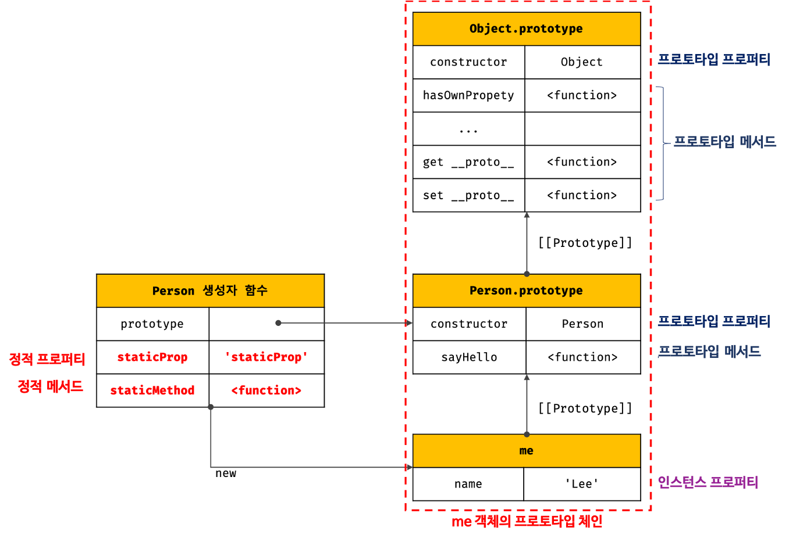
- 생성자 함수가 생성한 인스턴스는 자신의 프로토타입 체인에 속한 객체의 프로퍼티/메서드에 접근할 수 있지만, 정적 프로퍼티/메서드는 인스턴스의 프로토타입 체인에 속한 객체의 프로퍼티/메서드가 아니므로 인스턴스로 접근할 수 없다.
### 프로퍼티 존재 확인
1. in 연산자
   > key: 프로퍼티 키를 나타내는 문자열  
   > object: 객체로 평가되는 표현식  
   > `key in object`

   - 객체 내에 특정 프로퍼티가 존재하는지 여부를 확인
   - 확인 대상 객체의 프로퍼티뿐만 아니라 확인 대상 객체가 상속받은 모든 프로토타입의 프로퍼티를 확인하므로 주의가 필요

2. Object.prototype.hawOwnProperty 메서드
   - 객체에 특정 프로퍼티가 존재하는지 확인할 수 있음
   - 이름에서 알 수 있듯이 인수로 전달받은 프로퍼티 키가 객체 고유의 프로퍼티 키인 경우에만 true를 반환하고 상속받은 프로토타입의 프로퍼티 키인 경우 false를 반환

### 프로퍼티 열거

1. for...in문
   - 객체의 모든 프로퍼티를 순회하며 열거(enumeration)할 때 사용
  > for (변수선언문 in 객체) { ... }
   - for…in 문은 in 연산자처럼 순회 대상 객체의 프로퍼티 뿐만 아니라 상속받은 프로토타입의 프로퍼티까지 열거
   - for…in 문은 객체의 프로토타입 체인 상에 존재하는 모든 프로토타입의 프로퍼티 중에서 프로퍼티 어트리뷰트 [[Enumerable]]의 값이 ture인 프로퍼티를 순회하며 열거(enumeration)
    ```jsx
    const person = {
      name: 'Lee',
      address: 'Seoul'
    };

    // in 연산자는 객체가 상속받은 모든 프로토타입의 프로퍼티를 확인한다.
    console.log('toString' in person); // true

    // for...in 문도 객체가 상속받은 모든 프로토타입의 프로퍼티를 열거한다.
    // 하지만 toString과 같은 Object.prototype의 프로퍼티가 열거되지 않는다.
    for (const key in person) {
      console.log(key + ': ' + person[key]);
    }

    // name: Lee
    // address: Seoul
    ```
   - 프로퍼티 키가 심벌인 프로퍼티는 열거하지 않음
   - 상속받은 프로퍼티는 제외하고 객체 자신의 프로퍼티 만을 열거하려면 Object.prototype.hasOwnProperty 메서드를 사용하여 객체 자신의 프로퍼티인지 확인해야 함
   - 배열에는 for…in 문을 사용하지 말고 일반적인 for 문이나 for…of 문 또는 Array.prototype.forEach 메서드를 사용하기를 권장

2. Object.keys/values/entries 메서드
   - 객체 자신의 고유 프로퍼티만을 열거하기 위해서는 for…in 문을 사용하는 것 보다 Object.keys/values/entries 메서드를 사용하는 것을 권장
   - `Object.keys` - 객체 자신의 열거 가능한(enumerable) 프로퍼티 키를 배열로 반환
    ```jsx
    const person = {
      name: 'Lee',
      address: 'Seoul',
      __proto__: { age: 20 }
    };

    console.log(Object.keys(person)); // ["name", "address"]
    ```
   - `Object.values` - 객체 자신의 열거 가능한 프로퍼티 값을 배열로 반환
    ```jsx
    console.log(Object.values(person)); // ["Lee", "Seoul"]
    ```
   - `Object.entries` - 객체 자신의 열거 가능한 프로퍼티 키와 값의 쌍의 배열을 배열에 담아 반환
    ```jsx
    console.log(Object.entries(person)); // [["name", "Lee"], ["address", "Seoul"]]

    Object.entries(person).forEach(([key, value]) => console.log(key, value));
    /*
    name Lee
    address Seoul
    */
    ``` 
---
## Chapter 20. strict mode
### strict mode란?
```jsx
function foo() {
  x = 10;
}
foo();

console.log(x); // 10
```
- 자바스크립트 엔진은 암묵적으로 전역 객체에 x 프로퍼티를 동적 생성함. 이때 전역 객체의 x 프로퍼티는 마치 전역 변수처럼 사용할 수 있음 &#8594; 이를 암묵적 전역(implicit global)이라고 함
- 개발자의 의도와는 상관없이 발생한 암묵적 전역은 오류를 발생시키는 원인이 될 가능성이 큼 (var, let, const 키워드를 사용하여 변수를 선언한 다음 사용하자)
- strict mode는 자바스크립트 언어의 문법을 좀 더 엄격히 적용하여 오류를 발생시킬 가능성이 높거나 자바스크립트 엔진의 최적화 작업에 문제를 일으킬 수 있는 코드에 대해 명시적인 에러를 발생시킴
### strict mode의 적용
- 전역의 선두 또는 함수 몸체의 선두에 `'use strict';` 추가 (전역의 선두에 추가하면 스크립트 전체에 strict mode가 적용됨)
- 함수 몸체의 선두에 추가하면 해당 함수와 중첩 함수에 strict mode가 적용
### 전역에 strict mode를 적용하는 것은 피하자
- 스크립트 단위로 적용된 strict mode는 다른 스크립트에 영향을 주지 않고 해당 스크립트에 한정되어 적용
- strict mode 스크립트와 non-strict mode 스크립트를 혼용하는 것은 오류를 발생시킬 수 있음
- 외부 서드파티 라이브러리를 사용하는 경우 라이브러리가 non-strict mode인 경우도 있기 때문에 전역에 strict mode를 적용하는 것은 바람직하지 않음 - 즉시 실행 함수로 스크립트 전체를 감싸서 스코프를 구분하고 즉시 실행 함수의 선두에 strict mode를 적용
### 함수 단위로 strict mode를 적용하는 것도 피하자
- 어떤 함수는 strict mode를 적용하고 어떤 함수는 strict mode를 적용하지 않는 것은 바람직하지 않음
- strict mode는 즉시 실행 함수로 감싼 스크립트 단위로 적용하는 것이 바람직
### strict mode가 발생시키는 에러
1. 암묵적 전역
  선언하지 않은 변수를 참조하면 ReferenceError 발생
  ```jsx
  (function () {
    'use strict';

    x = 1;
    console.log(x); // ReferenceError: x is not defined
  }());
  ```
2. 변수, 함수, 매개변수의 삭제
  delete 연산자로 변수, 함수, 매개변수를 삭제하면 SyntaxError 발생
  ```jsx
  (function () {
    'use strict';

    var x = 1;
    delete x;
    // SyntaxError: Delete of an unqualified identifier in strict mode.

    function foo(a) {
      delete a;
      // SyntaxError: Delete of an unqualified identifier in strict mode.
    }
    delete foo;
    // SyntaxError: Delete of an unqualified identifier in strict mode.
  }());
  ```
3. 매개변수 이름의 중복
  중복된 매개변수 이름을 사용하면 SyntaxError 발생
  ```jsx
  (function () {
    'use strict';

    //SyntaxError: Duplicate parameter name not allowed in this context
    function foo(x, x) {
      return x + x;
    }
    console.log(foo(1, 2));
  }());
  ```
4. with 문의 사용
   - with 문을 사용하면 SyntaxError 발생
   - with 문은 전달된 객체를 스코프 체인에 추가함
   - with 문은 동일한 객체의 프로퍼티를 반복해서 사용할 때 객체 이름을 생략할 수 있어서 코드가 간단해지는 효과가 있지만 성능과 가독성이 나빠짐 - 사용하지 말자아
  ```jsx
  (function () {
    'use strict';

    // SyntaxError: Strict mode code may not include a with statement
    with({ x: 1 }) {
      console.log(x);
    }
  }());
  ```
### strict mode 적용에 의한 변화
1. 일반 함수의 this
strict mode 에서 함수를 일반 함수로서 호출하면 this에 undefined가 바인딩 - 생성자 함수가 아닌 일반 함수 내부에서는 this를 사용할 필요가 없기 때문
```jsx
(function () {
  'use strict';

  function foo() {
    console.log(this); // undefined
  }
  foo();

  function Foo() {
    console.log(this); // Foo
  }
  new Foo();
}());
```

2. arguments 객체
strict mode 에서는 매개변수에 전달된 인수를 재할당하여 변경하여도 arguments 객체에 반영되지 않는다.
```jsx
(function (a) {
  'use strict';
  // 매개변수에 전달된 인수를 재할당하여 변경
  a = 2;

  // 변경된 인수가 arguments 객체에 반영되지 않는다.
  console.log(arguments); // { 0: 1, length: 1 }
}(1));
```

