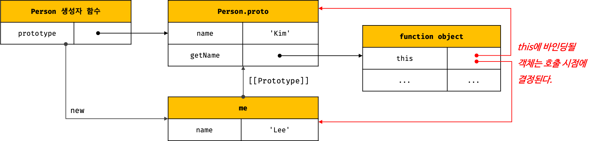

## Chapter 22. this

### this 키워드
- 객체 : 상태(state)를 나타내는 프로퍼티와 동작(behavior)을 나타내는 메서드를 하나의 논리적인 단위로 묶은 복합적인 자료구조 
- 동작을 나타내는 메서드는 자신이 속한 객체의 상태(프로퍼티)를 참조하고 변경할 수 있어야 함 &#8594; 즉, 자신이 속한 객체를 가리키는 식별자를 참조할 수 있어야 함
- 객체 리터럴 방식으로 생성한 객체의 경우, 메서드 내부에서 메서드 자신이 속한 객체를 가리키는 식별자를 재귀적으로 참조할 수 있음 - but, 자신이 속한 객체를 재귀적으로 참조하는 방식은 일반적이지도 바람직하지도 않음
- 생성자 함수 내부에서는 프로퍼티 또는 메서드를 추가하기 위해 자신이 생성할 인스턴스를 참조할 수 있어야 함! &#8594; 생성자 함수로 인스턴스를 생성하려면 먼저 생성자 함수가 존재해야 함
- 생성자 함수를 정의하는 시점에는 아직 인스턴스를 생성하기 이전이므로 생성자 함수가 생성할 인스턴스를 가리키는 식별자를 알 수 없음 &#8594; 그래서 등장한 것이 `this`!! 이는 자바스크립트가 제공하는 특수한 식별자!
- `this`는 **자신이 속한 객체 또는 자신이 생성할 인스턴스를 가리키는 자기 참조 변수(self-referencing variable)** 
- this는 js엔진에 의해 암묵적으로 생성되며, 코드 어디서든 참조할 수 있음 
- 함수를 호출하면 arguments 객체와 this가 암묵적으로 함수 내부에 전달
- **this가 가리키는 값, 즉 this 바인딩은 함수 호출 방식에 의해 동적으로 결정됨**  
  (반면에, 자바나 C++ 같은 클래스 기반 언어에서 this는 언제나 클래스가 생성하는 인스턴스를 가리킴)
- `this 바인딩` ?  
   - 바인딩(name binding)이란 식별자와 값을 연결하는 과정을 의미   
   - 변수 선언은 변수 이름(식별자)과 확보된 메모리 공간의 주소를 바인딩
   - this 바인딩은 this와 this가 가리킬 객체를 바인딩 (this는 키워드로 분류되지만 식별자 역할을 함)
- this는 일반적으로 객체의 메서드 내부 또는 생성자 함수 내부에서만 의미가 있음 (객체의 프로퍼티나 메서드를 참조하기 위한 자기 참조 변수이니까!)
- strict mode가 적용된 일반 함수 내부의 this에는 undefined가 바인딩 됨 (일반 함수 내부에서는 this를 사용할 필요가 없으니까)

### 함수 호출 방식과 this 바인딩
- this 바인딩(this에 바인딩될 값)은 함수 호출 방식(함수가 어떻게 호출되었는지)에 따라 동적으로 결정
- **렉시컬 스코프와 this 바인딩은 결정 시기가 다르다**  
  함수의 상위 스코프를 결정하는 방식인 `렉시컬 스코프(lexical scope)`는 함수 정의가 평가되어 함수 객체가 생성되는 시점에 상위 스코프를 결정하지만, `this 바인딩`은 함수 호출 시점에 결정!
> 함수를 호출하는 방식  
>   1. 일반 함수 호출  
>   2. 메서드 호출
>   3. 생성자 함수 호출
>   4. Function.prototype.apply/call/bind 메서드에 의한 간접 호출

1. 일반 함수 호출
   - 일반 함수로 호출하면 기본적으로 this에는 전역 객체(global object)가 바인딩됨
   - 다만, 객체를 생성하지 않는 일반 함수에서 this는 의미가 없음 &#8594; strict mode에서는 this에 undefined 바인딩
   - 메서드 내에서 정의한 중첩 함수도 일반 함수로 호출되면 중첩 함수 내부의 this에는 전역 객체가 바인딩
    ```jsx
    // var 키워드로 선언한 전역 변수 value는 전역 객체의 프로퍼티다.
    var value = 1;
    // const 키워드로 선언한 전역 변수 value는 전역 객체의 프로퍼티가 아니다.
    // const value = 1;

    const obj = {
      value: 100,
      foo() {
        console.log("foo's this: ", this);  // {value: 100, foo: ƒ}
        console.log("foo's this.value: ", this.value); // 100

        // 메서드 내에서 정의한 중첩 함수
        function bar() {
          console.log("bar's this: ", this); // window
          console.log("bar's this.value: ", this.value); // 1
        }

        // 메서드 내에서 정의한 중첩 함수도 일반 함수로 호출되면 중첩 함수 내부의 this에는 전역 객체가 바인딩된다.
        bar();
      }
    };

    obj.foo();
    ```
   - 콜백 함수가 일반 함수로 호출된다면 콜백 함수 내부의 this에 전역 객체가 바인딩! 
    ```jsx
    var value = 1;

    const obj = {
      value: 100,
      foo() {
        console.log("foo's this: ", this); // {value: 100, foo: ƒ}
        // 콜백 함수 내부의 this에는 전역 객체가 바인딩된다.
        setTimeout(function () {
          console.log("callback's this: ", this); // window
          console.log("callback's this.value: ", this.value); // 1
        }, 100);
      }
    };

    obj.foo();
    ```
   - **일반 함수로 호출된 모든 함수(중첩 함수, 콜백 함수 포함) 내부의 this에는 전역 객체가 바인딩됨**
   - 중첩 함수 또는 콜백 함수는 외부 함수를 돕는 헬퍼 함수의 역할을 하므로 외부 함수의 일부 로직을 대신하는 경우가 대부분이기 때문에, 외부 함수인 메서드와 중첩 함수 또는 콜백 함수의 this가 일치하지 않는 점은 중첩 함수, 콜백 함수를 헬퍼 함수로 동작하기 어렵게 만든다.
   - 메서드 내부의 중첩 함수나 콜백 함수의 this 바인딩을 메서드의 this 바인딩과 일치시키기 위한 방법
     - this 바인딩을 변수에 할당
      ```jsx
      var value = 1;

      const obj = {
        value: 100,
        foo() {
          // this 바인딩(obj)을 변수 that에 할당한다.
          const that = this;

          // 콜백 함수 내부에서 this 대신 that을 참조한다.
          setTimeout(function () {
            console.log(that.value); // 100
          }, 100);
        }
      };

      obj.foo();
      ```
     - Function.prototype.apply, Function.prototype.call, Function.prototype.bind 메서드 활용
      ```jsx
      var value = 1;

      const obj = {
        value: 100,
        foo() {
          // 콜백 함수에 명시적으로 this를 바인딩한다.
          setTimeout(function () {
            console.log(this.value); // 100
          }.bind(this), 100);
        }
      };

      obj.foo();
      ``` 
     - 화살표 함수 사용
      ```jsx
      var value = 1;

      const obj = {
        value: 100,
        foo() {
          // 화살표 함수 내부의 this는 상위 스코프의 this를 가리킨다.
          setTimeout(() => console.log(this.value), 100); // 100
        }
      };

      obj.foo();
      ``` 

2. 메서드 호출
   - 메서드 내부의 this에는 메서드를 호출한 객체, 즉 메서드를 호출할 때 메서드 이름 앞의 마침표(.) 연산자 앞에 기술한 객체가 바인딩됨
   - **주의** 메서드 내부의 this는 메서드를 소유한 객체가 아닌 **메서드를 호출한 객체**에 바인딩 됨!
   - 메서드는 객체에 포함된 것이 아니라 독립적으로 존재하는 별도의 객체로, 다른 객체의 프로퍼티에 할당하는 것으로 다른 객체의 메서드가 될 수도 있고 일반 변수에 할당하여 일반 함수로 호출될 수도 있음
    ```jsx
    const person = {
      name: 'Lee',
      getName() {
        // 메서드 내부의 this는 메서드를 호출한 객체에 바인딩된다.
        return this.name;
      }
    };

    // 메서드 getName을 호출한 객체는 person이다.
    console.log(person.getName()); // Lee

    const anotherPerson = {
      name: 'Kim'
    };
    // getName 메서드를 anotherPerson 객체의 메서드로 할당
    anotherPerson.getName = person.getName;

    // getName 메서드를 호출한 객체는 anotherPerson이다.
    console.log(anotherPerson.getName()); // Kim

    // getName 메서드를 변수에 할당
    const getName = person.getName;

    // getName 메서드를 일반 함수로 호출
    console.log(getName()); // ''
    // 일반 함수로 호출된 getName 함수 내부의 this.name은 브라우저 환경에서 window.name과 같다.
    // 브라우저 환경에서 window.name은 브라우저 창의 이름을 나타내는 빌트인 프로퍼티이며 기본값은 ''이다.
    // Node.js 환경에서 this.name은 undefined다.
    ```
    
   - 프로토타입 메서드 내부에서 사용된 this도 일반 메서드와 마찬가지로 해당 메서드를 호출한 객체에 바인딩 된당
    ```jsx
    function Person(name) {
      this.name = name;
    }

    Person.prototype.getName = function () {
      return this.name;
    };

    const me = new Person('Lee');

    // getName 메서드를 호출한 객체는 me다.
    console.log(me.getName()); // ① Lee

    Person.prototype.name = 'Kim';

    // getName 메서드를 호출한 객체는 Person.prototype이다.
    console.log(Person.prototype.getName()); // ② Kim
    ``` 
    

3. 생성자 함수 호출
   - 생성자 함수 내부의 this에는 생성자 함수가 (미래에) 생성할 인스턴스가 바인딩 
   - 생성자 함수는 객체(인스턴스)를 생성하는 함수로, 일반 함수와 동일한 방법으로 생성자 함수를 정의하고 new 연산자와 함께 호출하면! 생성자 함수로 동작
   - 생성자 함수를 new 연산자와 함께 호출하지 않으면 일반 함수로 동작
    ```jsx
    // 생성자 함수
    function Circle(radius) {
      // 생성자 함수 내부의 this는 생성자 함수가 생성할 인스턴스를 가리킨다.
      this.radius = radius;
      this.getDiameter = function () {
        return 2 * this.radius;
      };
    }

    // 반지름이 5인 Circle 객체를 생성
    const circle1 = new Circle(5);
    // 반지름이 10인 Circle 객체를 생성
    const circle2 = new Circle(10);

    console.log(circle1.getDiameter()); // 10
    console.log(circle2.getDiameter()); // 20

    // new 연산자와 함께 호출하지 않으면 생성자 함수로 동작하지 않는다. 즉, 일반적인 함수의 호출이다.
    const circle3 = Circle(15);

    // 일반 함수로 호출된 Circle에는 반환문이 없으므로 암묵적으로 undefined를 반환한다.
    console.log(circle3); // undefined

    // 일반 함수로 호출된 Circle 내부의 this는 전역 객체를 가리킨다.
    console.log(radius); // 15
    ```

4. Function.prototype.apply/call/bind 메서드에 의한 간접 호출
   - apply, call, bind 메서드는 Function.prototype의 메서드 &#8594; 모든 함수가 상속받아 사용 가능
    
   - `Function.prototype.apply`, `Function.prototype.call` 메서드는 this로 사용할 객체와 인수 리스트를 인수로 전달받아 함수를 호출 

    > 주어진 this 바인딩과 인수 리스트 배열을 사용하여 함수를 호출   
    > @param thisArg - this로 사용할 객체  
    > @param argsArray - 함수에게 전달할 인수 리스트의 배열 또는 유사 배열 객체  
    > @returns 호출된 함수의 반환값  
    > `Function.prototype.apply(thisArg[, argsArray])` 

    > 주어진 this 바인딩과 ,로 구분된 인수 리스트를 사용하여 함수를 호출  
    > @param thisArg - this로 사용할 객체  
    > @param arg1, arg2, ... - 함수에게 전달할 인수 리스트  
    > @returns 호출된 함수의 반환값  
    > `Function.prototype.call (thisArg[, arg1[, arg2[, ...]]])`  

   - apply와 call 메서드의 본질적인 기능은 함수를 호출하는 것
   - apply와 call 메서드는 함수를 호출하면서 첫 번째 인수로 전달한 특정 객체를 호출한 함수의 this에 바인딩

    ```jsx
    function getThisBinding() {
      console.log(arguments);
      return this;
    }

    // this로 사용할 객체
    const thisArg = { a: 1 };

    // getThisBinding 함수를 호출하면서 인수로 전달한 객체를 getThisBinding 함수의 this에 바인딩한다.
    // apply 메서드는 호출할 함수의 인수를 배열로 묶어 전달한다.
    console.log(getThisBinding.apply(thisArg, [1, 2, 3]));
    // Arguments(3) [1, 2, 3, callee: ƒ, Symbol(Symbol.iterator): ƒ]
    // {a: 1}

    // call 메서드는 호출할 함수의 인수를 쉼표로 구분한 리스트 형식으로 전달한다.
    console.log(getThisBinding.call(thisArg, 1, 2, 3));
    // Arguments(3) [1, 2, 3, callee: ƒ, Symbol(Symbol.iterator): ƒ]
    // {a: 1}
    ```
   - apply와 call 메서드의 대표적인 용도는 arguments 객체와 같은 유사 배열 객체에 배열 메서드를 사용하는 경우임  
    &#8594; arguments 객체는 배열이 아니기 때문에 Array.prototype.slice 같은 배열의 메서드를 사용할 수 없으나 apply와 call 메서드를 이용하면 가능
   - `Function.prototype.bind` 메서드는 함수를 호출하지 않고 this로 사용할 객체만 전달 (&#8594; 함수를 호출하지 않으므로 명시적으로 호출해야함)
   - bind 메서드는 메서드의 this와 메서드 내부의 중첩 함수 또는 콜백 함수의 this가 불일치하는 문제를 해결하기 위해 유용하게 사용
    ```jsx
    const person = {
      name: 'Lee',
      foo(callback) {
        // bind 메서드로 callback 함수 내부의 this 바인딩을 전달
        setTimeout(callback.bind(this), 100);
      }
    };

    person.foo(function () {
      console.log(`Hi! my name is ${this.name}.`); // Hi! my name is Lee.
      // 일반 함수로 호출된 콜백 함수 내부의 this.name은 브라우저 환경에서 window.name과 같음
      // 브라우저 환경에서 window.name은 브라우저 창의 이름을 나타내는 빌트인 프로퍼티이며 기본값은 ''임
      // 따라서 bind 메서드를 활용하지 않았다면 Hi! my name is . 으로 결과 나왔을 것
    });
    ```
- 함수 호출 방식에 따른 this 바인딩 정리   

| 함수 호출 방식 | this 바인딩 |
| :--- | :--- |
| 일반 함수 호출 | 전역 객체 |
| 메서드 호출 | 메서드를 호출한 객체 |
| 생성자 함수 호출 | 생성자 함수가 (미래에) 생성할 인스턴스 |
| Function.prototype.apply/call/bind 메서드에 의한 간접 호출 | Function.prototype.apply/call/bind 메서드에 첫 번째 인수로 전달한 객체 |


