## Chapter 23. 실행 컨텍스트

**실행 컨텍스트(execution context)**
- 자바스크립트의 동작 원리를 담고 있는 핵심 개념으로, 이를 제대로 이해하면 js가 스코프를 기반으로 **식별자와 식별자에 바인딩된 값(식별자 바인딩)을 관리하는 방식**과 **호이스팅이 발생하는 이유**,  
**클로저의 동작 방식**, 그리고 **태스크 큐**와 함께 동작하는 **이벤트 핸들러**와 **비동기 처리**의 동작 방식을 이해할 수 있다!

### 소스코드의 타입
- 소스코드(실행 가능한 코드, executable code)는 **실행 컨텍스트를 생성**함
- 소스코드(ECMAScript code)의 4가지 타입  

| 소스코드의 타입 | 설명 |
| :--- | :--- |
| 전역 코드(global code) | 전역에 존재하는 소스코드 (전역에 정의된 함수, 클래스 등의 내부 코드는 포함 X) |
| 함수 코드(function code) | 함수 내부에 존재하는 소스코드 (함수 내부에 중첩된 함수, 클래스 등의 내부 코드는 포함 X) |
| eval 코드(eval code) | 빌트인 전역 함수인 eval 함수에 인수로 전달되어 실행되는 소스코드 |
| 모듈 코드(module code) | 모듈 내부에 존재하는 소스코드 (모듈 내부의 함수, 클래스 등의 내부 코드는 포함 X) |

- 소스코드를 4가지 타입으로 구분하는 이유?  
  &#8594; 소스코드의 타입에 따라 실행 컨텍스트를 생성하는 과정과 관리 내용이 다르기 때문

   1. 전역 코드  
      전역 코드는 전역 변수를 관리하기 위해 최상위 스코프인 전역 스코프를 생성해야하고, var 키워드로 선언된 전역 변수와 함수 선언문으로 정의된 전역 함수를 전역 객체의 프로퍼티와 메서드로 바인딩하고 참조하기 위해 전역 객체와 연결되어야 함  
      &#8594; 전역 코드가 평가되면 전역 실행 컨텍스트가 생성
   2. 함수 코드   
      함수 코드는 지역 스코프를 생성하고 지역 변수, 매개변수, arguments 객체를 관리해야하며, 생성한 지역 스코프를 전역 스코프에서 시작하는 스코프 체인의 일원으로 연결해야 함  
      &#8594; 함수 코드가 평가되면 함수 실행 컨텍스트가 생성
   3. eval 코드  
      strict mode에서 자신만의 독자적인 스코프를 생성  
      &#8594; eval 코드가 평가되면 eval 실행 컨텍스트 생성
   4. 모듈 코드  
      모듈별로 독립적인 모듈 스코프를 생성  
      &#8594; 모듈 코드가 평가되면 모듈 실행 컨텍스트가 생성  
  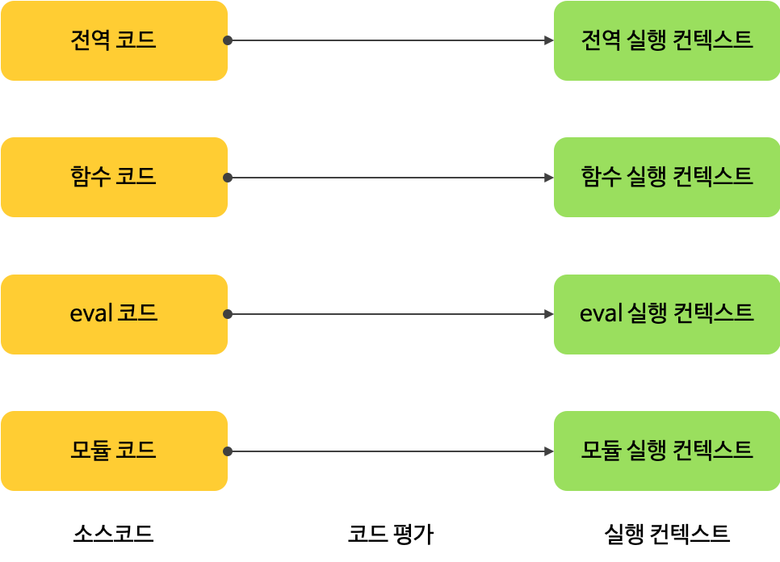

### 소스코드의 평가와 실행
- 모든 소스코드는 실행에 앞서 평가 과정을 거치며 코드를 실행하기 위한 준비 함
- 자바스크립트 엔진은 소스코드를 `소스코드의 평가`와 `소스코드의 실행` 과정으로 나누어 처리  
- 소스코드 평가 과정  
    - 실행 컨텍스트를 생성하고 변수, 함수 등의 선언문 만을 먼저 실행하여 생성된 변수나 함수 식별자를 키로 실행 컨텍스트가 관리하는 스코프(렉시컬 환경의 환경 레코드)에 등록
- 소스코드의 실행
    - 평가 과정 이후, 선언문을 제외한 소스코드가 순차적으로 실행되는 런타임 시작
    - 소스코드 실행에 필요한 정보(변수나 함수의 참조)를 실행 컨텍스트가 관리하는 스코프에서 검색하여 취득
    - 변수 값의 변경과 같은 소스코드의 실행 결과는 다시 실행 컨텍스트가 관리하는 스코프에 등록
   

### 실행 컨텍스트의 역할
> 실행 컨텍스트(execution context)
> - 소스코드를 실행하는 데 필요한 환경을 제공
> - 소스코드의 실행 결과를 관리하는 영역  
> ⇒ 식별자(변수, 함수, 클래스 등의 이름)를 등록하고 관리하는 스코프와 코드 실행 순서 관리를 구현한 내부 매커니즘으로, 모든 코드는 실행 컨텍스트를 통해 실행되고 관리됨

- 식별자와 스코프는 실행 컨텍스트의 `렉시컬 환경`으로 관리
- 코드 실행 순서는 `실행 컨텍스트 스택`으로 관리

- 자바스크립트 엔진이 코드를 평가하고 실행하는 과정
   1. 전역 코드 평가
      - 소스코드 평가 과정에서 선언문만 먼저 실행 &#8594; 전역 코드의 변수 선언문과 함수 선언문이 먼저 실행
      - 그 결과 생성된 전역 변수와 전역 함수가 실행 컨텍스트가 관리하는 전역 스코프에 등록  
        &#8594; var 키워드로 선언된 전역 변수와 함수 선언문으로 정의된 전역 함수는 전역 객체의 프로퍼티와 메서드가 됨
   2. 전역 코드 실행
      - 전역 코드 평가 과정이 끝나면 **런타임** 시작 &#8594; 전역 코드 순차적으로 실행
      - 전역 변수에 값이 할당되고 함수가 호출됨  
        &#8594; 함수가 호출되면 순차적으로 실행되던 전역 코드의 실행을 **일시 중단**하고 코드 실행 순서를 변경하여 함수 내부로 진입
   3. 함수 코드 평가 
      - 함수 호출로 실행 순서가 함수 내부로 진입하면 함수 내부의 문들을 실행하기에 앞서 매개변수와 지역 변수 선언문이 먼저 실행
      - 그 결과 생성된 매개변수와 지역 변수가 실행 컨텍스트가 관리하는 지역 스코프에 등록됨
      - 함수 내부에서 지역 변수처럼 사용할 수 있는 `arguments 객체`가 생성되어 지역 스코프에 등록되고 `this 바인딩`도 결정됨
   4. 함수 코드 실행
      - 함수 코드 평가 과정이 끝나고 런타임 시작
      - 매개변수와 지역 변수에 값이 할당되고 (hoxy, 다음 코드가 있다면) `console.log` 메서드 호출  
         - `console.log` 메서드를 호출하기 위해 먼저 식별자인 console을 **스코프 체인**을 통해 검색 (이를 위해, 함수 코드의 지역 스코프는 상위 스코프인 전역 스코프와 연결되어야 함)
         - But, console 식별자는 스코프 체인에 등록되어 있지 않고, 전역 객체에 프로퍼티로 존재  
            &#8594; 전역 객체의 프로퍼티가 마치 전역 변수처럼 전역 스코프를 통해 검색 가능해야 한다는 것을 의미
         - `log` 프로퍼티를 console 객체의 **프로토타입 체인**을 통해 검색
      - `console.log` 메서드에 인수로 전달된 표현식을 평가 
      - `console.log` 메서드의 실행이 종료되면 함수 코드 실행 과정이 종료되고 함수 호출 이전으로 돌아가 전역 코드 실행을 계속함
- 위의 내용처럼 코드가 실행되기 위해서는
   - 스코프를 구분하여 식별자와 바인딩된 값이 관리되어야 함
   - 중첩 관계에 의해 스코프 체인을 형성하여 식별자를 검색할 수 있어야 함
   - 전역 객체의 프로퍼티도 전역 변수처럼 검색할 수 있어야 함
   - 함수 호출이 종료되면 함수 호출 이전으로 돌아가기 위해 현재 실행 중인 코드와 실행하던 코드를 구분해서 관리해야 함  

  ⇒ 즉, **스코프, 식별자, 코드 실행 순서 등의 관리가 필요하다**

### 실행 컨텍스트 스택
> 실행 컨텍스트 스택 (execution context stack)
> - 코드를 평가하여 생성된 실행 컨텍스트는 스택(stack) 자료구조로 관리  
>   ⇒ 이를 `실행 컨텍스트 스택`이라고 함
> - 콜 스택(call stack)이라고도 한다
> - 코드가 실행되는 시간의 흐름에 따라 실행 컨텍스트 스택에는 실행 컨텍스트가 추가(push)되고 제거(pop)됨  

```jsx
const x = 1;

function foo () {
  const y = 2;

  function bar () {
    const z = 3;
    console.log(x + y + z);
  }
  bar();
}

foo(); // 6
```
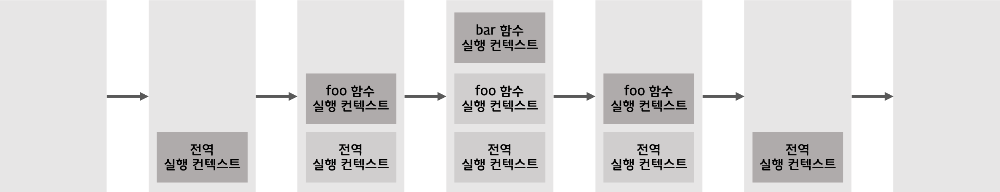

- 위 예제 코드 순서  
   전역 코드의 평가와 실행 &#8594; foo 함수 코드의 평가와 실행 &#8594; bar 함수 코드의 평가와 실행 (& `console.log` 메서드 호출 및 실행) &#8594; foo 함수 코드로 복귀 &#8594; 전역 코드로 복귀 &#8594; 종료

- **실행 컨텍스트 스택은 코드의 실행 순서를 관리**
- 실행 컨텍스트 스택의 최상위에 존재하는 실행 컨텍스트는 언제나 **현재 실행 중인 코드의 실행 컨텍스트** ⇒ `실행 중인 실행 컨텍스트(running execution context)`
- 스택 자료구조 &#8594; `후입선출`

### 렉시컬 환경 (Lexical Environment)
- `렉시컬 환경`은 식별자와 식별자에 바인딩된 값과 상위 스코프에 대한 참조를 기록하는 자료구조로, 실행 컨텍스트를 구성하는 컴포넌트 ⇒ 스코프와 식별자를 관리
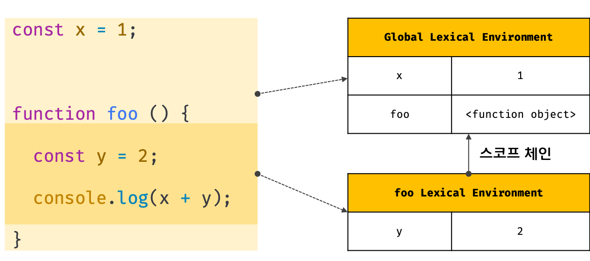
- 렉시컬 환경은 스코프를 구분하여 식별자를 등록하고 관리하는 저장소 역할로 **렉시컬 스코프의 실체**  
   &#8594; 키와 값을 갖는 객체 형태의 스코프(전역, 함수, 블록 스코프)를 생성하여 식별자를 키로 등록하고 식별자에 바인딩된 값을 관리

- 실행 컨텍스트는 `LexicalEnvironment 컴포넌트`와 `VariableEnvironment 컴포넌트`로 구성
- 생성 초기에 LexicalEnvironment 컴포넌트와 VariableEnvironment 컴포넌트는 하나의 동일한 렉시컬 환경을 참조  
   - 이후 몇 가지 상황을 만나면 VariableEnvironment 컴포넌트를 위한 새로운 렉시컬 환경을 생성하고, 이때부터 두 컴포넌트는 내용이 달라지는 경우가 있음 &#8594; But, 여기에서는 둘을 구분하지 않고 렉시컬 환경으로 통일해서 설명 
- 렉시컬 환경의 구성 컴포넌트
   1. 환경 레코드(Environment Record)
      - 스코프에 포함된 식별자를 등록하고 등록된 식별자에 바인딩된 값을 관리하는 저장소 
      - 소스코드의 타입에 따라 관리하는 내용에 차이가 있음
   2. 외부 렉시컬 환경에 대한 참조(Outer Lexical Environment Reference)
      - 외부 렉시컬 환경에 대한 참조는 상위 스코프를 가리킴
      - 상위 스코프? 외부 렉시컬 환경(해당 실행 컨텍스트를 생성한 소스코드를 포함하는 상위 코드의 렉시컬 환경)
      - 단방향 링크드 리스트인 스코프 체인을 구현
   

### 실행 컨텍스트의 생성과 식별자 검색 과정  
```jsx
var x = 1;
const y = 2;

function foo (a) {
  var x = 3;
  const y = 4;

  function bar (b) {
    const z = 5;
    console.log(a + b + x + y + z);
}
  bar(10);
}

foo(20); // 42
```
1. 전역 객체 생성
   - 전역 객체는 전역 코드가 평가되기 이전에 생성
   - 전역 객체에는 빌트인 전역 프로퍼티와 빌트인 전역 함수, 표준 빌트인 객체가 추가되고 동작 환경(클라이언트 사이드 또는 서버 사이드)에 따라 클라이언트 사이드 Web API 또는 특정 환경을 위한 호스트 객체가 포함
   - 전역 객체도 `Object.prototype` 상속받음 &#8594; 전역 객체도 프로토타입 체인의 일원  
```jsx
// Object.prototype.toString
window.toString(); // -> "[object Window]"

window.__proto__.__proto__.__proto__.__proto__ === Object.prototype; // -> true
```
2. 전역 코드 평가
   - 소스코드가 로드되면 js엔진은 전역 코드를 평가
   > 1. 전역 실행 컨텍스트 생성
   > 2. 전역 렉시컬 환경 생성  
   >    1. 전역 환경 레코드 생성  
   >        1. 객체 환경 레코드 생성  
   >        2. 선언적 환경 레코드 생성  
   >    2. this 바인딩  
   >    3. 외부 렉시컬 환경에 대한 참조 결정

   

   1. 전역 실행 컨텍스트 생성
      - 비어있는 전역 실행 컨텍스트를 생성하여 실행 컨텍스트 스택에 push
      - 이때 전역 실행 컨텍스트는 실행 컨텍스트 스택의 최상위, 즉 실행 중인 실행 컨텍스트(running execution context)임
   2. 전역 렉시컬 환경 생성
      - 전역 렉시컬 환경(Global Lexical Environment)을 생성하고 전역 실행 컨텍스트의 LexicalEnvironment 컴포넌트와 VariableEnvironment 컴포넌트에 바인딩
      - 렉시컬 환경은 2개의 컴포넌트로 구성
         - 환경 레코드 (Environment Record)
         - 외부 렉시컬 환경에 대한 참조 (OuterLexicalEnvironmentReference)
      1. 전역 환경 레코드 생성
         - 전역 렉시컬 환경을 구성하는 컴포넌트인 `전역 환경 레코드(Global Environment Record)`는 전역 변수를 관리하는 전역 스코프, 전역 객체의 빌트인 전역 프로퍼티와 빌트인 전역 함수, 표준 빌트인 객체를 제공
         - ES6의 let, const 키워드로 선언한 전역 변수는 전역 객체의 프로퍼티가 되지 않고 개념적인 블록 내에 존재
         - 기존의 var 키워드로 선언한 전역 변수와 let, const 키워드로 선언한 전역 변수를 구분하여 관리하기 위해 전역 스코프 역할을 하는 **전역 환경 레코드는 객체 환경 레코드(Object Environment Record)와 선언적 환경 레코드(Declarative Environment Record)로 구성** 
         - 전역 환경 레코드의 객체 환경 레코드와 선언적 환경 레코드는 서로 협력하여 전역 스코프와 전역 객체(전역 변수의 전역 객체 프로퍼티화)를 관리
         1. 객체 환경 레코드 생성
            - 기존의 전역 객체가 관리하던 var 키워드로 선언한 전역 변수와 함수 선언문으로 정의한 전역 함수, 빌트인 전역 프로퍼티와 빌트인 전역 함수, 표준 빌트인 객체를 관리
            - 객체 환경레코드는 `BindingObject`라고 부르는 객체와 연결 (`BindingObject`는 전역 객체)
            - 전역 코드 평가 과정에서 var 키워드로 선언한 전역 변수와 함수 선언문으로 정의된 전역 함수는 전역 환경 레코드의 객체 환경 레코드에 연결된 BindingObject를 통해 전역 객체의 프로퍼티와 메서드가 됨
            - 이때 등록된 식별자를 전역 환경 레코드의 객체 환경 레코드에서 검색하면 전역 객체의 프로퍼티를 검색하여 반환  
               ⇒ var 키워드로 선언된 전역 변수와 함수 선언문으로 정의된 전역 함수가 전역 객체의 프로퍼티와 메서드가 되고 전역 객체를 가리키는 식별자(window) 없이 전역 객체의 프로퍼티를 참조(ex, window.alert을 alert으로 참조)할 수 있는 메커니즘
            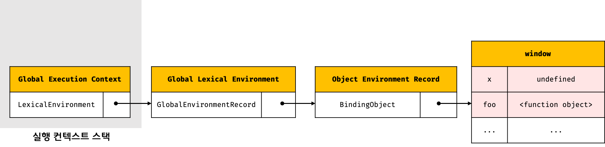
            - var 키워드로 선언한 변수는 '선언 단계'와 '초기화 단계'가 동시에 진행 &#8594; 전역 코드 평가 시점에 객체 환경 레코드에 바인딩된 BindingObject를 통해 전역 객체에 변수 식별자를 키로 등록한 다음, 암묵적으로 undefined 바인딩
            - var 키워드로 선언한 변수는 코드 실행 단계에서 변수 선언문 이전에도 참조 가능 (단, 변수 선언문 이전에 참조한 변수의 값은 언제나 undefined)
            - var 키워드로 선언한 변수에 할당한 함수 표현식도 동일하게 동작  
               ⇒ 변수 호이스팅이 발생하는 원인!
            - 함수 선언문으로 정의한 함수가 평가되면 함수 이름과 동일한 이름의 식별자를 객체 환경 레코드에 바인딩된 BindingObject를 통해 전역 객체에 키로 등록하고 생성된 함수 객체를 즉시 할당 (따라서 함수 선언문 이전에 호출 가능)  
               ⇒ 변수 호이스팅과 함수 호이스팅의 차이
         2. 선언적 환경 레코드 생성
            - let, const 키워드로 선언한 전역 변수(변수에 할당한 함수 표현식 포함)를 관리 - var 키워드로 선언한 전역 변수와 함수 선언문으로 정의한 전역 함수 이외의 선언
            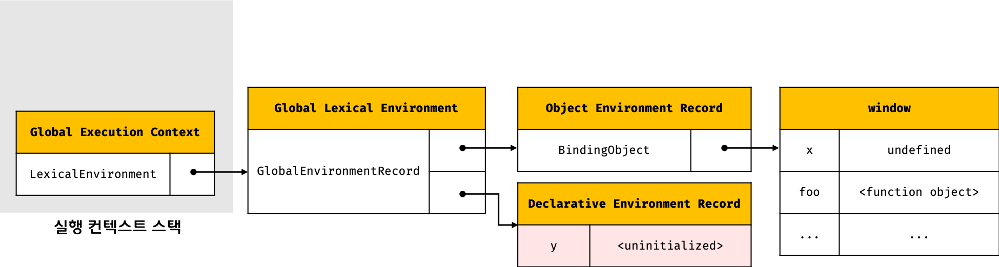
            - ES6의 let, const 키워드로 선언한 전역 변수는 전역 객체의 프로퍼티가 되지 않고 개념적인 블록 내에 존재 ⇒ **개념적인 블록**이 전역 환경 레코드의 선언적 환경 레코드
            - let, const 키워드로 선언한 변수는 전역 객체의 프로퍼티가 되지 않기 때문에 window.y와 같이 전역 객체의 프로퍼티로서 참조할 수 없음
            - const 키워드로 선언한 변수는 “선언 단계”와 “초기화 단계”가 분리되어 진행  
               ⇒ 따라서 초기화 단계, 즉 런타임에 변수 선언문에 도달하기 전까지 `일시적 사각지대(TDZ, Temporal Dead Zone)`에 빠짐
            - 그림에서 y 변수에 바인딩되어 있는 `<uninitialized>`는 초기화 단계가 진행되지 않아 변수에 접근할 수 없음을 나타내기 위해 명시적으로 사용한 표현 
            - let, const 키워드로 선언한 변수도 변수 호이스팅이 발생하지만, 런타임에 컨트롤이 변수 선언문에 도달하기 전까지 일시적 사각지대에 빠지기 때문에 참조 불가!  
               ```jsx
               let foo = 1; // 전역 변수

               {
               // let, const 키워드로 선언한 변수가 호이스팅되지 않는다면 전역 변수를 참조해야 한다.
               // 하지만 let 키워드로 선언한 변수도 여전히 호이스팅이 발생하기 때문에 참조 에러(ReferenceError)가 발생한다.
               console.log(foo); // ReferenceError: Cannot access 'foo' before initialization
               let foo = 2; // 지역 변수
               }
               ```
      2. this 바인딩
         - 전역 환경 레코드의 `[[GlobalThisValue]]` 내부 슬롯에 this가 바인딩
         - 일반적으로 전역 코드에서 this는 전역 객체를 가리키므로 전역 환경 레코드의 [[GlobalThisValue]] 내부 슬롯에는 전역 객체가 바인딩  
            &#8594; 전역 코드에서 this를 참조하면 전역 환경 레코드의 [[GlobalThisValue]] 내부 슬롯에 바인딩되어 있는 객체가 반환
         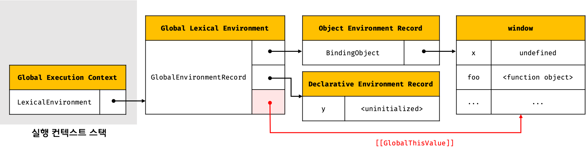
         - 전역 환경 레코드를 구성하는 객체 환경 레코드와 선언적 환경 레코드에는 this 바인딩이 없음  
            ⇒ this 바인딩은 전역 환경 레코드와 함수 환경 레코드에만 존재
      3. 외부 렉시컬 환경에 대한 참조 결정
         - 외부 렉시컬 환경에 대한 참조(Outer Lexical Environment Reference)는 현재 평가 중인 소스코드를 포함하는 외부 소스코드의 렉시컬 환경, 즉 상위 스코프를 가리킴  
            ⇒ 이를 통해 단방향 링크드 리스트인 스코프 체인을 구현
         - 전역 코드를 포함하는 소스코드는 없으므로 전역 렉시컬 환경의 외부 렉시컬 환경에 대한 참조에 `null` 할당  
            ⇒ 전역 렉시컬 환경이 스코프 체인의 종점에 존재함을 의미
         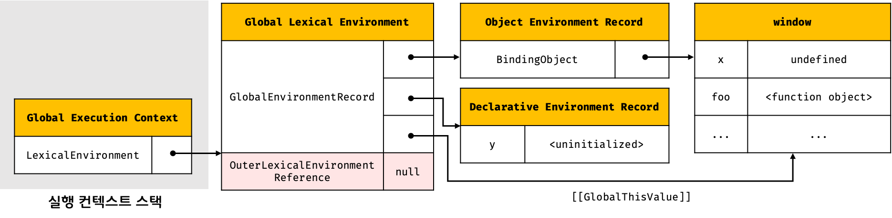
   3. 전역 코드 실행
      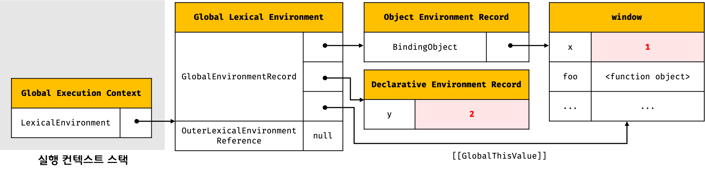
      - 변수 할당문 실행되어 값을 할당하고 함수 호출
         - 변수 할당문 또는 함수 호출문을 실행하려면 먼저 변수 또는 함수 이름이 선언된 식별자인지 확인해야 함  
            &#8594; 선언되지 않은 식별자는 참조할 수 없으므로 할당이나 호출도 할 수 없기 때문
         - 식별자는 스코프가 다르면 같은 이름 가질 수 있음 &#8594; 동일한 이름의 식별자가 다른 스코프에 여러 개 존재할 수 있음
         - `식별자 결정(identifier resolution)` ? 어느 스코프의 식별자를 참조하면 되는지 결정
      - 식별자 결정을 위해 식별자를 검색할 때는 **실행 중인 컨텍스트에서 식별자를 검색하기 시작**
         - 선언된 식별자는 실행 컨텍스트의 렉시컬 환경의 환경 레코드에 등록되어 있음
         - if, 실행 중인 실행 컨텍스트의 렉시컬 환경에서 식별자를 검색할 수 없으면 외부 렉시컬 환경에 대한 참조가 가리키는 렉시컬 환경(상위 스코프)으로 이동하여 식별자 검색  
            ⇒ **스코프 체인의 동작 원리**
      - 전역 렉시컬 환경은 스코프 체인의 종점이므로 전역 렉시컬 환경에서 검색할 수 없는 식별자는 참조 에러(ReferenceError) 발생 &#8594; 식별자 결정에 실패했기 때문
      - 실행 컨텍스트는 소스코드를 실행하기 위해 필요한 환경을 제공하고 코드의 실행 결과를 실제로 관리하는 영역
   4. 함수 코드 평가 
      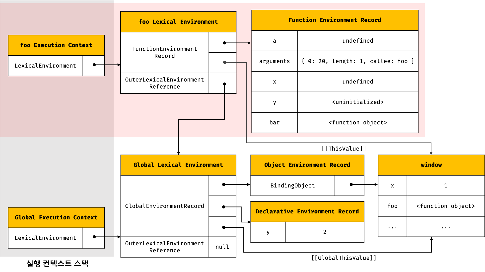
      - 함수가 호출되면 전역 코드의 실행을 일시 중단하고 함수 내부로 코드의 제어권이 이동, 함수 코드 평가 시작
         1. 함수 실행 컨텍스트 생성
            - 생성된 함수 실행 컨텍스트는 함수 렉시컬 환경이 완성된 다음 실행 컨텍스트 스택에 푸시
            - 이때 함수 실행 컨텍스트는 실행 컨텍스트 스택의 최상위, 즉 실행 중인 실행 컨텍스트(running execution context)
         2. 함수 렉시컬 환경 생성(Function Lexical Environment)
            - 함수 렉시컬 환경 생성 후 함수 실행 컨텍스트에 바인딩
            1. 함수 환경 레코드 생성
               - 함수 렉시컬 환경을 구성하는 컴포넌트 중 하나인 `함수 환경 레코드(Function Environment Record)`는 매개변수, arguments 객체, 함수 내부에서 선언한 지역 변수와 중첩 함수를 등록하고 관리
               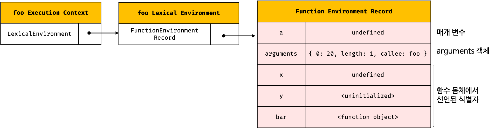
            2. this 바인딩
               - 함수 환경 레코드의 `[[ThisValue]]` 내부 슬롯에 this 바인딩 &#8594; `[[ThisValue]]` 내부 슬롯에 바인딩될 객체는 함수 호출 방식에 따라 결정
               - 일반 함수로 호출된 경우 this는 전역 객체를 가리킴 ⇒ 함수 환경 레코드의 [[ThisValue]] 내부 슬롯에는 전역 객체가 바인딩
                  - 함수 내부에서 this를 참조하면 함수 환경 레코드의 [[ThisValue]] 내부 슬롯에 바인딩되어 있는 객체가 반환
               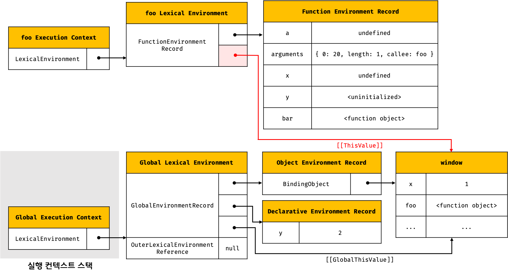
            3. 외부 렉시컬 환경에 대한 참조 결정
               - 외부 렉시컬 환경에 대한 참조에는 함수 정의가 평가된 시점에 실행 중인 실행 컨텍스트의 렉시컬 환경의 참조가 할당
               - ex, 전역 코드에 정의된 전역 함수는 전역 코드 평가 시점에 평가됨. 이때 실행 중인 실행 컨텍스트는 전역 실행 컨텍스트  
                  &#8594; 따라서 외부 렉시컬 환경에 대한 참조에는 전역 렉시컬 환경의 참조가 할당
               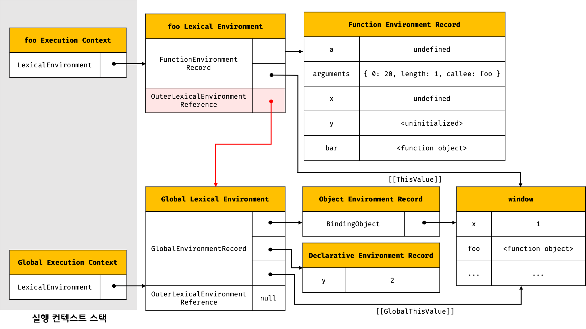
               - 자바스크립트는 함수를 어디서 호출했는지가 아니라 어디에 정의했는지에 따라 상위 스코프를 결정하고, 함수 객체는 자신이 정의된 스코프, 즉 상위 스코프를 기억
               - js 엔진은 함수 정의를 평가하여 함수 객체를 생성할 때 현재 실행 중인 실행 컨텍스트의 렉시컬 환경, 즉 함수의 상위 스코프를 함수 객체의 내부 슬롯 `[[Environment]]`에 저장
               - 함수 렉시컬 환경의 외부 렉시컬 환경에 대한 참조에 할당되는 것은 바로 함수의 상위 스코프를 가리키는 함수 객체의 내부 슬롯 [[Environment]]에 저장된 렉시컬 환경의 참조  
                  ⇒ 함수 객체의 내부 슬롯 [[Environment]]가 바로 렉시컬 스코프를 구현하는 메커니즘
               - 함수 객체의 내부 슬롯 [[Environment]]와 렉시컬 스코프는 클로저를 이해할 수 있는 중요한 단서

   5. 함수 코드 실행
      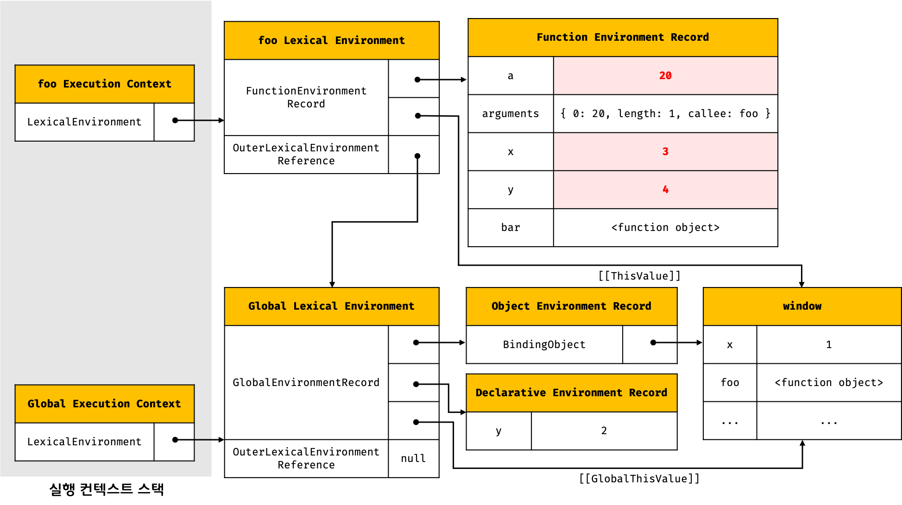
      - 런타임이 시작되어 함수의 소스코드가 순차적으로 실행되기 시작
      - 매개변수에 인수가 할당되고, 변수 할당문이 실행되어 지역 변수에 값이 할당! 그리고 중첩 함수 호출
      - 식별자 결정을 위해 실행 중인 실행 컨텍스트의 렉시컬 환경에서 식별자를 검색
      - 만약 실행 중인 실행 컨텍스트의 렉시컬 환경에서 식별자를 검색할 수 없으면 외부 렉시컬 환경에 대한 참조가 가리키는 렉시컬 환경으로 이동하여 식별자를 검색
      - 검색된 식별자에 값을 바인딩
   6. 중첩 함수 코드 평가
      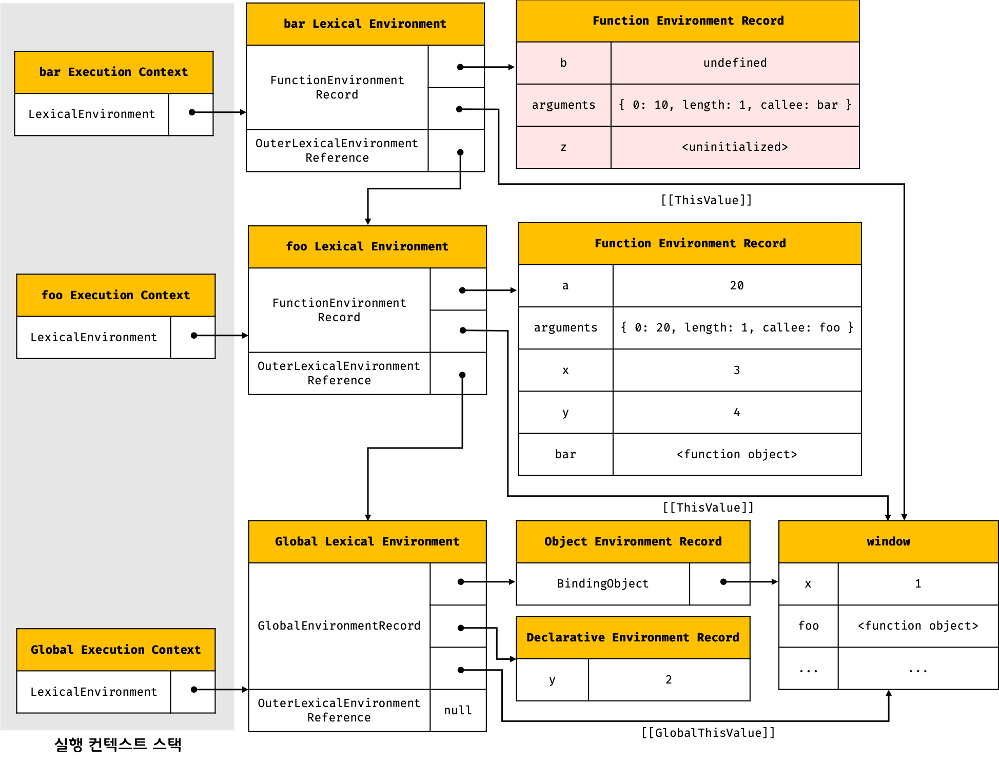
      - 함수 내부로 코드의 제어권이 이동
      - 실행 컨텍스트와 렉시컬 환경의 생성 과정은 외부 함수 코드 평가와 동일
   7. 중첩 함수 코드 실행
      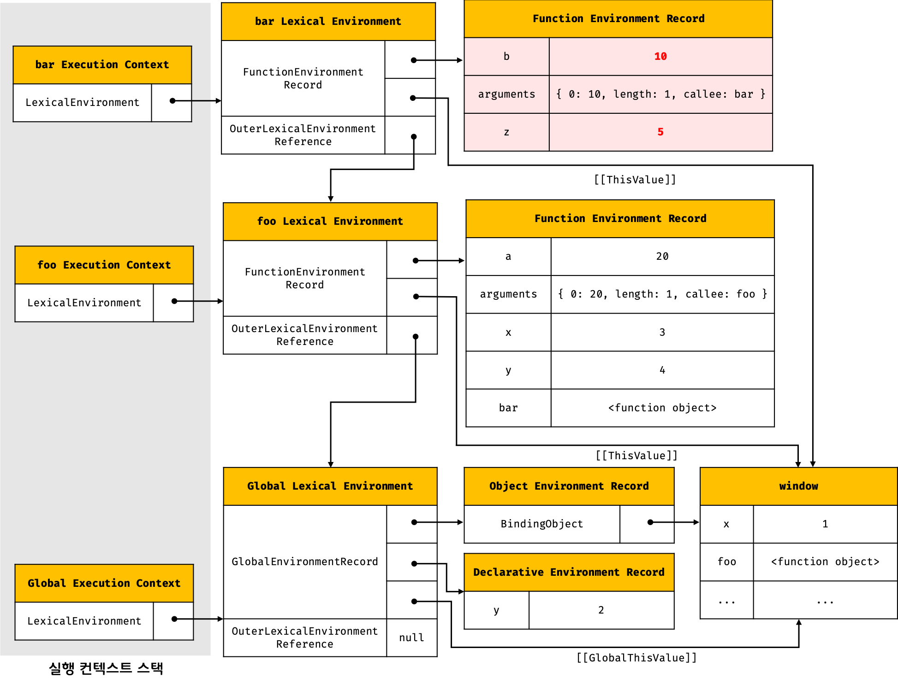
      - 런타임 시작되어 함수의 소스코드가 순차적으로 실행
      - 매개변수에 인수 할당, 변수 할당문 실행
      - `console.log` 실행 과정
         1. console 식별자 검색
            - `console` 식별자를 스코프 체인에서 검색
            - 스코프 체인은 현재 실행 중인 실행 컨텍스트의 렉시컬 환경에서 시작하여 외부 렉시컬 환경에 대한 참조로 이어지는 렉시컬 환경의 연속  
               ⇒ 식별자를 검색할 때는 언제나 현재 실행 중인 실행 컨텍스트의 렉시컬 환경에서 검색하기 시작
            - 실행 중인 함수 실행 컨텍스트의 함수 렉시컬 환경에서 console 식별자를 검색하고  
               &#8594; 그 곳에 없으면, 스코프 체인 상의 상위 스코프, 즉 외부 렉시컬 환경에 대한 참조가 가리키는 외부 함수 렉시컬 환경으로 이동하여 검색  
               &#8594; 외부 함수 렉시컬 환경에도 console 식별자가 없으므로 스코프 체인 상의 상위 스코프, 즉 외부 렉시컬 환경에 대한 참조가 가리키는 전역 렉시컬 환경(Global Lexical Environment)으로 이동하여 console 식별자를 검색
            - 전역 렉시컬 환경은 객체 환경 레코드와 선언적 환경 레코드로 구성
               - console 식별자는 객체 환경 레코드의 BindingObject를 통해 전역 객체에서 찾을 수 있음
         2. log 메서드 검색
            - console 식별자에 바인딩된 객체, 즉 console 객체에서 log 메서드를 검색  
               &#8594; console 객체의 프로토타입 체인을 통해 메서드를 검색
            - log 메서드는 상속된 프로퍼티가 아니라 console 객체가 직접 소유하는 프로퍼티
         3. 표현식 평가 
            - console.log 메서드에 전달할 인수, 즉 표현식을 평가 
            - 표현식 안의 식별자는 스코프 체인, 즉 현재 실행 중인 실행 컨텍스트의 렉시컬 환경에서 시작하여 외부 렉시컬 환경에 대한 참조로 이어지는 렉시컬 환경의 연속에서 검색
         4. console.log 메서드 호출 
            - 표현식이 평가되어 생성한 값을 console.log 메서드에 전달하여 호출
   8. 중첩 함수 코드 실행 종료 
      - 중첩 함수 안의 console.log 메서드가 호출되고 종료하면 더는 실행할 코드가 없으므로 중첩 함수 코드의 실행 종료 
      - 실행 컨텍스트 스택에서 중첩 함수 실행 컨텍스트가 팝(pop)되어 제거되고 외부 함수 실행 컨텍스트가 실행 중인 실행 컨텍스트가 됨
      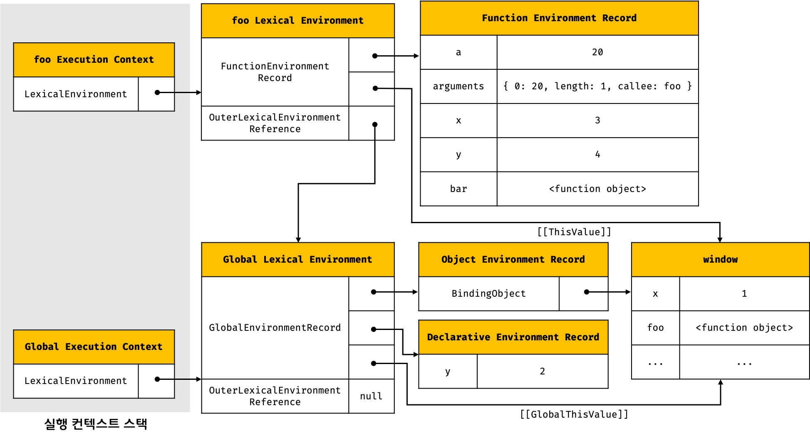
      - 실행 컨텍스트 스택에서 중첩 함수 실행 컨텍스트가 제거되었다고 해서 중첩 함수 렉시컬 환경까지 즉시 소멸하는 것은 아님
      - 렉시컬 환경은 실행 컨텍스트에 의해 참조되기는 하지만 독립적인 객체
      - 객체를 포함한 모든 값은 누군가에 의해 참조되지 않을 때 비로소 가비지 컬렉터에 의해 메모리 공간의 확보가 해제되어 소멸
   9. 외부 함수 코드 실행 종료 
      - 내부 함수가 종료하면 더 이상 실행할 코드가 없으므로 외부 함수 코드의 실행이 종료
      - 실행 컨텍스트 스택에서 함수 실행 컨텍스트가 팝되어 제거되고 전역 실행 컨텍스트가 실행 중인 실행 컨텍스트가 됨
   10. 전역 코드 실행 종료 
      - 외부 함수가 종료되면 더는 실행할 전역 코드가 없으므로 전역 코드의 실행이 종료되고 전역 실행 컨텍스트도 실행 컨텍스트 스택에서 팝되어 실행 컨텍스트 스택에는 아무것도 남아있지 않게 됨

### 실행 컨텍스트와 블록 레벨 스코프            
- var 키워드로 선언한 변수는 오로지 함수의 코드 블록 만을 지역 스코프로 인정하는 함수 레벨 스코프를 따름
- let, const 키워드로 선언한 변수는 모든 코드 블록(함수, if 문, for 문, while 문, try/catch 문 등)을 지역 스코프로 인정하는 블록 레벨 스코프(block-level scope)를 따름
- 선언적 환경 레코드를 갖는 렉시컬 환경을 새롭게 생성하여 기존의 전역 렉시컬 환경을 교체
---

## Chapter 24. 클로저 
> “A closure is the combination of a function and the lexical environment within which that function was declared.”  
> 클로저는 함수와 그 함수가 선언된 렉시컬 환경과의 조합이다.

- 클로저(closure)는 자바스크립트 고유의 개념이 아님
   - 함수를 일급 객체로 취급하는 함수형 프로그래밍 언어에서 사용되는 중요한 특성
- 핵심 키워드 `함수가 선언된 렉시컬 환경`

### 렉시컬 스코프
- 렉시컬 스코프 = 정적 스코프  
   자바스크립트 엔진은 함수를 어디서 호출했는지가 아니라 **함수를 어디서 정의했는지에 따라 상위 스코프를 결정**
- 함수의 상위 스코프는 함수를 정의한 위치에 의해 정적으로 결정되고 변하지 않음
- 스코프의 실체는 실행 컨텍스트의 렉시컬 환경(Lexical Environment)
- 렉시컬 환경은 자신의 `외부 렉시컬 환경에 대한 참조(Outer Lexical Encironment Reference)`를 통해 상위 렉시컬 환경과 연결된다 ⇒ **스코프 체인**
- 함수의 상위 스코프를 결정한다 = 렉시컬 환경의 외부 렉시컬 환경에 대한 참조에 저장할 참조값을 결정한다  
   &#8594; 렉시컬 환경의 '외부 렉시컬 환경에 대한 참조'에 저장할 참조값이 상위 렉시컬 환경에 대한 참조이며, 상위 스코프이기 때문
- **렉시컬 스코프**  
   ⇒ 렉시컬 환경의 '외부 렉시컬 환경에 대한 참조'에 저장할 참조값, 즉 상위 스코프에 대한 참조는 함수 정의가 평가되는 시점에 함수가 정의된 환경(위치)에 의해 결정된다

### 함수 객체의 내부 슬롯 [[Environment]]
- 함수가 정의된 환경(위치)과 호출되는 환경은 다를 수 있기 때문에 렉시컬 스코프가 가능하려면 함수는 자신이 호출되는 환경과 상관없이 자신의 정의된 환경, 상위 스코프를 기억해야 함  
   ⇒ 이를 위해 함수는 자신의 내부 슬롯 `[[Environment]]`에 상위 스코프의 참조를 저장
- 함수 정의가 평가되어 함수 객체를 생성할 때, 자신이 정의된 환경에 의해 결정된 상위 스코프의 참조를 함수 객체 자신의 내부 슬롯에 저장하는데, 이때 내부 슬롯 [[Environment]]에 저장된 상위 스코프의 참조는 **현재 실행 중인 실행 컨텍스트의 렉시컬 환경**을 가리킴
   - 함수 정의가 평가되어 함수 객체를 생성하는 시점은 함수가 정의된 환경, 즉 상위 함수(또는 전역 코드)가 평가 또는 실행되고 있는 시점이며, 이때 현재 실행 중인 실행 컨텍스트는 상위 함수(또는 전역 코드)의 실행 컨텍스트이기 때문
   - ex 1) 전역에서 정의된 함수 선언문은 전역 코드가 평가되는 시점에 평가되어 함수 객체를 생성 &#8594; 이때 생성된 함수 객체의 내부 슬롯 [[Environment]]에는 함수 정의가 평가되는 시점인 전역 코드 평가 시점에 실행 중인 실행 컨텍스트의 렉시컬 환경, 전역 렉시컬 환경의 참조를 저장
   - ex 2) 함수 내부에서 정의된 함수 표현식은 외부 함수 코드가 실행되는 시점에 평가되어 함수 객체를 생성 &#8594; 이때 생성된 함수 객체의 내부 슬롯 [[Environment]]에는 함수 정의가 평가되는 시점인 외부 함수 코드 실행 시점에 실행 중인 실행 컨텍스트의 렉시컬 환경, 외부 함수 렉시컬 환경의 참조가 저장
- 함수 객체의 내부 슬롯 [[Environment]]에 저장된 현재 실행 중인 실행 컨텍스트의 렉시컬 환경의 참조가 바로 상위 스코프이고 자신이 호출되었을 때 생성될 함수 렉시컬 환경의 “외부 렉시컬 환경에 대한 참조”에 저장될 참조값임
- 함수 객체는 내부 슬롯 [[Environment]]에 저장한 렉시컬 환경의 참조, 즉 상위 스코프를 자신이 존재하는 한 기억

### 클로저와 렉시컬 환경  
```jsx
const x = 1;

// ①
function outer() {
  const x = 10;
  const inner = function () { console.log(x); }; // ②
  return inner;
}

// outer 함수를 호출하면 중첩 함수 inner를 반환한다.
// 그리고 outer 함수의 실행 컨텍스트는 실행 컨텍스트 스택에서 팝되어 제거된다.
const innerFunc = outer(); // ③
innerFunc(); // ④ 10
```
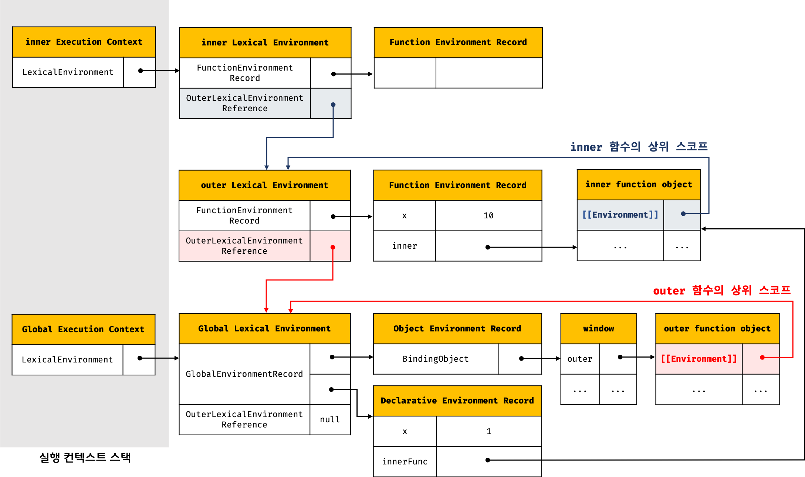
- outer 함수의 실행이 종료되면 outer 함수의 실행 컨텍스트는 스택에서 제거(pop)되어 outer 함수의 지역 변수 x 또한 생명 주기를 마감하는데, 코드 실행 결과 이미 생명 주기가 종료되어 실행 컨텍스트 스택에서 제거된 outer 함수의 지역 변수 x가 다시 부활한 듯이 동작
- 이와 같이 자신을 포함하고 있는 외부 함수보다 **중첩 함수가 더 오래 유지되는 경우 외부 함수 밖에서 중첩 함수를 호출하더라도 외부 함수의 지역 변수에 접근할 수 있는데** 이러한 중첩 함수를 `클로저(closure)`라고 한다
- 자바스크립트의 모든 함수는 자신의 상위 스코프를 기억하기 때문에 모든 함수가 기억하는 상위 스코프는 어디서 호출하든 상관없이 유지됨  
   ⇒ 따라서 함수를 어디서 호출하든 상관없이 함수는 언제나 자신이 기억하는 상위 스코프의 식별자를 참조할 수 있고 식별자에 바인딩된 값을 변경할 수 있음
- 함수는 자신이 평가될 때 자신이 정의된 위치에 의해 결정된 상위 스코프를 [[Environment]] 내부 슬롯에 저장하고, 이때 저장된 상위 스코프는 함수가 존재하는 한 유지됨
- 함수는 호출된 후 실행 종료하면 리턴값을 반환하면서 함수의 생명 주기가 종료되고, 함수의 실행 컨텍스트가 실행 컨텍스트 스택에서 제거되지만 **함수의 렉시컬 환경까지 소멸하는 것은 아님**  
   &#8594; 함수의 렉시컬 환경이 누군가에 의해 참조되고 있으면 가비지 컬렉션의 대상이 되지 않기 때문
- 중첩 함수는 외부 함수의 생존 여부(실행 컨텍스트의 생존 여부)와 상관없이 자신이 정의된 위치에 의해 결정된 상위 스코프를 기억함

- 자바스크립트의 모든 함수는 상위 스코프를 기억하므로 이론적으로는 모든 함수가 클로저이지만, 일반적으로 모든 함수를 다 클로저라고 하지는 않음
   - 상위 스코프의 어떤 식별자도 참조하지 않는 함수는 클로저가 아니다.  
      ```html
      <!DOCTYPE html>
      <html>
      <body>
      <script>
         function foo() {
            const x = 1;
            const y = 2;

            // 일반적으로 클로저라고 하지 않는다.
            function bar() {
            const z = 3;

            debugger;
            // 상위 스코프의 식별자를 참조하지 않는다.
            console.log(z);
            }

            return bar;
         }

         const bar = foo();
         bar();
      </script>
      </body>
      </html>
      ```
   - 중첩 함수가 상위 스코프의 식별자를 참조하고 있더라도 외부 함수보다 일찍 소멸되면 클로저의 본질에 부합하지 않는다.  
      ```html
      <!DOCTYPE html>
      <html>
      <body>
      <script>
         function foo() {
            const x = 1;

            // 일반적으로 클로저라고 하지 않는다.
            // bar 함수는 클로저였지만 곧바로 소멸한다.
            function bar() {
            debugger;
            // 상위 스코프의 식별자를 참조한다.
            console.log(x);
            }
            bar();
         }

         foo();
      </script>
      </body>
      </html>
      ```
- **클로저는 중첩 함수가 상위 스코프의 식별자를 참조하고 있고 중첩 함수가 외부 함수보다 더 오래 유지되는 경우에 한정하는 것이 일반적** 
- 모던 브라우저는 최적화를 통해 상위 스코프의 식별자 중에서 클로저가 참조하고 있는 식별자만을 기억함
- 클로저에 의해 참조되는 상위 스코프의 변수를 **자유 변수(free variable**라고 한다.
- 믈로저(closure) = '함수가 자유 변수에 대해 닫혀있다(closed)' = '자유 변수에 묶여있는 함수'  
```html
<!DOCTYPE html>
<html>
<body>
  <script>
    function foo() {
      const x = 1;
      const y = 2;

      // 클로저
      // 중첩 함수 bar는 외부 함수보다 더 오래 유지되며 상위 스코프의 식별자를 참조한다.
      function bar() {
        debugger;
        console.log(x);
      }
      return bar;
    }

    const bar = foo();
    bar();
  </script>
</body>
</html>
```
### 클로저의 활용
- 클로저는 **상태(state)를 안전하게 변경하고 유지하기 위해 사용**  
   ⇒ 상태가 의도치 않게 변경되지 않도록 상태를 안전하게 **은닉(information hiding)**하고 **특정 함수에게만 상태 변경 허용**  
```jsx
// 카운트 상태 변경 함수
const increase = (function () {
  // 카운트 상태 변수
  let num = 0;

  // 클로저
  return function () {
    // 카운트 상태를 1만큼 증가 시킨다.
    return ++num;
  };
}()); // 즉시 실행 함수는 클로저를 반환하고 소멸됨

console.log(increase()); // 1
console.log(increase()); // 2
console.log(increase()); // 3
```
- 외부 상태 변경이나 가변(mutable) 데이터를 피하고 불변성(immutability)을 지향하는 함수형 프로그래밍에서 부수 효과를 최대한 억제하여 오류를 피하고 프로그램의 안정성을 높이기 위해 클로저가 적극적으로 사용됨

### 캡슐화와 정보 은닉
- `캡슐화(encapsulation)`?   
   객체의 상태(state)를 나타내는 프로퍼티와 프로퍼티를 참조하고 조작할 수 있는 동작(behavior)인 메서드를 하나로 묶는 것   
- `정보 은닉(information hiding)` ?   
   객체의 특정 프로퍼티나 메서드를 감출 목적으로 캡슐화를 이용하는 것  
   ⇒ 외부에 공개할 필요가 없는 구현의 일부를 감추어 적절치 못한 접근으로부터 객체의 상태가 변경되는 것을 방지, 정보 보호, 객체간의 상호 의존성(=`결합도, coupling`)을 낮추는 효과가 있음
- 자바스크립트 객체의 모든 프로퍼티와 메서드는 기본적으로 public하여 외부에 공개되어 있음  
   (대부분의 객체지향 프로그래밍 언어는 클래스를 정의하고 그 클래스를 구성하는 프로퍼티와 메서드에 대하여 public, private, protected 같은 접근 제한자(access modifier)를 선어하여 공개 범위를 한정할 수 있으나 자바스크립트는 접근 제한자를 제공하지 않음)


---
**toString()**
뭐가 이리 많앙... 
- `Object.prototype.toString()`
   - [object type] 반환
- `String.prototype.toString()`
   - Object.prototype.toString()을 상속하지 않음
   - 호출 객체를 나타내는 문자열을 반환
- `Number.prototype.toString()`
   - numObj.toString([radix]) &#8594; numObj를 radix에 입력된 진수로 변환하여 문자열로 반환
   - radix는 옵션 - 지정되지 않으면 10진수로 가정
   - Object 객체의 toString()메소드를 `오버라이딩`함
   - Object.prototype.toString()을 상속받지 않음
