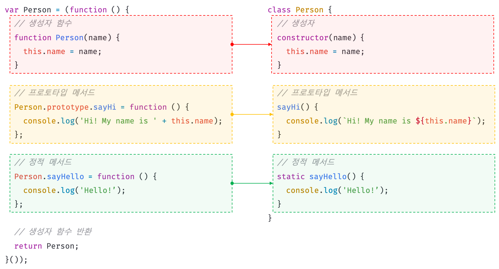
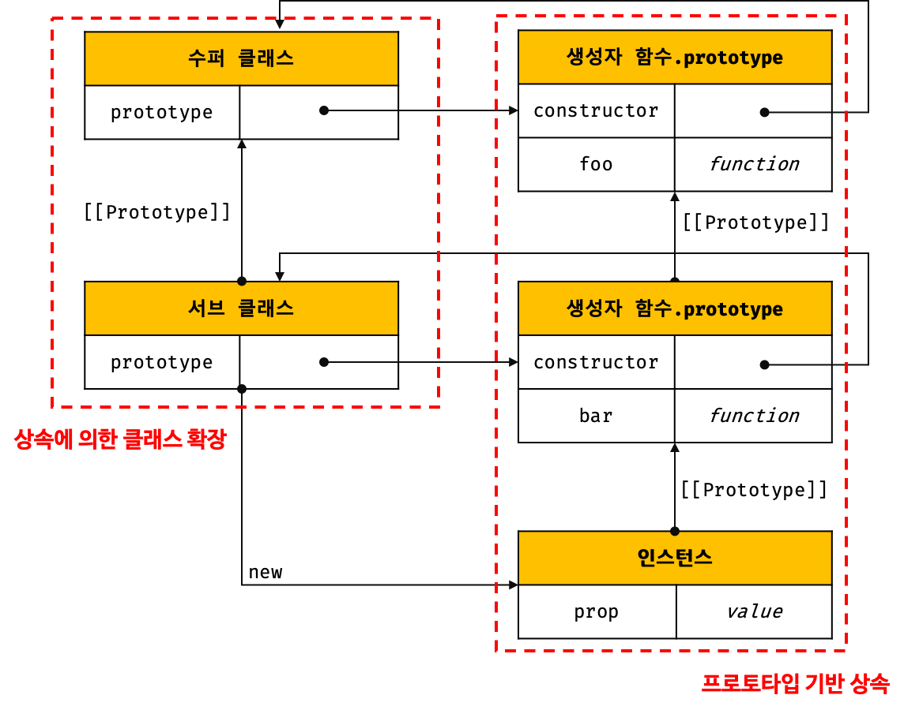
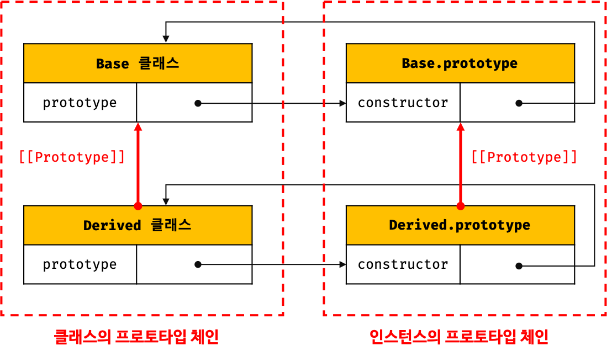

## Chapter 25. 클래스

### 클래스는 프로토타입의 문법적 설탕인가?
- 자바스크립트는 프로토타입 기반(prototype based) 객체지향 언어이다
- 프로토타입 기반 객체지향 언어는 클래스가 필요 없는(class free) 객체지향 프로그래밍 언어
- 클래스를 new 연산자 없이 호출하면 에러 발생
- 클래스는 상속을 지원하는 `extends`와 `super` 키워드를 제공
- 클래스는 호이스팅이 발생하지 않는 것처럼 동작
- 클래스 내의 모든 코드에는 암묵적으로 strict mode가 지정되어 실행 (해제 불가)
- 클래스의 constructor, 프로토타입 메서드, 정적 메서드는 모두 프로퍼티 어트리뷰트 [[Enumerable]]의 값이 `false` &#8594; 열거되지 않음
- 클래스는 새로운 객체 생성 메커니즘

### 클래스 정의 
- 파스칼 케이스를 사용하는 것이 일반적
- 표현식으로 정의하는 것도 가능 (일반적이지는 않음) &#8594; 기명, 무기명 가능
- 클래스는 값으로 사용할 수 있는 `일급 객체`
  - 무명의 리터럴로 생성할 수 있다. 즉, 런타임에 생성이 가능하다.
  - 변수나 자료구조(객체, 배열 등)에 저장할 수 있다.
  - 함수의 매개변수에게 전달할 수 있다.
  - 함수의 반환값으로 사용할 수 있다.
- 클래스 몸체에는 0개 이상의 메서드만 정의할 수 있음 
  1. constructor(생성자)
  2. 프로토타입 메서드
  3. 정적 메서드
- 클래스와 생성자 함수의 정의 방식 비교
  

### 클래스 호이스팅
- 클래스 선언문으로 정의한 클래스는 소스코드 평가 과정(런타임 이전)에 먼저 평가되어 함수 객체 생성
- 클래스가 평가되어 생성된 함수 객체는 생성자 함수로서 호출할 수 있는 함수(constructor)로 프로토타입도 더불어 생성됨 
- 클래스는 클래스 정의 이전에 참조할 수 없음
- 클래스는 let, const 키워드로 선언한 변수처럼 호이스팅됨 (선언문 이전에 일시적 사각지대, TDZ에 빠짐)
- var, let, const, function, function*, class 키워드를 사용하여 선언된 모든 식별자는 호이스팅됨 &#8594; 모든 선언문은 런타임 이전에 먼저 실행되기 때문

### 인스턴스 생성
- 클래스는 생성자 함수이며 new 연산자와 함께 호출되어 인스턴스를 생성
- 클래스는 인스턴스를 생성하는 것이 유일한 존재 이유이므로 반드시 new 연산자와 함께 호출해야 함
- 함수 표현식과 마찬가지로 클래스를 가리키는 식별자로 인스턴스를 생성해야 함
- 클래스 이름은 함수와 동일하게 클래스 몸체 내부에서만 유효한 식별자

### 메서드
1. constructor
  - 인스턴스를 생성하고 초기화하기 위한 특수한 메서드
  - constructor는 이름 변경 불가
  - constructor 내부에서 this에 추가한 프로퍼티는 인스턴스 프로퍼티가 됨
  - constructor 내부의 this는 클래스가 생성한 인스턴스를 가리킴
  - constructor는 메서드로 해석되는 것이 아니라 클래스가 평가되어 생성한 함수 객체 코드의 일부임  
    &#8594; 클래스 정의가 평가되면 constructor의 기술된 동작을 하는 함수 객체가 생성
  - 클래스의 constructor 메서드와 프로토타입의 constructor 프로퍼티는 이름은 같지만 직접적인 관련 없음
  - **constructor는 클래스 내에 최대 한 개만 존재** &#8594; 2개 이상의 constructor를 포함하면 문법 에러(SyntaxError)가 발생
  - constructor를 생략하면 클래스에 `constructor() {}`가 암묵적으로 정의됨 &#8594; 빈 객체 생성
  - 인스턴스를 초기화하려면 constructor를 생략해서는 안 됨 &#8594; constructor 내에서는 인스턴스의 생성과 동시에 인스턴스 프로퍼티 추가를 통해 인스턴스의 초기화를 실행
  - **constructor는 별도의 반환문(return문)을 갖지 않아야 한다** &#8594; new 연산자와 함께 클래스가 호출되면 생성자 함수와 동일하게 암묵적으로 this, 즉 인스턴스를 반환하기 때문
2. 프로토타입 메서드
  - 클래스 몸체에서 정의한 메서드는 생성자 함수에 의한 객체 생성 방식과는 다르게 클래스의 prototype 프로퍼티에 메서드를 추가하지 않아도 기본적으로 프로토타입 메서드가 됨
  - 클래스가 생성한 인스턴스는 프로토타입 체인의 일원
  - 클래스는 생성자 함수와 마찬가지로 프로토타입 기반의 객체 생성 매커니즘
3. 정적 메서드
  - 정적(static) 메서드는 인스턴스를 생성하지 않아도 호출할 수 있는 메서드를 말함
  - 클래스에서는 메서드에 static 키워드를 붙이면 정적 메서드(클래스 메서드)가 됨
  - 정적 메서드는 클래스에 바인딩된 메서드가 됨
  - 클래스는 함수 객체로 평가되므로 자신의 프로퍼티/메서드 소유 가능
  - 정적 메서드는 클래스 정의 이후 인스턴스를 생성하지 않아도 호출할 수 있음
  - 정적 메서드는 클래스로 호출 (인스턴스 없이도 호출 가능)
  - 정적 메서드는 인스턴스로 호출할 수 없음 &#8594; 인스턴스의 프로토타입 체인 상에는 클래스가 존재하지 않기 때문에 인스턴스로 클래스의 메서드를 상속받을 수 없음
4. 정적 메서드와 프로토타입 메서드의 차이 
  - 정적 메서드와 프로토타입 메서드는 자신이 속해 있는 프로토타입 체인이 다르다.
  - 정적 메서드는 클래스로 호출하고 프로토타입 메서드는 인스턴스로 호출한다.
  - 정적 메서드는 인스턴스 프로퍼티를 참조할 수 없지만 프로토타입 메서드는 인스턴스 프로퍼티를 참조할 수 있다.
  - 정적 메서드는 클래스로 호출해야 하므로 정적 메서드 내부의 this는 인스턴스가 아닌 클래스를 가리킴 &#8594; 프로토타입 메서드와 정적 메서드 내부의 this 바인딩이 다름
5. 클래스에서 정의한 메서드의 특징
  - function 키워드를 생략한 메서드 축약 표현을 사용
  - 클래스에 메서드를 정의할 때는 콤마가 필요 없음
  - 암묵적으로 strict 모드 실행
  - 프로퍼티 어트리뷰트 `[[Enumerable]]`의 값이 `false`
  - 내부 메서드 [[Construct]]를 갖지 않는 non-constructor로 new 연산자와 함께 호출할 수 없음

### 클래스의 인스턴스 생성 과정
1. 인스턴스 생성과 this 바인딩
  - 클래스를 호출하면 constructor의 내부 코드가 실행되기에 앞서 암묵적으로 빈 객체가 생성
  - 암묵적으로 생성된 빈 객체, 즉 인스턴스는 this에 바인딩 &#8594; constructor 내부의 this는 클래스가 생성한 인스턴스를 가리킴
2. 인스턴스 초기화
  - constructor의 내부 코드가 실행되어 this에 바인딩되어 있는 인스턴스를 초기화
  - if, constructor가 생략되었다면 이 과정도 생략
3. 인스턴스 반환
  - this가 암묵적으로 반환

### 프로퍼티
1. 인스턴스 프로퍼티 
  - 인스턴스 프로퍼티는 construnctor 내부에서 정의해야 함
  - constructor 내부 코드가 실행되기 이전에 constructor 내부의 this에는 이미 클래스가 암묵적으로 생성한 인스턴스인 빈 객체가 바인딩되어 있음
  - constructor 내부에서 this에 추가한 프로퍼티는 언제나 클래스가 생성한 인스턴스의 프로퍼티가 됨
2. 접근자 프로퍼티 
  - 접근자 프로퍼티(accessor property)는 자체적으로는 값([[Value]] 내부 슬롯)을 갖지 않고 다른 데이터 프로퍼티의 값을 읽거나 저장할 때 사용하는 접근자 함수(accessor function)로 구성된 프로퍼티임
  - 접근자 프로퍼티는 getter 함수와 setter 함수로 구성
  - getter는 이름 그대로 무언가를 취득할 때 사용하므로 반드시 무언가를 반환해야 함
  - setter는 단 하나의 값만 할당받기 때문에 단 하나의 매개변수만 선언할 수 있음
  - 클래스의 메서드는 기본적으로 프로토타입 메서드 &#8594; 클래스의 접근자 프로퍼티 또한 인스턴스 프로퍼티가 아닌 프로토타입의 프로퍼티가 됨
3. 클래스 필드 정의 제안
  - 클래스 필드(class field) ?  
    클래스 필드(또는 멤버)는 클래스 기반 객체지향 언어에서 클래스가 생성할 인스턴스의 프로퍼티를 가리키는 용어
  - 자바스크립트의 클래스 몸체(class body)에는 메서드 만을 선언할 수 있음 &#8594; 클래스 몸체에 클래스 필드를 선언하면 문법 에러(SyntaxError) 발생
  - But, 최신 브라우저(Chrome 72 이상) 또는 최신 Node.js(버전 12 이상)에서는 문법 에러 없이 정상 동작  
  ⇒ 새로운 표준 사양으로 TC39 프로세스의 stage 3(candidate)에 제안되어 있음
  - 클래스 몸체에서 클래스 필드를 정의하는 경우, this에 클래스 필드를 바인딩해서는 안됨 &#8594; this는 클래스의 constructor와 메서드 내에서만 유효
    ```jsx
    class Person {
      // this에 클래스 필드를 바인딩해서는 안된다.
      this.name = ''; // SyntaxError: Unexpected token '.'
    }
    ```
  - 클래스 필드를 참조하는 경우 this 반드시 사용
    ```jsx
    class Person {
      // 클래스 필드
      name = 'Lee';

      constructor() {
        console.log(name); // ReferenceError: name is not defined
        // console.log(this.name); 으로 해줘야 함
      }
    }

    new Person();
    ```
  - 클래스 필드에 초기값을 할당하지 않으면 undefined를 가짐
    ```jsx
    class Person {
      // 클래스 필드를 초기화하지 않으면 undefined를 갖는다.
      name;
    }

    const me = new Person();
    console.log(me); // Person {name: undefined}
    ```
  - 인스턴스를 생성할 때 클래스 필드를 초기화할 필요가 있다면 constructor 밖에서 클래스 필드를 정의할 필요 없음 
  - 함수는 일급 객체이므로 함수를 클래스 필드에 할당할 수 있음 &#8594; 클래스 필드를 통해 메서드를 정의할 수 있음  
  ⇒ 클래스 필드에 함수를 할당하는 경우, 이 함수는 프로토타입 메서드가 아닌 인스턴스 메서드가 되므로 클래스 필드에 함수를 할당하는 것은 권장하지 않음
    ```jsx
    class Person {
      // 클래스 필드에 문자열을 할당
      name = 'Lee';

      // 클래스 필드에 함수를 할당
      getName = function () {
        return this.name;
      }
      // 화살표 함수로 정의할 수도 있다.
      // getName = () => this.name;
    }

    const me = new Person();
    console.log(me); // Person {name: "Lee", getName: ƒ}
    console.log(me.getName()); // Lee
    ```
4. private 필드 정의 제안
  - 인스턴스 프로퍼티는 인스턴스를 통해 클래스 외부에서 언제나 참조할 수 있음 &#8594; 언제나 public
  - 클래스 필드는 기본적으로 public하기 때문에 외부에 그대로 노출
  - private 필드의 선두에는 #을 붙여줌. private 필드를 참조할 때도 #을 붙어주어야 함
  - private 필드는 클래스 내부에서만 참조할 수 있음 
  - 접근자 프로퍼티를 통해 간접적으로 접근하는 방법은 유효함
  - private 필드는 반드시 클래스 몸체에 정의 &#8594; 직접 constructor에 정의하면 SyntaxError 발생

### 상속에 의한 클래스 확장
1. 클래스 상속과 생성자 함수 상속
  - 프로토타입 기반 상속과는 다른 개념으로 **상속에 의한 클래스 확장은 기존 클래스를 상속받아 새로운 클래스를 확장(extends)하여 정의하는 것**
  
  - 클래스는 상속을 통해 다른 클래스를 확장할 수 있는 문법인 `extends` 키워드가 기본적으로 제공
2. extends 키워드
  - 상속을 통해 클래스를 확장하려면 extends 키워드를 사용하여 상속받을 클래스를 정의
    ```jsx
    // 수퍼(파생/부모)클래스
    class Base {}

    // 서브(파생/자식)클래스
    class Derived extends Base {}
    ```
  - `서브클래스(subclass)` : 상속을 통해 확장된 클래스 (=파생 클래스 derived class, 자식 클래스 child class)
  - `수퍼클래스(superclass)` : 서브클래스에게 상속된 클래스 (=베이스 클래스 base class, 부모 클래스 parent class)
  - `extends` 키워드의 역할 &#8594; 수퍼클래스와 서브클래스 간의 상속 관계를 설정하는 것
  - 수퍼클래스와 서브클래스는 인스턴스의 프로토타입 체인 뿐만이 아니라, 클래스 간의 프로토타입 체인도 생성하여 프로토타입 메서드, 정적 메서드 모두 상속이 가능
  
3. 동적 상속
  - extends 키워드는 클래스뿐만 아니라 생성자 함수를 상속받아 클래스를 확장 가능 (단, extends 키워드 앞에는 반드시 클래스가 와야 함)
  - extends 키워드 다음에는 클래스뿐만이 아니라 [[Construct]] 내부 메서드를 갖는 함수 객체로 평가될 수 있는 모든 표현식을 사용할 수 있음
    ```jsx
    function Base1() {}

    class Base2 {}

    let condition = true;

    // 조건에 따라 동적으로 상속 대상을 결정하는 서브클래스
    class Derived extends (condition ? Base1 : Base2) {}

    const derived = new Derived();
    console.log(derived); // Derived {}

    console.log(derived instanceof Base1); // true
    console.log(derived instanceof Base2); // false
    ```
4. 서브 클래스의 constructor
  - 서브클래스에서 constructor를 생략하면 클래스에 다음과 같은 constructor가 암묵적으로 정의  
    ```jsx
    constructor(...args) { super(...args); }
    ```
  - super()는 수퍼클래스의 constructor(super-constructor)를 호출하여 인스턴스를 생성
5. super 키워드
  - super 호출
    - super를 호출하면 수퍼클래스의 constructor(super-constructor)를 호출
    - 수퍼클래스의 constructor 내부에서 추가한 프로퍼티를 그대로 갖는 인스턴스를 생성한다면 서브클래스의 constructor를 생략할 수 있음
    - 수퍼클래스에서 추가한 프로퍼티와 서브클래스에서 추가한 프로퍼티를 갖는 인스턴스를 생성한다면 서브클래스의 constructor를 생략할 수 없음
    - super를 호출할 때 주의 사항
      1. 서브클래스에서 constructor를 생략하지 않는 경우 서브클래스의 constructor에서는 반드시 super를 호출해야 함
      2. 서브클래스의 constructor에서 super를 호출하기 전에는 this를 참조할 수 없음
      3. super는 반드시 서브클래스의 constructor에서만 호출! 서브클래스가 아닌 클래스의 constructor나 함수에서 super를 호출하면 에러 발생
  - super 참조
    - 서브클래스의 프로토타입 메서드 내에서 super.sayHi는 수퍼클래스의 프로토타입 메서드 sayHi를 가리킴
      - super 참조를 통해 수퍼클래스의 메서드를 참조하려면 super가 수퍼클래스의 메서드가 바인딩된 객체, 즉 수퍼클래스의 prototype 프로퍼티에 바인딩된 프로토타입을 참조할 수 있어야 함
      - 이를 위해 메서드는 내부 슬롯 [[HomeObject]]를 가지며, 자신을 바인딩하고 있는 객체를 가리킴
      - `super = Object.getPrototypeOf([[HomeObject]])` &#8594; **메서드 축약 표현으로 정의된 함수만이 [[HomeObject]]를 갖는다**
      - [[HomeObject]]를 가지는 함수만이 super 참조 가능 
      - super 참조는 수퍼클래스의 메서드를 참조하기 위해 사용하므로 서브클래스의 메서드에서 사용해야 함
    - 서브클래스의 정적 메서드 내에서 super.sayHi는 수퍼클래스의 정적 메서드 sayHi를 가리킴
6. 상속 클래스의 인스턴스 생성 과정
  1. 서브클래스의 super 호출
    - 서브클래스는 자신이 직접 인스턴스를 생성하지 않고 수퍼클래스에게 인스턴스 생성을 위임함 &#8594; 이것이 바로 서브클래스의 constructor에서 반드시 super를 호출해야 하는 이유
  2. 수퍼클래스의 인스턴스 생성과 this 바인딩
    - 인스턴스는 수퍼클래스가 생성한 것이지만, new 연산자와 함께 호출된 클래스가 서브클래스라는 것이 중요! 즉, new 연산자와 함께 호출된 함수를 가리키는 `new.target`은 서브클래스를 가리킴
    - 인스턴스는 new.target이 가리키는 서브클래스가 생성한 것으로 처리
  3. 수퍼클래스의 인스턴스 초기화
    - this에 바인딩되어 있는 인스턴스에 프로퍼티를 추가하고 constructor가 인수로 전달받은 초기값으로 인스턴스의 프로퍼티를 초기화
  4. 서브클래스 constructor로의 복귀와 this 바인딩
    - super의 호출이 종료되고 super가 반환한 인스턴스가 this에 바인딩
    - 서브클래스는 별도의 인스턴스를 생성하지 않고 super가 반환한 인스턴스를 this에 바인딩하여 그대로 사용
  5. 서브클래스의 인스턴스 초기화
  6. 인스턴스 반환


