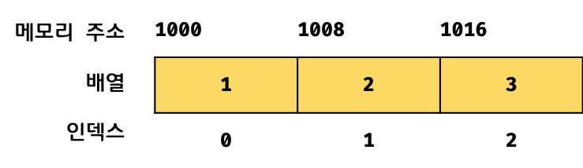

## Chapter 27. 배열

### 배열(array)이란?
- 여러 개의 값을 순차적으로 나열한 자료 구조
- 사용 빈도가 매우 높은 가장 기본적인 자료구조
- 배열이 가지고 있는 값 = 요소(element)
  - 자바스크립트의 모든 값은 배열의 요소가 될 수 있음 
  - 원시값, 객체, 함수, 배열 등 
- 인덱스(index) = 배열에서 자신의 위치를 나타내는 0 이상의 정수 
  - 배열의 요소에 접근할 때 사용
  - 프로그래밍 언어에서 인덱스는 1이 아닌 0부터 시작!
- 배열은 배열의 길이(요소의 개수)를 나타내는 length 프로퍼티를 가짐
  - 그렇기 때문에 for문을 통해 요소를 순회할 수 있음
- 배열은 객체 타입
  - `typeof array === object`
- 배열 리터럴, Array 생성자 함수, Array.of, Array.from 메서드로 생성 가능
  - 배열의 생성자 함수는 Array, 프로포타입 객체는 Array.prototype
- 배열 vs 일반 객체  
  | 구분 | 객체 | 배열 |
  | :---: | :---: | :---: |
  | 구조 | 프로퍼티 키와 프로퍼티 값 | 인덱스와 요소 |
  | 값의 참조 | 프로퍼티 키 | 인덱스 |
  | 값의 순서 | X | O |
  | length 프로퍼티 | X | O |

### 자바스크립트 배열은 배열이 아니다
- 자료 구조(data structure)에서 말하는 배열은 동일한 크기의 메모리 공간이 빈틈없이 연속적으로 나열된 자료 구조   
  &#8594; 밀집 배열(dense array) : 배열의 요소는 하나의 데이터 타입으로 통일되어 있고, 연속적으로 인접
  
- 임의 접근 : random access, 시간 복잡도 O(1)
- 선형 검색 : linear search, 시간 복잡도 O(n)
  ```jsx
  // 선형 검색으로 배열에 특정 요소(target) 존재 여부 확인
  // target 있으면 인덱스 반환, 없으면 -1 반환
  function linearSearch(array, target) {
    const length = array.length;

    for (let i = 0; i < length; i++) {
      if (array[i] === target) return i;
    }

    return -1;
  }

  console.log(linearSearch([1, 2, 3, 4, 5, 6], 3)); // 2
  console.log(linearSearch([1, 2, 3, 4, 5, 6], 0)); // -1
  ```
- 자바스크립트의 배열은 요소를 위한 각각의 메모리 공간이 동일한 크기를 갖지 않아도 되고, 연속적으로 이어져 있지 않아도 됨 
  - 희소 배열(sparse array) : 배열의 요소가 연속적으로 이어져 있지 않은 배열
  - js의 배열은 일반적인 배열의 동작을 흉내낸 특수한 객체
  - js 배열의 요소는 프로퍼티 값 &#8594; 어떤 타입의 값이라도 배열의 요소가 될 수 있음
- js 배열은 해시 테이블로 구현된 객체이므로 인덱스로 요소에 접근하는 경우 일반적인 배열보다 성능적인 면에서 느리지만, 특정 요소를 검색하거나 요소를 삽입 또는 삭제하는 경우 일반 배열보다 빠르다
  ```jsx
  const arr = [];

  console.time('Array Performance Test');

  for (let i = 0; i < 1000000; i++) {
    arr[i] = i;
  }
  console.timeEnd('Array Performance Test');
  // 약 340ms

  const obj = {};

  console.time('Object Performance Test');

  for (let i = 0; i < 10000000; i++) {
    obj[i] = i;
  }

  console.timeEnd('Object Performance Test');
  // 약 600ms
  ```

### length 프로퍼티와 희소 배열
- length 프로퍼티의 값은 배열에 요소를 추가하거나 삭제하면 자동 갱신
  ```jsx
  const arr = [1, 2, 3];
  console.log(arr.length); // 3

  // 요소 추가 push
  arr.push(4);
  // 요소 추가하면 length 프로퍼티 값 자동 갱신
  console.log(arr.length); // 4

  // 요소 삭제 pop
  arr.pop(); // 마지막 요소가 삭제되나봄? 삭제하고 arr 콘솔 찍어보면 1,2,3 나옴
  // 요소 삭제하면 length 값 자동 갱신
  console.log(arr.length); // 3
  ```
- length 프로퍼티 값 임의로 지정 가능 
  ```jsx
  const arr = [1, 2, 3, 4, 5];

  // 현재 length 프로퍼티 값보다 작은 값 할당
  arr.length = 3; 

  // 배열의 길이가 줄어듬
  console.log(arr); // [1, 2, 3]
  
  const arr1 = [1];

  // 현재 length 프로퍼티 값보다 큰 값을 할당
  arr1.length = 3;

  // length 프로퍼티 값은 변경되지만 실제로 배열의 길이가 늘어나지는 않음
  console.log(arr1.length); // 3
  console.log(arr1); // [ 1, <2 empty items> ]

  console.log(Object.getOwnPropertyDescriptors(arr1));
  /*
  {
    '0': { value: 1, writable: true, enumerable: true, configurable: true },
    length: { value: 3, writable: true, enumerable: false, configurable: false }
  }
  */
  ```
- 배열의 요소가 연속적으로 위치하지 않고 일부가 비어 있는 **희소 배열**을 자바스크립트는 문법적으로 허용함
  ```jsx
  // 희소 배열
  const sparse = [, 2, , 4];

  // 희소 배열의 length 프로퍼티 값은 요소의 개수와 일치하지 않음
  console.log(sparse.length); // 4
  console.log(sparse); // [ <1 empty item>, 2, <1 empty item>, 4 ]

  // 배열 sparse에는 인덱스가 0, 2인 요소 존재 X
  console.log(Object.getOwnPropertyDescriptors(sparse));
  /*
  {
    '1': { value: 2, writable: true, enumerable: true, configurable: true },
    '3': { value: 4, writable: true, enumerable: true, configurable: true },
    length: { value: 4, writable: true, enumerable: false, configurable: false }
  }
  */
  ```
- 희소 배열은 length와 배열 요소의 개수가 일치하지 않음 &#8594; 희소 배열의 length는 희소 배열의 실제 요소 개수보다 언제나 큼
- 희소 배열은 사용하지 않는 것이 좋음 
- 배열에는 같은 타입의 요소를 연속적으로 위치시키는 것이 최선

### 배열 생성
1. 배열 리터럴
  - 가장 일반적이고 간편한 방법
  - 프로퍼티 키가 없고 값만 존재 
  - 요소 추가하지 않으면 length 프로퍼티 값이 0인 빈 배열
  - 요소 생략하면 희소 배열 생성
  ```jsx
  const arr = [1, 2, 3];
  console.log(arr.length); // 3

  const arr1 = [];
  console.log(arr.length); // 0

  const arr2 = [1, , 3]; // 희소 배열

  // 희소 배열의 length는 언제나 실제 요소 개수보다 큼
  console.log(arr2.length); // 3
  console.log(arr2); // [ 1, <1 empty item>, 3 ]
  console.log(arr2[1]); // undefined
  ```
2. Array 생성자 함수
  - 전달된 인수의 개수에 따라 다르게 동작
  ```jsx
  // 전달된 인수가 한 개이고 숫자인 경우,
  const arr = new Array(10);

  console.log(arr); // [ <10 empty items> ]
  console.log(arr.length); // 10

  // 이때 생성된 배열은 희소 배열 - length는 10이지만 배열의 요소 존재 X
  console.log(Object.getOwnPropertyDescriptors(arr));
  /*
  {
    length: {value: 10, writable: true, enumerable: false, configurable: false}
  }
  */
  ```
  - 배열은 요소를 최대 2의 32승 – 1(4,294,967,295)개 가질수 있으나 이 범위를 벗어나면 `RangeError` 발생 
  ```jsx
  // 전달된 인수가 0 ~ 4,294,967,295를 벗어나면 RangeError가 발생한다.
  new Array(4294967296); // RangeError: Invalid array length

  // 전달된 인수가 음수이면 에러가 발생한다.
  new Array(-1); // RangeError: Invalid array length
  ```
- 전달된 인수 없는 경우 빈 배열 생성 
- 전달된 인수 2개 이상 또는 숫자가 아닌경우 인수를 요소로 갖는 배열 생성
  ```jsx
  new Array(); // -> []

  new Array(1, 2, 3); // -> [1, 2, 3]

  // 숫자가 아닌 경우
  new Array({}) // -> [{}]
  ```
- Array 생성자 함수는 new 연산자와 함께 호출하지 않더라도 배열을 생성하는 함수로 동작  
  &#8594; Array 생성자 함수 내부에서 new.target을 확인하기 때문
  ```jsx
  Array(1, 2, 3); // -> [1, 2, 3]
  ```

3. Array.of
  - ES6에서 도입된 메서드로 전달된 인수를 요소로 갖는 배열을 생성
  - Array 생성자 함수와 다르게 전달된 인수가 1개이고 숫자이더라도 인수를 요소로 갖는 배열 생성
  ```jsx
  Array.of(1); // -> [1]

  Array.of(1, 2, 3); // -> [1, 2, 3]

  Array.of('string'); // -> ['string']
  ```

4. Array.from
  - ES6에서 도입된 메서드로 유사 배열 객체(array-like object) 또는 이터러블 객체(iterable object)를 인수로 전달받아 배열로 변환하여 반환
  ```jsx
  // 유사 배열 객체
  Array.from({length: 2, 0: 'a', 1: 'b'}); // -> ['a', 'b']

  // 이터러블
  Array.from('Hello'); // -> ['H', 'e', 'l', 'l', 'o']
  ```
  - 두 번째 인수로 전달한 콜백 함수를 통해 값을 만들면서 요소 채울 수 있음
    - 두 번째 인수로 전달한 콜백 함수에 첫 번째 인수에 의해 생성된 배열의 요소값과 인덱스를 순차적으로 전달하면서 호출하고, 콜백 함수의 반환값으로 구성된 배열을 반환
  ```jsx
  // length만 존재하는 유사 배열 객체 전달하면 undefined로 채움
  Array.from({ length: 3 }); // -> [undefined, undefined, undefined]

  // 두 번째 인수로 전달한 콜백 함수의 반환값으로 구성된 배열을 반환
  Array.from({ length: 3}, (_, i) => i); // -> [0, 1, 2]
  ```
5. 배열 요소의 참조
  - 배열의 요소를 참조할 때에는 대괄호`[]` 표기법 사용하며, 대괄호 안에는 인덱스 
  - 정수로 평가되는 표현식이라면 인덱스 대신 사용 가능
  - 인덱스는 값을 참조할 수 있다는 의미에서 객체의 프로퍼티 키와 같은 역할
  - 존재하지 않는 요소에 접근하면 undefined 반환
  ```jsx
  const arr = [1, 2];

  // 인덱스가 0인 요소 참조
  console.log(arr[0]); // 1
  // 인덱스가 1인 요소 참조
  console.log(arr[1]); // 2

  // 인덱스가 2인 요소 참조 - 존재하지 않음
  console.log(arr[2]); // undefined
  ```
  - 희소 배열의 존재하지 않는 요소를 참조해도 undefined 반환
  ```jsx
  // 희소 배열
  const arr = [1, , 3];

  // 배열 arr에는 인덱스가 1인 요소가 존재하지 않는다.
  console.log(Object.getOwnPropertyDescriptors(arr));
  /*
  {
    '0': {value: 1, writable: true, enumerable: true, configurable: true},
    '2': {value: 3, writable: true, enumerable: true, configurable: true},
    length: {value: 3, writable: true, enumerable: false, configurable: false}
  */

  // 존재하지 않는 요소를 참조하면 undefined가 반환된다.
  console.log(arr[1]); // undefined
  console.log(arr[3]); // undefined
  ```

### 배열 요소의 추가와 갱신
- 배열에도 요소 동적 추가 가능 &#8594; 존재하지 않는 인덱스를 사용해 값을 할당 
- 배열의 length보다 큰 인덱스에 요소를 추가하면 희소 배열이 됨 &#8594; 명시적으로 값을 할당하지 않은 요소는 생성되지 않음
- 이미 요소가 존재하는 요소에 값을 재할당하면 요소값이 갱신됨
  ```jsx
  const arr = [0];

  // 배열 요소 추가
  arr[1] = 1;

  console.log(arr); // [0, 1]
  console.log(arr.length); // 22

  // length 보다 큰 인덱스로 요소 추가
  arr[100] = 100;

  console.log(arr); // [0, 1, <98 empty items>, 100]
  console.log(arr.length); // 101

  // 명시적으로 값을 할당하지 않은 요소는 생성되지 않는다.
  console.log(Object.getOwnPropertyDescriptors(arr));
  /*
  {
    '0': {value: 0, writable: true, enumerable: true, configurable: true},
    '1': {value: 1, writable: true, enumerable: true, configurable: true},
    '100': {value: 100, writable: true, enumerable: true, configurable: true},
    length: {value: 101, writable: true, enumerable: false, configurable: false}
  */

  // 요소값 갱신
  arr[1] = 10;

  console.log(arr); // [0, 10, <98 empty items>, 100]
  ```
- 인덱스는 요소의 위치를 나타내므로 반드시 0 이상의 정수(또는 정수 형태의 문자열)를 사용해야 함  
  &#8594; 정수 이외의 값을 인덱스처럼 사용하면 요소가 생성되는 것이 아니라 프로퍼티가 생성  
  &#8594; 이때 추가된 프로퍼티는 length 프로퍼티 값에 영향 주지 않음
  ```jsx
  const arr = [];

  // 배열 요소 추가
  arr[0] = 1;
  arr['1'] = 2;

  // 프로퍼티 추가
  arr['foo'] = 3;
  arr.bar = 4;
  arr[1.1] = 5;
  arr[-1] = 6;

  console.log(arr); // [1, 2, foo: 3, bar: 4, '1.1': 5, '-1': 6]

  // 프로퍼티는 length에 영향 X
  console.log(arr.length); // 2
  ```

### 배열 요소의 삭제
- delete 연산자 사용 가능.. but, 배열이 희소 배열이 되고 length 값은 변하지 않음
```jsx
const arr = [1, 2, 3];

// 배열 요소 삭제
delete arr[1];
console.log(arr); // [ 1, <1 empty item>, 3 ]

// length 프로퍼티에 영향을 주지 않음 -> 희소 배열 됨
console.log(arr.length); // 3
```
- 희소 배열을 만들지 않으면서 배열의 특정 요소를 완전히 삭제하려면 `Array.prototype.splice` 메서드를 사용
```jsx
const arr = [1, 2, 3];

// Array.prototype.splice(삭제를 시작할 인덱스, 삭제할 요소 수)
// arr[1]부터 1개의 요소 제거
arr.splice(1, 1);
console.log(arr); // [1, 3]

// length 프로퍼티 자동 갱신
console.log(arr.length); // 2
```
