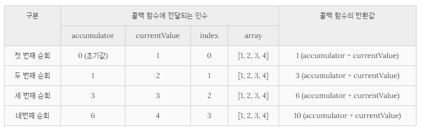

## Chapter 27. 배열

### 배열 고차 함수
- `고차 함수(Higher-Order Function, HOF)` : 함수를 인수로 전달받거나 함수를 반환하는 함수
- 고차함수는 외부 상태의 변경이나 가변(mutable) 데이터를 피하고 불변성(immutability)을 지향하는 함수형 프로그래밍에 기반을 둠 
- 함수형 프로그래밍  
  - 순수 함수(pure function)와 보조 함수의 조합을 통해 로직 내에 존재하는 조건문과 반복문을 제거하여 복잡성을 해결하고 변수의 사용을 억제하여 상태 변경을 피하려는 프로그래밍 패러다임
  - 순수 함수를 통해 부수 효과를 최대한 억제하여 오류를 피하고 프로그램의 안정성을 높이려는 노력의 일환

1. Array.prototype.sort
  - 오름차순(ascending)으로 요소 정렬하여 정렬된 배열 반환
  - 원본 배열 직접 변경
  - 내림차순(descending)으로 정렬 원할 시, sort 메서드 사용하여 오름차순으로 정렬해준 후, reverse 메서드를 사용하여 요소의 순서 뒤집으면 됨
  - 숫자 요소로 이루어진 배열 정렬시에는 주의!  
    - 의도대로 정렬되지 않음
  ```jsx
  const points = [40, 100, 1, 5, 2, 25, 10];

  points.sort();
  console.log(points); // [1, 10, 100, 2, 25, 40, 5]
  ```
    - 배열의 요소를 일시적으로 문자열로 변환한 후 유니코드 코드 포인트의 순서를 기준으로 정렬하기 때문임
    - 숫자 요소를 정렬할 때에는 **정렬 순서를 정의하는 비교 함수를 인수로 전달**해야 함
    - 비교 함수는 양수나 음수 또는 0을 반환해야 함

  > 숫자랑 객체 예제.. 전혀 모르겠는데...........?

2. Array.prototype.forEach
  - for문을 대체할 수 있는 고차 함수
  - 자신의 내부에서 반복문 실행 &#8594; 반복문을 추상화한 고차 함수로서 내부에서 반복문을 통해 자신을 호출한 배열을 순회하면서 수행해야할 처리를 콜백 함수로 전달받아 반복 호출
  ```jsx
  const numbers = [1, 2, 3];
  let pows = [];

  // numbers 배열의 요소 3개이므로 콜백 함수 3번 호출
  numbers.forEach(item => pows.push(item ** 2));
  console.log(pows); // [1, 4, 9]
  ```
  - 콜백 함수를 호출할 때 forEach 메서드를 호출한 배열의 요소값과 인덱스, forEach 메서드를 호출한 배열(this)을 순차적으로 전달
  - 원본 배열(this) 변경하지 않지만, 콜백 함수를 통해 원본 배열을 변경할 수는 있음
  - forEach 메서드의 반환값은 언제나 `undefined`
  - forEach 메서드의 콜백 함수 내부의 this와 외부 메서드의 this를 일치시키려면 forEach 메서드의 두 번째 인수로 콜백 함수 내부에서 this로 사용할 객체 전달 &#8594; 아니면 **화살표 함수** 사용
  ```jsx
  class Numbers {
    numberArray = [];

    multiply(arr) {
      arr.forEach(function (item) {
        this.numberArray.push(item * item);
      }, this);
    }
    /* 화살표 함수로 표현
    multiply(arr) {
      arr.forEach(item => this.numberArray.push(item * item));
    }
    */
  }

  const numbers = new Numbers();
  numbers.multiply([1, 2, 3]);
  console.log(numbers.numberArray); // [1, 4, 9]
  ```
  - forEach 메서드도 내부에서는 반복문을 통해 배열을 순회하는데, 반복문을 메서드 내부로 은닉하여 로직의 흐름을 이해하기 쉽고 복잡하지 않음
  - for문과는 달리 break, continue문 사용 불가 &#8594; 배열의 모든 요소를 빠짐없이 모두 순회함, 중간에 순회 중단하지 못함
  - 희소 배열의 경우 존재하지 않는 요소는 순회 대상에서 제외
  - forEach 메서드는 for 문에 비해 성능이 좋지는 않지만 가독성은 Good! 
  - 복잡한 코드 또는 높은 성능이 필요한 경우가 아니라면 for 문 대신 forEach 메서드를 사용 추천
  - 단순히 반복문을 대체하기 위한 고차 함수
3. Array.prototype.map
  - 자신을 호출한 배열의 모든 요소를 순회하면서 인수로 전달받은 콜백 함수를 반복 호출
  - 콜백 함수의 반환값들로 구성된 새로운 배열을 반환 (원본 배열은 변경되지 않음, accessor)
  - 요소값을 다른 값으로 매핑(mapping)한 새로운 배열을 생성하기 위한 고차 함수
  - map 메서드가 생성하여 반환하는 새로운 배열의 length 프로퍼티 값은 map 메서드를 호출한 배열의 length 프로퍼티 값과 반드시 일치!! &#8594; map 메서드를 호출한 배열과 map 메서드가 생성하여 반환한 배열은 1:1매핑(mapping)함
  - map 메서드는 콜백 함수를 호출할 때 3개의 인수, 즉 map 메서드를 호출한 배열의 요소값(v)과 인덱스(i), map 메서드를 호출한 배열 자체(arr), 즉 this를 순차적으로 전달함
  - 두 번째 인수로 map 메서드의 콜백 함수 내부에서 this로 사용할 객체를 전달할 수 있음
  ```jsx
  class Prefixer {
    constructor(prefix) {
      this.prefix = prefix;
    }

    add(arr) {
      return arr.map(function (item) {
        // 외부에서 this를 전달하지 않으면 this는 undefined
        return this.prefix + item;
      }, this); // map 메서드의 콜백 함수 내부에서 this로 사용할 객체를 전달
    }
    /* 화살표 함수로 표현
    add(arr) {
      return arr.map(item => this.prefix + item);
    }
    */
  }

  const prefixer = new Prefixer('-webkit-');
  console.log(prefixer.add(['transition', 'user-select']));
  // ['-webkit-transition', '-webkit-user-select']
  ```
4. Array.prototype.filter
  - 자신을 호출한 배열의 모든 요소를 순회하면서 인수로 전달받은 콜백 함수를 반복 호출
  - 콜백 함수의 반환값이 true인 요소로만 구성된 새로운 배열 반환 (원본 배열 변경X, accessor)
  ```jsx
  const numbers = [1, 2, 3, 4, 5];

  // filter 메서드는 numbers 배열의 모든 요소를 순회하면서 콜백 함수를 반복 호출
  // 그리고 콜백 함수의 반환값이 true인 요소로만 구성된 새로운 배열을 반환
  // 다음의 경우 numbers 배열에서 홀수인 요소만을 필터링(1은 true로 평가)
  const odds = numbers.filter(item => item % 2);
  console.log(odds); // [1, 3, 5]
  ```
  - 자신을 호출한 배열에서 필터링 조건을 만족하는 특정 요소만 추출하여 새로운 배열을 만들고 싶을 때 사용
  - filter 메서드가 생성하여 반환한 새로운 배열의 length 프로퍼티 값은 filter 메서드를 호출한 배열의 length 프로퍼티 값과 같거나 작음
  - 콜백 함수를 호출할 때 3개의 인수, 즉 filter 메서드를 호출한 배열의 요소값과 인덱스, filter 메서드를 호출한 배열(this)을 순차적으로 전달
  - 두 번째 인수로 filter 메서드의 콜백 함수 내부에서 this로 사용할 객체를 전달할 수 있음
  - 자신을 호출한 배열에서 특정 요소를 제거하기 위해 사용할 수도 있음
  - filter 메서드를 사용해 특정 요소를 제거할 경우 특정 요소가 중복되어 있다면 중복된 요소가 모두 제거 &#8594; 특정 요소 하나만 제거하려면 indexOf 메서드 통해 특정 요소의 인덱스 취득 후 splice 메서드 사용
5. Array.prototype.reduce
  - 자신을 호출한 배열을 모든 요소를 순회하며 인수로 전달받은 콜백 함수를 반복 호출
  - 콜백 함수의 반환값을 다음 순회 시에 콜백 함수의 첫 번째 인수로 전달하면서 콜백 함수를 호출하여 하나의 결과값을 만들어 반환
  - 원본 배열 변경 X
  -  첫 번째 인수로 콜백 함수, 두 번째 인수로 초기값 &#8594; 두 번째 인수인 초기값은 옵션이지만, reduce 메서드를 호출할 때는 언제나 초기값을 전달하는 것이 안전!
  - 콜백 함수에는 4개의 인수, 초기값 또는 콜백 함수의 이전 반환값, reduce 메서드를 호출한 배열의 요소값과 인덱스, reduce 메서드를 호출한 배열 자체, 즉 this가 전달
  ```jsx
  // 모든 요소의 누적 구하기
  const sum = [1, 2, 3, 4].reduce((accumulator, currentValue, index, array) => accumulator + currentValue, 0);

  console.log(sum); // 10
  ```
  
  - 초기값과 배열의 첫 번째 요소값을 콜백 함수에게 인수로 전달하면서 호출하고 다음 순회에는 콜백 함수의 반환값과 두 번째 요소값을 콜백 함수의 인수로 전달하면서 호출
6. Array.prototype.some
  - 자신을 호출한 배열의 요소를 순회하면서 인수로 전달된 콜백 함수를 호출
  - 콜백 함수의 반환값이 단 한 번이라도 참이면 true, 모두 거짓이면 false를 반환 &#8594; 배열의 요소 중에 콜백 함수를 통해 정의한 조건을 만족하는 요소가 1개 이상 존재하는지 확인하여 그 결과를 불리언 타입으로 반환
  - some 메서드를 호출한 배열이 빈 배열인 경우 언제나 false를 반환
  - some 메서드를 호출한 요소값과 인덱스, some 메서드를 호출한 배열 자체, 즉 this를 순차적으로 전달받을 수 있음
7. Array.prototype.every
  - 자신을 호출한 배열의 요소를 순회하면서 인수로 전달된 콜백 함수를 호출
  - 콜백 함수의 반환값이 모두 참이면 true, 단 한 번이라도 거짓이면 false를 반환 &#8594; 배열의 모든 요소가 콜백 함수를 통해 정의한 조건을 모두 만족하는지 확인하여 그 결과를 불리언 타입으로 반환
  - every 메서드를 호출한 배열이 빈 배열인 경우 언제나 true를 반환
  - every 메서드의 콜백 함수는 every 메서드를 호출한 요소값과 인덱스, every 메서드를 호출한 배열 자체, 즉 this를 순차적으로 전달받을 수 있음
8. Array.prototype.find
  - ES6에서 도입
  - 자신을 호출한 배열의 요소를 순회하면서 인수로 전달된 콜백 함수를 호출하여 반환값이 true인 첫 번째 **요소**를 반환 &#8594; find의 결과값은 배열이 아닌 해당 요소값
  - 콜백 함수의 반환값이 true인 요소가 존재하지 않는다면 `undefined` 반환
  - find 메서드의 콜백 함수는 find 메서드를 호출한 요소값과 인덱스, find 메서드를 호출한 배열 자체, 즉 this를 순차적으로 전달받을 수 있음
9. Array.prototype.findIndex
  - ES6에서 도입
  - 자신을 호출한 배열의 요소를 순회하면서 인수로 전달된 콜백 함수를 호출하여 반환값이 true인 첫 번째 요소의 **인덱스**를 반환
  - 콜백 함수의 반환값이 true인 요소가 존재하지 않는다면 `-1`을 반환
  - findIndex 메서드의 콜백 함수는 findIndex 메서드를 호출한 요소값과 인덱스, findIndex 메서드를 호출한 배열 자체, 즉 this를 순차적으로 전달받을 수 있음
  ```jsx
  const users = [
    { id: 1, name: 'Lee' },
    { id: 2, name: 'Kim' },
    { id: 2, name: 'Choi' },
    { id: 3, name: 'Park' }
  ];

  // id가 2인 요소의 인덱스를 구한다.
  users.findIndex(user => user.id === 2); // -> 1

  // name이 'Park'인 요소의 인덱스를 구한다.
  users.findIndex(user => user.name === 'Park'); // -> 3

  // 위와 같이 프로퍼티 키와 프로퍼티 값으로 요소의 인덱스를 구하는 경우 다음과 같이 콜백 함수를 추상화할 수 있다.
  function predicate(key, value) {
    // key와 value를 기억하는 클로저를 반환
    return item => item[key] === value;
  }

  // id가 2인 요소의 인덱스를 구한다.
  users.findIndex(predicate('id', 2)); // -> 1

  // name이 'Park'인 요소의 인덱스를 구한다.
  users.findIndex(predicate('name', 'Park')); // -> 3
  ```
10. Array.prototype.flatMap
  - ES10에서 도입
  - map 메서드를 통해 생성된 새로운 배열을 평탄화 &#8594; map 메서드와 flat 메서드를 순차적으로 실행하는 효과
  - But,  **1단계만 평탄화** &#8594; map 메서드를 통해 생성된 중첩 배열의 평탄화 깊이를 지정해야 하면 flatMap 메서드를 사용하지 말고 map 메서드와 flat 메서드를 각각 호출 

---

## Chapter 28. Number

### Number 생성자 함수
- 표준 빌트인 객체(standard built-in object)인 `Number` 객체는 생성자 함수 객체로 `new` 연산자와 함께 호출하여 Number 인스턴스를 생성할 수 있음
- Number 생성자 함수에 **인수를 전달하지 않고** new 연산자와 함께 호출하면 `[[NumberData]]` 내부 슬롯에 0을 할당한 Number 래퍼 객체를 생성
- Number 생성자 함수의 인수로 **숫자를 전달**하면서 new 연산자와 함께 호출하면 `[[NumberData]]` 내부 슬롯에 인수로 전달받은 숫자를 할당한 Number 래퍼 객체를 생성
- 
```jsx
const numObj = new Number();
console.log(numObj); // Number {[[PrimitiveValue]]: 0}
// ES5에서 [[NumberData]]를 [[PrimitiveValue]]라고 불렀음

const numObj = new Number(10);
console.log(numObj); // Number {[[PrimitiveValue]]: 10}
```
- Number 생성자 함수의 인수로 **숫자가 아닌 값**을 전달하면 인수를 숫자로 강제 변환한 후, `[[NumberData]]` 내부 슬롯에 변환된 숫자를 할당한 Number 래퍼 객체를 생성
```jsx
let numObj = new Number('10');
console.log(numObj); // Number {[[PrimitiveValue]]: 10}

numObj = new Number('Hello');
console.log(numObj); // Number {[[PrimitiveValue]]: NaN}
```

### Number 프로퍼티
1. Number.EPSILON
  - ES6에서 도입
  - 1과 1보다 큰 숫자 중에서 가장 작은 숫자와의 차이 : 약 2.2204460492503130808472633361816 x 10의 -16승
  - 부동소수점으로 인해 발생하는 오차를 해결하기 위해 사용 
2. Number.MAX_VALUE
  - 자바스크립트에서 표현할 수 있는 가장 큰 양수 값(1.7976931348623157 x 10의 308승)
  - Number.MAX_VALUE보다 큰 숫자는 Infinity
3. Number.MIN_VALUE
  - 자바스크립트에서 표현할 수 있는 가장 작은 양수 값(5 x 10의 -324승)
  - Number.MIN_VALUE보다 작은 숫자는 0
4. Number.MAX_SAFE_INTEGER
  - 안전하게 표현할 수 있는 가장 큰 정수값(9007199254740991)
5. Number.MIN_SAFE_INTEGER
  - 안전하게 표현할 수 있는 가장 작은 정수값(-9007199254740991)
6. Number.POSITIVE_INFINITY
  - 양의 무한대를 나타내는 숫자 값 Infinity와 같음
7. Number.NEGATIVE_INFINITY
  - 음의 무한대를 나타내는 숫자 값 -Infinity와 같음
8. Number.NaN
  - 숫자가 아님(Not-a-Number)을 나타내는 숫자 값
  - Number.NaN은 window.NaN과 같음

### Number 메서드
1. Number.isFinite
  - ES6에서 도입
  - 인수로 전달된 숫자 값이 정상적인 유한수, 즉 `Infinity` 또는 `-Infinity`가 아닌지 검사하여 그 결과를 불리언 값으로 반환
  - if, 인수가 NaN이면 언제나 false를 반환
  ```jsx
  // 인수가 정상적인 유한수이면 true를 반환한다.
  Number.isFinite(0);                // -> true
  Number.isFinite(Number.MAX_VALUE); // -> true
  Number.isFinite(Number.MIN_VALUE); // -> true

  // 인수가 무한수이면 false를 반환한다.
  Number.isFinite(Infinity);  // -> false
  Number.isFinite(-Infinity); // -> false

  Number.isFinite(NaN); // -> false
  ```
  - 빌트인 전역 함수 `isFinite`는 전달받은 인수를 숫자로 암묵적 타입 변환하여 검사를 수행하지만 `Number.isFinite`는 전달받은 인수를 숫자로 암묵적 타입 변환하지 않음!
  - **숫자가 아닌 인수가 주어졌을 때 반환값은 언제나 false** (ex, null)
2. Number.isInteger
  - ES6에서 도입
  - 인수로 전달된 숫자값이 정수(integer)인지 검사하여 그 결과를 불리언 값으로 반환
  - 인수를 숫자로 암묵적 타입 변환하지 않음
  ```jsx
  // 인수가 정수이면 true를 반환한다.
  Number.isInteger(0)     // -> true
  Number.isInteger(123)   // -> true
  Number.isInteger(-123)  // -> true

  // 0.5는 정수가 아니다.
  Number.isInteger(0.5)   // -> false
  // '123'을 숫자로 암묵적 타입 변환하지 않는다.
  Number.isInteger('123') // -> false
  // false를 숫자로 암묵적 타입 변환하지 않는다.
  Number.isInteger(false) // -> false
  // Infinity/-Infinity는 정수가 아니다.
  Number.isInteger(Infinity)  // -> false
  Number.isInteger(-Infinity) // -> false
  ```
3. Number.isNaN
  - ES6에서 도입
  - 인수로 전달된 숫자값이 NaN인지 검사하여 그 결과를 불리언 값으로 반환
  - 빌트인 전역 함수 isNaN은 전달받은 인수를 숫자로 암묵적 타입 변환하여 검사를 수행하지만 Number.isNaN 메서드는 전달받은 인수를 숫자로 암묵적 타입 변환하지 않음
  - **숫자가 아닌 인수가 주어졌을 때 반환값은 언제나 false** (ex, undefined)
4. Number.isSafeInteger
  - ES6에서 도입
  - 인수로 전달된 숫자값이 안전한 정수인지 검사하여 그 결과를 불리언 값으로 반환
  - 암묵적 타입 변환 X
  - 안전한 정수값은 -(2의 53승 - 1)와 2의 53승 - 1 사이의 정수값
  ```jsx
  // 0은 안전한 정수이다.
  Number.isSafeInteger(0); // -> true
  // 1000000000000000은 안전한 정수이다.
  Number.isSafeInteger(1000000000000000); // -> true

  // 10000000000000001은 안전하지 않다.
  Number.isSafeInteger(10000000000000001); // -> false
  // 0.5은 정수가 아니다.
  Number.isSafeInteger(0.5); // -> false
  // '123'을 숫자로 암묵적 타입 변환하지 않는다.
  Number.isSafeInteger('123'); // -> false
  // false를 숫자로 암묵적 타입 변환하지 않는다.
  Number.isSafeInteger(false); // -> false
  // Infinity/-Infinity는 정수가 아니다.
  Number.isSafeInteger(Infinity); // -> false
  ```
5. Number.prototype.toExponential
  - 숫자를 지수 표기법으로 변환하여 문자열로 반환
  - 지수 표기법 : 매우 크거나 작은 숫자를 표기할 때 주로 사용하며 e(exponent) 앞에 있는 숫자에 10의 n승을 곱하는 형식으로 수를 나타내는 방식
  - 인수로 소수점 이하로 표현할 자리수를 전달할 수 있음
  
