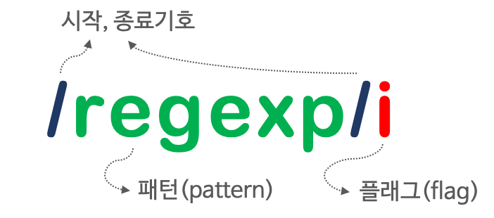

## Chapter 31. RegExp

### 정규 표현식이란? 
- `정규 표현식(regular expression, regexp)`은 일정한 패턴을 가진 문자열의 집합을 표현하기 위해 사용하는 형식 언어(fornal language)
- js의 고유 문법 아님! 대부분의 프로그래밍 언어와 코드 에디터에 내장되어 있음
- js는 펄(Perl)의 정규 표현식 문법을 ES3부터 도입
- 문자열을 대상으로 패턴 매칭 기능 제공 &#8594; 특정 패턴과 일치하는 문자열을 검색하거나 추출 또는 치환할 수 있는 기능
- 반복문과 조건문 없이 패턴을 정의하고 테스트를 통해 패턴과 매칭되는지 간단히 체크할 수 있음
- But, 주석이나 공백을 허용하지 않고 여러가지 기호를 혼합하여 사용하기 때문에 가독성이 좋지 않음

### 정규 표현식의 생성 
- 정규 표현식 리터럴과 RegExp 생성자 함수를 사용하려 정규 표현식 객체(RegExp 객체) 생성
- 정규 표현식 리터럴은 패턴과 플래그로 구성
  
  ```jsx
  const target = 'Is this all there is?';

  // 패턴: is
  // 플래그: i => 대소문자를 구별하지 않고 검색한다.
  const regexp = /is/i;

  // test 메서드는 target 문자열에 대해 정규표현식 regexp의 패턴을 검색하여 매칭 결과를 불리언 값으로 반환한다.
  regexp.test(target); // -> true
  ```
- RegExp 생성자 함수를 사용하여 RegExp 객체 생성 가능
  ```jsx
  /**
  * pattern: 정규 표현식의 패턴
  * flags: 정규 표현식의 플래그 (g, i, m, u, y)
  */

  new RegExp(pattern[, flags])
  ``` 
  ```jsx
  const target = 'Is this all there is?';

  const regexp = new RegExp(/is/i); // ES6
  // const regexp = new RegExp(/is/, 'i');
  // const regexp = new RegExp('is', 'i');

  regexp.test(target); // -> true
  ```

### RegExp 메서드
1. RegExp.prototype.exec
  - exec 메서드는 인수로 전달받은 문자열에 대해 정규 표현식의 패턴을 검색하여 매칭 결과를 배열로 반환
  - 매칭 결과가 없는 경우 `null` 반환
  - 문자열 내의 모든 패턴을 검색하는 `g 플래그`를 지정해도 첫 번째 매칭 결과만 반환
  ```jsx
  const target = 'Is this all there is?';
  const regExp = /is/;

  regExp.exec(target); // -> ["is", index: 5, input: "Is this all there is?", groups: undefined]
  ```
2. RegExp.prototype.test
  - 문자열에서 패턴을 검색하여 매칭 결과를 불리언 값으로 반환
  ```jsx
  const target = 'Is this all there is?';
  const regExp = /is/;

  regExp.test(target); // -> true
  ```
3. String.prototype.match
  - String 표준 빌트인 객체가 제공하는 match 메서드는 문자열과 정규 표현식과의 매칭 정보를 배열로 반환
  ```jsx
  const target = 'Is this all there is?';
  const regExp = /is/;

  target.match(regExp); // -> ["is", index: 5, input: "Is this all there is?", groups: undefined]
  ```
  - g 플래그가 지정되면 모든 매칭 결과를 배열로 반환
  ```jsx
  const target = 'Is this all there is?';
  const regExp = /is/g;

  target.match(regExp); // -> ["is", "is"]
  ```

### 플래그
- 플래그는 패턴과 함께 정규 표현식을 구성하며 정규 표현식의 검색 방식을 설정하기 위해 사용
- 총 6개가 있지만, 가장 중요한 3개만 먼저 살펴보자

| 플래그 | 의미 | 설명 |
| :---: | :--- | :--- |
| i | Ignore case | 대소문자를 구별하지 않고 패턴을 검색 |
| g | Global | 대상 문자열 내에서 패턴과 일치하는 모든 문자열을 전역 검색 |
| m | Multi line | 문자열의 행이 바뀌더라도 패턴 검색을 계속 함 |

- 플래그는 옵션이며, 순서와 상관없이 하나 이상의 플래그를 동시에 설정 가능
- 어떤 플래그도 사용하지 않았을 때에는 대소문자를 구별해서 패턴을 검색하고, 문자열에 패턴 검색 매칭 대상이 1개 이상 존재해도 첫 번째 매칭한 대상만 검색하고 종료함!
```jsx
const target = 'Is this all there is?';

// target 문자열에서 is 문자열을 대소문자를 구별하여 한 번만 검색한다.
target.match(/is/);
// -> ["is", index: 5, input: "Is this all there is?", groups: undefined]

// target 문자열에서 is 문자열을 대소문자를 구별하지 않고 한 번만 검색한다.
target.match(/is/i);
// -> ["Is", index: 0, input: "Is this all there is?", groups: undefined]

// target 문자열에서 is 문자열을 대소문자를 구별하여 전역 검색한다.
target.match(/is/g);
// -> ["is", "is"]

// target 문자열에서 is 문자열을 대소문자를 구별하지 않고 전역 검색한다.
target.match(/is/ig);
// -> ["Is", "is", "is"]
```
> 공백 문자도 하나의 인덱스를 가진다! 희소배열처럼 되는건가? 빈 공간??? 
> is 검색하면 단어로 달랑있는 is 외에 this 이런 단어에도 is 있으니까 얘들도 싹다 검색! 단어 단위로 찾는게 아님 

### 패턴
- 정규 표현식은 "일정한 규칙(패턴)을 가진 문자열의 집합을 표현하기 위해 사용하는 형식 언어(formal language)"이며 패턴과 플래그로 구성되어 있음
- 패턴 : 문자열의 일정한 규칙을 표현하기 위해 사용
  - `/`로 열고 닫으며 문자열의 따옴표는 생략!
  - 따옴표를 포함하면 따옴표까지 패턴에 포함되어 버림
  - 특별한 의미를 가지는 메타 문자(meta character) 또는 기호로 표현
- 플래그 : 검색 방식을 설정하기 위해 사용
- 어떤 문자열 내에 패턴과 일치하는 문자열이 존재할 때 **정규 표현식과 매치(match)한다**고 표현

1. 문자열 검색
  - 정규 표현식의 패턴에 문자 또는 문자열을 지정하면 검색 대상 문자열에서 패턴으로 지정한 문자 또는 문자열을 검색 (but, 정규 표현식을 생성하는 것만으로는 검색이 수행되지 않음)
  - `RegExp`메서드를 사용하여 검색 대상 문자열과 정규 표현식의 매칭 결과를 구하면 검색이 수행됨
  - 검색 대상 문자열과 플래그를 생략한 정규 표현식의 매칭 결과를 구하면 대소문자를 구별하여 정규 표현식과 매치한 첫 번째 결과만 반환
2. 임의의 문자열 검색
  - `.`은 임의의 문자 한개를 의미
  - 문자의 내용 무엇이든 No 상관
  - ex, `.`을 3개 연속하여 패턴을 생성하면 문자의 내용과 상관없이 3자리 문자열과 매치
  ```jsx
  const target = 'Is this all there is?';

  // 임의의 3자리 문자열을 대소문자를 구별하여 전역 검색한다.
  const regExp = /.../g;

  target.match(regExp); // -> ["Is ", "thi", "s a", "ll ", "the", "re ", "is?"]
  ```
3. 반복 검색
  - `{m,n}` : 앞에 있는 패턴이 최소 m번, 최대 n번 반복되는 문자열을 의미 (`,`뒤에 공백 있으면 정상 동작 안함..)
  - `{n}` = `{n,n}` : 앞선 패턴이 n번 반복되는 문자열을 의미 
  - `{n,}` : 앞선 패턴이 최소 n번 이상 반복되는 문자열 의미
  - `+` = `{1,}` : 앞선 패턴이 최소 한 번 이상 반복되는 문자열 
  - `?` = `{0,1}` : 앞선 패턴이 최대 한 번(0번 포함) 이상 반복되는 문자열을 의미
4. OR 검색
  - `|` : or 의미를 가짐! 
    - 분해되지 않은 단어 레벨로 검색하고 싶으면 `+` 같이 사용
    - ex) `/A|B/` A 또는 B 의미 , `/A+|B+/` A 또는 B가 한 번 이상 반복
  - 범위 지정하려면 `[]`내에 `-` 사용
    - ex) `/[A-Z]+/` A ~ Z가 한 번 이상 반복되는 문자열, `/[A-Za-z]+/` 대소문자 구별하지 않고 검색
  - `\d` = `[0-9]` : 숫자 의미
  - `\D` : 숫자가 아닌 문자를 의미
  - `\w` = `[A-Za-z0-9_]` : 알파벳, 숫자, 언더스코어 의미 (cf, `\W`는 반대로 동작)
5. NOT 검색
  - `[...]`내의 `^`은 **not**의 의미를 가짐 
    - ex, `[^0-9]`는 숫자를 제외한 문자를 의미 
    - `\D` = `[^0-9]` , `\W` = `[^A-Za-z0-9]`
6. 시작 위치로 검색
  - `[...]` 밖의 `^`은 문자열의 **시작**을 의미 
    - ex, `/^https/`
7. 마지막 위치로 검색
  - `$` : 문자열의 마지막을 의미

### 자주 사용하는 정규표현식
1. 특정 단어로 시작하는지 검사
  ```jsx
  const url = 'https://marguworld.com';

  // 'http://' 또는 'https://'로 시작하는지 검사
  /^https?:\/\//.test(url); // true
  // 또는 
  /^(http|https):\/\//.test(url); // true
  ```
2. 특정 단어로 끝나는지 검사 
  ```jsx
  const fileName = 'index.html';

  // 'html'로 끝나는지 검사한다.
  /html$/.test(fileName); // -> true
  ```
3. 숫자로만 이루어진 문자열인지 검사
  ```jsx
  const target = '12345';

  // 숫자로만 이루어진 문자열인지 검사한다.
  /^\d+$/.test(target); // -> true
  ```  
4. 하나 이상의 공백으로 시작하는지 검사 
  - `\s` 여러 가지 공백 문자(스페이스, 탭 등)를 의미 
  - `\s` = `[\t\r\n\v\f]`
  ```jsx
  const target = ' Hi!';

  // 하나 이상의 공백으로 시작하는지 검사한다.
  /^[\s]+/.test(target); // -> true
  ```
5. 아이디로 사용 가능한지 검사
  ```jsx
  const id = 'abc123';

  // 알파벳 대소문자 또는 숫자로 시작하고 끝나며 4 ~10자리인지 검사한다.
  /^[A-Za-z0-9]{4,10}$/.test(id); // -> true
  ```
6. 메일 주소 형식에 맞는지 검사
  ```jsx
  const email = 'margu31@marguworld.com';

  /^[0-9a-zA-Z]([-_\.]?[0-9a-zA-Z])*@[0-9a-zA-Z]([-_\.]?[0-9a-zA-Z])*\.[a-zA-Z]{2,3}$/.test(email); // -> true
  ```
7. 핸드폰 번호 형식에 맞는지 검사 
  ```jsx
  const cellphone = '010-1234-5678';

  /^\d{3}-\d{3,4}-\d{4}$/.test(cellphone); // -> true
  ```
8. 특수 문자 포함 여부 검사 
  - 특수 문자는 A-Za-z0-9 이외의 문자
  ```jsx
  const target = 'abc#123';

  // A-Za-z0-9 이외의 문자가 있는지 검사한다.
  (/[^A-Za-z0-9]/gi).test(target); // -> true

  // 대체 방식으로는 아래와 같은게 있음, 이는 특수 문자를 선택적으로 검사할 수 있음
  (/[\{\}\[\]\/?.,;:|\)*~`!^\-_+<>@\#$%&\\\=\(\'\"]/gi).test(target); // -> true

  // 특수 문자 제거
  target.replace(/[^A-Za-z0-9]/gi, ''); // -> abc123
  ```

---

## Chapter 32. String

### String 생성자 함수 
- 표준 빌트인 객체인 String 객체는 생성자 함수 객체로 new 연산자와 함께 호출하여 String 인스턴스 생성
- String 생성자 함수에 인수를 전달하지 않고 new 연산자와 함께 호출하면 `[[StringData]]` 내부 슬롯에 빈 문자열을 할당한 String 래퍼 객체 생성
- String 생성자 함수의 인수로 문자열이 아닌 값을 전달하면 인수를 문자열로 강제 변환한 후, `[[StringData]]` 내부 슬롯에 변환된 문자열을 할당한 String 래퍼 객체를 생성
```jsx
const strObj = new Stirng();
console.log(strObj); // String {length: 0, [[PrimitiveValue]]: ""} 

// [[PrimitiveValue]]는 ES5에서 부르던 내부 슬롯으로 [[StringData]]이당

const strObj = new String('Lee');
console.log(strObj);
// String {0: "L", 1: "e", 2: "e", length: 3, [[PrimitiveValue]]: "Lee"}
```
- String 래퍼 객체는 **유사 배열 객체이면서 이터러블**이기 때문에 배열과 유사하게 인덱스를 사용하여 각 문자에 접근 가능
- 단, 문자열은 원시값이므로 변경 No! &#8594; 변경 시도해도 에러는 발생하지 않음.. 무시될 뿐
- new 연산자를 사용하지 않고 String 생성자 함수를 호출하면 String 인스턴스가 아닌 문자열을 반환 &#8594; 명시적 타입 변환
  ```jsx
  // 숫자 타입 => 문자열 타입
  String(1);        // -> "1"
  String(NaN);      // -> "NaN"
  String(Infinity); // -> "Infinity"

  // 불리언 타입 => 문자열 타입
  String(true);  // -> "true"
  String(false); // -> "false"
  ```

### String 메서드 
- 배열에는 원본 배열을 직접 변경하는 메서드(mutator method)와 원본 배열을 직접 변경하지 않고 새로운 배열을 생성하여 반환하는 메서드(accessor method)가 있음 
- String 객체에는 원본 String 래퍼 객체를 직접 변경하는 메서드는 존재하지 않음  
  &#8594; String 객체의 메서드는 **언제나 새로운 문자열을 반환**
- 문자열은 변경 불가능(immutable)한 원시값이기 때문에 String 래퍼 객체는 **읽기 전용(read only)** 객체로 제공됨
```jsx
const strObj = new String('Lee');

console.log(Object.getOwnPropertyDescriptors(strObj));
/* String 래퍼 객체는 읽기 전용 객체다. 즉, writable 프로퍼티 어트리뷰트 값이 false다.
{
  '0': { value: 'L', writable: false, enumerable: true, configurable: false },
  '1': { value: 'e', writable: false, enumerable: true, configurable: false },
  '2': { value: 'e', writable: false, enumerable: true, configurable: false },
  length: { value: 3, writable: false, enumerable: false, configurable: false }
}
*/
```

1. String.prototype.indexOf
  - 인수로 전달받은 문자열을 검색하여 첫 번째 인덱스를 반환
  - 검색에 실패하면 `-1` 반환
  - 2번째 인수로 검색을 시작할 인덱스 전달 가능
  - 대상 문자열에 특정 문자열이 존재하는지 확인할 때 유용
  - ES6에서 도입된 `String.prototype.includes` 메서드가 더 가독성 좋다!
  ```jsx
  const str = 'Hello World';

  str.indexOf('l'); // 2
  str.indexOf('or'); // 7
  str.indexOf('x'); // -1

  str.indexOf('l', 3); // 3

  if (str.indexOf('Hello') !== -1) {
    // 문자열 str에 'Hello'가 포함되어 있는 경우 처리할 내용
  }

  // String.prototype.includes 메서드 이용
  if (str.includes('Hello')) {
    // 문자열 str에 'Hello'가 포함되어 있는 경우 처리할 내용
  }
  ```
2. String.prototype.search
  - 인수로 전달받은 정규 표현식과 매치하는 문자열을 검색하여 일치하는 문자열의 인덱스를 반환
  - 검색 실패하면 `-1` 반환
  흠~~~~~~ 그럼 indexOf랑 뭔차이냐아~~ 똑같은거 아닌가..? 
  그냥 '' 이케 넣어주느냐 // 이케 넣어주는냐 차이인 것같은뎅.. 왜 같은 기능이 두개나 있어..?
  ```jsx
  const str = 'Hello world';

  // 문자열 str에서 정규 표현식과 매치하는 문자열을 검색하여 일치하는 문자열의 인덱스를 반환한다.
  str.search(/o/); // -> 4
  str.search(/x/); // -> -1
  ```
3. String.prototype.includes
  - 인수로 전달받은 문자열이 **포함**되어 있는지 확인하여 그 결과를 true 또는 false로 반환
  - 2번째 인수로 검색을 시작할 인덱스 전달 가능
  - ES6에서 도입
  ```jsx
  const str = 'Hello world';

  str.includes('Hello'); // -> true
  str.includes('');      // -> true
  str.includes('x');     // -> false
  str.includes();        // -> false

  // 문자열 str의 인덱스 3부터 'l'이 포함되어 있는지 확인
  str.includes('l', 3); // -> true
  str.includes('H', 3); // -> false
  ```
4. String.prototype.startsWith
  - 인수로 전달받은 문자열로 **시작**하는지 확인하여 그 결과를 true 또는 false로 반환
  - 2번째 인수로 검색을 시작할 인덱스를 전달 가능
  - ES6에서 도입
  ```jsx
  const str = 'Hello world';

  str.startsWith('He'); // true
  str.startsWith('x'); // false

  str.startsWith(' ', 5); // true
  ```
5. String.prototype.endsWith
  - 인수로 전달받은 문자열로 **끝나**는지 확인하여 그 결과를 true 또는 false로 반환
  - 2번째 인수로 검색할 문자열의 길이를 전달
  - ES6에서 도입
  ```jsx
  const str = 'Hello world';

  str.endsWith('ld'); // true
  str.endsWith('x'); // false

  str.endsWith('lo', 5); // true
  ```
6. String.prototype.charAt
  - 인수로 전달받은 인덱스에 위치한 문자를 검색하여 반환
  - 인덱스가 문자열의 범위를 벗어난 정수인 경우 빈 문자열을 반환
  - 유사한 메서드 : `String.prototype.charCodeAt`, `String.prototype.codePointAt`
  ```jsx
  const str = 'Hello';

  for (let i = 0; i < str.length; i++) {
    console.log(str.charAt(i)); // H e l l o
  }

  // 인덱스가 문자열의 범위(0 ~ str.length-1)를 벗어난 경우 빈문자열을 반환
  str.charAt(5); // ''
  ```
7. String.prototype.substring
  - 첫 번째 인수로 전달받은 인덱스에 위치하는 문자부터 두 번째 인수로 전달받은 인덱스에 위치하는 문자의 바로 이전 문자까지의 부분 문자열을 반환
  - 두 번째 인수 생략 가능 &#8594; 첫 번째 인수로 전달한 인덱스에 위치하는 문자부터 마지막 문자까지 부분 문자열 반환
  ```jsx
  const str = 'Hello World';

  str.substring(1, 4); // ell

  str.substring(1); // ello World
  ```
  - 첫 번째 인수는 두 번째 인수보다 작은 정수이어야 정상! but, 그렇지 않아도 정상 동작함
    - `첫 번째 인수 > 두 번째 인수` : 두 인수는 교환됨
    - `인수 < 0` 또는 인수가 `NaN`인 경우 : 0으로 취급
    - `인수 < string.length`인 경우 : 문자열의 길이(string.length)로 취급
  ```jsx
  const str = 'Hello World'; // str.length = 11

  str.substring(4, 1); // ell  -> (1, 4)로 교환됨 
  str.substrind(-2); // Hello World   -> 0으로 취급
  
  str.substring(1, 100); // ello World   -> (1, 11)로 취급 (length를 넘어가서)
  str.substring(20); // ''   -> 11로 취급되어 반환할 문자열이 없음
  ```
  - `Stirng.prototype.indexOf`와 같이 사용해서 특정 문자열을 기준으로 앞뒤에 위치한 부분 문자열 취득 가능
  ```jsx
  const str = 'Hello World';

  // 스페이스 기준으로 앞에 있는 문자열 취득
  str.substring(0, str.indexOf(' ')); // Hello

  // 스페이스 기준으로 뒤에 있는 문자열 취득
  str.substring(str.indexOf(' ') + 1, str.length); // World
  ```
8. String.prototype.slice
  - `substring`와 동일하게 동작
  - 단, `slice`에는 음수인 인수 전달 가능 &#8594; 음수인 인수를 전달하면 가장 뒤에서부터 시작해서 문자열을 잘라내어 반환
  ```jsx
  const str = 'hello world';

  // substring과 slice 메서드는 동일하게 동작
  // 0번째부터 5번째 이전 문자까지 잘라내어 반환
  str.substring(0, 5); // 'hello'
  str.slice(0, 5); // 'hello'

  // 인덱스가 2인 문자부터 마지막 문자까지 잘라내어 반환
  str.substring(2); // 'llo world'
  str.slice(2); // 'llo world'

  // substring : 인수 < 0 또는 NaN인 경우 0으로 취급
  str.substring(-5); // 'hello world'
  // slice : 음수인 인수 전달 가능, 뒤에서 5자리를 잘라내어 반환
  str.slice(-5); // 'world'
  ```
9. String.prototype.toUpperCase
  - 모두 대문자로 변경한 문자열을 반환
10. String.prototype.toLowerCase
  - 모두 소문자로 변경한 문자열을 반환
11. String.prototype.trim
  - 대상 문자열 앞뒤에 공백 문자가 있을 경우 이를 제거한 문자열을 반환
  - stage 4에 제안되어 있는 `String.prototype.trimStart`, `String.prototype.trimEnd`를 사용하면 대상 문자열 앞 또는 뒤에 공백 문자가 있을 경우 이를 제거한 문자열을 반환
  ```jsx
  const str = '   foo  ';

  // String.prototype.{trimStart,trimEnd} : Proposal stage 4
  str.trimStart(); // -> 'foo  '
  str.trimEnd();   // -> '   foo'
  ```
  - `String.prototype.replace` 메서드에 정규 표현식을 인수로 전달하여 공백 문자 제거 가능
12. String.prototype.repeat
  - 인수로 전달받은 정수만큼 반복해 연결한 새로운 문자열을 반환
  - 인수로 전달받은 정수가 `0`이면 빈 문자열을 반환, `음수`이면 `RangeError` 발생
  - 인수 생략하면 기본값 0 설정
  ```jsx
  const str = 'abc';

  str.repeat();    //  ''
  str.repeat(0);   //  ''
  str.repeat(1);   //  'abc'
  str.repeat(2);   //  'abcabc'
  str.repeat(2.5); //  'abcabc' (2.5 → 2)
  str.repeat(-1);  //  RangeError: Invalid count value
  ```
13. String.prototype.replace
  - 첫 번째 인수로 전달받은 문자열 또는 정규 표현식을 검색하여 두 번째 인수로 전달한 문자열로 치환한 문자열을 반환
  - 검색된 문자열이 여럿 존재할 경우 첫 번째로 검색된 문자열만 치환
  ```jsx
  const str = 'Hello world';

  // str에서 첫 번째 인수 'world'를 검색하여 두 번째 인수 'Lee'로 치환한다.
  str.replace('world', 'Lee'); //  'Hello Lee'

  const str1 = 'Hello world world';

  str1.replace('world', 'Lee'); //  'Hello Lee world'
  ```
  - 특수한 교체 패턴 사용 가능 (ex, `$&`는 검색된 문자열을 의미)
  ```jsx
  const str = 'Hello world';

  // 특수한 교체 패턴을 사용할 수 있다. ($& => 검색된 문자열)
  str.replace('world', '<strong>$&</strong>'); // 검색한 아이를 <strong>태그로 감싸주어라
  ```
  - 첫 번째 인수로 정규 표현식 전달 가능
  ```jsx
  const str = 'Hello Hello';

  // 'hello'를 대소문자를 구별하지 않고 전역 검색
  str.replace(/hello/gi, 'Lee'); // -> 'Lee Lee
  ```
  - 두 번째 인수로 치환 함수 전달 가능 &#8594; 첫 번째 인수로 전달한 문자열 또는 정규 표현식에 매치한 결과를 두 번째 인수로 전달한 치환 함수의 인수로 전달하면서 호출하고 치환 함수가 반환한 결과와 매치 결과를 치환.......ㅎㅎ 어렵네
14. String.prototype.split
  - 첫 번째 인수로 전달한 문자열 또는 정규 표현식을 검색하여 문자열을 구분한 후 분리된 각 문자열로 이루어진 **배열**을 반환
  - 인수로 빈 문자열을 전달하면 각 문자를 모두 분리
  - 인수를 생략하면 대상 문자열 전체를 단일 요소로 하는 배열을 반환
  - 두 번째 인수로 배열의 길이 지정 가능
  - 배열을 반환하기 때문에 `Array.protptype.reverse`, `Array.protptype.join` 메서드와 함께 사용하면 문자열을 역순으로 뒤집을 수 있음
  ```jsx
  const str = 'How are you doing?';

  // 공백으로 구분(단어로 구분)하여 배열로 반환
  str.split(' '); // -> ["How", "are", "you", "doing?"]

  // \s는 여러 가지 공백 문자(스페이스, 탭 등)를 의미. 즉, [\t\r\n\v\f]와 같은 의미
  str.split(/\s/); // -> ["How", "are", "you", "doing?"]

  // 인수로 빈 문자열을 전달하면 각 문자를 모두 분리
  str.split(''); // -> ["H", "o", "w", " ", "a", "r", "e", " ", "y", "o", "u", " ", "d", "o", "i", "n", "g", "?"]

  // 인수를 생략하면 대상 문자열 전체를 단일 요소로 하는 배열을 반환
  str.split(); // -> ["How are you doing?"]

  // 공백으로 구분하여 배열로 반환. 단, 배열의 길이는 3
  str.split(' ', 3); // -> ["How", "are", "you"]

  // 인수로 전달받은 문자열을 역순으로 
  function reverseString(str) {
    return str.split('').reverse().join('');
  }

  reverseString('Hello world!'); // -> '!dlrow olleH'
  ```

---


