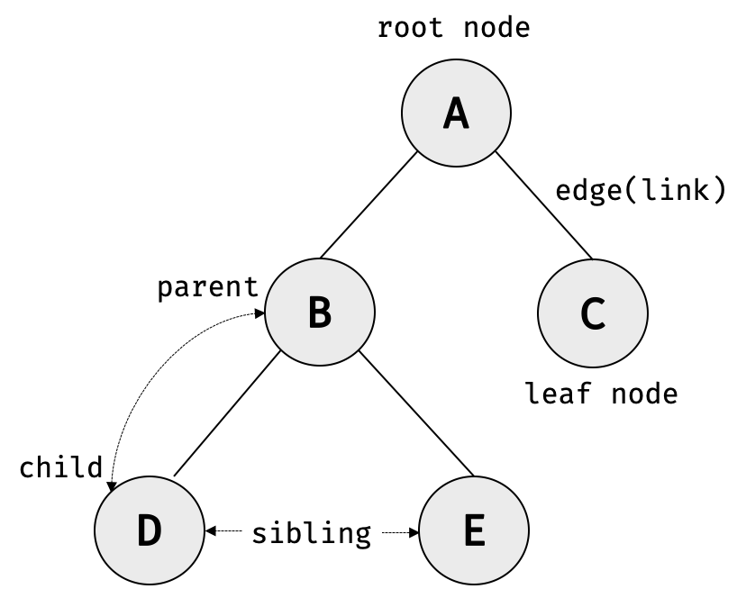
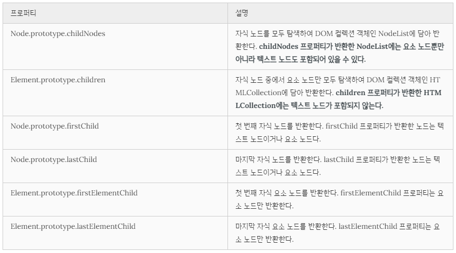
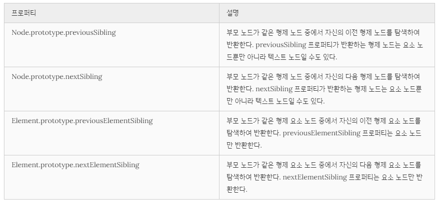
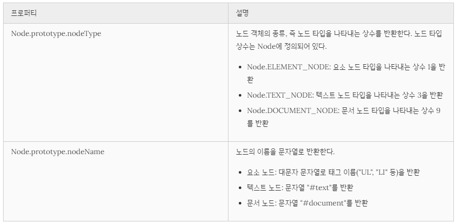
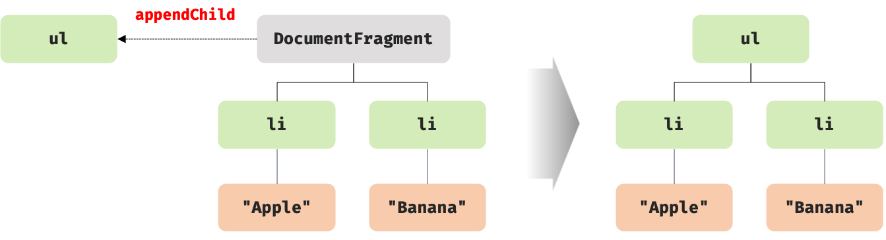

## Chapter 39. DOM

- 브라우저의 렌더링 엔진은 HTML 문서를 파싱하여 브라우저가 이해할 수 있는 자료구조인 DOM을 생성  
- `DOM(Document Object Model)`은 HTML 문서의 계층적 구조와 정보를 표현하며 이를 제어할 수 있는 API, 즉 프로퍼티와 메서드를 제공하는 트리 자료구조

### 노드
1. HTML 요소와 노드 객체
  - HTML 요소(HTML element)는 HTML 문서를 구성하는 개별적인 요소를 의미
  - HTML 요소는 렌더링 엔진에 의해 파싱되어 DOM을 구성하는 요소 노드 객체로 변환
  - HTML 요소의 어트리뷰트는 어트리뷰트 노드로, HTML 요소의 텍스트 콘텐츠는 텍스트 노드로 변환
  - HTML 요소 간에는 중첩 관계에 의해 계층적인 부자(parent-child) 관계가 형성됨 &#8594; 이러한 HTML 요소 간의 부자 관계를 반영하여 HTML 문서의 구성 요소인 HTML 요소를 객체화한 모든 노드 객체들을 **트리 자료구조**로 구성
  - `트리 자료구조(tree data structure)`  
    - 노드(node)들의 계층 구조로 이뤄짐
    - 부모 노드(parent node)와 자식 노드(child node)로 구성되어 노드 간의 계층적 구조(부자, 형제 관계)를 표현하는 비선형 자료구조
    - 트리 자료구조는 하나의 최상위 노드에서 시작
    - 최상위 노드는 부모 노드가 없으며, **루트 노드(root node)**라 함
    - 루트 노드는 0개 이상의 자식 노드를 갖는다. 자식 노드가 없는 노드를 **리프 노드(leaf node)**라 함
  - 노드 객체들로 구성된 트리 자료구조를 `DOM(Document Object Model)`이라고 하며 **DOM 트리**라고 부르기도 함  
  
2. 노드 객체의 타입
  
  - 문서 노드(document node)
    - DOM 트리의 최상위에 존재하는 루트 노드로서 document 객체를 가리킴
    - document 객체는 브라우저가 렌더링한 HTML 문서 전체를 가리키는 객체로서 전역 객체 window의 document 프로퍼티에 바인딩되어 있음
    - HTML 문서당 document 객체는 유일함
    - DOM 트리의 노드들에 접근하기 위한 진입점(entry point) 역할
  - 요소 노드(element node)
    - HTML 요소를 가리키는 객체
    - HTML 요소 간의 중첩에 의해 부자 관계를 가짐 &#8594; 이를 통해 정보를 구조화
  - 어트리뷰트 노드(attribute node)
    - 어트리뷰트 노드는 어트리뷰트가 지정된 HTML 요소의 요소 노드와 연결되어 있음
    - 어트리뷰트 노드는 부모 노드가 없으므로 요소 노드의 형제(sibling) 노드 아님  
    - 어트리뷰트를 참조하거나 변경하려면 먼저 요소 노드에 접근해야 함
  - 텍스트 노드(text node)
    - 문서의 정보를 표현
    - 요소 노드의 자식 노드이며, 자식 노드를 가질 수 없는 리프 노드(leaf node) &#8594; DOM 트리의 최종단
3. 노드 객체의 상속 구조
  - 모든 노드 객체는 Object, EventTarget, Node 인터페이스를 상속받음
  - DOM은 HTML 문서의 계층적 구조와 정보를 표현하는 것은 물론 노드 객체의 종류, 즉 노드 타입에 따라 필요한 기능을 프로퍼티와 메서드의 집합인 DOM API(Application Programming Interface)로 제공한다. 이 DOM API를 통해 HTML의 구조나 내용 또는 스타일 등을 동적으로 조작할 수 있음

### 요소 노드 취득 
- HTML의 구조나 내용 또는 스타일 등을 동적으로 조작하려면 먼저 요소 노드를 취득해야 한다. 텍스트 노드는 요소 노드의 자식 노드이고, 어트리뷰트 노드는 요소 노드와 연결되어 있기 때문에 텍스트 노드나 어트리뷰트 노드를 조작하고자 할 때도 마찬가지
- 요소 노드의 취득은 HTML 요소를 조작하는 시작점

1. id를 이용한 요소 노드 취득
  - `Document.prototype.getElementById` : 인수로 전달한 id 어트리뷰트 값(이하 id 값)을 갖는 하나의 요소 노드를 탐색하여 반환
  - id 값은 HTML 문서 내에서 유일한 값이어야 하며, class 어트리뷰트와는 달리 공백 문자로 구분하여 여러 개의 값을 가질 수 없음
  - But,HTML 문서 내에 중복된 id 값을 갖는 HTML 요소가 여러 개 존재하더라도 어떠한 에러도 발생하지 않음
  - `getElementById`는 인수로 전달된 id 값을 갖는 **첫 번째 요소 노드**만 반환 &#8594; 언제나 단 하나의 요소 노드를 반환
  - if, 인수로 전달된 id 값을 갖는 HTML 요소가 존재하지 않는 경우 getElementById 메서드는 `null`을 반환
2. 태그 이름을 이용한 요소 노드 취득
  - `Document.prototype/Element.prototype.getElementsByTagName` : 인수로 전달한 태그 이름을 갖는 모든 요소 노드들을 탐색하여 반환
  - getElementsByTagName 메서드는 여러 개의 요소 노드 객체를 갖는 DOM 컬렉션 객체인 **HTMLCollection** 객체를 반환
  - `HTMLCollection` 객체는 유사 배열 객체이면서 이터러블
  - if, 인수로 전달된 태그 이름을 갖는 요소가 존재하지 않는 경우 getElementsByTagName 메서드는 빈 HTMLCollection 객체를 반환
3. class를 이용한 요소 노드 취득
  - `Document.prototype/Element.prototype.getElementsByClassName` : 인수로 전달한 class 어트리뷰트 값(이하 class 값)을 갖는 모든 요소 노드 들을 탐색하여 반환
  - 인수로 전달할 class 값은 공백으로 구분하여 여러 개의 class를 지정할 수 있음
  - getElementsByClassName 메서드는 여러 개의 요소 노드 객체를 갖는 DOM 컬렉션 객체인 HTMLCollection 객체를 반환
  - if, 인수로 전달된 class 값을 갖는 요소가 존재하지 않는 경우 getElementsByClassName 메서드는 빈 HTMLCollection 객체를 반환
4. CSS 선택자를 이용한 요소 노드 취득
  - `Document.prototype/Element.prototype.querySelector` : 인수로 전달한 CSS 선택자를 만족시키는 하나의 요소 노드를 탐색하여 반환
    - CSS 선택자를 만족시키는 요소 노드가 여러 개인 경우 첫 번째 요소 노드만 반환
    - CSS 선택자를 만족시키는 요소 노드가 존재하지 않는 경우 null 반환
    - CSS 선택자가 문법에 맞지 않는 경우 DOMException 에러 발생
  - `Document.prototype/Element.prototype.querySelectorAll` : 인수로 전달한 CSS 선택자를 만족시키는 모든 요소 노드를 탐색하여 반환
  - querySelectorAll 메서드는 여러 개의 요소 노드 객체를 갖는 DOM 컬렉션 객체인 NodeList 객체를 반환
    - CSS 선택자를 만족시키는 요소 노드가 존재하지 않는 경우 빈 NodeList 객체 반환
    - NodeList 객체는 유사 배열 객체이면서 이터러블
5. 특정 요소 노드를 취득할 수 있는지 확인
  - `Element.prototype.matches` : 인수로 전달한 CSS 선택자를 통해 특정 요소 노드를 취득할 수 있는지 확인
  - 이벤트 위임을 사용할 때 유용
6. HTMLCollection과 NodeList
  - DOM 컬렉션 객체인 HTMLCollection과 NodeList는 DOM API가 여러 개의 결과값을 반환하기 위한 DOM 컬렉션 객체로 유사 배열 객체이면서 이터러블 &#8594; for...of문으로 순회 가능, 스프레드 문법으로 배열 변환 가능
  - 노드 객체의 상태 변화를 실시간으로 반영하는 살아 있는(live) 객체
    - but, NodeList는 대부분의 경우 노드 객체의 상태 변화를 실시간으로 반영하지 않고 과거의 정적 상태를 유지하는 non-live 객체로 동작하지만 경우에 따라 live 객체로 동작할 때 있음
  - `HTMLCollection`
    - 실시간으로 노드 객체의 상태 변경을 반영하여 요소를 제거할 수 있음
  - `NodeList` 
    - 실시간으로 노드 객체의 상태 변경을 반영하지 않는(non-live) 객체
    - but, `childNodes` 프로퍼티가 반환하는 NodeList 객체는 HTMLCollection 객체와 같이 실시간으로 노드 객체의 상태 변경을 반영하는 live 객체로 동작하므로 주의가 필요
  - 노드 객체의 상태 변경과 상관없이 안전하게 DOM 컬렉션을 사용하려면 HTMLCollection이나 NodeList 객체를 **배열로 변환**하여 사용하는 것을 권장

### 노드 탐색 (traversing, node walking)
노드 탐색 프로퍼티는 모두 접근자 프로퍼티이나, getter만 존재하여 참조만 가능한 읽기 전용 접근자 프로퍼티다

1. 공백 텍스트 노드
  - HTML 요소 사이의 스페이스, 탭, 줄바꿈(개행) 등의 공백(white space) 문자는 텍스트 노드를 생성 &#8594; 공백 텍스트 노드
2. 자식 노드 탐색
  
3. 자식 노드 존재 확인
  - `Node.prototype.hasChildNodes` 메서드 사용 &#8594; true or false 반환
  - `childNodes` 프로퍼티와 마찬가지로 텍스트 노드를 포함하여 자식 노드의 존재를 확인
  - 자식 노드 중에 텍스트 노드가 아닌 요소 노드가 존재하는지는 확인하려면 `children.length` 또는 Element 인터페이스의 `childElementCount` 프로퍼티 사용
4. 요소 노드의 텍스트 노드 탐색
  - 요소 노드의 텍스트 노드는 요소 노드의 자식 노드 &#8594; 요소 노드의 텍스트 노드는 firstChild 프로퍼티로 접근 가능
  - firstChild 프로퍼티가 반환한 노드는 텍스트 노드이거나 요소 노드
5. 부모 노드 탐색 
  - `Node.prototype.parentNode` 프로퍼티 사용
  - 텍스트 노드는 DOM 트리의 최종단 노드인 리프 노드(leaf node)이므로 부모 노드가 텍스트 노드인 경우는 없다.
6. 형제 노드 탐색
  - 아래 프로퍼티는 텍스트 노드 또는 요소 노드만 반환
  
  - 어트리뷰트 노드는 요소 노드와 연결되어 있지만 부모 노드가 같은 형제 노드가 아니기 때문에 반환되지 않음

### 노드 정보 취득


### 요소 노드의 텍스트 조작
1. nodeValue
  - setter와 getter 모두 존재하는 접근자 프로퍼티 &#8594; 참조와 할당 모두 가능
  - 노드 객체의 nodeValue 프로퍼티를 참조하면 노드 객체의 값을 반환
  - 노드 객체의 값이란 텍스트 노드의 텍스트
  - 문서 노드나 요소 노드의 nodeValue 프로퍼티를 참조하면 null을 반환
2. textContent
  - setter와 getter 모두 존재하는 접근자 프로퍼티로서 요소 노드의 텍스트와 모든 자손 노드의 텍스트를 모두 취득하거나 변경
  - 요소 노드의 textContent 프로퍼티를 참조하면 요소 노드의 콘텐츠 영역 내의 텍스트를 모두 반환 &#8594; HTML 마크업은 무시
  - textContent 프로퍼티에 문자열을 할당하면 요소 노드의 모든 자식 노드가 제거되고 할당한 문자열이 텍스트로 추가 &#8594; HTML 마크업이 파싱되지 않음

### DOM 조작 (DOM manipulation)
새로운 노드를 생성하여 DOM에 추가하거나 기존 노드를 삭제 또는 교체하는 것 &#8594; 리플로우와 리페인트가 발생하는 원인이 되므로 성능에 영향을 줌

1. innerHTML
  - `Element.prototype.innerHTML` 프로퍼티는 setter와 getter 모두 존재하는 접근자 프로퍼티로서 요소 노드의 HTML 마크업을 취득하거나 변경 &#8594;  HTML 마크업이 포함된 문자열을 그대로 반환
  - 요소 노드의 innerHTML 프로퍼티에 문자열을 할당하면 요소 노드의 모든 자식 노드가 제거되고 할당한 문자열에 포함되어 있는 HTML 마크업이 파싱되어 요소 노드의 자식 노드로 DOM에 반영
  - innerHTML 프로퍼티에 할당한 HTML 마크업 문자열은 렌더링 엔진에 의해 파싱되어 요소 노드의 자식으로 DOM에 반영된다. 이때 사용자로부터 입력 받은 데이터(untrusted input data)를 그대로 innerHTML 프로퍼티에 할당하는 것은 **크로스 사이트 스크립팅 공격(XSS: Cross-Site Scripting Attacks)**에 취약하므로 위험
  - innerHTML 프로퍼티의 또 다른 단점은 요소 노드의 innerHTML 프로퍼티에 HTML 마크업 문자열을 할당하는 경우 요소 노드의 모든 자식 노드를 제거하고 할당한 HTML 마크업 문자열을 파싱하여 DOM을 변경한다는 것
  - innerHTML 프로퍼티에 HTML 마크업 문자열을 할당하면 유지되어도 좋은 기존의 자식 노드까지 모두 제거하고 다시 처음부터 새롭게 자식 노드를 생성하여 DOM에 반영 - 효율적이지 ㅇ낳음
  - 새로운 요소를 삽입할 때 삽입될 위치를 지정할 수 없다
2. insertAdjacentHTML 메서드
  - `Element.prototype.insertAdjacentHTML(position, DOMString)` 메서드는 기존 요소를 제거하지 않으면서 위치를 지정해 새로운 요소를 삽입
  - 두 번째 인수로 전달한 HTML 마크업 문자열(DOMString)을 파싱하고 그 결과로 생성된 노드를 첫 번째 인수로 전달한 위치(position)에 삽입하여 DOM에 반영
  - 첫 번째 인수로 전달할 수 있는 문자열은 ‘beforebegin’, ‘afterbegin’, ‘beforeend’, ‘afterend’
  
  - 기존 요소에는 영향을 주지 않고 새롭게 삽입될 요소만을 파싱하여 자식 요소로 추가하므로 기존의 자식 노드를 모두 제거하고 다시 처음부터 새롭게 자식 노드를 생성하여 자식 요소로 추가하는 innerHTML 프로퍼티보다 효율적이고 빠름
  - HTML 마크업 문자열을 파싱하므로 크로스 사이트 스크립팅 공격에 취약
3. 노드 생성과 추가
  - 요소 노드 생성 : `Document.prototype.createElement(tagName)`
    - createElement 메서드로 생성한 요소 노드는 기존 DOM에 추가되지 않고 홀로 존재하는 상태
    - 따라서 이후에 생성된 요소 노드를 DOM에 추가하는 처리가 별도로 필요
  - 텍스트 노드 생성 : `Document.prototype.createTextNode(text)`
    - createTextNode 메서드로 생성한 텍스트 노드는 요소 노드의 자식 노드로 추가되지 않고 홀로 존재하는 상태
    - 따라서 이후에 생성된 텍스트 노드를 요소 노드에 추가하는 처리가 별도로 필요
  - 텍스트 노드를 요소 노드의 자식 노드로 추가 : `Node.prototype.appendChild(childNode)` 매개변수 childNode에게 인수로 전달한 노드를 appendChild 메서드를 호출한 노드의 마지막 자식 노드로 추가
  - 요소 노드에 자식 노드가 하나도 없는 경우에는 텍스트 노드를 생성하여 요소 노드의 자식 노드로 텍스트 노드를 추가하는 것보다 textContent 프로퍼티를 사용하는 편이 더욱 간편
  ```jsx
  // 텍스트 노드를 생성하여 요소 노드의 자식 노드로 추가
  $li.appendChild(document.createTextNode('Banana'));

  // $li 요소 노드에 자식 노드가 하나도 없는 위 코드와 동일하게 동작한다.
  $li.textContent = 'Banana';
  ```
  - 요소 노드를 DOM에 추가 : `Node.prototype.appendChild` 
4. 복수의 노드 생성과 추가
  - DOM을 변경하는 것은 높은 비용이 드는 처리이므로 가급적 횟수를 줄이는 편이 성능에 유리
  - DOM을 여러 번 변경하는 문제를 회피하기 위해 컨테이너 요소를 사용 but, 불필요한 컨테이너 요소가 DOM에 추가되는 부작용이 있음
  - `DocumentFragment` 노드
    - 문서, 요소, 어트리뷰트, 텍스트 노드와 같은 노드 객체의 일종으로, 부모 노드가 없어서 기존 DOM과는 별도로 존재한다는 특징이 있음
    - 자식 노드들의 부모 노드로서 별도의 서브 DOM을 구성하여 기존 DOM에 추가하기 위한 용도로 사용
    - 기존 DOM과는 별도로 존재하므로 DocumentFragment 노드에 자식 노드를 추가하여도 기존 DOM에는 어떠한 변경도 발생하지 않음 
    - DocumentFragment 노드를 DOM에 추가하면 자신은 제거되고 자신의 자식 노드만 DOM에 추가
  
  - `Document.prototype.createDocumentFragment` : 비어 있는 DocumentFragment 노드를 생성하여 반환
5. 노드 삽입
  - 마지막 노드로 추가 : `Node.prototype.appendChild` 인수로 전달받은 노드를 자신을 호출한 노드의 마지막 자식 노드로 DOM에 추가 (위치를 지정할 수 없고 언제나 마지막 자식 노드로 추가)
  - 지정한 위치에 노드 삽입 : `Node.prototype.insertBefore(newNode, childNode)` 첫 번째 인수로 전달받은 노드를 두 번째 인수로 전달받은 노드 앞에 삽입
    - 두 번째 인수로 전달받은 노드가 null이면 첫 번째 인수로 전달받은 노드를 insertBefore 메서드를 호출한 노드의 마지막 자식 노드로 추가 &#8594; appendChild 메서드처럼 동작
6. 노드 이동
  - DOM에 이미 존재하는 노드를 appendChild 또는 insertBefore 메서드를 사용하여 DOM에 다시 추가하면 현재 위치에서 노드를 제거하고 새로운 위치에 노드를 추가
7. 노드 복사
  - `Node.prototype.cloneNode([deep: true | false])` : 노드의 사본을 생성하여 반환
  - 매개변수 deep에 true를 인수로 전달하면 노드를 깊은 복사(deep copy)하여 모든 자손 노드가 포함된 사본을 생성하고, false를 인수로 전달하거나 생략하면 노드를 얕은 복사(shallow copy)하여 노드 자신만의 사본을 생성
  - 얕은 복사로 생성된 요소 노드는 자손 노드를 복사하지 않으므로 텍스트 노드도 없음
8. 노드 교체
  - `Node.prototype.replaceChild(newChild, oldChild)` : 자신을 호출한 노드의 자식 노드를 다른 노드로 교체
  - 첫 번째 매개변수 newChild에는 교체할 새로운 노드를 인수로 전달하고, 두 번째 매개변수 oldChild에는 이미 존재하는 교체될 노드를 인수로 전달 &#8594; 자신을 호출한 노드의 자식 노드인 oldChild 노드를 newChild 노드로 교체
  - oldChild 노드는 DOM에서 제거 됨
9. 노드 삭제
  - `Node.prototype.removeChild(child)` : child 매개변수에 인수로 전달한 노드를 DOM에서 삭제

### 어트리뷰트
1. 어트리뷰트 노드와 attributes 프로퍼티
  - HTML 문서가 파싱될 때 HTML 요소의 어트리뷰트는 어트리뷰트 노드로 변환되어 요소 노드와 연결
  - HTML 어트리뷰트당 하나의 어트리뷰트 노드가 생성
  - 모든 어트리뷰트 노드의 참조는 유사 배열 객체이자 이터러블인 `NamedNodeMap` 객체에 담겨서 요소 노드의 attributes 프로퍼티에 저장
  - attributes 프로퍼티는 getter만 존재하는 읽기 전용 접근자 프로퍼티이며, 요소 노드의 모든 어트리뷰트 노드의 참조가 담긴 `NamedNodeMap` 객체를 반환
2. HTML 어트리뷰트 조작
  - `Element.prototype.getAttribute/setAttribute` 메서드를 사용하면 attributes 프로퍼티를 통하지 않고 요소 노드에서 메서드를 통해 직접 HTML 어트리뷰트 값을 취득하거나 변경 가능
  - HTML 어트리뷰트 값 참조 : `Element.prototype.getAttribute(attributeName)`
  - HTML 어트리뷰트 값 변경 : `Element.prototype.setAttribute(attributeName, attributeValue)`
  - 특정 HTML 어트리뷰트 존재 확인 : `Element.prototype.hasAttribute(attributeName)`
  - 특정 HTML 어트리뷰트 삭제 : `Element.prototype.removeAttribute(attributeName)`
3. HTML 어트리뷰트 vs. DOM 프로퍼티
  - 요소 노드 객체에는 HTML 어트리뷰트에 대응하는 프로퍼티(= DOM 프로퍼티)가 존재
  - DOM 프로퍼티들은 HTML 어트리뷰트 값을 초기값으로 가지고 있음
  - DOM 프로퍼티는 setter와 getter 모두 존재하는 접근자 프로퍼티로 참조와 변경 가능
  - HTML 어트리뷰트의 역할은 HTML 요소의 초기 상태를 지정하는 것 &#8594; HTML 어트리뷰트 값은 HTML 요소의 초기 상태를 의미하며 이는 변하지 않음
  - 요소 노드는 초기 상태와 최신 상태를 관리해야 함.
    - 요소 노드의 초기 상태는 어트리뷰트 노드가 관리
    - 요소 노드의 최신 상태는 DOM 프로퍼티가 관리
  1. 어트리뷰트 노드
    - HTML 어트리뷰트로 지정한 HTML 요소의 초기 상태는 어트리뷰트 노드에서 관리
    - 어트리뷰트 노드에서 관리하는 어트리뷰트 값은 사용자의 입력에 의해 상태가 변경되어도 변하지 않고 HTML 어트리뷰트로 지정한 HTML 요소의 초기 상태를 그대로 유지
    ```jsx
    // attributes 프로퍼티에 저장된 value 어트리뷰트 값을 취득한다. 결과는 언제나 동일하다.
    document.getElementById('user').getAttribute('value'); // ungmo2
    ```
  2. DOM 프로퍼티
    - 사용자가 입력한 최신 상태는 HTML 어트리뷰트에 대응하는 요소 노드의 DOM 프로퍼티가 관리
    - 사용자의 입력에 의한 상태 변화에 반응하여 언제나 최신 상태를 유지
    - 단, 모든 DOM 프로퍼티가 사용자의 입력에 의해 변경되는 최신 상태를 관리하는 것은 아님 (ex, id 어트리뷰트)
  3. HTML 어트리뷰트와 DOM 프로퍼티의 대응 관계
    - id 어트리뷰트와 id 프로퍼티는 1:1 대응하며, 동일한 값으로 연동
    - input 요소의 value 어트리뷰트는 value 프로퍼티와 1:1 대응하지만 value 어트리뷰트는 초기 상태를, value 프로퍼티는 최신 상태를 가짐
    - class 어트리뷰트는 className, classList 프로퍼티와 대응
    - for 어트리뷰트는 htmlFor 프로퍼티와 1:1 대응
    - td 요소의 colspan 어트리뷰트는 대응하는 프로퍼티가 존재하지 않음
    - textContent 프로퍼티는 대응하는 어트리뷰트가 존재하지 않음
    - 어트리뷰트 이름은 대소문자를 구별하지 않지만 대응하는 프로퍼티 키는 카멜 케이스를 따름
  4. DOM 프로퍼티 값의 타입
    - getAttribute 메서드로 취득한 어트리뷰트 값은 언제나 문자열이지만, DOM 프로퍼티로 취득한 상태 값은 문자열이 아닐 수도 있음
    - ex, checkbox 요소의 checked 어트리뷰트 값은 문자열이지만 checked 프로퍼티 값은 불리언 타입
4. data 어트리뷰트와 dataset 프로퍼티
  - data 어트리뷰트와 dataset 프로퍼티를 사용하면 HTML 요소에 정의한 사용자 정의 어트리뷰트와 자바스크립트 간에 데이터 교환 가능
  - data 어트리뷰트의 값은 `HTMLElement.dataset` 프로퍼티로 취득 가능
  - dataset 프로퍼티는 HTML 요소의 모든 data 어트리뷰트의 정보를 제공하는 DOMStringMap 객체를 반환

### 스타일
1. 인라인 스타일 조작
  - `HTMLElement.prototype.style` 프로퍼티는 setter와 getter 모두 존재하는 접근자 프로퍼티로서 요소 노드의 인라인 스타일(inline style)을 취득하거나 추가 또는 변경
  - style 프로퍼티를 참조하면 CSSStyleDeclaration 타입의 객체를 반환
2. 클래스 조작
  - class 어트리뷰트에 대응하는 DOM 프로퍼티는 class가 아니라 `className`과 `classList`
  - `className` 
    - `Element.prototype.className` 프로퍼티는 setter와 getter 모두 존재하는 접근자 프로퍼티로서 HTML 요소의 class 어트리뷰트 값을 취득하거나 변경
    - className 프로퍼티를 참조하면 class 어트리뷰트 값을 문자열로 반환하고, 요소 노드의 className 프로퍼티에 문자열을 할당하면 class 어트리뷰트 값을 할당한 문자열로 변경
  - `classList`
    - `Element.prototype.classList` 프로퍼티는 class 어트리뷰트의 정보를 담은 `DOMTokenList` 객체를 반환
    - DOMTokenList 객체는 class 어트리뷰트의 정보를 나타내는 컬렉션 객체로서 유사 배열 객체이면서 이터러블
    - `add(…className)` : 인수로 전달한 1개 이상의 문자열을 class 어트리뷰트 값으로 추가
    - `remove(…className)` : 인수로 전달한 1개 이상의 문자열과 일치하는 클래스를 class 어트리뷰트에서 삭제
    - `item(index)` : 인수로 전달한 index에 해당하는 클래스를 class 어트리뷰트에서 반환
    - `contains(className)` : 인수로 전달한 문자열과 일치하는 클래스가 class 어트리뷰트에 포함되어 있는지 확인
    - `replace(oldClassName, newClassName)` : class 어트리뷰트에서 첫 번째 인수로 전달한 문자열을 두 번째 인수로 전달한 문자열로 변경
    - `toggle(className[, force])` : class 어트리뷰트에 인수로 전달한 문자열과 일치하는 클래스가 존재하면 제거하고, 존재하지 않으면 추가
3. 요소에 적용되어 있는 CSS 스타일 참조
  - style 프로퍼티는 인라인 스타일만 반환 &#8594; 클래스를 적용한 스타일이나 상속을 통해 암묵적으로 적용된 스타일은 style 프로퍼티로 참조할 수 없음 
  - HTML 요소에 적용되어 있는 모든 CSS 스타일을 참조해야 할 경우 `getComputedStyle` 사용
  - `window.getComputedStyle(element[, pseudo])` 첫 번째 인수(element)로 전달한 요소 노드에 적용되어 있는 평가된 스타일을 CSSStyleDeclaration 객체에 담아 반환
  - **평가된 스타일(computed style)**이란 요소 노드에 적용되어 있는 모든 스타일, 즉 링크 스타일, 임베딩 스타일, 인라인 스타일, 자바스크립트에서 적용한 스타일, 상속된 스타일, 기본(user agent) 스타일 등 모든 스타일이 조합되어 최종적으로 적용된 스타일
  - getComputedStyle 메서드의 두 번째 인수(pseudo)로 :after, :before와 같은 의사 요소 를 지정하는 문자열을 전달 가능

### DOM 표준
HTML과 DOM 표준은 W3C(World Wide Web Consortium)과 WHATWG(Web Hypertext Application Technology Working Group)이라는 두 단체가 나름대로 협력하면서 공통된 표준을 만들어 왔으나, 2018년 4월부터 구글, 애플, 마이크로소프트, 모질라로 구성된, 4개의 주류 브라우저 벤더사가 주도하는 WHATWG이 단일 표준을 내놓기로 두 단체가 합의

