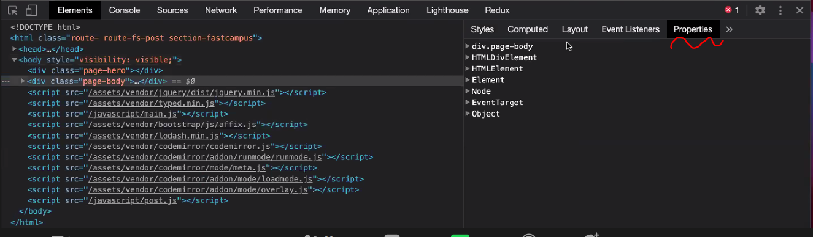
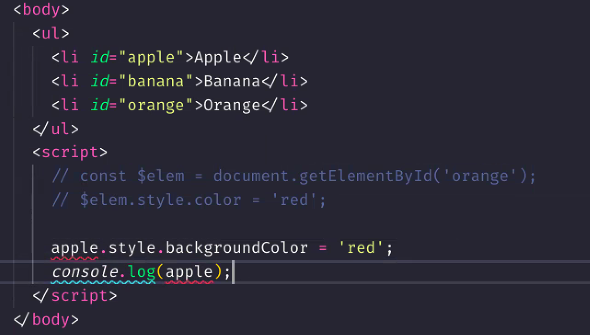
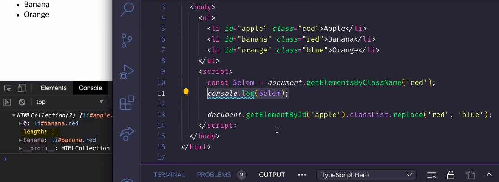

# 201228 - JavaScript Day 18 

## Chapter 39. DOM
- HTML은 정보 뿐만 아니라 구조 또한 표현한다 
- DOM 자료 구조에는 프로퍼티, 메서드 등이 내장되어 있다
### 노드
1. HTML 요소와 노드 객체
  - 돔의 구성 요소가 노드 객체들이다 
  - 4개가 중요하당 : 문서 노드, 요소 노드, 텍스트 노드, 어트리뷰트 노드 
  - HTML은 파싱이 되어서 돔의 요소가 된다???
  - 텍스트 노드는 요소 노드의 자식이 된다 
  - 어트리뷰트 노드는 요소 노드와 형제 관계를 맺고 있는 것 같지만 실제로는 아니다. 
  - 엄밀히 따지면 어트리뷰트 노드는 DOM의 일원은 아니다 (부모가 없으니까)
2. 노드 객체의 타입

  - document 노드 : 문서 노드 &#8594; 진입점이자 루트노드이다 
  - html은 요소로 취급 안함 head, body만 자식으로 가질 수 있음
    - head meta정보만 가진다 해당 html만을 위한 정보 뷰포트에는 보이지 않음
    - body 실제 뷰포트에 보이는 내용 
  - 태그는 전부 요소 노드가 된다 
  - 요소 노드는 어트리뷰트 노드를 가질 수도 있고 안가질 수도 있다 
  - script, link 태그도 전부 요소 노드로 만들어진당
  - textnode는 진입점을 통해 부모 요소 노드에 접근해서 (**탐색**해서) 변경해야함
  - getElementById, querySelector
  - 문서, 요소, 어트리뷰트, 텍스트 노드 이 4가지는 알아두자!!

3. 노드 객체의 상속 구조
  - 타입스크립트 배울 때 잘 알아둬야하는데 일단은 가볍게 보고 넘어가라!

  - 프로토타입의 체인을 구성한다~ 맨 오른쪽이 생성자 함수 같은거
  - 각각 관리하는 프로퍼티가 다르기 때문에 같은 요소 노드라도 li, input 등 다 세세하게 나눠뒀다 
  - 상속 받는게 다 다르기 때문에 세부적으로 다 나눠두었다 (ex, 배열은 객체이면서 배열, 모든 객체가 다 배열은 아니다 - 집합을 생각해봐!) 

### 요소 노드 취득 
- 개발자 도구를 항상 열어놓고 개발하는 습관을 들이자..! 에디터만 이용하지 말구
- 개발자 도구 빨간 x 표시에 유념하면서~~~ (에러 발생했음을 의미)

- 내가 만든 코드가 아니면, 내가 만든 코드라도 배포가 된 상태이며 html을 건들면 안된다!!! id 필요하다고 막 고치면 안돼용

1. id를 이요한 요소 노드 취득
  - 가장 심플한 방법인데.. 문제는 html은 id가 고유하지 않아도 에러가 발생안함 (동일 id가 있을 수 있음...)
  - 강사님은 id 보다는 class를 선호 
  - `document.getElementById(문자열)` &#8594; 요소 노드 객체 반환 - ex) li#banana
  - document 문서 노드! 진입점!
  - 코딩 컨벤션 : 변수 이름 앞에 `$` 붙여줌 &#8594; 요소 노드 객체가 담겨있다는 의미 
  - `document.getElementById` 첫 번째 요소만 가져욤
  - 잘못 탐색하면 TypeError 발생. 없는 요소 노드를 찾으면 null이니까 (null.style.color 같은거) 그러니 console.log로 확인 사살해보자! 가져온 변수 확인!
  - 적은 양을 쓰고 테스트 해보고를 반복하자 console.log 달고 다녀~~ 
  - id를 붙여주면 id값을 식별자로 window에 ㅁㄴ ㅓ니아러??????????? &#8594; 그렇지만 이건 안티패턴
  
  - 카멜케이스를 쓰자 ~~ (ex, style.backgroundColor)
  - `getElementsById` - 이렇게 s 붙인 복수형은 자료 구조로 반환 &#8594; 그렇지만.. 쓰지 마세용.. 
  - id, class 등 순서도 컨벤션이 있어야 한다! 강사님은 항상 id가 앞으로!
  - `HTMLCollection` - live 객체, 유사 배열 객체이자 이터러블
    - 실시간으로 변한다 (상태 변화를 추척해서 반영하는 살아있는 객체)
    - console.log가 변경코드 먼저 와도 그걸 반영해버림
    
    - getElements~ 들은 (복수형) 사용하지 말자! 그렇지만 이유는 알아야겠지~?
  - 따라서 아이디 여러개 찾을 때는 `querySelectorAll` 사용 - `NodeList` 객체 반환 (but 이 아이도 live 객체로 돌 때가 있음)
  - 가장 좋은 방법은 요소 노드를 배열로 바꿔서 해라 **중요**
3. class를 이용한 요소 노드 취득
  - `querySelector()` : 요거요거 중요해요~ `.`쓰는거 잊지 말아용 (id 선택시에는 `#`)
  - `NodeList` 유사 배열 객체이자 이터러블 
    - entries, forEach, item 등 제공
    - `childNodes` 사용하면???? live객체로 돌 때가 있음...
  - `[...$elem]` 이런 식으로 배열로 풀어서 써랑!

- 요소 노드 취득!! getElementById, querySelector, querySelectorAll 이 셋만 잘 알아두자

- 이벤트 위임을 할 때 matches 라는 메서드가 중요하다~ 추후에 다시 배울 내용임

6. HTMLCollection 과 NodeList
  - length 가지고 있음 &#8594; for문 돌릴 수 있는 유사 배열 객체
  - 둘다 살아있는 객체이므로 주의!
  - 이 둘을 배열로 변환해서 쓰는게 가장 안전하다 

### 노드 탐색

- 전부 프로퍼티다! 호출 기호 사용하지 말아요 
- 자식요소 찾을 때는 childNodes 또는 children 

1. 공백 텍스트 노드
- 공백 문자도 텍스트 노드로 생성된다 &#8594; 공백 텍스트 노드
- 어트리뷰트 노드는 요소 노드의 sibling이 아님! 그렇기 때문에 nextsibling으로 취득할 수 없음 nextsibling 하면 공백 텍스트 노드가 나오는 경우가 많기 때문에 nextElement를 찾아야함

2. 자식 노드 탐색
  - `children` 
  - firstChild말고 `firstElementChild` 써

3. 자식 노드 존재 확인 
  - 함수를 써야해 이거는... 다른건 다 접근자 프로퍼티였는데 
  - 함수이므로 동사로 시작 `hasChild
  - length 써라 0이면 자식 노드 없다 

4. 요소 노드의 택스트 노드 탐색
  - 텍스트 노드는 요소 노드의 자식 요소임 
  - firstChild

5. 부모 노드 탐색
  - `parentNode` 텍스트 노드가 반환될 일이 없음 

6. 형제 노드 탐색
  - element 붙은거 써라 
  - 전부 프로퍼티 

### 노드 정보 취득
- 노드 정보 : 문서냐 요소냐 텍스트냐 nodeType 상수로 반환 
- nodeName 대문자로 리턴 

### 요소 노드의 텍스트 조작
#### `nodeValue`
- firstChild는 setter가 없어서 재할당은 안됨
- .firstChild.modeValue로 재할당 가능
#### `.textContent`
  - textContent는 get, set 둘다 가능해서 텍스트 교체할 때에는 이것을 써라~
  - 여기에 태그 넣으면 그냥 순수한 문자열로 인식 (파싱 안함)
  - `innerHTML` 을 사용하면 html을 파싱해서 태그로 삽입

### DOM 조작
1. `innerHTML` 상당히 편한 기능이다 get, set 다 있음
  - $fruits.innerHTML += '추가할 내용' 해야 기존꺼 유지 + 새로운거 추가 가능
  - 앞 또는 뒤에 추가 가능하지만 중간에 끼우는건 불가능
  - 문제가.. 보안에 취약하다... 크로스 사이트 스크립팅 공격
  - HTML sanitization을 사용해서 살균 처리 빡~ 스크립트 코드 다 없애버림 
  - 사용자가 입력하는 untrusted data는 전부 살균처리해줘야함... **면접 질문**
  - 하수 중의 하수...
  - innerHTML 쓰지 말라는게 아니라 이런 보안 상의 문제가 있으니 살균처리를 해서 써라! 
  - innerHTML은 새로 안만들어도 되는걸 만들어 버리니 퍼포먼스 문제가 있음 (기존 내용을 지우고 새롭게 만들기 때문에) - 그냥 냅둬도 되는데 지우고 새로 만드니까 
  - 따라서 하나 두개 정도의 목록이 있고 한두개만 더 추가할 때 
  - 기존 목록이 많으면 create 뭐시기로 한다

2. insertAdjacentHTML
  - innerHTML의 보완 기능?
  - 원하는 위치에 끼워넣을 수 있음 
  - beforebegin, afterbegin, beforeend, afterend - 첫 번째 인수로 넣어줌
  - 두 번째 인수로 넣어줄 문자열

- `createElement` : 가장 좋은 방법 
  - 문제점은... 귀찮오~ ㅎㅎㅎ 손이 많이 가~
  - 요소 노드 만들고 텍스트 노드 만들고~ 텍스트 노드를 요소 노드의 자식으로 넣어주고~ 여기까지는 dom에 안들어간거야!!(리플로우, 리페인트 발생 no) 또 그걸 부모 요소의 자식 노드로 추가~ dom에 넣어줘야징(리플로우, 리페인트 발생)
  - 다 각각 별개의 객체로 존재하니까 다 연결을 시켜주는거얌 appendChild (항상 뒤에 막냉이로 붙음)
  - createElement > createTextNode > appendChild >> appendChild(기존 DOM에 추가) 
  - 여러개 추가할 때, 한번만 리플로우 하게 하려면 불필요한 container가 필요하게 됨

- **`documentFragment`** 불필요한 container없이 단 한번만 리플로우 발생시키면서 DOM에 추가 

5. 마지막 노드로 추가 
  - 부모요소.appendChild.자식요소
  - 지정 위치에 추가 insertBefore(newNode, childNode)

6. 노드 이동
  - appendChild

7. 노드 복사 
  - 복사할놈.cloneNode

8. 노드 교체 
  - replaceChild(new, old)

9. 노드 삭제 
  - 부모요소.remoceChild(child)
  - 객체는 우리가 못지웡...ㅎㅎ 가비지 컬렉터가 하는거야 
  - 객체를 지우는게 아니고 연결을 끊어버리는거다 
  - cf, `remove` &#8594; 지울요소.remove 하면 그 요소만 쏙 빠짐 

### 어트리뷰트 (중요)
- 어트리뷰트 노드와 attributes 프로퍼티
  - .attributes.id.value 이런식은 너무 기니까 get, set 사용
  - `getAttribute()`, `setAttribute()`

- input의 value 프로퍼티는 초기값을 의미 
  - 사용자한테 입력받은 값은 value 프로퍼티에 따로 저장
  - value는 요소 노드에 두개가 있다 > 어트리뷰트에 있는 value(초기값), 요소노드에 있는 value 프로퍼티는 사용자가 입력하면 바뀐다 (상태 변경 - 렌더링에 영향을 준다, 요소 노드가 관리)
    - 리액트에서는 component가 상태 관리하게 해야함 

- **요소 노드의 초기 상태는 어트리뷰트 노드가 관리하고, 요소 노드의 최신 상태는 DOM프로퍼티가 관리한다**

---

CBD (component based development)
  - 개발 방식 중 하나
  - jQuery는 컴포넌트 위주의 애플리케이션 개발 방식에 어울리지 않아서 시들해진 것일 뿐, 굉장히 훌륭한 라이브러리임
  - 웹 사이트 만들 때는 jquery 사용해주는게 좋음 
- 바닐라 스크립트는 기본 중의 기본..! 
    - 뷰, 앵귤러, 리액트 3대장
    - 리액트는 js 도와주는거 
- 지금 바닐리 자바스크립트를 배우면서 어떤 문제점이 있는가..어떤 점이 불편한지 그것을 알고 다른 프레임워크로 커버쳐야함 
- 활용의 측면만이 아니라 체험의 측면도 생각해라! 어떤 문제가 있어서 왜 이런게 나왔고 
- 소스코드를 까보고 공부하자.... 쀼 ㅜㅜ 
