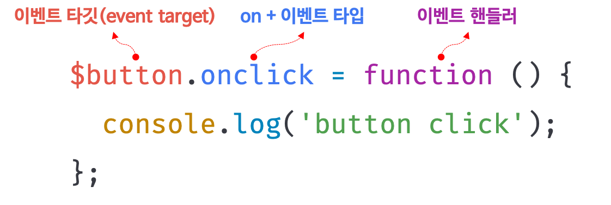
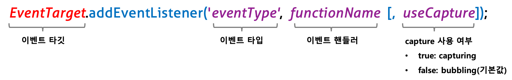
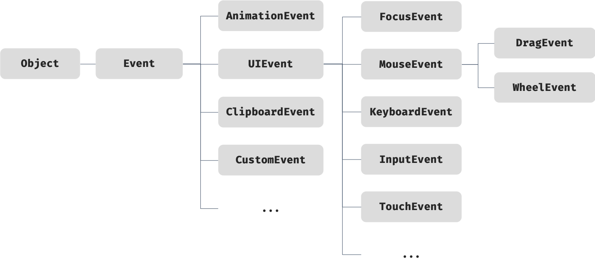
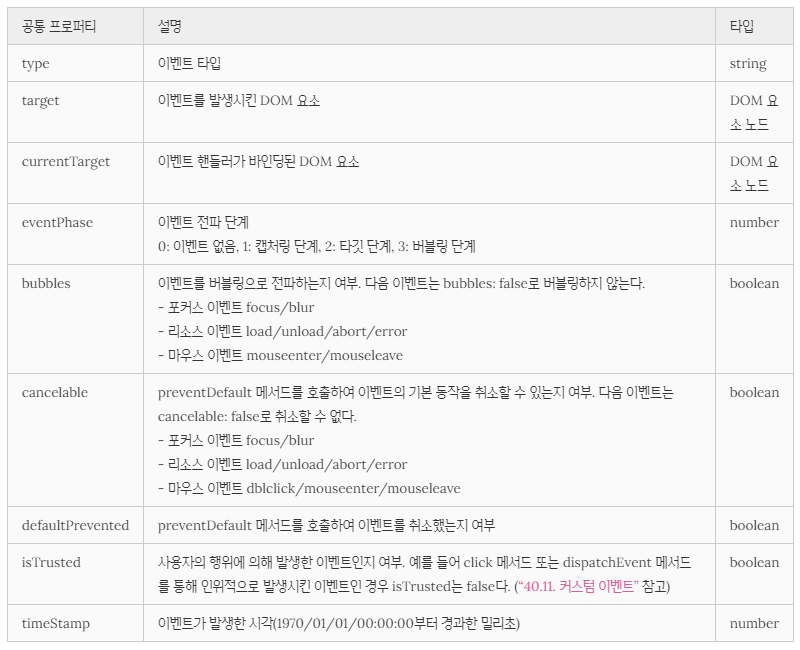
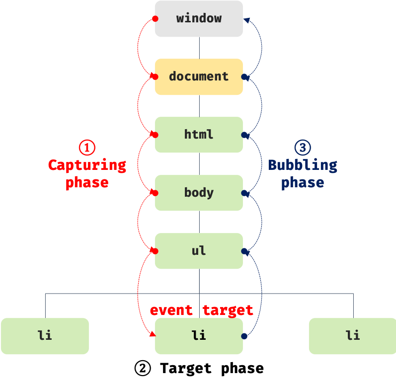

## Chapter 40. 이벤트 

### 이벤트 드리븐 프로그래밍
- 브라우저는 처리해야 할 특정 사건이 발생하면 이를 감지하여 이벤트(event)를 발생(trigger)시킴 (ex, 클릭, 키보드 입력, 마우스 이동 등)
- **이벤트 핸들러(event handler)** : 이벤트가 발생했을 때 호출될 함수
- **이벤트 핸들러 등록** : 이벤트가 발생했을 때 브라우저에게 이벤트 핸들러의 호출을 위임하는 것
```html
<!DOCTYPE html>
<html>
<body>
  <button>Click me!</button>
  <script>
    const $button = document.querySelector('button');

    // 사용자가 버튼을 클릭하면 함수를 호출하도록 요청
    $button.onclick = () => { alert('button click'); };
  </script>
</body>
</html>
```
- 이벤트 핸들러 프로퍼티에 함수를 할당하면 해당 이벤트가 발생했을 때 할당한 함수가 브라우저에 의해 호출됨 &#8594; 이벤트와 이벤트 핸들러를 통해 사용자와 애플리케이션은 상호작용(interaction) 할 수 있음
- **이벤트 드리븐 프로그래밍(event-driven programming)** : 프로그램의 흐름을 이벤트 중심으로 제어하는 프로그래밍 방식

### 이벤트 타입 (event type)
이벤트 타입은 이벤트의 종류를 나타내는 문자열로 약 200여 가지가 있음
참고 : [Event reference by MDN](https://developer.mozilla.org/ko/docs/Web/Events)

1. 마우스 이벤트  
  - click, dblclick, mousedown, mouseup, mousemove, mouseenter, mouseover, mouseleave, mouseout
2. 키보드 이벤트 
  - keydown, keypress(폐지됨), keyup
3. 포커스 이벤트 
  - focus, blur, focusin, focusout
4. 폼 이벤트 
  - submit, reset
5. 값 변경 이벤트 
  - input, change, readystatechange
6. DOM 뮤테이션 이벤트 
  - DOMContentLoaded
7. 뷰 이벤트 
  - resize, scroll
8. 리소스 이벤트 
  - load, unload, abort, error

### `이벤트 핸들러 등록`
- event handler 또는 event listene : 이벤트가 발생하면 브라우저에 의해 호출될 함수  
- 이벤트 핸들러를 등록하는 방법은 3가지가 있음

1. 이벤트 핸들러 어트리뷰트 방식
  - HTML 요소의 어트리뷰트 중에는 이벤트에 대응하는 이벤트 핸들러 어트리뷰트가 있음
  - 이벤트 핸들러 어트리뷰트의 이름은 on 접두사와 이벤트 타입으로 이루어져 있음
  - 이벤트 핸들러 등록 &#8594; 이벤트 핸들러 어트리뷰트 값으로 문(statement)을 할당 (ex, 함수 호출문)
  - 이벤트 핸들러 어트리뷰트 값은 암묵적으로 생성될 이벤트 핸들러의 함수 몸체를 의미 &#8594; 이벤트 핸들러 어트리뷰트 값으로 여러 개의 문 할당 가능
  - 이벤트 핸들러 어트리뷰트 방식은 더는 사용하지 않는 것이 좋다 (HTML과 JS는 관심사가 다르므로 분리하는 것이 좋기 때문)
  - BUT, CBD(Component Based Development) 방식의 Angular/React/Svelte/Vue.js 같은 프레임워크/라이브러리에서는 이벤트 핸들러 어트리뷰트 방식으로 이벤트를 처리 (HTML, CSS, JS를 관심사가 다른 개별적인 요소가 아닌, 뷰를 구성하기 위한 구성 요소로 보기 때문에 관심사가 다르다고 생각하지 않음)

2. 이벤트 핸들러 프로퍼티 방식
  - window 객체와 Document, HTMLElement 타입의 DOM 노드 객체는 이벤트에 대응하는 이벤트 핸들러 프로퍼티를 가지고 있음
  - 이벤트 핸들러 프로퍼티의 키는 on 접두사와 이벤트 타입으로 이루어짐
  - 이벤트 핸들러 프로퍼티에 함수를 바인딩하면 이벤트 핸들러가 등록됨
  - 이벤트 핸들러를 등록하기 위해서는,
    - 이벤트 타깃(event target) : 이벤트를 발생시킬 객체
    - 이벤트 타입(event type) : 이벤트의 종류를 나타내는 문자열
    - 이벤트 핸들러(event handler)  
    위 세가지를 지정할 필요가 있음
  
  - 이벤트 핸들러는 대부분 이벤트를 발생시킬 이벤트 타깃에 바인딩 (반드시 그런 것은 아님)
  - 단점 : 이벤트 핸들러 프로퍼티에 하나의 이벤트 핸들러만 바인딩할 수 있음
3. addEventListener 메서드 방식
  - `EventTarget.prototype.addEventListener` 메서드 사용하여 이벤트 핸들러 등록 (DOM Level2에서 도입)
  
  - 첫 번째 매개변수에는 이벤트의 종류를 나타내는 문자열인 이벤트 타입을 전달 (on 접두사 없이!)
  - 두 번째 매개변수에는 이벤트 핸들러를 전달
  - 마지막 매개변수에는 이벤트를 캐치할 이벤트 전파 단계(캡처링 또는 버블링)를 지정
    - 생략하거나 false를 지정하면 버블링 단계에서 이벤트를 캐치
    - true를 지정하면 캡처링 단계에서 이벤트를 캐치
  ```html
  <!DOCTYPE html>
  <html>
  <body>
    <button>Click me!</button>
    <script>
      const $button = document.querySelector('button');

      // 이벤트 핸들러 프로퍼티 방식
      // $button.onclick = function () {
      //   console.log('button click');
      // };

      // addEventListener 메서드 방식
      $button.addEventListener('click', function () {
        console.log('button click');
      });
    </script>
  </body>
  </html>
  ```
  - 동일한 HTML 요소에서 발생한 동일한 이벤트에 대해 이벤트 핸들러 프로퍼티 방식은 하나 이상의 이벤트 핸들러를 등록할 수 없지만 addEventListener 메서드는 하나 이상의 이벤트 핸들러를 등록할 수 있음 &#8594; 이벤트 핸들러는 등록된 순서대로 호출됨
  - 단, addEventListener 메서드를 통해 참조가 동일한 이벤트 핸들러를 중복 등록하면 하나의 이벤트 핸들러만 등록

### 이벤트 핸들러 제거 

- addEventListener 메서드로 등록한 이벤트 핸들러를 제거하려면 `EventTarget.prototype.removeEventListener` 메서드를 사용
- 전달할 인수는 addEventListener와 동일 (이벤트 타입, 이벤트 핸들러, 이벤트 전파 단계)
- 주의: addEventListener 메서드에 전달한 인수와 removeEventListener 메서드에 전달한 인수가 일치하지 않으면 이벤트 핸들러가 제거되지 않음 &#8594; 무명 함수를 이벤트 핸들러로 등록한 경우 제거 불가.. 
- 이벤트 핸들러를 제거하려면 이벤트 핸들러의 참조를 변수나 자료구조에 저장하고 있어야 함
- 기명 이벤트 핸들러 내부에서 removeEventListener 메서드를 호출하여 이벤트 핸들러를 제거하는 것은 가능(이때 이벤트 핸들러는 단 한번만 호출)
- 이벤트 핸들러 프로퍼티 방식으로 등록한 이벤트 핸들러는 removeEventListener 메서드로 제거 불가
  - 이벤트 핸들러 프로퍼티 방식으로 등록한 이벤트 핸들러를 제거하려면 이벤트 핸들러 프로퍼티에 null을 할당

### 이벤트 객체 
- 이벤트가 발생하면 이벤트에 관련한 다양한 정보를 담고 있는 이벤트 객체가 동적으로 생성되는데 이 객체는 이벤트 핸들러의 첫 번째 인수로 전달됨 &#8594; 이벤트 객체를 전달받으려면 이벤트 핸들러를 정의할 때 이벤트 객체를 전달받을 매개변수를 명시적으로 선언해야 함!!
- 이벤트 핸들러 어트리뷰트 방식의 경우 이벤트 객체를 전달받으려면 이벤트 핸들러의 첫 번째 매개변수 이름이 반드시 event이어야 함 &#8594; 이벤트 핸들러 어트리뷰트 값은 암묵적으로 생성되는 이벤트 핸들러의 함수 몸체를 의미하기 때문

1. 이벤트 객체의 상속 구조
  
  - 위 그림의 Event, UIEvent, MouseEvent 등 모두 생성자 함수 &#8594; 호출하여 이벤트 객체 생성 가능
  - Event 인터페이스는 DOM 내에서 발생한 이벤트에 의해 생성되는 이벤트 객체를 나타냄
  - Event 인터페이스에는 모든 이벤트 객체의 공통 프로퍼티가 정의되어 있고 FocusEvent, MouseEvent, KeyboardEvent, WheelEvent 같은 하위 인터페이스에는 이벤트 타입에 따라 고유한 프로퍼티가 정의되어 있음
  - 이벤트 객체의 프로퍼티는 발생한 이벤트의 타입에 따라 달라짐

2. 이벤트 객체의 공통 프로퍼티
  - Event 인터페이스, 즉 Event.prototype에 정의되어 있는 이벤트 관련 프로퍼티는 모든 파생 이벤트 객체에 상속됨 (= 모든 이벤트 객체가 상속받는 공통 프로퍼티)
  

3. 마우스 정보 취득
  - `MouseEvent` 타입의 이벤트 객체는 다음과 같은 고유의 프로퍼티를 가짐
    - 마우스 포인터의 좌표 정보를 나타내는 프로퍼티 : screenX/screenY, clientX/clientY(뷰포트 기준), pageX/pageY, offsetX/offsetY
    - 버튼 정보를 나타내는 프로퍼티 : altKey, ctrlKey, shiftKey, button
  - ex, 드래그는 mousedown 이벤트가 발생한 상태에서 mousemove 이벤트가 발생한 시점에 시작하고 mouseup 이벤트가 발생한 시점에 종료

4. 키보드 정보 취득
  - `KeyboardEvent` 타입의 이벤트 객체는 altKey, ctrlKey, shiftKey, metaKey, key, keyCode(폐지됨.. key를 써라) 같은 고유의 프로퍼티를 가짐
  - input 요소의 입력 필드에 한글을 입력하고 엔터 키를 누르면 keyup 이벤트 핸들러가 두 번 호출되는 현상이 발생 &#8594; keyup 이벤트 대신 keydown 이벤트를 캐치하면 문제 회피 가능

### `이벤트 전파`(event propagation)

- DOM 트리 상에 존재하는 DOM 요소 노드에서 발생한 이벤트는 DOM 트리를 통해 전파되는데 이를 이벤트 전파라 함
- 이벤트가 발생하여 생성된 이벤트 객체는 이벤트를 발생시킨 DOM 요소인 이벤트 타깃(event target)을 중심으로 DOM 트리를 통해 전파됨



  1. 캡쳐링 단계(capturing phase) : 이벤트가 상위 요소에서 하위 요소 방향으로 전파 (window에서 시작해서 이벤트 타깃 방향으로 전파)
  2. 타깃 단계(target phase) : 이벤트 객체가 이벤트를 발생시킨 이벤트 타깃에 도달
  3. 버블링 단계(bubbling phase) : 이벤트가 하위 요소에서 상위 요소 방향으로 전파 (이벤트 타깃에서 시작해서 window 방향으로 전파)

- 이벤트 핸들러 어트리뷰트/프로퍼티 방식으로 등록한 이벤트 핸들러는 타깃 단계와 버블링 단계의 이벤트만 캐치
- 캡처링 단계의 이벤트를 캐치하려면 addEventListener 메서드의 3번째 인수로 true를 전달해야 함
- 이벤트 핸들러가 캡처링 단계의 이벤트를 캐치하도록 설정되어 있다면 이벤트 핸들러는 window에서 시작해서 이벤트 타깃 방향으로 전파되는 이벤트 객체를 캐치하고, 이벤트를 발생시킨 이벤트 타깃과 이벤트 핸들러가 바인딩된 커런트 타깃이 같은 DOM 요소라면 이벤트 핸들러는 타깃 단계의 이벤트 객체를 캐치 ......... 어렵당

- 대부분의 이벤트는 캡처링과 버블링을 통해 전파되지만, 버블링을 통해 이벤트를 전파하는지 여부를 나타내는 이벤트 객체의 공통 프로퍼티 event.bubbles의 값이 false인 이벤트들도 있다
  - 포커스 이벤트 : focus/blur
  - 리소스 이벤트 : load/unload/abort/error
  - 마우스 이벤트 : mouseenter/mouseleave

### `이벤트 위임`
- 이벤트 위임(event delegation) : 여러 개의 하위 DOM 요소에 각각 이벤트 핸들러를 등록하는 대신 하나의 상위 DOM 요소에 이벤트 핸들러를 등록하는 방법
- 이벤트 위임을 통해 상위 DOM 요소에 이벤트 핸들러를 등록하면 여러 개의 하위 DOM 요소에 이벤트 핸들러를 등록할 필요가 없음
- 이벤트 위임을 통해 하위 DOM 요소에서 발생한 이벤트를 처리할 때 주의할 점은 상위 요소에 이벤트 핸들러를 등록하기 때문에 이벤트 타깃, 즉 이벤트를 실제로 발생시킨 DOM 요소가 개발자가 기대한 DOM 요소가 아닐 수도 있다는 것

### DOM 요소의 기본 동작 조작

1. DOM 요소의 기본 동작 중단
  - `preventDefault` 메서드 사용
2. 이벤트 전파 방지
  - `stopPropagation` 메서드 사용

### 이벤트 핸들러 내부의 this
1. 이벤트 핸들러 어트리뷰트 방식
  ```html
  <!DOCTYPE html>
  <html>
  <body>
    <button onclick="handleClick()">Click me</button>
    <script>
      function handleClick() {
        console.log(this); // window
      }
    </script>
  </body>
  </html>
  ```
  - 위 예제처럼 이벤트 핸들러에 의해 일반 함수로 호출되면 this는 전역 객체 window를 가리킴
  - 이벤트 핸들러를 호출할 때 인수로 전달한 this는 이벤트를 바인딩한 DOM 요소를 가리킴(암묵적으로 생성된 이벤트 핸들러 내부의 this) &#8594; ex) `<button onclick="handleClick(this)">Click me</button>`
2. 이벤트 핸들러 프로퍼티 방식과 addEventListener 메서드 방식
  - 이벤트 핸들러 프로퍼티 방식과 addEventListener 메서드 방식 모두 이벤트 핸들러 내부의 this는 이벤트를 바인딩한 DOM 요소를 가리킴 
  - 즉, 이벤트 핸들러 내부의 this는 이벤트 객체의 currentTarget 프로퍼티와 같음
  - 화살표 함수로 정의한 이벤트 핸들러 내부의 this는 상위 컨텍스트의 this를 가리킴

### 이벤트 핸들러에 인수 전달
- 이벤트 핸들러 어트리뷰트 방식은 함수 호출문을 사용할 수 있기 때문에 인수를 전달할 수 있지만 이벤트 핸들러 프로퍼티 방식과 addEventListener 메서드 방식의 경우 이벤트 핸들러를 브라우저가 호출하기 때문에 함수 호출문이 아닌 함수 자체를 등록해야 함
- 이벤트 핸들러 프로퍼티 방식과 addEventListener 메서드 방식에 인수를 전달하려면, 1) 이벤트 핸들러 내부에서 함수를 호출하면서 전달, 2) 이벤트 핸들러를 반환하는 함수를 호출하면서 인수를 전달하는 방법이 있음

### 커스텀 이벤트
1. 커스텀 이벤트 생성
  - Event, UIEvent, MouseEvent 같은 이벤트 생성자 함수를 호출하여 명시적으로 생성한 이벤트 객체는 임의의 이벤트 타입 지정 가능 &#8594; 이렇게 개발자의 의도로 생성된 이벤트를 **커스텀 이벤트**라고 함
  - 이벤트 생성자 함수
    - 첫 번째 인수로 이벤트 타입을 나타내는 문자열을 전달받음
    - 이벤트 타입을 나타내는 문자열은 기존의 이벤트 타입을 사용할 수도 있고, 기존 이벤트 타입이 아닌 임의의 문자열을 사용하여 새로운 이벤트 타입을 지정할 수도 있음  
    &#8594; 이 경우 일반적으로 `CustomEvent` 이벤트 생성자 함수 사용
  - 생성된 커스텀 이벤트 객체는 버블링되지 않으며 `preventDefault` 메서드로 취소할 수 없음 &#8594; bubbles와 cancelable 프로퍼티의 값이 기본 false 
  - bubbles또는 cancelable 프로퍼티를 true로 설정하려면 이벤트 생성자 함수의 두 번째 인수로 bubbles 또는 cancelable 프로퍼티를 갖는 객체를 전달
  - 이벤트 생성자 함수로 생성한 커스텀 이벤트는 isTrusted 프로퍼티의 값이 언제나 false
2. 커스텀 이벤트 디스패치
  - 생성된 커스텀 이벤트는 `dispatchEvent` 메서드로 디스패치(dispatch, 이벤트를 발생시키는 행위) 가능
  - `dispatchEvent` 메서드에 이벤트 객체를 인수로 전달하면서 호출하면 인수로 전달한 이벤트 타입의 이벤트가 발생
  - 일반적으로 이벤트 핸들러는 비동기(asynchronous) 처리 방식으로 동작하지만 dispatchEvent 메서드는 이벤트 핸들러를 동기(synchronous) 처리 방식으로 호출 = dispatchEvent 메서드를 호출하면 커스텀 이벤트에 바인딩된 이벤트 핸들러를 직접 호출하는 것과 동일
  - CustomEvent 이벤트 생성자 함수에는 두 번째 인수로 이벤트와 함께 전달하고 싶은 정보를 담은 detail 프로퍼티를 포함하는 객체를 전달할 수 있음
  - **기존 이벤트 타입이 아닌 임의의 이벤트 타입을 지정하여 커스텀 이벤트 객체를 생성한 경우 반드시 addEventListener 메서드 방식으로 이벤트 핸들러를 등록해야 함**
