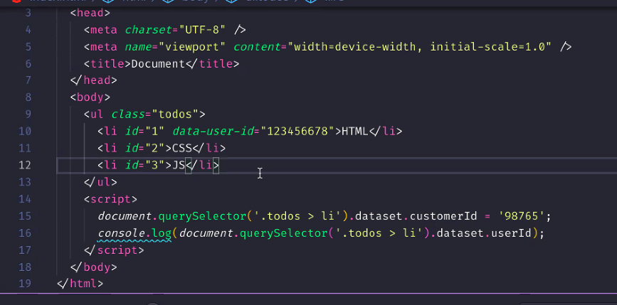
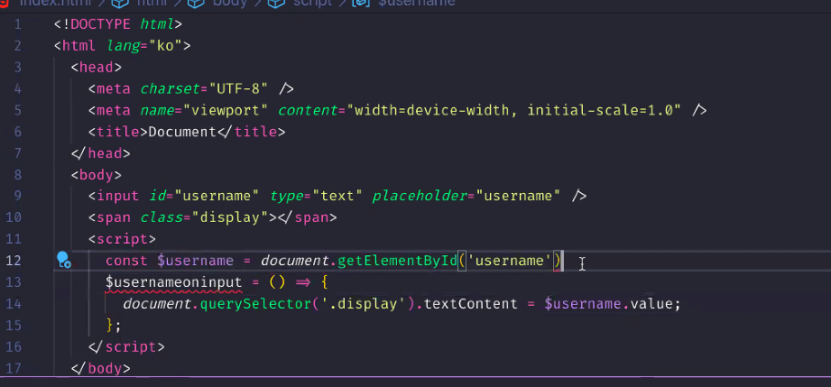
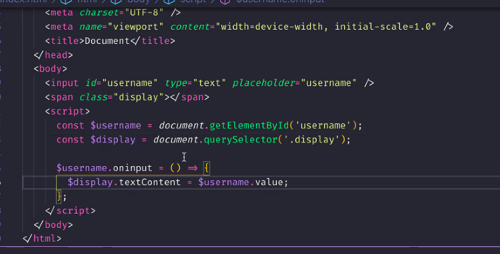
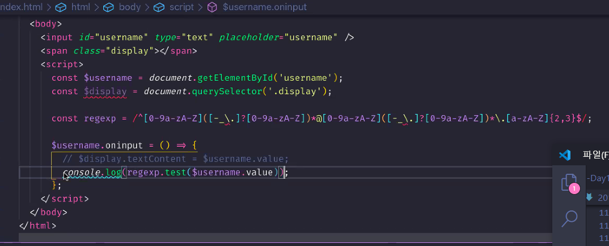
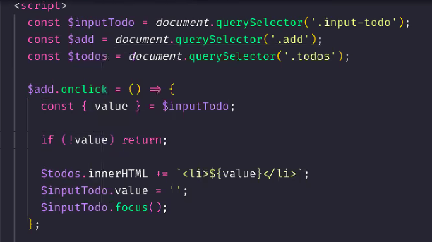
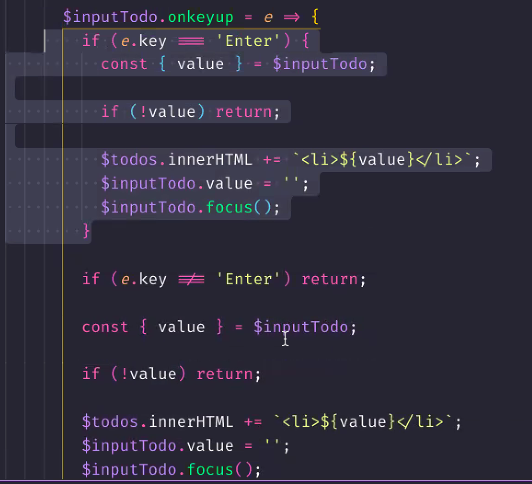

# 201229 - JavaScript Day 19

## Chapter 39. DOM

### 어트리뷰트

어트리뷰트 값 고정값 ???

- checked와 같은 프로퍼티는 값이 중요한게 아니라 그 단어가 있는지 없는지가 중요 (프로퍼티 이름과 동일한 어트리뷰트가 또 있다!) &#8594; `checked=""` 빈문자열을 가지고 있는거임

- DOM 프로퍼티에서 현재 상태 관리 
- 어트리뷰트에서 초기 상태 관리 

4. data 어트리뷰트와 dataset 프로퍼티 (**많이 쓰임**)
  - 어트리뷰트를 우리가 정의할 수 있음 (ex, data-user-id="")
  - 접근할 때는 dataset.userId 
  - dataset은 프로퍼티 만들때에도 사용 가능 dataset.cumtomerID -> 자동으로 케밥케이스로 만들어서 추가해줌
  

### 스타일
- 케밥케이스로 
- 인라인 스타일 추가 (인라인이 우선 순위 높음)
- 두가지 방법
  - className - class는 예약어이기 때문에 class라고 못 지음, 옛날꺼 값이 문자열, 요즘꺼는 `classList`
  - classList는 값이 객체 (유사 배열 객체)
    - add, remove, item, replace 등 제공하는 메서드 알아두자 많이 쓰인다고 함
    - contains 전달한 인수를 가지고 있냐! Boolean으로 값 반환
    - 메서드는 코드를 만들어보면서 익숙해지자! 외우려하지 말고 
    - item은 가지고 오는거 
    - **toggle** 중요 : binary 모 아니면 도, 가지고 있으면 떼어버리고 없으면 붙여버령~

3. 요소에 적용되어 있는 CSS 스타일 참조 
  - 직접 지정하지 않은 css프로퍼티 `getComputedStyle`사용. 객체 반환 ... 한번 해봐라~~~ : 조심해서 써야함 ... 이거 호출하면 reflow가 발생.. 그니까 꼭 필요할 때만 써라~

### DOM 표준
dom도 버전이 있다 
level 3이 지금 표준
적용이 빠름.. html은 느림.. ㅋㅋ

## Chapter 40. 이벤트 

### 이벤트 드리븐 프로그래밍
- 이벤트가 발생하면 브라우저가 캐치! 그러고 함수를 호출해줌 그때 이 함수를 이벤트 리스너 또는 이벤트 핸들러라고 함 
- **브라우저가** 이벤트 핸들러를 **호출**! 
- 브라우저에게 호출을 '의뢰' 
- 뷰를 생각하자! 
  - 뷰를 이루고 있는 html 요소들은 계층 구조를 갖는다 &#8594; eventTarget 프로토타입을 상속받음(eventTarget은 object밑에) - 이벤트를 발생시킬 수 있다 
- DOM은 xml, svg에 의해서도 형성됨 - 이들도 이벤트를 발생시킴
- 이벤트 종류가 200여 가지가 있지만.. 웹 프로그래밍에서 많이 쓰는거는 10개 정도..? 
 
### 이벤트 타입
이벤트의 종류를 말함

1. 마우스 이벤트 
  - 좌표가 있어야 함 (move든, click이든)
  - hover &#8594; mouseenter, mouseover
  - 버블링이란?  이벤트가 전파가 된다...
2. 키보드 이벤트
  - 어떤 키를 눌렀느냐 enter, esc 등
  - 한글이 먹히고 안먹히고 그런게 있음
3. 포커스 이벤트
  - blur : 포커스가 빠지는.. 유효검사 등을 하기 적당한 타이밍
4. 폼 이벤트
  - 서버로 전송
  - submit 이벤트 &#8594; form 태그가 발생시킴
5. 값 변경 이벤트
  - input 한글자 한글자마다 input 이벤트 발생
  - 포커스가 입력창에서 빠지면 change 이벤트 발생
  - **checkbox에서는 체크 됐다 풀렸다 할때 change 이벤트 발생**
  - native event 브라우저가 기본 제공하는 이벤트 
  - readystatechange: dom 문서의 파싱 상태 나타냄 = document.readyState 프로퍼티 값이 바뀔 때마다 이 이벤트가 발생
6. **dom 뮤테이션 이벤트** 
  - `DOMContentLoaded` : 돔이 다 완성됐을 때 발생하는 - 사용할 일 많음!!
7. 뷰 이벤트
  - 굉장히 조심해야함.. 이벤트가 엄청 많이 발생..
  - resize, scroll 다른 기법과 엮어서 가야하고.. 이 두 이벤트를 안쓰는게 최고 베스트
8. 리소스 이벤트
  - 로딩 완료되면 load (ex, ) window객체에서 ?????
    - img 로드 이벤트 발생??????? 엥 ㅜㅜ 못들음
  - abort, unload 잘 안씀
  - error - path가 틀렸다거나.. 

- click, mouseenter, mouseover, mouseleave, keydown, keypress, keyup, focus, blur, submit , input change domcontendloaded, resize, scroll 이 많이 쓰임 잘 알아두자 

### 이벤트 핸들러 등록
- 함수는 만들지만 호출은 우리가 안함.. 호출 타이밍은 브라우저만 알고 있으니까 
- 브라우저에게 함수를 전달하면서 어떤 이벤트가 발생했을 때 이 함수를 호출해달라고 부탁, 위임 하는것 

1. 옛날 방식 - 어트리뷰트
html 상에서 js 사용하는것
- 항상 어트리뷰트의 값은 문자열! 문자열로 js코드를 주는것 
- on 접두사 붙이고 이벤트 타입을 적어줌
- 호출 해도 됨.. 안하면 인수를 전달할 방법이 없음
  - 실제로는 내부에서 문자열을 가지고 함수를 만들어버림 암묵적으로.. 
  - 함수 이름을 어트리부트랑 동일한 이름으로 만들어줌 - 인수를 전달할 수 있는 방법을 제공하기 위해서 
- 함수 body 안에 들어올 문들이 온다 호출문 인수에, 문을 여러개 써도 됨
이벤트 핸들러 프로퍼티... 많이 가지고 있음

```html
<button onclick="sayHi('Park')">Click me!</button>
```
- 리액트, 뷰, 앵귤러 등도 다 이런 방식 사용
- cbd 방식.. 컴퍼넌트를 만드는 방식 - html, css,js가 같이 존재해야한다고 생각 이게 다 있어야 뭘?? 만들수 있기 때문
- 한꺼번에 다 같이 있는게.. 코딩하기는 편하다 
- 바닐라로만 개발해야한다면.. 이 방식은 비추 


2. 이벤트 핸들러 프로퍼티 방식 &#8594; 가장 일반적
  - 함수 호출 아니고 함수 정의를 함 
  ```html
  <button>Click me!</button>
  <script>
    const $button = 
    $button.onclick = function() {
      console.log('button click');
    };
  </script>
  ```
  - 이벤트를 발생시키는 타깃..에 이벤트 핸들러를 달아줌???????
  - dom과 이벤트는 같이 돈다 
  
  - 계속 호출됨.. 쓸데없는 반복하지 않게 잘 생각하자 몇번 호출이 되고 그런건
  
  
  - 이메일형식에 맞는지 확인.. 쓸데없이 계속 호출함 이벤트를 oninput하면 한글자마다 이벤트 계속 발생 .. blur해주면 enter안할 수도 있으니 keyup

  - 브라우저가 이벤트가 발생하면 이벤트 객체를 생성 
    - 이벤트 핸들러의 첫 번째 인수로
    - 이벤트 객체가 알고 있다 .. 

  아... 여기 진ㅉㅏ 모르겠넹..퓨우... 

  - 사용자를 생각해서 편의성 확보..다음 행동까지 예측해서..? 
  

  - 이벤트 코드(폐지됨)보다는 이벤트 키를 봐라! 이벤트 키 프로퍼티 
  
  - 엔터키를 눌렀을때도 적용되게끔.. 아래쪽 코드가 더 좋다 !

  - form의 기본 동작?은 서버와 통신하는거  
    - action 서버의 자산
    - 근데 우리는 submit 이벤트만 캐치해야하니까 기본 동작을 막아줘야함 통신하려는게 아니니까 
    - form이 유용하긴 한갑당...
    
