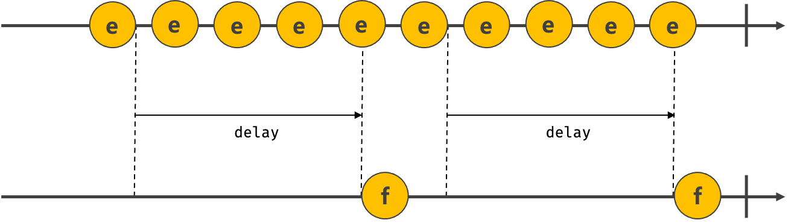

## Chapter 41. 타이머

### 호출 스케줄링
- 함수를 명시적으로 호출하지 않고 일정 시간이 경과된 이후에 호출되도록 함수 호출을 예약하려면 타이머 함수를 사용하는데 이를 호출 스케줄링(scheduling a call)이라 함
- JS는 타이머를 생성할 수 있는 타이머 함수 `setTimeout`과 `setInterval`, 타이머를 제거할 수 있는 타이머 함수 `clearTimeout`과 `clearInterval`을 제공
- 타이머 함수는 호스트 객체
- setTimeout 함수가 생성한 타이머는 단 한 번 동작하고, setInterval 함수가 생성한 타이머는 반복 동작 ⇒ setTimeout 함수의 콜백 함수는 타이머가 만료되면 단 한 번 호출되고, setInterval 함수의 콜백 함수는 타이머가 만료될 때마다 반복 호출
- 자바스크립트 엔진은 단 하나의 실행 컨텍스트 스택을 갖기 때문에 두가지 이상의 태스크를 동시에 실행할 수 없음 ⇒ 자바스크립트 엔진은 **싱글 스레드(single thread)**로 동작

### 타이머 함수 
1. setTimeout / clearTimeout
  - setTimeout 함수는 두 번째 인수로 전달받은 시간(ms)으로 단 한 번 동작하는 타이머를 생성하고, 그 타이머가 만료되면 첫 번째 인수로 전달받은 콜백 함수가 호출된다.  
  &#8594; setTimeout 함수의 콜백 함수는 두 번째 인수로 전달받은 시간 이후 **단 한 번 실행**되도록 호출 스케줄링됨
  ```jsx
  const timeoutId = setTimeout(func[, delay, param1, param2, ...]);
  ```
  - delay 인수 전달을 생략한 경우 기본값 0 지정
  - param : 호출 스케줄링된 콜백함수에 전달해야 할 인수가 존재하는 경우
  - setTimeout 함수는 생성된 타이머를 식별할 수 있는 **고유한 타이머 id를 반환** (브라우저 환경: 숫자, Node.js 환경: 객체)
  - setTimeout 함수가 반환한 타이머 id를 clearTimeout 함수의 인수로 전달하여 타이머 취소 가능 ⇒ `clearTimeout` 함수는 호출 스케줄링을 취소
2. setInterval / clearInterval
  - setInterval 함수는 두 번째 인수로 전달받은 시간(ms)으로 반복 동작하는 타이머를 생성하고, 타이머가 만료될 때마다 첫 번째 인수로 전달받은 콜백 함수가 반복 호출된다.  
  &#8594; setInterval 함수의 콜백 함수는 두 번째 인수로 전달받은 시간이 경과할 때마다 **반복 실행**되도록 호출 스케줄링됨
  - setInterval 함수도 setTimeout 함수와 마찬가지로 생성된 타이머를 식별할 수 있는 **고유한 타이머 id를 반환**
  - setInterval 함수가 반환한 타이머 id를 `clearInterval` 함수의 인수로 전달하여 타이머 취소 가능

### `디바운스와 스로틀`
- scroll, resize, input, mousemove 같은 이벤트는 짧은 시간 간격으로 연속해서 발생 &#8594; 이벤트 핸들러가 과도하게 호출되어 성능상 문제 있을 수 있음 
- **디바운스**와 **스로틀**은 짧은 시간 간격으로 연속해서 발생하는 이벤트를 그룹화해서 과도한 이벤트 핸들러의 호출을 방지하는 프로그래밍 기법

1. 디바운스(debounce)
  - 짧은 시간 간격으로 이벤트가 연속해서 발생하면 이벤트 핸들러를 호출하지 않다가 일정 시간이 경과한 이후에 이벤트 핸들러가 한 번만 호출되도록 함  
  ⇒ 짧은 시간 간격으로 발생하는 이벤트를 그룹화 &#8594; 마지막에 한 번만 이벤트 핸들러 호출
  
  - 짧은 시간 간격으로 이벤트가 연속해서 발생하면 이벤트 핸들러를 호출하지 않다가 일정 시간 동안 이벤트가 더 이상 발생하지 않으면 이벤트 핸들러가 한 번만 호출되도록 하는 디바운스는 resize 이벤트 처리나 input 요소에 입력된 값으로 ajax 요청하는 입력필드 자동완성(autocomplete) UI 구현, 버튼 중복 클릭 방지 처리 등에 유용하게 사용
  - 실무에서는 Underscore의 debounce 함수나 Lodash의 debounce 함수를 사용하는 것을 권장

2. 스로틀(throttle)
  - 짧은 시간 간격으로 이벤트가 연속해서 발생하더라도 일정 시간 간격으로 이벤트 핸들러가 최대 한 번만 호출되도록 함  
  ⇒ 짧은 시간 간격으로 연속해서 발생하는 이벤트를 그룹화해서 일정 시간 단위로 이벤트 핸들러가 호출되도록 호출 주기를 만듦
  - throttle 함수가 반환한 함수는 throttle 함수에 두 번째 인수로 전달한 시간(delay)이 경과하기 이전에 이벤트가 발생하면 아무것도 하지 않다가 delay 시간이 경과했을 때 이벤트가 발생하면 콜백 함수를 호출하고 새로운 타이머를 재설정 &#8594; delay 시간 간격으로 콜백 함수가 호출
  
  - scroll 이벤트 처리나 무한 스크롤(infinite scrolling) UI 구현 등에 유용하게 사용
  - 실무에서는 Underscore의 throttle 함수나 Lodash의 throttle 함수를 사용하는 것을 권장


