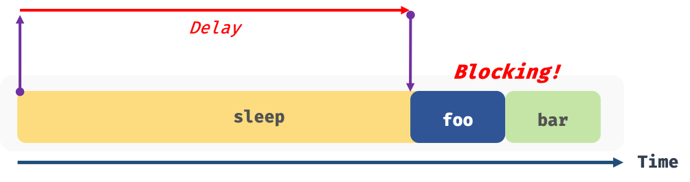
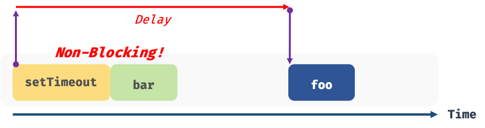

## Chapter 42. 비동기 프로그래밍

### 동기 처리와 비동기 처리
- 실행 컨텍스트 스택에 함수 실행 컨텍스트가 푸시되는 것이 바로 함수의 실행의 시작을 의미
- 함수의 실행 순서는 실행 컨텍스트 스택으로 관리
- 자바스크립트 엔진은 단 하나의 실행 컨텍스트 스택을 가짐 &#8594; 동시에 2개 이상의 함수를 동시에 실행할 수 없음
- 실행 컨텍스트 스택의 최상위 요소인 “실행 중인 실행 컨텍스트”를 제외한 모든 실행 컨텍스트는 실행 대기 중인 태스크(task)
- 싱글 스레드(single thread) : 한 번에 하나의 태스크만 실행 가능
  - JS 엔진은 이 방식으로 동작
  - 처리에 시간이 걸리는 태스크를 실행하는 경우 블로킹(blocking, 작업 중단)이 발생

- **동기(synchronous) 처리**
  - 현재 실행 중인 태스크가 종료할 때까지 다음에 실행될 태스크가 대기하는 방식
  - 장점 : 태스크를 순서대로 하나씩 처리하므로 실행 순서가 보장된다
  - 단점 : 앞선 태스크가 종료할 때까지 이후 태스크들이 블로킹된다
  
- **비동기(asynchronous) 처리**
  - 현재 실행 중인 태스크가 종료되지 않은 상태라 해도 다음 태스크를 곧바로 실행하는 방식
  - 장점 : 블로킹이 발생하지 않는다
  - 단점 : 태스크의 실행 순서가 보장되지 않는다
  

- 비동기 처리를 수행하는 비동기 함수는 전통적으로 콜백 패턴을 사용
- **타이머 함수인 setTimeout과 setInterval, HTTP 요청, 이벤트 핸들러는 비동기 처리 방식으로 동작**
- 비동기 처리는 이벤트 루프와 태스크 큐와 깊은 관계가 있음

- 커스텀 이벤트를 디스패치하거나 click, blur, focus 메서드 등을 호출하면 해당 이벤트 핸들러가 태스크 큐를 거치지 않고 즉시 호출된다. 즉, 동기 처리 방식으로 동작

### 이벤트 루프와 태스크 큐
- **이벤트 루프(event loop)** ? 브라우저에 내장되어 있는 기능 중 하나로 JS의 동시성(concurrency)을 지원
- JS 엔진의 2개 영역
  - 콜 스택(call stack) : 실행 컨텍스트 스택
  - 힙(heap) : 객체가 저장되는 메모리 공간으로 힙은 구조화되어 있지 않다
- 콜 스택의 요소인 실행 컨텍스트는 힙에 저장된 객체를 참조함
- **비동기 처리에서 소스 코드의 평가와 실행을 제외한 모든 처리는 JS 엔진을 구동하는 환경인 브라우저 또는 Node.js가 담당**
- 태스크 큐(task queue / event queue / callback queue)
  - 비동기 함수의 콜백 함수 또는 이벤트 핸들러가 일시적으로 보관되는 영역
  - 태스크 큐와는 별도로 프로미스의 후속 처리 메서드의 콜백 함수가 일시적으로 보관되는 마이크로태스크 큐도 존재
- 이벤트 루프(event loop)
  - 콜 스택에 현재 실행 중인 실행 컨텍스트가 있는지, 태스크 큐에 대기 중인 함수가 있는지 반복 확인함
  - if, 콜 스택이 비어있고 태스크 큐에 대기중인 함수가 있으면 이벤트 루프는 순차적으로(First in First out) 태스크 큐에 대기중인 함수를 콜 스택으로 이동시킴
  - 태스크 큐에 일시 보관된 함수들은 비동기 처리 방식으로 동작

- 호출 스케줄링, 즉 타이머 설정과 타이머가 만료되면 콜백 함수를 태스크 큐에 푸시하는 것은 브라우저의 역할
- **싱글 스레드로 동작하는 것은 브라우저가 아니라 브라우저에 내장된 자바스크립트 엔진**
- 브라우저는 멀티 스레드로 동작

